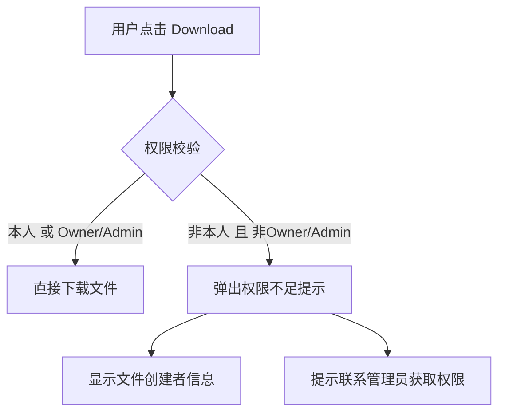
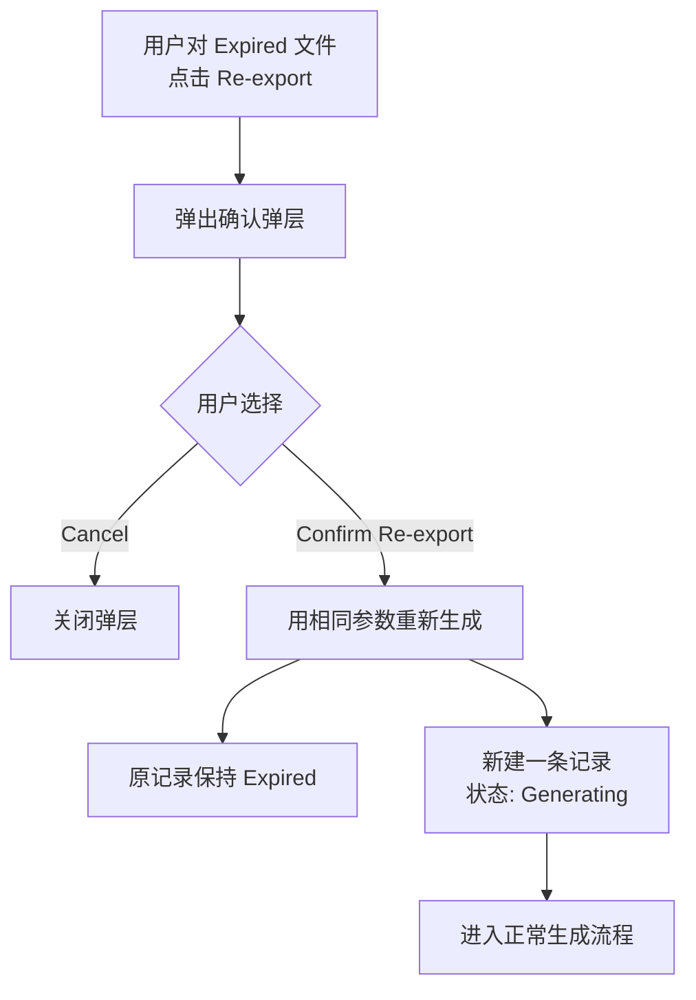
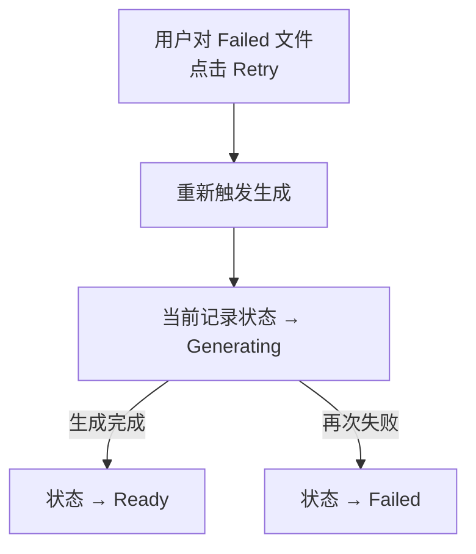
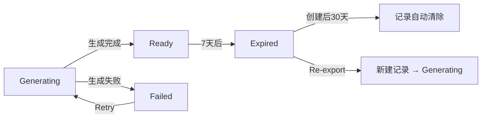

# Download Center — 下载中心 PRD

> **版本**: v1.0  
> **更新日期**: 2026-02-14  
> **所属模块**: Reports 大模块  
> **关联原型**: `mp-download-center.html`

---

## 1. 功能定位

Download Center 是 Reports 模块下的子页面，统一管理商户端所有异步导出的文件。

**核心价值：**
- 当导出数据量大、文件体积大时，系统异步生成文件，避免页面阻塞
- 商户可随时回到 Download Center 查看文件生成进度、下载已生成文件
- 文件有效期 **7天**，过期后状态变为 Expired；记录保留 **30天** 后自动清除

---

## 2. 触发异步下载的条件

当用户在 Reports 或其他页面点击"导出"时，系统根据以下条件判断是**即时下载**还是**异步生成**：

| 条件 | 阈值 | 说明 |
|---|---|---|
| 数据条数 | > **2,000 条** | 超过2000条数据，转异步生成 |
| Sheet数量 | > **1 个 Sheet** | 多Sheet的Excel文件（如包含汇总+明细），转异步生成 |
| 预估文件大小 | > **5 MB** | 预估文件体积超过5MB，转异步生成 |

> **判断逻辑：满足任意一个条件即触发异步生成。**

### 2.1 即时下载 vs 异步生成

```
用户点击"导出"
    │
    ├─ 条数 ≤ 2000 且 单Sheet 且 预估 ≤ 5MB
    │   → 即时下载：浏览器直接下载文件
    │   → 同时在 Download Center 生成一条记录（状态直接为 Ready）
    │
    └─ 任一条件超出阈值
        → 异步生成：弹出"文件生成中"弹层
        → 在 Download Center 生成一条记录（状态为 Generating）
        → 文件生成完成后状态变为 Ready，推送通知
```

### 2.2 文件大小预估参考

| 文件格式 | 每1000条约占大小 | 2000条 | 10000条 | 50000条 |
|---|---|---|---|---|
| CSV | ~200 KB | ~400 KB | ~2 MB | ~10 MB |
| Excel (.xlsx) 单Sheet | ~350 KB | ~700 KB | ~3.5 MB | ~17 MB |
| Excel (.xlsx) 多Sheet | ~500 KB | ~1 MB | ~5 MB | ~25 MB |
| PDF | ~400 KB | ~800 KB | ~4 MB | ~20 MB |

> 以上为参考值，实际大小取决于字段数量和内容长度。

---

## 3. 文件生命周期

```
┌──────────┐     生成完成     ┌──────────┐     7天后       ┌──────────┐     30天后
│Generating│ ──────────────→ │  Ready   │ ──────────────→ │ Expired  │ ────→ 自动清除
└──────────┘                 └──────────┘                 └──────────┘
     │                            │                            │
     │ 生成失败                    │ 用户可下载                  │ 不可下载
     ▼                            │ 可多次下载                  │ 可 Re-export
┌──────────┐                      │                            │ 可 Delete
│  Failed  │                      │                            │
└──────────┘                      ▼                            ▼
```

### 3.1 状态定义

| 状态 | 英文 | 说明 | 有效期 |
|---|---|---|---|
| 生成中 | Generating | 文件正在异步生成 | — |
| 已生成 | Ready | 文件已生成，可下载 | 自生成完成起 **7天** |
| 已失效 | Expired | 文件已过期，不可下载 | — |
| 生成失败 | Failed | 文件生成过程中出错 | — |

### 3.2 有效期规则

- 文件有效期：**7天**（自文件生成完成时间起算）
- 7天后文件从存储中删除，记录保留（状态变为 Expired）
- 到期前 **1天** 可在列表中显示“即将过期”提示
- 过期记录保留至创建后 **30天**，然后自动清除

---

## 4. 列表字段

| 字段 | 英文 | 说明 | 示例 |
|---|---|---|---|
| 下载批次号 | Batch No. | 系统自动生成，格式 `DL` + 日期 + 序号 | `DL20260214001` |
| 文件名 | File | 文件名（Ready 后显示实际大小） | `Transaction_Report_2026-02.xlsx` · 2.3 MB |
| 类型 | Type | 报表类型 | Transaction Report / Settlement Report / Account Statement / Payin Report / Payout Report |
| 创建时间 | Created At | 导出请求发起时间 | 2026-02-14 20:01:32 |
| 下载人 | Created By | 发起导出的用户 | Alice Liu (alice@merchant.com) |
| 状态 | Status | 当前文件状态 | Generating / Ready / Expired / Failed |
| 操作 | Actions | 根据状态展示不同操作按钮 | 见下方 |

---

## 5. 状态 × 操作 对照

| 状态 | 可用操作 | 操作说明 |
|---|---|---|
| **Generating** | 无（Download 按钮置灰） | 页面轮询状态（每10秒），生成完成后自动刷新为 Ready |
| **Ready** | `Download` | 点击直接下载文件；可多次下载 |
| **Expired** | `Re-export` / `Delete` | Re-export：用相同参数重新生成（注意：数据为当前最新状态）；Delete：删除记录 |
| **Failed** | `Retry` / `Delete` | Retry：重新触发生成；Delete：删除记录 |

---

## 6. 筛选与搜索

| 筛选项 | 类型 | 选项 |
|---|---|---|
| 类型 | 下拉单选 | 全部 / Transaction Report / Settlement Report / Account Statement / Payin Report / Payout Report |
| 状态 | 下拉单选 | 全部 / Generating / Ready / Expired / Failed |
| 批次号 | 文本搜索 | 支持模糊搜索 |
| 时间范围 | 日期区间 | 创建时间范围筛选 |

**排序规则：** 默认按创建时间倒序（最新在前）。

---

## 7. 操作流程

### 7.1 导出流程

```mermaid
flowchart TD
    A[用户在 Reports 点击导出] --> B{系统判断}
    B -->|条数≤2000 且 单Sheet 且 ≤5MB| C[即时下载]
    B -->|任一条件超出阈值| D[异步生成]

    C --> C1[浏览器直接下载文件]
    C --> C2[Download Center 生成记录<br>状态: Ready]

    D --> D1[弹出"文件生成中"弹层]
    D --> D2[Download Center 生成记录<br>状态: Generating]

    D1 --> D1a[Continue working<br>关闭弹层继续操作]
    D1 --> D1b[Go to Download Center<br>跳转下载中心]

    D2 -->|生成完成| E[状态 → Ready]
    D2 -->|生成失败| F[状态 → Failed]

    E --> E1[站内通知 + 菜单角标 + Toast]
    E --> E2[用户可下载]
```

### 7.2 下载流程



### 7.3 Re-export 流程



### 7.4 Retry 流程



### 7.5 文件生命周期



---

## 8. 每次导出都生成记录

**核心规则：无论即时下载还是异步生成，每次导出操作都在 Download Center 生成一条记录。**

| 场景 | 记录生成时机 | 初始状态 | 说明 |
|---|---|---|---|
| 即时下载 | 点击导出时 | Ready | 浏览器直接下载，同时记录入库，方便用户回来重新下载 |
| 异步生成 | 点击导出时 | Generating | 生成完成后变为 Ready |
| 生成失败 | 生成过程出错时 | Failed | 用户可 Retry 或 Delete |

**好处：**
- 用户可以在 Download Center 找到所有历史导出记录
- 即时下载的文件如果没保存，可以回来重新下载
- 统一管理，统一有效期

---

## 9. 空状态

当 Download Center 没有任何记录时，显示空状态：

- 图标：📭
- 标题：No files yet
- 描述：You haven't exported any reports yet. Go to **Reports** to export transaction data, settlement reports, or account statements.
- **无操作按钮**

---

## 10. 技术要点

### 10.1 文件存储
- 生成的文件存储在对象存储（如 S3/OSS）
- 文件 URL 使用签名链接（Signed URL），有效期与文件有效期一致
- 过期后定时任务清理存储文件

### 10.2 状态轮询
- 列表页对 Generating 状态的记录进行轮询，间隔 **10秒**
- 可选：通过 WebSocket 推送状态变更，减少轮询开销

### 10.3 并发控制
- 同一商户同时生成中的文件数量上限：**5个**
- 超出时提示"You have too many files being generated. Please wait for current files to complete."

### 10.4 文件命名规则

```
{ReportType}_{DateRange}.{ext}

示例：
Transaction_Report_2026-02.xlsx
Settlement_Report_2026-W06.xlsx
Payin_Report_Jan2026.csv
Account_Statement_Jan2026.pdf
```

---

## 11. 权限

| 操作 | 权限要求 |
|---|---|
| 查看 Download Center | 所有有 Reports 查看权限的用户 |
| 下载文件 | 仅文件创建者本人，或 Owner/Admin |
| 删除记录 | 仅文件创建者本人，或 Owner/Admin |
| Re-export | 同导出权限 |

> **说明：** 普通 Member 只能看到和下载自己导出的文件；Owner/Admin 可以看到所有成员的导出记录。

---

## 12. 汇总

```mermaid
flowchart TD
    A[用户点击导出] --> B{判断是否异步}
    B -->|条数≤2000 且 单Sheet 且 ≤5MB| C[即时下载]
    B -->|任一条件超出| D[异步生成]
    
    C --> E[浏览器直接下载]
    C --> F[Download Center 记录 → Ready]
    
    D --> G[弹出"文件生成中"弹层]
    D --> H[Download Center 记录 → Generating]
    
    H -->|生成完成| I[状态 → Ready]
    H -->|生成失败| J[状态 → Failed]
    
    I -->|7天后| K[状态 → Expired]
    K -->|30天后| O[记录自动清除]
    
    I --> L[用户可下载]
    J --> M[用户可 Retry]
    K --> N[用户可 Re-export]
```
