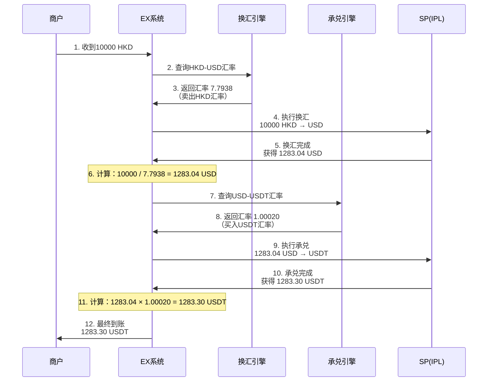
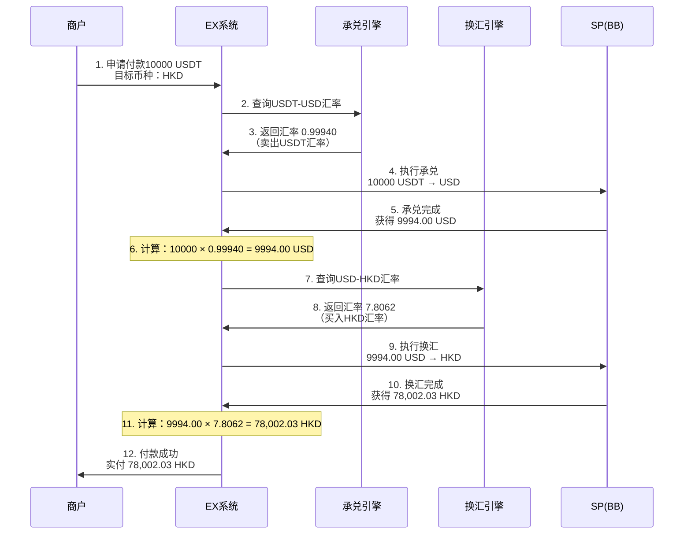
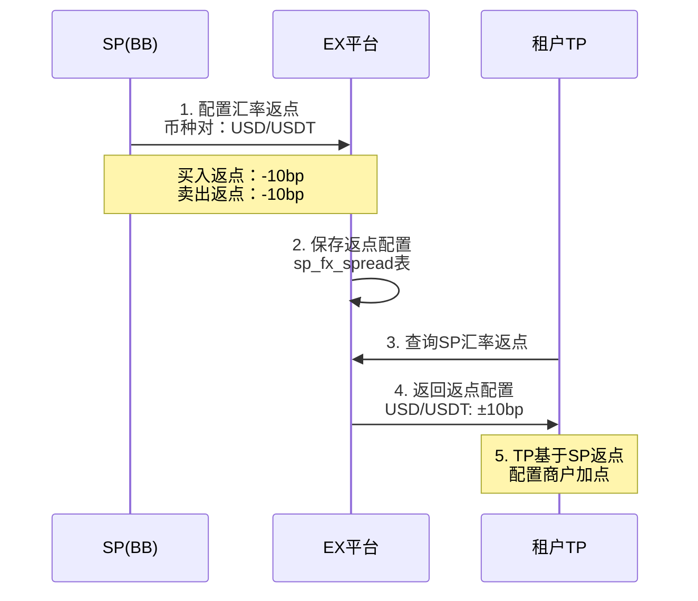
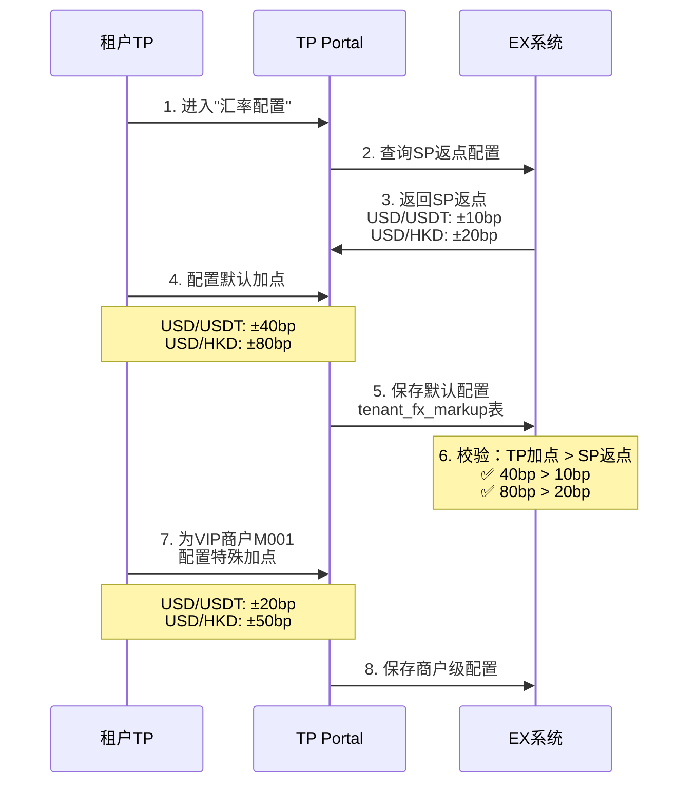
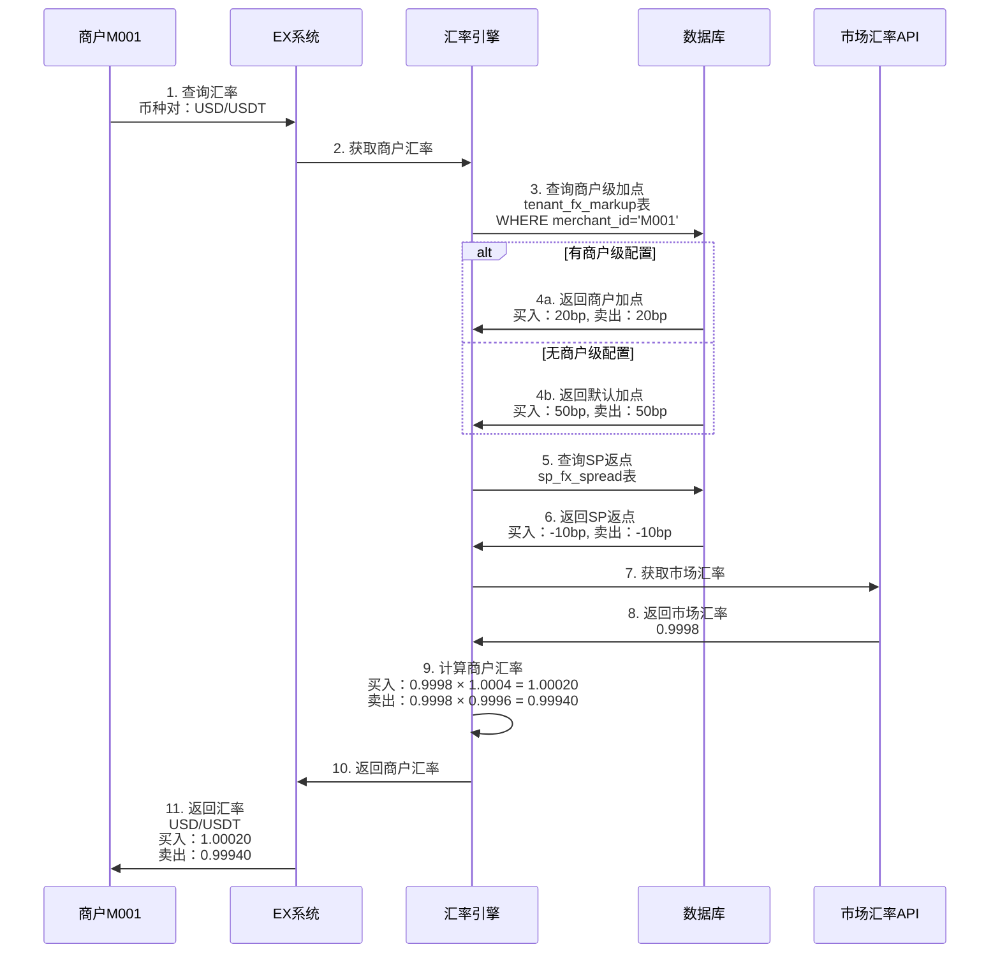
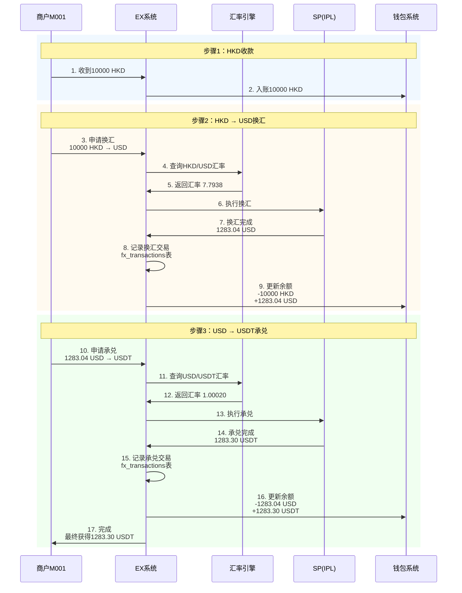
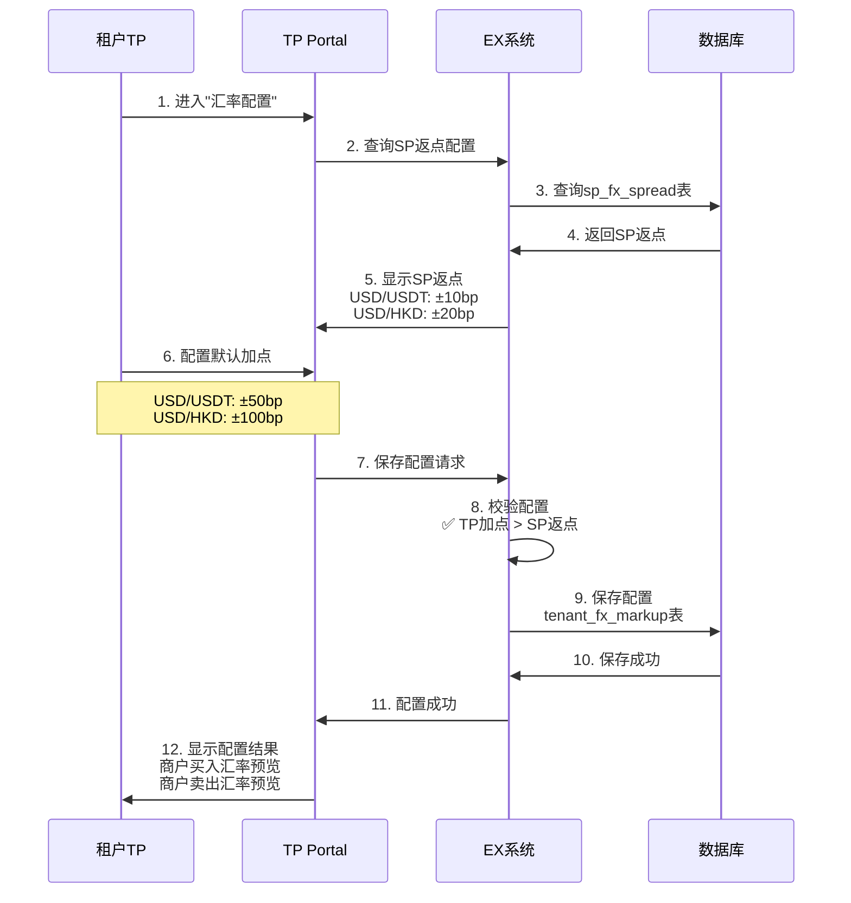

# 汇率和换汇产品设计

## 文档概述

本文档详细描述了EX平台的汇率和换汇体系，包括：

- 承兑汇率（数币↔法币）
- 法币换汇（法币↔法币）
- 两段式换汇流程
- 汇率返点配置规则
- 汇率计算和展示逻辑
- 需要补充

**核心设计理念：**

- ✅ **自动开通**：换汇产品随相关产品自动开通
- ✅ **灵活返点**：SP给TP配置返点，TP给商户配置加点
- ✅ **两段式换汇**：支持数币→法币→法币的组合换汇
- ✅ **实时汇率**：基于市场汇率+返点/加点计算
- ✅ **多层配置**：SP返点 → TP默认加点 → 商户级加点

---

## 目录

1. [汇率产品分类](#汇率产品分类)
2. [汇率返点模型](#汇率返点模型)
3. [两段式换汇流程](#两段式换汇流程)
4. [汇率配置层级](#汇率配置层级)
5. [汇率计算逻辑](#汇率计算逻辑)
6. [完整交易示例](#完整交易示例)
7. [数据表设计](#数据表设计)
8. [汇率流程时序图](#汇率流程时序图)

---

## 汇率产品分类

### 1.1 产品概览

#### **产品1：承兑汇率（Crypto-Fiat Exchange）**

- **功能**：数币与法币之间的兑换
- **汇率对**：
  - USD ↔ USDT
  - USD ↔ USDC
  - 其他法币 ↔ 稳定币
- **开通规则**：开通Onramp或Offramp产品时自动开通
- **应用场景**：
  - Onramp：法币 → 数币（如：USD → USDT）
  - Offramp：数币 → 法币（如：USDT → USD）

#### **产品2：法币换汇（Fiat-Fiat Exchange）**

- **功能**：不同法币之间的兑换
- **汇率对**：
  - USD ↔ HKD
  - USD ↔ AUD
  - USD ↔ EUR
  - USD ↔ GBP
  - 其他法币对
- **开通规则**：开通跨币种支付产品时自动开通
- **应用场景**：
  - 收款：HKD收款 → 换汇USD → 承兑USDT
  - 付款：USDT承兑 → USD → 换汇HKD付款

---

### 1.2 产品开通规则

```
┌─────────────────────────────────────────────────────────────┐
│                    产品开通关联关系                          │
└─────────────────────────────────────────────────────────────┘

商户开通Onramp产品
    ↓
自动开通：
  - 数币钱包产品（充币、提币）
  - 承兑汇率产品（USD-USDT）

商户开通Offramp产品
    ↓
自动开通：
  - 数币钱包产品（充币、提币）
  - 承兑汇率产品（USDT-USD）

商户开通跨币种支付
    ↓
自动开通：
  - 法币换汇产品（USD-HKD等）
  - 承兑汇率产品（如需数币）
```

---

## 汇率返点模型

### 2.1 汇率返点概念

**基础概念：**

```
市场汇率（Market Rate）：实时市场汇率
SP返点（SP Spread）：SP给TP的汇率优惠
TP加点（TP Markup）：TP给商户的汇率加价
商户汇率（Merchant Rate）：商户实际使用的汇率
```

**计算公式：**

```
买入汇率（商户买入外币）：
商户汇率 = 市场汇率 × (1 + TP加点 - SP返点)

卖出汇率（商户卖出外币）：
商户汇率 = 市场汇率 × (1 - TP加点 + SP返点)
```

---

### 2.2 返点配置示例

#### **示例1：USD-USDT承兑汇率**

**市场汇率：** 1 USD = 0.9998 USDT

**SP返点配置（BB给TP001）：**

```json
{
  "sp_id": 1001,
  "sp_name": "BB",
  "tenant_id": 2001,
  "currency_pair": "USD/USDT",
  "sp_spread_buy": -0.0001,
  "sp_spread_sell": -0.0001,
  "description": "SP给TP的返点：买卖各10个基点"
}
```

**TP加点配置（TP001给商户）：**

```json
{
  "tenant_id": 2001,
  "merchant_id": null,
  "currency_pair": "USD/USDT",
  "tp_markup_buy": 0.0005,
  "tp_markup_sell": 0.0005,
  "description": "TP给商户的加点：买卖各50个基点"
}
```

**商户实际汇率：**

```
买入USDT（USD → USDT）：
商户汇率 = 0.9998 × (1 + 0.0005 - 0.0001) = 0.9998 × 1.0004 = 1.00020

卖出USDT（USDT → USD）：
商户汇率 = 0.9998 × (1 - 0.0005 + 0.0001) = 0.9998 × 0.9996 = 0.99940

TP利润：
买入：(0.0005 - 0.0001) = 0.0004 = 40个基点
卖出：(0.0005 - 0.0001) = 0.0004 = 40个基点
```

---

#### **示例2：USD-HKD法币换汇**

**市场汇率：** 1 USD = 7.8000 HKD

**SP返点配置（IPL给TP001）：**

```json
{
  "sp_id": 1002,
  "sp_name": "IPL",
  "tenant_id": 2001,
  "currency_pair": "USD/HKD",
  "sp_spread_buy": -0.0002,
  "sp_spread_sell": -0.0002,
  "description": "SP给TP的返点：买卖各20个基点"
}
```

**TP加点配置（TP001给商户）：**

```json
{
  "tenant_id": 2001,
  "merchant_id": null,
  "currency_pair": "USD/HKD",
  "tp_markup_buy": 0.0010,
  "tp_markup_sell": 0.0010,
  "description": "TP给商户的加点：买卖各100个基点"
}
```

**商户实际汇率：**

```
买入HKD（USD → HKD）：
商户汇率 = 7.8000 × (1 + 0.0010 - 0.0002) = 7.8000 × 1.0008 = 7.8062

卖出HKD（HKD → USD）：
商户汇率 = 7.8000 × (1 - 0.0010 + 0.0002) = 7.8000 × 0.9992 = 7.7938

TP利润：
买入：(0.0010 - 0.0002) = 0.0008 = 80个基点
卖出：(0.0010 - 0.0002) = 0.0008 = 80个基点
```

---

### 2.3 商户级特殊汇率配置

**场景：** TP为VIP商户M001配置更优惠的汇率

```json
{
  "tenant_id": 2001,
  "merchant_id": "M001",
  "currency_pair": "USD/HKD",
  "tp_markup_buy": 0.0005,
  "tp_markup_sell": 0.0005,
  "description": "VIP商户特殊汇率：买卖各50个基点"
}
```

**优先级：** 商户级汇率 > 默认汇率

---

## 两段式换汇流程

### 3.1 两段式换汇场景

#### **场景1：Onramp跨币种收款**

```
商户收款：10000 HKD
目标：获得 USDT

流程：
步骤1：法币换汇 HKD → USD
步骤2：承兑 USD → USDT
```

**详细流程：**



**费用计算：**

```
步骤1：HKD → USD换汇
- 收款金额：10000 HKD
- 市场汇率：7.8000
- 商户汇率：7.7938（含TP加点80bp）
- 换汇结果：10000 / 7.7938 = 1283.04 USD
- TP换汇利润：10000 / 7.8000 - 10000 / 7.7938 = 1282.05 - 1283.04 = -0.99 USD
  （实际计算：1282.05 × 0.0008 = 1.03 USD）

步骤2：USD → USDT承兑
- 承兑金额：1283.04 USD
- 市场汇率：0.9998
- 商户汇率：1.00020（含TP加点40bp）
- 承兑结果：1283.04 × 1.00020 = 1283.30 USDT
- TP承兑利润：1283.04 × 0.0004 = 0.51 USD

TP总利润：1.03 USD + 0.51 USD = 1.54 USD
```

---

#### **场景2：Offramp跨币种付款**

```
商户付款：10000 USDT
目标：支付 HKD

流程：
步骤1：承兑 USDT → USD
步骤2：法币换汇 USD → HKD
```

**详细流程：**



**费用计算：**

```
步骤1：USDT → USD承兑
- 承兑金额：10000 USDT
- 市场汇率：0.9998
- 商户汇率：0.99940（含TP加点40bp）
- 承兑结果：10000 × 0.99940 = 9994.00 USD
- TP承兑利润：10000 × 0.0004 = 4.00 USD

步骤2：USD → HKD换汇
- 换汇金额：9994.00 USD
- 市场汇率：7.8000
- 商户汇率：7.8062（含TP加点80bp）
- 换汇结果：9994.00 × 7.8062 = 78,002.03 HKD
- TP换汇利润：9994.00 × 0.0008 = 7.99 USD

TP总利润：4.00 USD + 7.99 USD = 11.99 USD
```

---

## 汇率配置层级

### 4.1 配置层级概览

```
┌─────────────────────────────────────────────────────────────┐
│                    汇率配置层级                              │
└─────────────────────────────────────────────────────────────┘

市场汇率（实时获取）
    ↓
SP返点配置（SP给TP）
    ↓
TP默认加点配置（TP给所有商户）
    ↓
TP商户级加点配置（TP给特定商户，可选）
    ↓
商户实际汇率
```

---

### 4.2 SP返点配置

**说明：** SP为TP配置汇率返点，可以按币种对配置



**数据示例：**

```json
{
  "sp_id": 1001,
  "sp_name": "BB",
  "tenant_id": 2001,
  "fx_spreads": [
    {
      "currency_pair": "USD/USDT",
      "base_currency": "USD",
      "quote_currency": "USDT",
      "sp_spread_buy": -0.0001,
      "sp_spread_sell": -0.0001,
      "effective_date": "2026-02-01",
      "status": "ACTIVE"
    },
    {
      "currency_pair": "USD/HKD",
      "base_currency": "USD",
      "quote_currency": "HKD",
      "sp_spread_buy": -0.0002,
      "sp_spread_sell": -0.0002,
      "effective_date": "2026-02-01",
      "status": "ACTIVE"
    }
  ]
}
```

---

### 4.3 TP商户加点配置

**说明：** TP为商户配置汇率加点，支持默认配置和商户级配置



---

### 4.4 商户侧汇率展示

**MVP期间：统一展示汇率，不暴露SP**

```
商户M001看到的汇率：
┌────────────────────────────────────┐
│ 实时汇率                            │
├────────────────────────────────────┤
│ USD/USDT                           │
│  - 买入：1.00020                   │
│  - 卖出：0.99940                   │
│                                    │
│ USD/HKD                            │
│  - 买入：7.8062                    │
│  - 卖出：7.7938                    │
└────────────────────────────────────┘

说明：
- 买入：商户买入报价币种（如买入USDT）
- 卖出：商户卖出报价币种（如卖出USDT）
- 汇率已包含所有费用
```

---

## 汇率计算逻辑

### 5.1 汇率计算公式

#### **买入汇率（商户买入报价币种）**

```
商户买入汇率 = 市场汇率 × (1 + TP加点 - SP返点)

示例：USD/USDT买入
- 市场汇率：0.9998
- SP返点：-0.0001（-10bp）
- TP加点：0.0005（50bp）
- 商户汇率：0.9998 × (1 + 0.0005 - 0.0001) = 0.9998 × 1.0004 = 1.00020
```

#### **卖出汇率（商户卖出报价币种）**

```
商户卖出汇率 = 市场汇率 × (1 - TP加点 + SP返点)

示例：USD/USDT卖出
- 市场汇率：0.9998
- SP返点：-0.0001（-10bp）
- TP加点：0.0005（50bp）
- 商户汇率：0.9998 × (1 - 0.0005 + 0.0001) = 0.9998 × 0.9996 = 0.99940
```

---

### 5.2 TP利润计算

#### **买入交易TP利润**

```
TP利润率 = TP加点 - SP返点

示例：
- TP加点：50bp
- SP返点：-10bp
- TP利润率：50bp - (-10bp) = 60bp

实际利润：
- 交易金额：10000 USD
- TP利润：10000 × 0.0006 = 6 USD
```

#### **卖出交易TP利润**

```
TP利润率 = TP加点 - SP返点

示例：
- TP加点：50bp
- SP返点：-10bp
- TP利润率：50bp - (-10bp) = 60bp

实际利润：
- 交易金额：10000 USDT
- TP利润：10000 × 0.0006 = 6 USD等值
```

---

### 5.3 汇率查询优先级

```
查询商户汇率时的优先级：

1. 查询商户级配置
   tenant_fx_markup表
   WHERE tenant_id = ? AND merchant_id = ? AND currency_pair = ?

2. 如果没有商户级配置，查询默认配置
   tenant_fx_markup表
   WHERE tenant_id = ? AND merchant_id IS NULL AND currency_pair = ?

3. 查询SP返点配置
   sp_fx_spread表
   WHERE sp_id = ? AND tenant_id = ? AND currency_pair = ?

4. 获取市场汇率
   调用汇率服务API

5. 计算商户汇率
   应用公式计算
```

---

## 完整交易示例

### 6.1 Onramp跨币种收款完整示例

**场景：** 商户M001收款10000 HKD，最终获得USDT

**配置：**

```json
{
  "merchant": "M001",
  "tenant": "TP001",
  "sp": "IPL",
  "fx_config": {
    "HKD/USD": {
      "market_rate": 7.8000,
      "sp_spread": -0.0002,
      "tp_markup": 0.0010,
      "merchant_sell_rate": 7.7938
    },
    "USD/USDT": {
      "market_rate": 0.9998,
      "sp_spread": -0.0001,
      "tp_markup": 0.0005,
      "merchant_buy_rate": 1.00020
    }
  }
}
```

**交易流程：**

```
步骤1：HKD收款
- 收款金额：10000 HKD
- 到账确认：10000 HKD

步骤2：HKD → USD换汇
- 换汇金额：10000 HKD
- 商户汇率：7.7938（卖出HKD）
- 换汇结果：10000 / 7.7938 = 1283.04 USD
- 换汇费用：已包含在汇率中
- TP换汇利润：1283.04 × (0.0010 - 0.0002) = 1.03 USD

步骤3：USD → USDT承兑
- 承兑金额：1283.04 USD
- 商户汇率：1.00020（买入USDT）
- 承兑结果：1283.04 × 1.00020 = 1283.30 USDT
- 承兑费用：已包含在汇率中
- TP承兑利润：1283.04 × (0.0005 - 0.0001) = 0.51 USD

商户最终获得：1283.30 USDT
TP总利润：1.03 + 0.51 = 1.54 USD
```

---

### 6.2 Offramp跨币种付款完整示例

**场景：** 商户M001支付10000 USDT，最终付款HKD

**配置：**

```json
{
  "merchant": "M001",
  "tenant": "TP001",
  "sp": "BB",
  "fx_config": {
    "USD/USDT": {
      "market_rate": 0.9998,
      "sp_spread": -0.0001,
      "tp_markup": 0.0005,
      "merchant_sell_rate": 0.99940
    },
    "USD/HKD": {
      "market_rate": 7.8000,
      "sp_spread": -0.0002,
      "tp_markup": 0.0010,
      "merchant_buy_rate": 7.8062
    }
  }
}
```

**交易流程：**

```
步骤1：USDT → USD承兑
- 承兑金额：10000 USDT
- 商户汇率：0.99940（卖出USDT）
- 承兑结果：10000 × 0.99940 = 9994.00 USD
- 承兑费用：已包含在汇率中
- TP承兑利润：10000 × (0.0005 - 0.0001) = 4.00 USD

步骤2：USD → HKD换汇
- 换汇金额：9994.00 USD
- 商户汇率：7.8062（买入HKD）
- 换汇结果：9994.00 × 7.8062 = 78,002.03 HKD
- 换汇费用：已包含在汇率中
- TP换汇利润：9994.00 × (0.0010 - 0.0002) = 7.99 USD

步骤3：HKD付款
- 付款金额：78,002.03 HKD
- 付款成功

商户实际支付：10000 USDT
收款方收到：78,002.03 HKD
TP总利润：4.00 + 7.99 = 11.99 USD
```

---

## 数据表设计

### 7.1 SP汇率返点表 (sp_fx_spread)

```sql
CREATE TABLE sp_fx_spread (
    id BIGINT PRIMARY KEY AUTO_INCREMENT,
    sp_id BIGINT NOT NULL COMMENT 'SP ID',
    tenant_id BIGINT COMMENT '租户ID，NULL表示通用返点',
    currency_pair VARCHAR(20) NOT NULL COMMENT '币种对，如：USD/USDT',
    base_currency VARCHAR(10) NOT NULL COMMENT '基础币种',
    quote_currency VARCHAR(10) NOT NULL COMMENT '报价币种',
  
    -- SP返点（负数表示返点，正数表示加点）
    sp_spread_buy DECIMAL(10,6) NOT NULL COMMENT 'SP买入返点（基点）',
    sp_spread_sell DECIMAL(10,6) NOT NULL COMMENT 'SP卖出返点（基点）',
  
    effective_date DATE COMMENT '生效日期',
    expiry_date DATE COMMENT '失效日期',
    status VARCHAR(20) DEFAULT 'ACTIVE' COMMENT '状态',
    created_at TIMESTAMP DEFAULT CURRENT_TIMESTAMP,
    updated_at TIMESTAMP DEFAULT CURRENT_TIMESTAMP ON UPDATE CURRENT_TIMESTAMP,
  
    UNIQUE KEY uk_sp_tenant_pair (sp_id, tenant_id, currency_pair),
    INDEX idx_currency_pair (currency_pair),
    INDEX idx_status (status)
) COMMENT 'SP汇率返点表';
```

**示例数据：**

```sql
-- BB给TP001的USD/USDT返点
INSERT INTO sp_fx_spread VALUES 
(1, 1001, 2001, 'USD/USDT', 'USD', 'USDT', -0.0001, -0.0001, '2026-02-01', NULL, 'ACTIVE', NOW(), NOW());

-- IPL给TP001的USD/HKD返点
INSERT INTO sp_fx_spread VALUES 
(2, 1002, 2001, 'USD/HKD', 'USD', 'HKD', -0.0002, -0.0002, '2026-02-01', NULL, 'ACTIVE', NOW(), NOW());
```

---

### 7.2 TP商户汇率加点表 (tenant_fx_markup)

```sql
CREATE TABLE tenant_fx_markup (
    id BIGINT PRIMARY KEY AUTO_INCREMENT,
    tenant_id BIGINT NOT NULL COMMENT 'TP ID',
    merchant_id VARCHAR(50) COMMENT '商户ID，NULL表示默认加点',
    currency_pair VARCHAR(20) NOT NULL COMMENT '币种对',
    base_currency VARCHAR(10) NOT NULL COMMENT '基础币种',
    quote_currency VARCHAR(10) NOT NULL COMMENT '报价币种',
  
    -- TP加点
    tp_markup_buy DECIMAL(10,6) NOT NULL COMMENT 'TP买入加点（基点）',
    tp_markup_sell DECIMAL(10,6) NOT NULL COMMENT 'TP卖出加点（基点）',
  
    effective_date DATE COMMENT '生效日期',
    expiry_date DATE COMMENT '失效日期',
    status VARCHAR(20) DEFAULT 'ACTIVE' COMMENT '状态',
    created_at TIMESTAMP DEFAULT CURRENT_TIMESTAMP,
    updated_at TIMESTAMP DEFAULT CURRENT_TIMESTAMP ON UPDATE CURRENT_TIMESTAMP,
  
    UNIQUE KEY uk_tenant_merchant_pair (tenant_id, merchant_id, currency_pair),
    INDEX idx_tenant_merchant (tenant_id, merchant_id),
    INDEX idx_status (status)
) COMMENT 'TP商户汇率加点表';
```

**示例数据：**

```sql
-- TP001的默认加点（所有商户）
INSERT INTO tenant_fx_markup VALUES 
(1, 2001, NULL, 'USD/USDT', 'USD', 'USDT', 0.0005, 0.0005, '2026-02-01', NULL, 'ACTIVE', NOW(), NOW()),
(2, 2001, NULL, 'USD/HKD', 'USD', 'HKD', 0.0010, 0.0010, '2026-02-01', NULL, 'ACTIVE', NOW(), NOW());

-- TP001为VIP商户M001的特殊加点
INSERT INTO tenant_fx_markup VALUES 
(3, 2001, 'M001', 'USD/USDT', 'USD', 'USDT', 0.0002, 0.0002, '2026-02-01', NULL, 'ACTIVE', NOW(), NOW()),
(4, 2001, 'M001', 'USD/HKD', 'USD', 'HKD', 0.0005, 0.0005, '2026-02-01', NULL, 'ACTIVE', NOW(), NOW());
```

---

### 7.3 汇率交易记录表 (fx_transactions)

```sql
CREATE TABLE fx_transactions (
    id BIGINT PRIMARY KEY AUTO_INCREMENT,
    transaction_id VARCHAR(100) NOT NULL COMMENT '交易ID',
    merchant_id VARCHAR(50) NOT NULL COMMENT '商户ID',
    tenant_id BIGINT NOT NULL COMMENT 'TP ID',
    sp_id BIGINT NOT NULL COMMENT 'SP ID',
  
    fx_type VARCHAR(20) NOT NULL COMMENT '换汇类型：CRYPTO_FIAT/FIAT_FIAT',
    currency_pair VARCHAR(20) NOT NULL COMMENT '币种对',
    base_currency VARCHAR(10) NOT NULL COMMENT '基础币种',
    quote_currency VARCHAR(10) NOT NULL COMMENT '报价币种',
  
    direction VARCHAR(10) NOT NULL COMMENT '方向：BUY/SELL',
  
    -- 交易金额
    from_amount DECIMAL(18,8) NOT NULL COMMENT '原始金额',
    from_currency VARCHAR(10) NOT NULL COMMENT '原始币种',
    to_amount DECIMAL(18,8) NOT NULL COMMENT '目标金额',
    to_currency VARCHAR(10) NOT NULL COMMENT '目标币种',
  
    -- 汇率信息
    market_rate DECIMAL(18,8) NOT NULL COMMENT '市场汇率',
    merchant_rate DECIMAL(18,8) NOT NULL COMMENT '商户汇率',
    sp_spread DECIMAL(10,6) COMMENT 'SP返点',
    tp_markup DECIMAL(10,6) COMMENT 'TP加点',
  
    -- 利润
    tp_profit DECIMAL(18,8) NOT NULL COMMENT 'TP利润',
    tp_profit_currency VARCHAR(10) NOT NULL COMMENT 'TP利润币种',
  
    transaction_status VARCHAR(20) DEFAULT 'PENDING' COMMENT '交易状态',
    completed_at TIMESTAMP COMMENT '完成时间',
    created_at TIMESTAMP DEFAULT CURRENT_TIMESTAMP,
  
    INDEX idx_transaction (transaction_id),
    INDEX idx_merchant (merchant_id),
    INDEX idx_tenant (tenant_id),
    INDEX idx_created (created_at),
    INDEX idx_status (transaction_status)
) COMMENT '汇率交易记录表';
```

**示例数据：**

```sql
-- HKD → USD换汇记录
INSERT INTO fx_transactions VALUES 
(1, 'FX202602030001', 'M001', 2001, 1002, 'FIAT_FIAT', 'USD/HKD', 'USD', 'HKD', 'SELL',
 10000, 'HKD', 1283.04, 'USD',
 7.8000, 7.7938, -0.0002, 0.0010,
 1.03, 'USD',
 'COMPLETED', '2026-02-03 12:00:00', NOW());

-- USD → USDT承兑记录
INSERT INTO fx_transactions VALUES 
(2, 'FX202602030002', 'M001', 2001, 1002, 'CRYPTO_FIAT', 'USD/USDT', 'USD', 'USDT', 'BUY',
 1283.04, 'USD', 1283.30, 'USDT',
 0.9998, 1.00020, -0.0001, 0.0005,
 0.51, 'USD',
 'COMPLETED', '2026-02-03 12:01:00', NOW());
```

---

### 7.4 市场汇率快照表 (market_fx_rates)

```sql
CREATE TABLE market_fx_rates (
    id BIGINT PRIMARY KEY AUTO_INCREMENT,
    currency_pair VARCHAR(20) NOT NULL COMMENT '币种对',
    base_currency VARCHAR(10) NOT NULL COMMENT '基础币种',
    quote_currency VARCHAR(10) NOT NULL COMMENT '报价币种',
  
    market_rate DECIMAL(18,8) NOT NULL COMMENT '市场汇率',
    bid_rate DECIMAL(18,8) COMMENT '买入价',
    ask_rate DECIMAL(18,8) COMMENT '卖出价',
  
    source VARCHAR(50) COMMENT '数据源',
    snapshot_time TIMESTAMP NOT NULL COMMENT '快照时间',
    created_at TIMESTAMP DEFAULT CURRENT_TIMESTAMP,
  
    INDEX idx_currency_pair (currency_pair),
    INDEX idx_snapshot_time (snapshot_time)
) COMMENT '市场汇率快照表';
```

**示例数据：**

```sql
-- 市场汇率快照
INSERT INTO market_fx_rates VALUES 
(1, 'USD/USDT', 'USD', 'USDT', 0.9998, 0.9997, 0.9999, 'Binance', '2026-02-03 12:00:00', NOW()),
(2, 'USD/HKD', 'USD', 'HKD', 7.8000, 7.7995, 7.8005, 'Bloomberg', '2026-02-03 12:00:00', NOW());
```

---

## 汇率流程时序图

### 8.1 汇率查询流程



---

### 8.2 两段式换汇流程（Onramp）



---

### 8.3 汇率配置流程



---

## 附录

### A. 汇率配置最佳实践

#### **1. SP返点设置建议**

```
承兑汇率（USD/USDT）：
- SP返点：±10-20bp
- 适用场景：数币与法币兑换

法币换汇（USD/HKD等）：
- SP返点：±20-50bp
- 适用场景：跨币种支付

建议：
- 主流币种对返点较低
- 小币种返点较高
- VIP客户可提供更优返点
```

#### **2. TP加点设置建议**

```
默认加点策略：
- 承兑汇率：±40-60bp
- 法币换汇：±80-120bp

VIP商户加点：
- 承兑汇率：±20-30bp
- 法币换汇：±50-80bp

测试商户：
- 可设置更低加点或零加点

TP利润率：
- 承兑：30-50bp
- 换汇：60-100bp
```

#### **3. 汇率更新频率**

```
市场汇率更新：
- 数币汇率：每分钟更新
- 法币汇率：每5分钟更新

商户汇率缓存：
- 缓存时间：30秒
- 超过缓存时间重新计算

汇率锁定：
- 交易发起时锁定汇率
- 锁定时间：2分钟
- 超时需重新查询
```

---

### B. 汇率风险管理

#### **1. 汇率波动保护**

```
设置汇率变动阈值：
- 单次变动超过1%：触发预警
- 单次变动超过3%：暂停交易

汇率锁定机制：
- 商户查询汇率后锁定2分钟
- 锁定期内汇率不变
- 超时后需重新查询
```

#### **2. 大额交易审核**

```
设置大额交易阈值：
- 单笔超过10万USD：需要审核
- 单日超过50万USD：需要审核

审核流程：
- 自动风控检查
- 人工审核确认
- 审核通过后执行
```

---

### C. 汇率展示规范

#### **1. 汇率精度**

```
数币汇率：
- USD/USDT：保留5位小数
- USD/USDC：保留5位小数

法币汇率：
- USD/HKD：保留4位小数
- USD/EUR：保留4位小数
- USD/JPY：保留2位小数
```

#### **2. 汇率展示格式**

```
买入/卖出标识：
- 买入：商户买入报价币种的汇率
- 卖出：商户卖出报价币种的汇率

示例：
USD/USDT
- 买入：1.00020（商户用USD买入USDT）
- 卖出：0.99940（商户卖出USDT换USD）

USD/HKD
- 买入：7.8062（商户用USD买入HKD）
- 卖出：7.7938（商户卖出HKD换USD）
```

---

## 总结

本文档设计了完整的汇率和换汇体系，核心特点：

✅ **双重汇率产品**：承兑汇率（数币↔法币）+ 法币换汇（法币↔法币）
✅ **自动开通**：随相关产品自动开通，无需单独申请
✅ **灵活返点**：SP返点 + TP加点，支持默认和商户级配置
✅ **两段式换汇**：支持跨币种收付款的组合换汇
✅ **实时汇率**：基于市场汇率实时计算商户汇率
✅ **利润透明**：自动计算TP汇率利润

**关键数据表：**

1. `sp_fx_spread` - SP汇率返点表
2. `tenant_fx_markup` - TP商户汇率加点表
3. `fx_transactions` - 汇率交易记录表
4. `market_fx_rates` - 市场汇率快照表

**汇率计算公式：**

- 买入汇率 = 市场汇率 × (1 + TP加点 - SP返点)
- 卖出汇率 = 市场汇率 × (1 - TP加点 + SP返点)
- TP利润率 = TP加点 - SP返点

---

*最后更新：2026-02-03*
*文档版本：v1.0*
