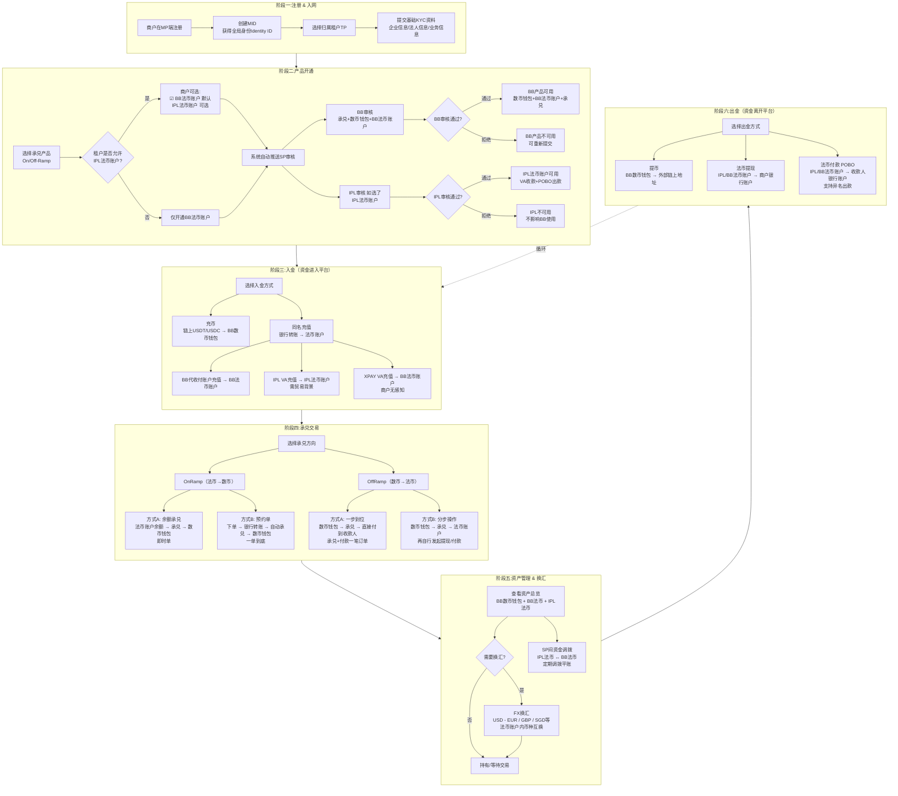
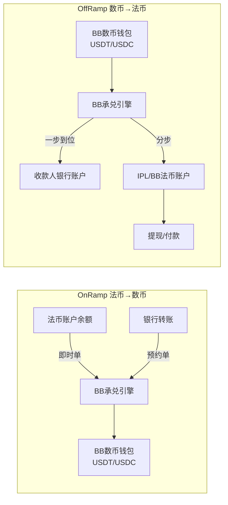
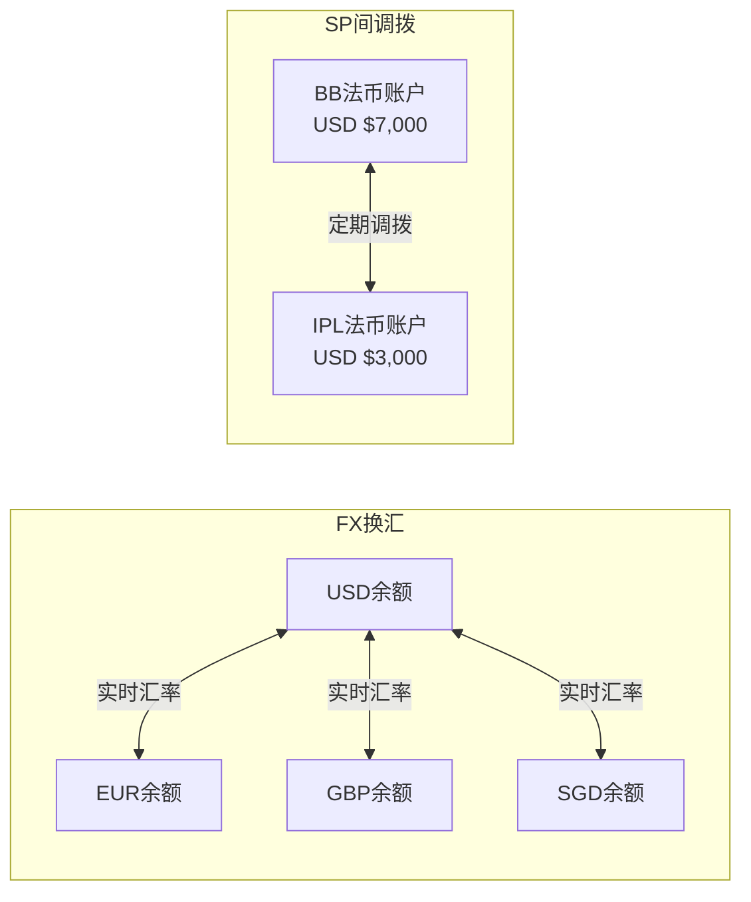
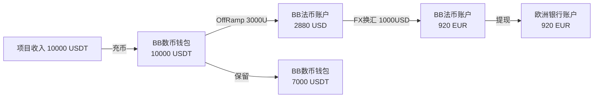
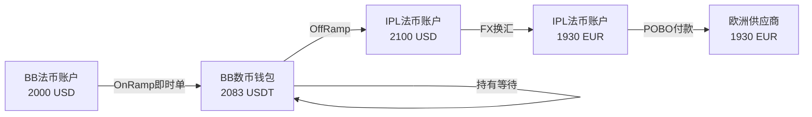

# 承兑产品 — Introduction & MVP范围

## 文档信息

| 项目     | 内容                 |
| -------- | -------------------- |
| 文档版本 | v1.0                 |
| 创建日期 | 2026-02-11           |
| 文档状态 | 草稿                 |
| 产品名称 | 数法融合承兑解决方案 |

---

## 目录

1. [业务背景与客户画像](#1-业务背景与客户画像)
   - 1.1 [业务背景](#11-业务背景)
   - 1.2 [客户画像](#12-客户画像)
   - 1.3 [客户痛点](#13-客户痛点)
2. [EX平台角色与合作模式](#2-ex平台角色与合作模式)
   - 2.1 [EX平台架构总览](#21-ex平台架构总览)
   - 2.2 [角色定义：IPL、BB、XPAY](#22-角色定义iplbbxpay)
   - 2.3 [两种承兑模式](#23-两种承兑模式)
   - 2.4 [两种模式对比](#24-两种模式对比)
   - 2.5 [产品模型与能力定义](#25-产品模型与能力定义)
     - 2.5.1 [独立产品及其自带能力](#251-独立产品及其自带能力)
     - 2.5.2 [租户签约承兑产品时的法币账户选择](#252-租户签约承兑产品时的法币账户选择)
     - 2.5.3 [租户产品中心 — 商户默认承兑法币账户配置](#253-租户产品中心--商户默认承兑法币账户配置)
     - 2.5.4 [客户交易范围](#254-客户交易范围)
3. [MVP范围（需求清单）](#3-mvp范围需求清单)
   - 3.1 [MVP核心决策](#31-mvp核心决策)
   - 3.2 [MVP需求清单](#32-mvp需求清单)
   - 3.3 [MVP不包含项](#33-mvp不包含项)

---

## 1. 业务背景与客户画像

### 1.1 业务背景

EX是一家科技公司，提供 **Payment Platform as a Service** 服务。承兑产品是EX平台上的核心业务之一，解决数字货币与法币之间的兑换和出入金需求。

```
┌─────────────────────────────────────────────────────────────────────────────┐
│                      EX SaaS 平台架构                                        │
└─────────────────────────────────────────────────────────────────────────────┘

┌─────────────────────────────────────────────────────────────────────────────┐
│                              SA (SaaS Admin)                                │
│                           EX 平台管理后台                                    │
│              - SP管理  - 租户管理  - 全局配置  - 数据统计                      │
└─────────────────────────────────────────────────────────────────────────────┘
                                    │
                    ┌───────────────┴───────────────┐
                    ▼                               ▼
        ┌───────────────────┐           ┌───────────────────┐
        │   BB (SP)         │           │   IPL (SP)        │
        │  承兑服务商        │           │  法币服务商        │
        │  - 数币钱包        │           │  - VA 收款         │
        │  - 承兑引擎        │           │  - POBO 出款       │
        │  - 代收付账户    │           │  - 法币账户        │
        │  - 法币账户        │           │                   │
        └───────────────────┘           └───────────────────┘
                    │                               │
                    └───────────────┬───────────────┘
                                    │ 提供支付能力
                                    ▼
┌───────────────────────────────────────────────────────────────────────────┐
│                         Tenant (租户层)                                    │
│                    如: 环球、TC、WB、FOPAY等                                │
│              - 商户管理  - 费率配置  - 交易查看  - 渠道配置                   │
└───────────────────────────────────────────────────────────────────────────┘
                    │
                    │ 商户归属于租户
                    ▼
┌───────────────────────────────────────────────────────────────────────────┐
│                         Merchant (商户层)                                  │
│                      最终使用支付服务的企业客户                              │
│              - 交易查询  - 出款申请  - 账户管理  - 对账下载                   │
└───────────────────────────────────────────────────────────────────────────┘
```

### 1.2 客户画像

**画像一：WEB2外贸/服贸客户**

- 在数币友好国家开展业务
- 买家需用数币付款
- 原因：汇率不稳定（稳定币合法）或外汇管制严格
- 典型场景：跨境电商卖家收到USDT，需兑换为USD/EUR付给供应商

**画像二：WEB3行业客户**

- 需要WEB2行业的off-ramp渠道能力
- 收到数币后需回到现实世界消费/支付
- 面临银行对WEB3背景资金不友好的问题
- 典型场景：加密项目方收到USDT，需兑换为法币支付运营费用

### 1.3 客户痛点

| 痛点                 | 描述                                                        | 对应能力                 |
| -------------------- | ----------------------------------------------------------- | ------------------------ |
| **数币入金难** | WEB2客户想收WEB3货币，缺少数币钱包能力（地址、充币）        | BB数币钱包               |
| **法币出款难** | 收到数币后，给供应商/服务商付款仍需法币，付款行需是WEB2银行 | BB承兑 + 法币出款        |
| **合规通道缺** | WEB3背景资金难以进入传统银行体系                            | IPL法币VA收款 + POBO出款 |

---

## 2. EX平台角色与合作模式

### 2.1 EX平台架构总览

| 角色                 | 英文                  | Portal | 说明                                                         |
| -------------------- | --------------------- | ------ | ------------------------------------------------------------ |
| **平台管理员** | SaaS Admin            | SA     | EX平台总管理后台                                             |
| **服务提供商** | Service Provider (SP) | PP     | 提供底层支付能力（收付款、承兑、数币收单、法币收单、发卡等） |
| **租户**       | Tenant                | TP     | 使用SP能力，为商户提供支付服务                               |
| **商户**       | Merchant              | MP     | 最终使用支付服务的企业，必须归属于某个租户                   |
| **渠道**       | Channel               | -      | SP内部概念，不在EX/TP层面暴露                                |

### 2.2 角色定义：IPL、BB、XPAY

#### BB — 承兑服务商 (SP)

| 属性               | 说明                                                            |
| ------------------ | --------------------------------------------------------------- |
| **角色**     | EX平台上的SP（服务提供商）                                      |
| **核心能力** | 数币钱包（USDT/USDC）、承兑引擎（U→USD）、代收付账户、法币账户 |
| **内部渠道** | 可通过XPAY渠道（BB内部Channel）扩展VA和POBO能力                 |
| **对外暴露** | 统一的承兑服务能力，底层Channel对租户透明                       |

#### IPL — 法币服务商 (SP)

| 属性               | 说明                                                     |
| ------------------ | -------------------------------------------------------- |
| **角色**     | EX平台上的SP（服务提供商）                               |
| **核心能力** | VA收款、POBO出款、法币账户                               |
| **合作模式** | 与BB为集团内部"隐藏"合作，对外不作为BB渠道，非代理行模式 |
| **客户入网** | 客户需双方入网（客户无感知）                             |

#### XPAY — BB内部渠道 (Channel)

| 属性                 | 说明                                   |
| -------------------- | -------------------------------------- |
| **角色**       | BB的底层Channel，**不是独立SP**  |
| **核心能力**   | 为BB提供独立的法币VA和POBO能力         |
| **合作模式**   | BB与XPAY是渠道合作，代理行模式         |
| **对外可见性** | EX和TP都看不到XPAY，只在BB系统内部管理 |

> **关键区分**：IPL是独立SP，在EX平台上可见；XPAY不是SP，是BB的内部Channel，EX/TP看不到。

### 2.3 两种承兑模式

#### 模式一：IPL-BB 打通承兑（双SP中间户划转）

```
┌─────────────────────────────────────────────────────────────────────────────┐
│                    模式一：IPL-BB 打通承兑                                    │
│                    租户需签约 BB + IPL 两家SP                                 │
└─────────────────────────────────────────────────────────────────────────────┘

  ┌─────────────────┐                      ┌─────────────────┐
  │   BB (SP)       │                      │   IPL (SP)      │
  │                 │                      │                 │
  │  数币钱包       │   中间户划转          │  法币账户       │
  │  承兑引擎       │ ──────────────────>  │  VA收款         │
  │                 │                      │  POBO出款       │
  └─────────────────┘                      └─────────────────┘
         │                                        │
         └────────────────┬───────────────────────┘
                          │ 双方入网（客户无感知）
                          ▼
                  ┌───────────────┐
                  │   租户 (TP)   │
                  └───────────────┘

  Off-Ramp资金流向：
  商户USDT钱包(BB) → 承兑(BB) → IPL中间户(在BB) → 商户USD账户(IPL)

  Off-Ramp后资金可见位置：IPL法币账户
```

**核心特点：**

- 租户签约BB + IPL两家SP
- 商户需在BB和IPL双方入网（客户无感知）
- BB负责数币侧（钱包、承兑），IPL负责法币侧（账户、出款）
- 通过中间户实现跨SP账户划转，无需调用外部渠道
- IPL不作为BB渠道，非代理行模式
- 适用客户：有贸易背景的合规客户

#### 模式二：BB承兑 + XPAY渠道（单SP内部渠道）

```
┌─────────────────────────────────────────────────────────────────────────────┐
│                    模式二：BB承兑 + XPAY渠道                                  │
│                    租户只需签约 BB 一家SP                                     │
└─────────────────────────────────────────────────────────────────────────────┘

  ┌─────────────────────────────────────────────────┐
  │                    BB (SP)                       │
  │                                                 │
  │  ┌──────────────┐     ┌──────────────────────┐ │
  │  │  BB核心能力   │     │  底层Channel（内部）  │ │
  │  │              │     │                      │ │
  │  │  数币钱包     │     │  ┌────────────────┐ │ │
  │  │  承兑引擎     │     │  │  BB代收付账户 │ │ │
  │  │  法币账户     │     │  │  (自有代收付)  │ │ │
  │  │              │     │  ├────────────────┤ │ │
  │  │              │     │  │  XPAY渠道      │ │ │
  │  │              │     │  │  (VA+POBO)     │ │ │
  │  └──────────────┘     │  └────────────────┘ │ │
  │                        └──────────────────────┘ │
  └─────────────────────────────────────────────────┘
                          │ 单方入网
                          ▼
                  ┌───────────────┐
                  │   租户 (TP)   │
                  └───────────────┘

  Off-Ramp资金流向：
  商户USDT钱包(BB) → 承兑(BB内部) → BB法币账户 → XPAY渠道出款到收款人

  Off-Ramp后资金可见位置：BB法币账户
```

**核心特点：**

- 租户只需签约BB一家SP
- 商户只需在BB单方入网
- BB内部完成承兑，通过XPAY渠道（代理行模式）执行法币出款
- XPAY对EX/TP/商户完全透明，BB内部决定用代收付账户还是XPAY
- 适用客户：通用客户

### 2.4 两种模式对比

| 对比项                     | 模式一：IPL-BB打通          | 模式二：BB+XPAY              |
| -------------------------- | --------------------------- | ---------------------------- |
| **签约SP**           | BB + IPL（2家）             | BB（1家）                    |
| **入网方式**         | 双方入网（客户无感知）      | 单方入网                     |
| **承兑执行**         | BB承兑，通过中间户划转到IPL | BB内部承兑                   |
| **法币出款**         | IPL的POBO能力               | XPAY渠道（BB内部Channel）    |
| **Off-ramp资金可见** | IPL法币账户                 | BB法币账户                   |
| **XPAY对租户可见**   | 不涉及                      | 不可见（BB内部决策）         |
| **IPL与BB关系**      | 独立SP合作，非代理行        | 不涉及IPL                    |
| **适用客户**         | 有贸易背景的合规客户        | 通用客户                     |
| **EX平台单据**       | 双交易单（BB+IPL各一笔）    | 单交易主单+子单（承兑+出款） |
| **渠道单**           | 无（中间户划转）            | 有（BB→XPAY→银行）         |

```
┌─────────────────────────────────────────────────────────────────────────────┐
│                    TP视角：两种模式选择                                       │
└─────────────────────────────────────────────────────────────────────────────┘

                              ┌─────────────┐
                              │   租户(TP)  │
                              │  环球/TC等   │
                              └──────┬──────┘
                                     │
                 ┌───────────────────┴───────────────────┐
                 │                                       │
                 ▼                                       ▼
        ┌────────────────────┐              ┌────────────────────┐
        │  模式一：IPL-BB    │              │  模式二：BB+XPAY   │
        │  签约BB+IPL        │              │  只签约BB          │
        │                    │              │                    │
        │  租户看到的能力：   │              │  租户看到的能力：   │
        │  - 数币钱包(BB)    │              │  - 数币钱包(BB)    │
        │  - 承兑(BB)        │              │  - 承兑(BB)        │
        │  - VA收款(IPL)     │              │  - 法币出款(BB)    │
        │  - POBO出款(IPL)   │              │  - 法币账户(BB)    │
        │  - 法币账户(IPL)   │              │                    │
        │                    │              │  (底层XPAY不可见)  │
        └────────────────────┘              └────────────────────┘
```

---

### 2.5 产品模型与能力定义

#### 2.5.1 独立产品及其自带能力

> **法币账户和数币钱包是独立产品**，开通即自带充值/提现、充币/提币能力。

```
┌─────────────────────────────────────────────────────────────────────────────┐
│                         产品与自带能力                                        │
├─────────────────────────────────────────────────────────────────────────────┤
│                                                                             │
│  【IPL法币账户】（独立产品）                                                  │
│  ┌─────────────────────────────────────────────────────────────────────┐   │
│  │  开通即具备：                                                        │   │
│  │  - 充值能力：VA同名充值（贸易背景下）                                 │   │
│  │  - 提现能力：法币提现到银行账户                                       │   │
│  └─────────────────────────────────────────────────────────────────────┘   │
│                                                                             │
│  【BB法币账户】（独立产品）                                                   │
│  ┌─────────────────────────────────────────────────────────────────────┐   │
│  │  开通即具备：                                                        │   │
│  │  - 充值能力：BB代收付账户同名充值                                         │   │
│  │  - 提现能力：法币提现到银行账户                                       │   │
│  └─────────────────────────────────────────────────────────────────────┘   │
│                                                                             │
│  【BB数币钱包】（独立产品）                                                   │
│  ┌─────────────────────────────────────────────────────────────────────┐   │
│  │  开通即具备：                                                        │   │
│  │  - 充币能力：链上充币到钱包地址                                       │   │
│  │  - 提币能力：链上提币到外部地址                                       │   │
│  └─────────────────────────────────────────────────────────────────────┘   │
│                                                                             │
│  【承兑产品】（On/Off-Ramp）— 商户唯一需要选择的产品                          │
│  ┌─────────────────────────────────────────────────────────────────────┐   │
│  │  承兑能力：USDT/USDC → USD（本期仅支持U→USD）                        │   │
│  │                                                                     │   │
│  │  默认开通（不需选择，推送BB审核）：                                    │   │
│  │  - BB数币钱包 → 固定默认开通                                         │   │
│  │  - BB法币账户 → 固定默认开通                                         │   │
│  │  → BB审核通过即可使用承兑+数币钱包+BB法币账户                         │   │
│  │                                                                     │   │
│  │  商户可选：                                                           │   │
│  │  - 是否额外使用IPL法币账户？选了才推送IPL审核                         │   │
│  │  → IPL审核通过后可使用IPL法币账户（独立于BB审核）                     │   │
│  └─────────────────────────────────────────────────────────────────────┘   │
│                                                                             │
└─────────────────────────────────────────────────────────────────────────────┘
```

#### 2.5.2 租户签约承兑产品时的配置

> 租户签约承兑产品时，BB数币钱包+BB法币账户默认开通，TP只需配置是否允许商户额外使用IPL法币账户。

```
┌─────────────────────────────────────────────────────────────────────────────┐
│                    租户签约承兑产品 — 配置项                                │
├─────────────────────────────────────────────────────────────────────────────┤
│                                                                             │
│  承兑能力提供方：BB（固定，不可更改）                                        │
│                                                                             │
│  默认开通（固定，不可更改）：                                                  │
│  ☑ BB数币钱包                                                                │
│  ☑ BB法币账户                                                                │
│                                                                             │
│  租户配置项：                                                                  │
│  ┌───────────────────────────────────────────────────────────────────┐   │
│  │  是否允许商户额外使用IPL法币账户？                                  │   │
│  │  ◉ 是（商户可选，选了推送IPL审核）                                  │   │
│  │  ○ 否（商户只用BB法币账户）                                          │   │
│  └───────────────────────────────────────────────────────────────────┘   │
│                                                                             │
│  审核独立：                                                                  │
│  - BB审核通过 → BB可用（承兑+数币钱包+BB法币账户）                         │
│  - IPL审核通过 → IPL可用（IPL法币账户）                                    │
│  - BB和IPL审核互不依赖                                                      │
│                                                                             │
└─────────────────────────────────────────────────────────────────────────────┘
```

#### 2.5.3 租户产品中心 — 商户默认承兑法币账户配置

> 如果TP允许商户使用IPL法币账户，且商户已开通IPL，则商户同时拥有BB和IPL两个法币账户。租户可在**产品中心**配置商户的默认承兑法币账户。

```
┌─────────────────────────────────────────────────────────────────────────────┐
│                    产品中心 — 承兑产品配置                                     │
├─────────────────────────────────────────────────────────────────────────────┤
│                                                                             │
│  【租户配置项】（仅当商户同时开通了BB和IPL法币账户时生效）              │
│  ┌───────────────────────────────────────────────────────────────────┐   │
│  │  承兑产品 — 商户默认法币账户：                                        │   │
│  │  ☐ IPL法币账户                                                      │   │
│  │  ☐ BB法币账户                                                       │   │
│  │  （可多选：多选时商户可自行选择用哪个法币账户）                         │   │
│  └─────────────────────────────────────────────────────────────────────┘   │
│                                                                             │
│  【配置逻辑】                                                                │
│  - 默认1个 → 商户承兑时自动使用该法币账户                                    │
│  - 默认2个 → 商户承兑时可自行选择目标法币账户                                │
│  - 商户开了默认的1个法币账户后，可以再开通另一个法币账户                       │
│                                                                             │
│  【示例】                                                                    │
│  租户签约了IPL+BB法币账户，默认配置=IPL                                      │
│  → 商户A注册后，默认开通IPL法币账户                                          │
│  → 商户A后续可自行申请开通BB法币账户                                         │
│  → 开通后，商户A承兑时可选择资金落入IPL或BB                                  │
│                                                                             │
└─────────────────────────────────────────────────────────────────────────────┘
```

#### 2.5.4 客户交易范围

> 以下是商户开通相关产品后可执行的交易类型。

**1. 充币**

```
┌─────────────────────────────────────────────────────────────────────────────┐
│  充币（订单类型=充币）                                                        │
│                                                                             │
│  外部链上地址 ──→ BB数币钱包                                                 │
│                                                                             │
│  前提：已开通BB数币钱包                                                      │
└─────────────────────────────────────────────────────────────────────────────┘
```

**2. Off-Ramp（数币→法币）— 两种方式**

```
┌─────────────────────────────────────────────────────────────────────────────┐
│  Off-Ramp 方式一：一笔交易直接承兑+付出去                                     │
│  订单类型 = offramp                                                          │
│                                                                             │
│  BB数币钱包(USDT) ──承兑为USD──→ 直接付到收款人银行账户                       │
│                                                                             │
│  说明：承兑(U→USD)+付款一步完成，商户发起一笔offramp订单                      │
└─────────────────────────────────────────────────────────────────────────────┘

┌─────────────────────────────────────────────────────────────────────────────┐
│  Off-Ramp 方式二：分两笔交易                                                 │
│                                                                             │
│  第1笔（订单类型=offramp）：                                                 │
│  BB数币钱包(USDT) ──承兑为USD──→ IPL法币账户 或 BB法币账户                    │
│  （商户选择目标法币账户）                                                     │
│                                                                             │
│  第2笔（订单类型=提现）：                                                    │
│  IPL/BB法币账户 ──提现──→ 商户银行账户                                       │
│                                                                             │
│  说明：先承兑到自己的法币账户，再自行发起提现                                  │
└─────────────────────────────────────────────────────────────────────────────┘
```

**3. On-Ramp（法币→数币）— 两种方式 + 预约单**

```
┌─────────────────────────────────────────────────────────────────────────────┐
│  On-Ramp 方式一：分两笔交易                                                  │
│                                                                             │
│  第1笔（订单类型=同名充值）：                                                │
│  法币入金到法币账户，来源可选：                                               │
│  - IPL VA同名充值（贸易背景下）→ IPL法币账户                                 │
│  - BB代收付账户同名充值 → BB法币账户                                             │
│  - XPAY VA同名充值 → BB法币账户（XPAY对商户透明）                            │
│                                                                             │
│  第2笔（订单类型=onramp）：                                                  │
│  IPL/BB法币账户 ──承兑──→ BB数币钱包(USDT)                                   │
│                                                                             │
│  说明：先充值到法币账户，再自行发起onramp承兑到数币钱包                        │
└─────────────────────────────────────────────────────────────────────────────┘

┌─────────────────────────────────────────────────────────────────────────────┐
│  On-Ramp 方式二：预约单（一笔交易）                                           │
│  订单类型 = onramp                                                           │
│                                                                             │
│  商户先下预约单 → VA收款后 → 自动承兑到BB数币钱包                             │
│                                                                             │
│  流程：                                                                      │
│  1. 商户创建onramp预约单（指定金额、币种）                                    │
│  2. 系统返回VA收款信息                                                       │
│  3. 汇款人打款到VA                                                           │
│  4. 系统收到入金后，自动执行承兑                                              │
│  5. 承兑完成，USDT入到BB数币钱包                                              │
│                                                                             │
│  说明：VA收款+承兑一单到底，商户只看到一笔onramp订单                           │
└─────────────────────────────────────────────────────────────────────────────┘
```

**4. 提币**

```
┌─────────────────────────────────────────────────────────────────────────────┐
│  提币（订单类型=提币）                                                        │
│                                                                             │
│  BB数币钱包 ──→ 外部链上地址                                                 │
│                                                                             │
│  前提：BB数币钱包有余额                                                      │
└─────────────────────────────────────────────────────────────────────────────┘
```

**交易范围汇总：**

```
┌─────────────────────────────────────────────────────────────────────────────┐
│                         客户交易范围总览                                      │
├─────────────────────────────────────────────────────────────────────────────┤
│                                                                             │
│  【入金】                                                                    │
│  充币 ─────────── 链上 → BB数币钱包                                          │
│  同名充值 ──────── VA/代收付账户 → IPL/BB法币账户                                │
│                                                                             │
│  【承兑】                                                                    │
│  Off-Ramp ──────── BB数币钱包(U) → IPL/BB法币账户(USD)（或直接付出去）       │
│  On-Ramp ─────── IPL/BB法币账户(USD) → BB数币钱包(U)（或预约单一步到位）    │
│                                                                             │
│  【出金】                                                                    │
│  提币 ─────────── BB数币钱包 → 外部链上地址                                  │
│  提现 ─────────── IPL/BB法币账户 → 商户银行账户                              │
│                                                                             │
└─────────────────────────────────────────────────────────────────────────────┘
```

---

## 2.6 客户生命旅程（Customer Lifecycle Journey）

> 从商户注册到日常交易的完整生命旅程，覆盖注册、产品开通、入金、承兑（OnRamp/OffRamp）、换汇、出金等核心环节。

### 2.6.1 旅程总览


### 2.6.2 完整旅程详细流程



### 2.6.3 旅程阶段详解

#### 阶段一：注册 & 入网

| 步骤 | 操作方 | 动作         | 系统行为                               |
| ---- | ------ | ------------ | -------------------------------------- |
| 1    | 商户   | MP端注册账号 | 创建Identity ID + User ID，分配MID     |
| 2    | 商户   | 选择归属租户 | 建立商户-租户归属关系                  |
| 3    | 商户   | 提交KYC资料  | 企业信息、法人信息、业务范围、合规文件 |
| 4    | 系统   | —           | 资料暂存，等待产品选择后推送SP审核     |

> **关键规则**：注册即创建MID，无需TP先审核。KYC审核由SP负责，EX不做合规审核。

#### 阶段二：产品开通

| 步骤 | 操作方  | 动作                          | 系统行为                             |
| ---- | ------- | ----------------------------- | ------------------------------------ |
| 1    | 商户/TP | 选择承兑产品（On/Off-Ramp）   | 自动绑定BB数币钱包 + BB法币账户      |
| 2    | 商户    | 可选：是否额外开通IPL法币账户 | 取决于TP是否允许                     |
| 3    | 系统    | 推送SP审核                    | BB审核（必须）+ IPL审核（如选了）    |
| 4    | BB      | 审核商户资料                  | 通过 → 开通承兑+数币钱包+BB法币账户 |
| 5    | IPL     | 审核商户资料（如需）          | 通过 → 开通IPL法币账户（VA+POBO）   |

> **关键规则**：BB和IPL审核互不依赖。BB通过即可使用承兑核心功能，IPL通过后额外获得VA收款和POBO出款能力。

**产品开通后商户获得的能力矩阵：**

| 能力                    | 仅BB通过 | BB+IPL都通过 |
| ----------------------- | -------- | ------------ |
| 数币钱包（充币/提币）   | ✅       | ✅           |
| BB法币账户（充值/提现） | ✅       | ✅           |
| 承兑（OnRamp/OffRamp）  | ✅       | ✅           |
| IPL法币账户             | ❌       | ✅           |
| IPL VA同名收款          | ❌       | ✅           |
| IPL POBO出款            | ❌       | ✅           |

#### 阶段三：入金

商户有多种方式将资金注入平台：

| 入金方式     | 资金流向                               | 前提条件                      | 订单类型 |
| ------------ | -------------------------------------- | ----------------------------- | -------- |
| 充币         | 外部链上地址 → BB数币钱包             | BB数币钱包已开通              | 充币     |
| BB代收付充值 | 银行转账 → BB代收付账户 → BB法币账户 | BB法币账户已开通              | 同名充值 |
| IPL VA充值   | 银行转账 → IPL VA → IPL法币账户      | IPL法币账户已开通，需贸易背景 | 同名充值 |
| XPAY VA充值  | 银行转账 → XPAY VA → BB法币账户      | BB法币账户已开通，商户无感知  | 同名充值 |

> **关键规则**：所有法币充值必须同名转账，第三方转账自动退回。IPL VA充值需贸易背景。

#### 阶段四：承兑交易（OnRamp / OffRamp）

**OnRamp（法币 → 数币）：**

| 方式               | 流程                                                  | 订单数     | 适用场景         |
| ------------------ | ----------------------------------------------------- | ---------- | ---------------- |
| 余额承兑（即时单） | 法币账户余额 → 承兑 → BB数币钱包                    | 1笔 onramp | 账户已有法币余额 |
| 预约单             | 下单 → 银行转账到VA/代收付 → 自动承兑 → BB数币钱包 | 1笔 onramp | 外部汇款直接买币 |
| 分步操作           | ①同名充值到法币账户 → ②发起onramp承兑              | 2笔        | 灵活控制时机     |

**OffRamp（数币 → 法币）：**

| 方式     | 流程                                            | 订单数      | 适用场景             |
| -------- | ----------------------------------------------- | ----------- | -------------------- |
| 一步到位 | BB数币钱包 → 承兑 → 直接付到收款人银行        | 1笔 offramp | 卖币后直接付款       |
| 分步操作 | ①BB数币钱包 → 承兑 → 法币账户 → ②提现/付款 | 2笔         | 先落入法币账户再操作 |



#### 阶段五：资产管理 & 换汇

| 功能     | 说明                                            | 前提           |
| -------- | ----------------------------------------------- | -------------- |
| 资产总览 | 查看所有账户余额：BB数币钱包 + BB法币 + IPL法币 | —             |
| FX换汇   | 法币账户内不同币种互换（USD↔EUR/GBP/SGD等）    | 法币账户有余额 |
| SP间调拨 | IPL法币 ↔ BB法币，定期调拨平账                 | 同时开通BB+IPL |

> **换汇说明**：换汇发生在法币账户内部，不涉及数币。商户可将USD换为EUR用于欧洲供应商付款，或将EUR换为USD用于承兑买币。



#### 阶段六：出金

| 出金方式 | 资金流向                         | 前提条件                 | 订单类型 |
| -------- | -------------------------------- | ------------------------ | -------- |
| 提币     | BB数币钱包 → 外部链上地址       | 钱包有余额               | 提币     |
| 法币提现 | IPL/BB法币账户 → 商户银行账户   | 法币账户有余额           | 提现     |
| POBO付款 | IPL/BB法币账户 → 收款人银行账户 | 法币账户有余额，支持异名 | 付款     |

### 2.6.4 典型客户旅程示例

#### 示例一：WEB2外贸客户 — 收USDT → 换USD → 付供应商

```
旅程：充币 → OffRamp → 付款

1. 注册 & 开通承兑产品（BB+IPL）
2. 收到买家 5,000 USDT → 充币到BB数币钱包
3. 发起 OffRamp：5,000 USDT → 承兑 → 4,800 USD 落入IPL法币账户
4. 发起 POBO付款：从IPL法币账户付 4,800 USD 给供应商银行账户
```


#### 示例二：WEB3项目方 — 收USDT → 部分换USD运营 → 部分留U

```
旅程：充币 → 部分OffRamp → 换汇 → 提现

1. 注册 & 开通承兑产品（仅BB）
2. 收到项目收入 10,000 USDT → 充币到BB数币钱包
3. 发起 OffRamp：3,000 USDT → 承兑 → 2,880 USD 落入BB法币账户
4. 发起 FX换汇：1,000 USD → 换为 920 EUR（用于欧洲运营）
5. 发起 提现：920 EUR 提现到公司欧洲银行账户
6. 剩余 7,000 USDT 留在数币钱包
```



#### 示例三：跨境电商 — 银行汇款直接买币（OnRamp预约单）

```
旅程：OnRamp预约单 → 提币到外部

1. 注册 & 开通承兑产品（BB+IPL）
2. 发起 OnRamp 预约单：买入 10,000 USDT，系统返回VA收款信息
3. 从公司银行账户汇款 9,600 USD 到 IPL VA
4. 系统收到入金 → 自动匹配预约单 → 执行承兑
5. 10,000 USDT 入到BB数币钱包
6. 发起 提币：10,000 USDT 提到外部链上地址（付给WEB3供应商）
```


#### 示例四：混合场景 — OnRamp + OffRamp + 换汇 全流程

```
旅程：OnRamp → 持有 → OffRamp → 换汇 → 付款

1. 注册 & 开通承兑产品（BB+IPL）
2. OnRamp：从BB法币账户余额 2,000 USD → 承兑 → 2,083 USDT（即时单）
3. 等待USDT升值...
4. OffRamp：2,083 USDT → 承兑 → 2,100 USD 落入IPL法币账户
5. FX换汇：2,100 USD → 1,930 EUR
6. POBO付款：1,930 EUR 付给欧洲供应商
```



### 2.6.5 旅程阶段与订单类型映射

| 旅程阶段                | 订单类型 | 涉及SP         | 商户可见       |
| ----------------------- | -------- | -------------- | -------------- |
| 充币                    | 充币     | BB             | ✅             |
| 同名充值（BB代收付/VA） | 同名充值 | BB / IPL       | ✅             |
| OnRamp（即时单）        | onramp   | BB             | ✅             |
| OnRamp（预约单）        | onramp   | BB + IPL(如VA) | ✅             |
| OffRamp（一步到位）     | offramp  | BB             | ✅             |
| OffRamp（分步-承兑）    | offramp  | BB             | ✅             |
| FX换汇                  | fx       | BB / IPL       | ✅             |
| 提币                    | 提币     | BB             | ✅             |
| 法币提现                | 提现     | BB / IPL       | ✅             |
| POBO付款                | 付款     | IPL / BB       | ✅             |
| SP间调拨                | 调拨     | BB + IPL       | ❌（系统内部） |

### 2.6.6 旅程中的关键业务规则

| 规则                   | 说明                                            |
| ---------------------- | ----------------------------------------------- |
| **同名转账**     | 所有法币充值/VA收款必须同名，第三方转账自动退回 |
| **Purpose Code** | 银行转账备注必须填写Purpose Code，否则自动退款  |
| **预约单有效期** | OnRamp预约单72小时有效，超时自动过期            |
| **承兑引擎唯一** | 所有承兑（OnRamp/OffRamp）固定由BB处理          |
| **SP审核独立**   | BB和IPL审核互不依赖，各自通过各自可用           |
| **账户按SP区分** | BB有BB余额，IPL有IPL余额，商户端分开展示        |
| **XPAY不可见**   | XPAY是BB内部Channel，商户/TP/EX均不可见         |
| **汇率锁定**     | 即时单实时锁定汇率；预约单以资金到账时汇率为准  |

---

## 3. MVP范围（需求清单）

### 3.1 MVP核心决策

> **MVP支持模式一（IPL-BB打通）+ 模式二（BB+XPAY），账户按SP区分，不能统一账户出款**

| 项目               | MVP支持                                     | 后续扩展                   |
| ------------------ | ------------------------------------------- | -------------------------- |
| **承兑模式** | 模式一：IPL-BB打通 + 模式二：BB+XPAY        | -                          |
| **SP范围**   | IPL + BB                                    | YPay、ZPay等独立SP         |
| **账户模型** | 按SP区分账户（BB账户余额、IPL账户余额独立） | 独立SP各自账户             |
| **出款能力** | 不能统一账户出款（各SP账户独立出款）        | 统一账户出款               |
| **资金调拨** | IPL↔BB定期调拨                             | 独立SP不可调拨             |
| **产品路由** | 每个产品唯一SP，无需路由                    | 多SP提供同一产品时启用路由 |

**账户模型说明：**

```
┌─────────────────────────────────────────────────────────────────────────────┐
│                         MVP账户模型（按SP区分）                               │
├─────────────────────────────────────────────────────────────────────────────┤
│                                                                             │
│  【商户视角】                                                                │
│  ┌──────────────────────────┐  ┌──────────────────────────┐               │
│  │  BB账户                   │  │  IPL账户                  │               │
│  │  USDT钱包：5,000 USDT    │  │  USD法币账户：$3,000      │               │
│  │  USD法币账户：$7,000      │  │                           │               │
│  └──────────────────────────┘  └──────────────────────────┘               │
│                                                                             │
│  【核心规则】                                                                │
│  - 每个SP给商户开独立账户，余额分开展示                                       │
│  - BB有BB的余额，IPL有IPL的余额                                              │
│  - 承兑后资金落入对应SP账户（模式一：落入IPL账户）                              │
│  - IPL↔BB可定期调拨平账                                                     │
│                                                                             │
└─────────────────────────────────────────────────────────────────────────────┘
```

### 3.2 MVP需求清单

#### 模块一：商户入网与产品开通

| 序号 | 需求描述                 | 优先级 | 说明                     |
| ---- | ------------------------ | ------ | ------------------------ |
| 1.1  | TP签约SP，获得产品代理权 | P0     | BB/IPL签约               |
| 1.2  | 商户注册即创建MID        | P0     | 注册即入网，无需TP先审核 |
| 1.3  | 商户选择产品+提交KYC资料 | P0     | 产品驱动，一步到位       |
| 1.4  | 系统自动推送SP审核       | P0     | 根据产品→SP映射自动推送 |
| 1.5  | SP审核通过后产品开通     | P0     | EX不做合规审核，SP负责   |
| 1.6  | 2种产品开通方式          | P0     | 商户主动/TP开通          |
| 1.7  | 产品开通补充字段         | P2     | 后续完善                 |

#### 模块二：费率汇率配置

| 序号 | 需求描述          | 优先级 | 说明                                                                                                                                                                                                                                 |
| ---- | ----------------- | ------ | ------------------------------------------------------------------------------------------------------------------------------------------------------------------------------------------------------------------------------------ |
| 2.1  | 租户配置商户费率  | P0     | 不得低于SP商户最低报价                                                                                                                                                                                                               |
| 2.2  | 交易收费-支持内扣 | P0     | 1. onramp<br />- 内扣 （收款方承担）<br />2. offramp<br />- 内扣（收款方承担）<br />-外扣 （付款方承担）<br />3. 法币出款<br />-内扣<br />-外扣<br />4. 充值<br />- 内扣<br />5. 充币<br />-内扣<br />6. 提币<br />-内扣<br />- 外扣 |
| 2.3  | 汇率              | P0     | 实时汇率<br />多少差值之内1:1（usdt,usdc))                                                                                                                                                                                           |
|      |                   |        |                                                                                                                                                                                                                                      |

#### 模块三：交易处理

| 序号 | 需求描述               | 优先级 | 说明                 |
| ---- | ---------------------- | ------ | -------------------- |
| 3.1  | 租户可以看到交易       | P1     | 交易查询             |
| 3.2  | 充币（链上入金）       | P0     | BB数币钱包           |
| 3.3  | 承兑处理（数币→法币） | P0     | IPL-BB打通模式       |
| 3.4  | 法币出款（POBO）       | P0     | IPL POBO出款         |
| 3.5  | 支持异名出款           | P0     | 出款人与收款人不同名 |
| 3.6  | 支持本地出款           | P0     | 本地银行转账         |
| 3.7  | 支持错名出款           | P1     | 收款人名称有差异     |
| 3.8  | 退款流程               | P1     | 详见transaction.md   |

#### 模块四：对账清算

| 序号 | 需求描述                 | 优先级 | 说明                                                                                |
| ---- | ------------------------ | ------ | ----------------------------------------------------------------------------------- |
| 4.1  | 商户交易账单             | P1     | 按商户维度汇总交易明细（收款、出款、承兑等），商户可在MP端查看/下载                 |
| 4.2  | 租户分佣账单（按SP区分） | P1     | 租户与IPL的分佣账单、租户与BB的分佣账单，分别出具；租户在TP端查看                   |
| 4.3  | SP与租户的分佣结算单     | P1     | IPL跟租户的结算单、BB跟租户的结算单；SP在PP端查看，用于SP与租户之间的佣金结算和对账 |

#### 汇总视图

| 优先级       | 需求数 | 说明                     |
| ------------ | ------ | ------------------------ |
| **P0** | 10项   | 必须交付，核心业务闭环   |
| **P1** | 5项    | 重要但可延后，不阻塞上线 |
| **P2** | 2项    | 后续迭代                 |

### 3.3 MVP不包含项

| 排除项                | 原因                                  | 计划阶段 |
| --------------------- | ------------------------------------- | -------- |
| 多SP产品路由          | 每个产品唯一SP，无需路由              | Phase 2  |
| 独立SP接入（YPay等）  | MVP只支持IPL+BB                       | Phase 2  |
| 统一账户出款          | MVP各SP账户独立出款，不能统一账户出款 | Phase 2  |
| 按资金池分组账户      | MVP按SP区分账户                       | Phase 2  |
| 收款/出款渠道灵活配置 | P2需求                                | Phase 2  |

---

*文档版本：v1.0*
*创建日期：2026-02-11*
*最后更新：2026-02-11*
