# OffRamp 完整产品方案（PRD + 交易流程）

> **文档类型**：产品需求文档 + 交易流程（合并版）
> **产品名称**：OffRamp — 数币卖出为法币
> **版本**：v1.0
> **最后更新**：2026-02-22
> **来源文档**：`on-offramp.md`（交易流程与时序图）、`refund.md`（退款流程）
> **配套文档**：`onramp-complete.md`（OnRamp 完整方案）、`product-attributes.md`（产品属性定义）

---

## 目录

1. [产品概述](#1-产品概述)
2. [角色与系统架构](#2-角色与系统架构)
3. [商户配置与开通](#3-商户配置与开通)
4. [三单模型](#4-三单模型)
5. [业务流程与时序图](#5-业务流程与时序图)（含各场景异常处理）
6. [中间户机制](#6-中间户机制跨sp场景)
7. [状态机](#7-状态机)
8. [计费与汇率](#8-计费与汇率)
9. [风控规则与异常退款汇总](#9-风控规则与异常退款汇总)
10. [收款人管理](#10-收款人管理)
11. [退款汇率规则（承兑后付款失败）](#11-退款汇率规则承兑后付款失败)
12. [商户端功能清单](#12-商户端功能清单)
13. [场景汇总对比](#13-场景汇总对比)

---

## 1. 产品概述

### 1.1 定义

**OffRamp = 数币 → 法币承兑**。商户将数币（USDT/USDC）兑换为法币（USD 等），入账到法币账户，或直接付款给外部收款人。

### 1.2 核心价值

| 用户类型           | 痛点                                      | OffRamp 解决方案                |
| ------------------ | ----------------------------------------- | ------------------------------- |
| WEB2 外贸/服贸客户 | 持有数币需转为法币用于供应商付款/工资发放 | 数币→法币承兑 + 法币付款一站式 |
| WEB3 行业客户      | 需要将数币收入转为法币出金到银行账户      | 一站式数币出金+承兑+付款        |

### 1.3 产品边界

| 范围        | 说明                                             |
| ----------- | ------------------------------------------------ |
| ✅ 本期包含 | OffRamp（数币→法币）全流程                      |
| ❌ 本期不含 | OnRamp（法币→数币）— 见 `onramp-complete.md` |
| ❌ 本期不含 | 纯 FX 兑换（法币↔法币）                         |

### 1.4 两种模式

| 模式             | 名称                     | 特点                                                 | 场景   |
| ---------------- | ------------------------ | ---------------------------------------------------- | ------ |
| **纯承兑** | 数币→法币到账户         | 数币钱包余额直接承兑为法币，入到法币账户，无外部付款 | 场景 A |
| **带付款** | 数币→法币→付款给收款人 | 承兑为法币后，通过渠道付款给外部收款人               | 场景 B |

---

## 2. 角色与系统架构

> 与 OnRamp 完全相同，详见 `onramp-complete.md` 第2章。

**OffRamp 中的关键差异：**

- **BB 承兑方向相反**：OnRamp 是 USD→USDT，OffRamp 是 USDT→USD
- **OffRamp 带付款场景**：需要调用外部渠道（BB/XPAY 或 IPL 法币通道）付款给收款人
- **收款人管理**：OffRamp 带付款场景需要商户预先添加收款人，详见 `vaandpayees.md` 第4.3章

---

## 3. 商户配置与开通

> 完整的商户注册、产品开通、租户签约、入网推送流程详见 `productionopening.md`。

### 3.1 商户配置组合

| 配置模式           | 包含产品                            | 付款渠道选项                              | 适用场景             |
| ------------------ | ----------------------------------- | ----------------------------------------- | -------------------- |
| **仅 BB**    | BB 承兑 + BB 数币钱包 + BB 法币账户 | BB 自有通道 / XPAY（对商户透明）          | 通用客户             |
| **BB + IPL** | 上述全部 + IPL 法币账户             | BB 自有通道 / XPAY + IPL 法币通道（POBO） | 有贸易背景的合规客户 |

### 3.2 OffRamp 特有配置

| 配置项         | 说明                                               | 配置层级 |
| -------------- | -------------------------------------------------- | -------- |
| 退款汇率规则   | 承兑后付款失败时，退回数币还是法币（详见第11章）   | 商户级   |
| 收款人审核模式 | 预审核 / 付款时扫描（详见 `vaandpayees.md` 4.3） | SP级     |
| 付款渠道路由   | BB/XPAY/IPL 渠道优先级                             | TP级     |

---

## 4. 三单模型

> 与 OnRamp 相同的三层单据模型，详见 `onramp-complete.md` 第4.1章。

### 4.2 各场景的单据结构

| 场景 | 配置   | 交易类型           | 商户单 | 交易单                                     | 渠道单     | 触发方式     |
| ---- | ------ | ------------------ | ------ | ------------------------------------------ | ---------- | ------------ |
| A1   | 仅 BB  | 纯承兑(数币→法币) | 1      | 1 (BB 承兑)                                | 0          | 商户即时发起 |
| A2   | BB+IPL | 纯承兑(跨SP)       | 1      | 2 (BB 数币扣款 + IPL 同名收款)             | 0          | 商户即时发起 |
| B1   | 仅 BB  | 承兑+付款          | 1      | 2 (BB 承兑 + BB 付款)                      | 1 (BB PP)  | 商户即时发起 |
| B2   | BB+IPL | 承兑+跨SP+付款     | 1      | 3 (BB 承兑+划转 + IPL 同名收款 + IPL 付款) | 1 (IPL PP) | 商户即时发起 |

**与 OnRamp 的关键差异：** OffRamp 所有场景都是**商户即时发起**（无预约单模式）；场景B涉及外部付款和收款人信息。

---

## 5. 业务流程与时序图

### 5.1 场景总览

```
OffRamp 场景矩阵：

                    仅BB（单SP）              BB+IPL（双SP）
                ┌──────────────────┐     ┌──────────────────┐
纯承兑          │ A1: USDT→USD     │     │ A2: USDT→IPL USD │
（到法币账户）  │ 1笔交易单         │     │ 2笔交易单         │
                └──────────────────┘     └──────────────────┘
                ┌──────────────────┐     ┌──────────────────┐
带付款          │ B1: USDT→USD→付款│     │ B2: USDT→IPL付款 │
（给收款人）    │ 2笔交易单         │     │ 3笔交易单         │
                └──────────────────┘     └──────────────────┘
```

---

### 5.2 场景A1：即时单 — BB数币钱包承兑到BB法币账户（仅BB）

**场景：** 商户BB数币钱包持有USDT，承兑为USD到BB法币账户。

**特点：** 纯承兑，无外部收付款，无渠道单。与 OnRamp A1 方向相反。

**单据结构（1笔交易单）：**

```
商户单 M001 (Off-Ramp: USDT→USD)  ← 仅BB
    └── 交易单 T001 (BB): 承兑 — BB USDT→USD（内部账户划转）

单据数：1 商户单 + 1 交易单 + 0 渠道单
资金流：商户 BB USDT 钱包 → 商户 BB USD 账户
```

**业务流程：**

```
商户下单 → 业务校验 → 校验通过 → 创建商户单+交易单 → 冻结余额 →
计费+汇率 → BB承兑风控 → 扣款+入账 → 交易完成 → 通知商户
```

**关键节点：**

1. 商户选择卖出数币（USDT/USDC）、目标法币（USD）、数币金额
2. 选择"承兑到法币账户"
3. 系统校验数币余额充足、产品启用、限额合规（**校验失败直接拒绝，不创建任何单据**）
4. 校验通过后创建商户单+交易单，冻结数币余额
5. 实时获取汇率+计费
6. BB承兑风控通过 → 确认扣款 → 法币入账
7. 商户单状态更新为 SUCCESS

**时序图：**

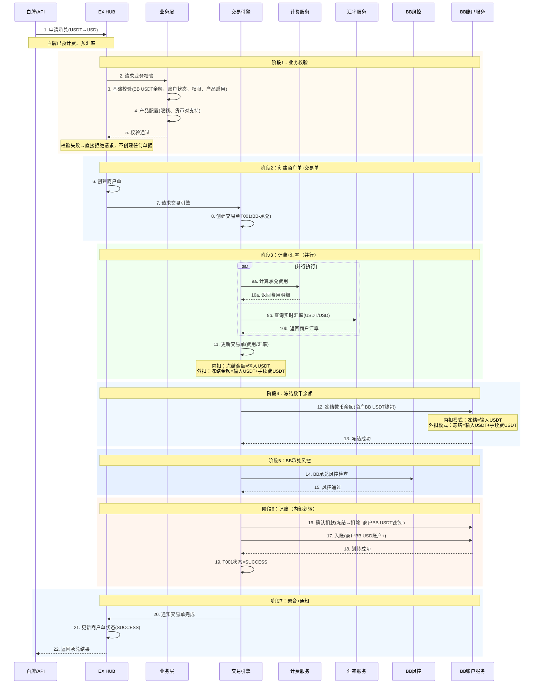

**说明：**

- **纯BB内部承兑**：BB数币钱包 → BB法币账户，内部账户划转
- **先校验再建单**：业务校验通过后才创建商户单和交易单
- **先计费后冻结**：计费+汇率确定后才冻结余额，确保冻结金额准确
- **手续费扣取方式（产品级配置）**：
  - **内扣**：冻结=输入USDT，手续费从承兑金额中扣，到账USD=(输入USDT-手续费USDT)×汇率
  - **外扣**：冻结=输入USDT+手续费USDT，到账USD=输入USDT×汇率，手续费另行扣除
- **先冻结后风控**：冻结余额 → 风控检查 → 通过后确认扣款并入账；风控拒绝则解冻退回
- **无需渠道单**：不调用外部渠道
- **1个商户单，1笔交易单**
- **与 OnRamp A1 完全对称**，方向相反

**异常处理：**

> 场景A1 所有异常均为**解冻退回**，不产生退款单，不收费。

| 异常环节       | 触发条件                                | 处理方式                                 | 商户感知               |
| -------------- | --------------------------------------- | ---------------------------------------- | ---------------------- |
| 业务校验失败   | 余额不足/产品未启用/超限额/货币对不支持 | 直接拒绝，不创建商户单                   | 下单失败，返回错误原因 |
| 冻结失败       | 并发冻结导致余额不足                    | 直接拒绝，不创建商户单                   | 下单失败               |
| BB承兑风控拒绝 | BB风控检测到异常                        | 解冻数币余额，T001=FAILED，商户单=FAILED | 订单失败，余额恢复     |
| 承兑执行失败   | BB承兑引擎异常（重试3次耗尽）           | 解冻数币余额，T001=FAILED，商户单=FAILED | 订单失败，余额恢复     |

**异常总览流程图：**

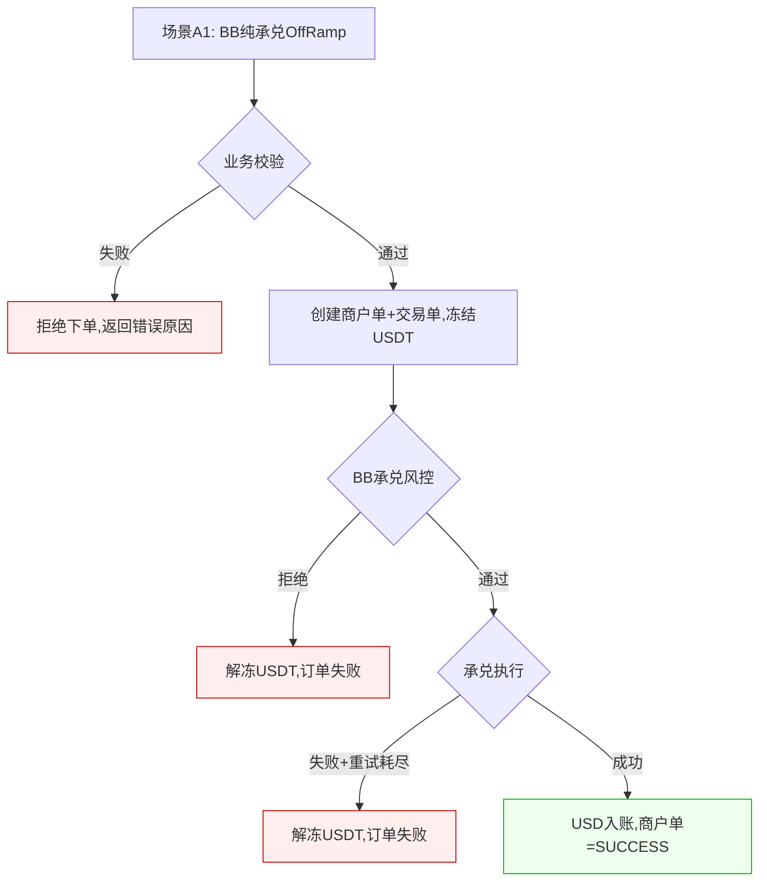

---

### 5.3 场景A2：即时单 — BB数币钱包承兑到IPL法币账户（BB+IPL）

**场景：** 商户BB数币钱包持有USDT，通过BB-IPL打通承兑为USD，入到IPL法币账户。

**特点：** 纯承兑（账户已有余额），跨SP中间户划转，IPL侧为同名收款。2笔交易单。

**单据结构（2笔交易单）：**

```
商户单 M001 (Off-Ramp: BB USDT→IPL USD)  ← BB和IPL共享
    ├── 交易单 T001 (BB): 数币扣款 — 商户USDT钱包扣款，入到IPL中间户(在BB)
    └── 交易单 T002 (IPL): 同名收款 — IPL中间户扣款，入到商户USD账户

单据数：1 商户单 + 2 交易单 + 0 渠道单
资金流：商户 BB USDT 钱包 → IPL中间户(在BB) → 商户 IPL USD 账户
```

**业务流程：**

```
商户下单 → 业务校验 → 校验通过 → 创建商户单+交易单 → 冻结数币余额 →
计费+汇率 → 双侧风控 → T001 BB数币扣款+中间户划转 → T002 IPL同名收款入账 →
交易完成 → 通知商户
```

**关键节点：**

1. 商户选择卖出数币（USDT/USDC）、目标法币（USD）、数币金额
2. 选择"承兑到法币账户"（系统路由到IPL法币账户）
3. 系统校验数币余额充足、IPL账户状态、产品启用、限额合规（**校验失败直接拒绝，不创建任何单据**）
4. 校验通过后创建商户单+交易单，冻结数币余额
5. 双侧风控（BB承兑风控 + IPL同名收款风控）
6. T001→T002串行：BB数币扣款完成后才能IPL同名收款入账
7. 商户单状态更新为 SUCCESS

**时序图：**

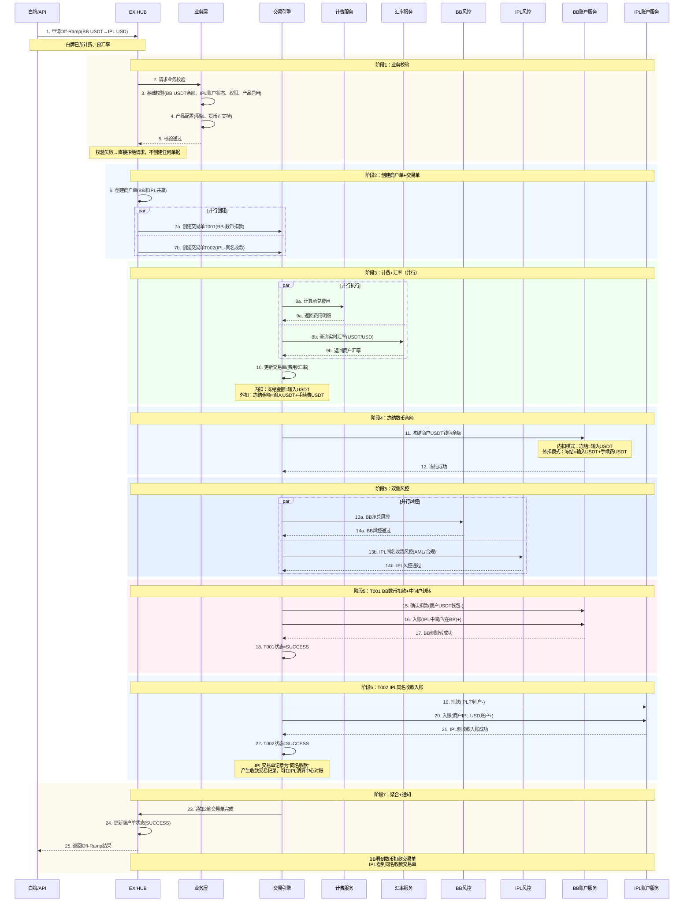

**说明：**

- **先校验再建单**：业务校验通过后才创建商户单和交易单
- **先计费后冻结**：计费+汇率确定后才冻结余额，确保冻结金额准确
- **手续费扣取方式（产品级配置）**：内扣（冻结=输入USDT）/ 外扣（冻结=输入USDT+手续费USDT）
- **1个商户单，2笔交易单**：BB数币扣款1笔 + IPL同名收款1笔
- **T001(BB数币扣款)**：商户USDT钱包 → IPL中间户(在BB)，走BB承兑风控
- **T002(IPL同名收款)**：IPL中间户 → 商户IPL USD账户，走IPL收款合规流程（AML）
- **IPL侧是同名收款交易**：付款人=收款人=同一商户
- **无需渠道单**：通过中间户划转
- **T001→T002串行**

**异常处理：**

| 异常环节                                | 触发条件                        | 处理方式                                                     | 退款               | 商户感知           |
| --------------------------------------- | ------------------------------- | ------------------------------------------------------------ | ------------------ | ------------------ |
| 业务校验失败                            | 余额不足/产品未启用/超限额      | 直接拒绝请求，不创建任何单据                                 | 无                 | 下单失败           |
| BB或IPL风控拒绝                         | BB/IPL风控检测到异常            | 解冻商户USDT余额，T001=FAILED                                | 无（解冻即恢复）   | 订单失败           |
| BB数币扣款执行失败                      | BB账户服务异常                  | 回滚，解冻USDT，T001=FAILED                                  | 无（内部回滚）     | 订单失败           |
| **IPL同名收款失败（T001已成功）** | IPL账户服务异常（资金在中间户） | T002=FAILED，**逆向回滚T001**：中间户→商户BB USDT钱包 | ✅(RT内部)，不收费 | 订单退款，USDT恢复 |

**异常时序图（IPL同名收款失败，逆向回滚）：**

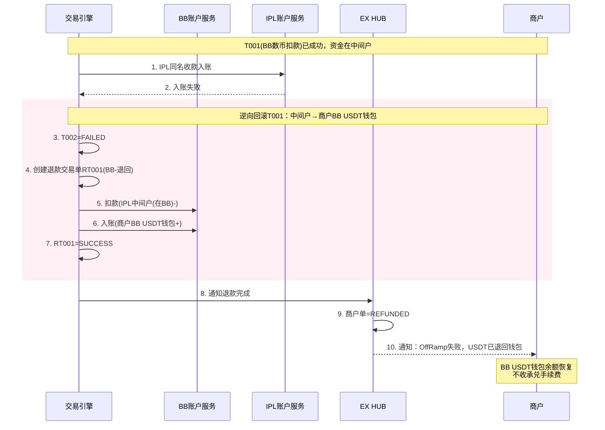

**异常总览流程图：**

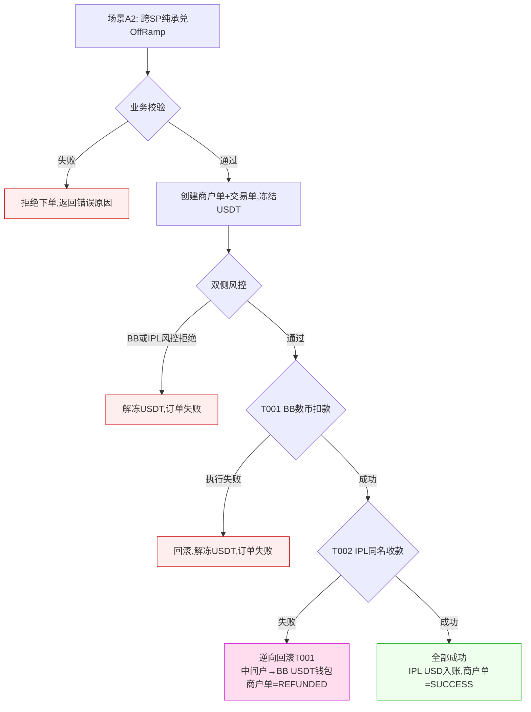

---

### 5.4 场景B1：带付款 — BB数币钱包→承兑→BB/XPAY付款（仅BB）

**场景：** 商户持有BB USDT，OffRamp承兑为USD后，直接通过BB的法币通道（XPAY等）付款给外部收款人。全程在BB内部完成。

**特点：** 承兑 + 付款（调用外部渠道），2笔交易单串行。

**单据结构（2笔交易单）：**

```
商户单 M001 (Off-Ramp: USDT→USD→付款)  ← 仅BB
    ├── 交易单 T001 (BB): 承兑 — BB USDT→USD
    └── 交易单 T002 (BB): 付款 — BB USD付款给收款人（调用XPAY等外部渠道）
            └── 渠道单 C001 (BB PP): XPAY等渠道执行记录

单据数：1 商户单 + 2 交易单 + 1 渠道单（仅 BB PP 可见）
资金流：商户 BB USDT 钱包 → 商户 BB USD 账户 → 外部收款人
```

**业务流程：**

```
商户下单(含收款人信息) → 业务校验(含收款人校验) → 校验通过 →
创建商户单+交易单 → 冻结数币余额 → 计费+汇率 → 风控(承兑+付款+收款人AML) →
T001承兑(USDT→USD) → T002付款(调用渠道) → 交易完成 → 通知商户
```

**关键节点：**

1. 商户选择卖出数币、目标法币、金额
2. 选择"付款给收款人"，指定收款人信息
3. 系统校验数币余额、产品启用、限额、收款人信息（**校验失败直接拒绝，不创建任何单据**）
4. 校验通过后创建商户单+交易单，冻结数币余额
5. 计费+汇率 → 风控（承兑风控+付款风控+收款人AML）
6. T001承兑完成 → T002付款（调用外部渠道）
7. 渠道返回付款结果 → 商户单状态更新

**时序图：**

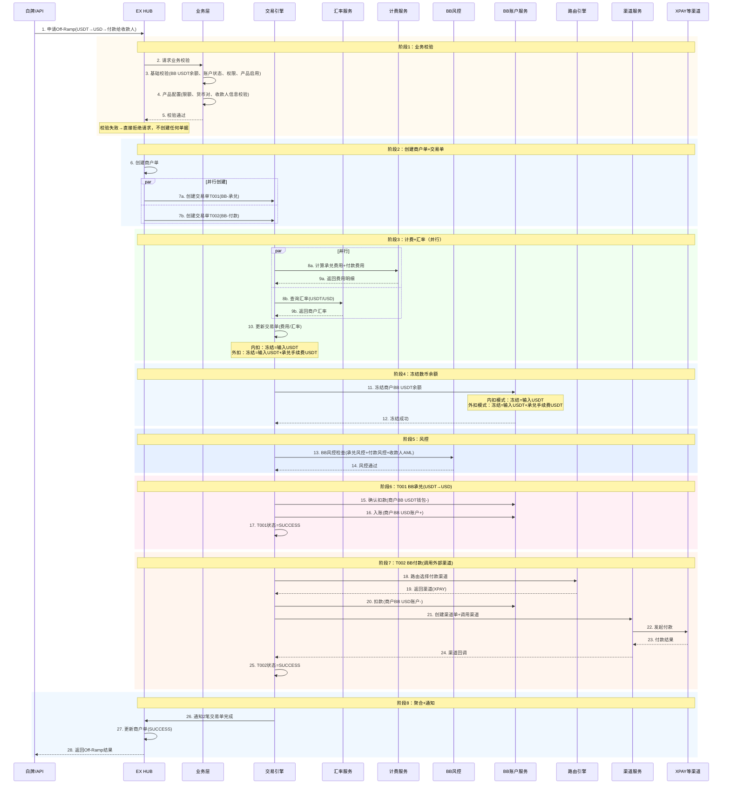

**说明：**

- **先校验再建单**：业务校验通过后才创建商户单和交易单
- **先计费后冻结**：计费+汇率确定后才冻结余额，确保冻结金额准确
- **手续费扣取方式（产品级配置）**：
  - **内扣**：冻结=输入USDT，承兑手续费从USDT中扣，到账USD=(输入USDT-手续费USDT)×汇率；付款手续费从USD中扣
  - **外扣**：冻结=输入USDT+承兑手续费USDT，到账USD=输入USDT×汇率；付款手续费另行扣除
- **1个商户单，2笔交易单**：BB承兑1笔 + BB付款1笔，全程BB内部
- **T001(BB承兑)**：BB USDT→USD，内部账户划转（钱包→法币账户）
- **T002(BB付款)**：BB USD→外部收款人，调用XPAY等外部渠道，有渠道单
- **风控**：BB统一风控（承兑风控+付款风控+收款人AML）
- **计费**：承兑费用 + 付款费用分别计算
- **T001→T002串行**：承兑完成后才能付款

**异常处理：**

> 场景B1的核心复杂度：T001承兑已成功但T002付款失败时，需要根据退款汇率规则决定退回数币还是法币。详见第11章。

| 异常环节                                 | 触发条件                                  | 处理方式                                              | 退款                   | 商户感知 |
| ---------------------------------------- | ----------------------------------------- | ----------------------------------------------------- | ---------------------- | -------- |
| 业务校验失败                             | 余额不足/产品未启用/超限额/收款人信息无效 | 直接拒绝请求，不创建任何单据                          | 无                     | 下单失败 |
| 风控拒绝（未承兑）                       | BB风控拒绝                                | 解冻USDT余额，T001=FAILED                             | 无（解冻即恢复）       | 订单失败 |
| T001承兑执行失败                         | BB承兑引擎异常                            | 解冻USDT余额，T001=FAILED                             | 无（解冻即恢复）       | 订单失败 |
| **T002付款风控拦截（T001已成功）** | T002付款时风控拦截（未送渠道）            | 根据退款汇率规则退回（详见第11章，参考refund.md 5.1） | ✅(RT)，不收承兑费     | 订单退款 |
| **T002付款渠道退票（T001已成功）** | 渠道退票（银行拒绝/退汇等）               | 清算确认 → 根据退款汇率规则退回（参考refund.md 5.1） | ✅(RT)，付款费清算确认 | 订单退款 |

**承兑后付款失败退款时序图（参考 refund.md 5.1）：**

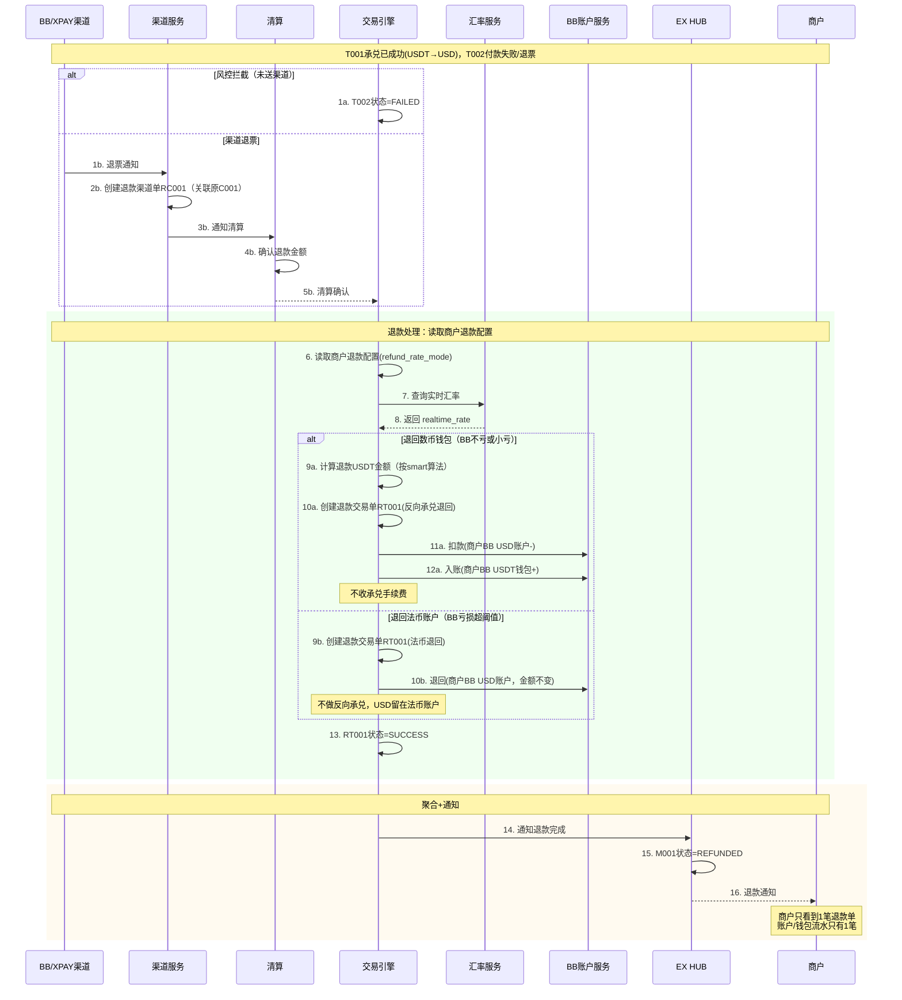

**异常总览流程图：**

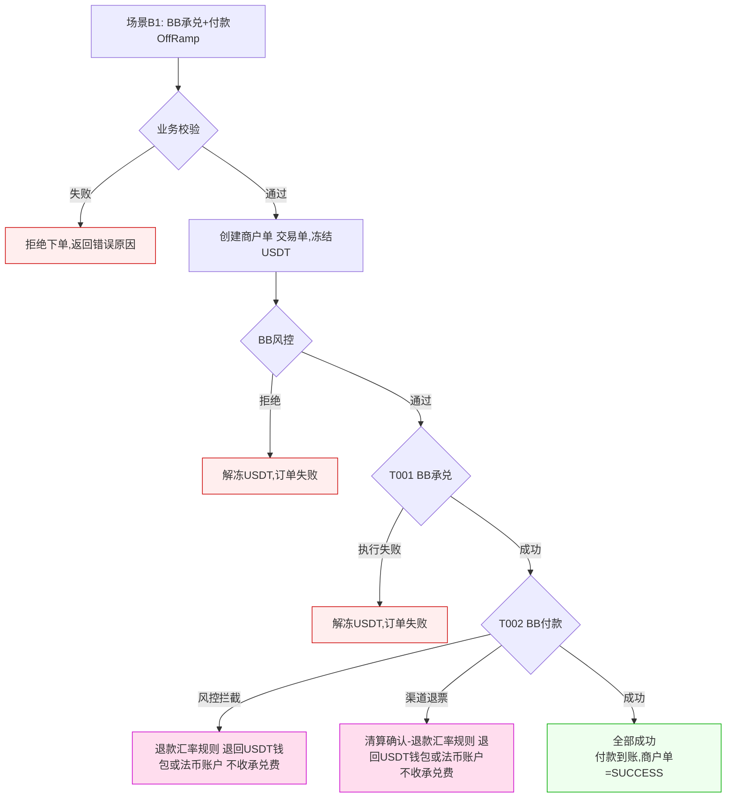

---

### 5.5 场景B2：带付款 — BB数币钱包→承兑→通过IPL付款（BB+IPL）

**场景：** 商户持有BB USDT，OffRamp承兑为USD，通过中间户转到IPL法币账户，再通过IPL法币通道付款给外部收款人。

**特点：** 承兑 + 跨SP划转 + 付款（调用外部渠道），3笔交易单串行。**这是最复杂的OffRamp场景。**

**单据结构（3笔交易单）：**

```
商户单 M001 (Off-Ramp: BB USDT→IPL USD→付款)  ← BB和IPL共享
    ├── 交易单 T001 (BB): 承兑+划转 — BB USDT→USD，通过中间户到IPL
    ├── 交易单 T002 (IPL): 同名收款入账 — 中间户→商户IPL USD账户
    └── 交易单 T003 (IPL): 付款 — IPL USD付款给收款人（调用外部渠道）
            └── 渠道单 C001 (IPL PP): IPL法币通道执行记录

单据数：1 商户单 + 3 交易单 + 1 渠道单（仅 IPL PP 可见）
资金流：商户 BB USDT 钱包 → 中间户 → 商户 IPL USD 账户 → 外部收款人
```

**业务流程：**

```
商户下单(含收款人信息) → 业务校验(含收款人校验) → 校验通过 →
创建商户单+交易单 → 冻结数币余额 → 计费+汇率 → 双侧风控 →
T001 BB承兑+中间户划转 → T002 IPL同名收款入账 → T003 IPL付款(调用渠道) →
交易完成 → 通知商户
```

**关键节点：**

1. 商户选择卖出数币、目标法币、金额
2. 选择"付款给收款人"，指定收款人信息
3. 系统校验数币余额、IPL账户状态、产品启用、限额、收款人信息（**校验失败直接拒绝，不创建任何单据**）
4. 校验通过后创建商户单+交易单，冻结数币余额
5. 计费+汇率 → 双侧风控（BB承兑风控 + IPL付款风控+收款人AML）
6. T001→T002→T003串行：承兑完才能入账，入账后才能付款
7. 渠道返回付款结果 → 商户单状态更新

**时序图：**

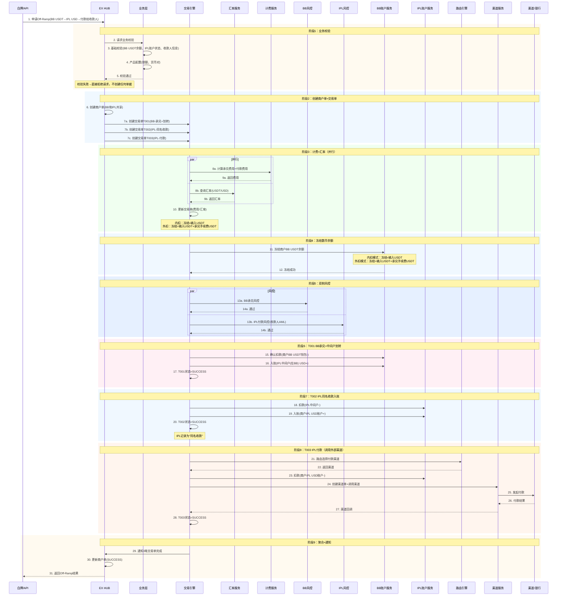

**说明：**

- **先校验再建单**：业务校验通过后才创建商户单和交易单
- **先计费后冻结**：计费+汇率确定后才冻结余额，确保冻结金额准确
- **手续费扣取方式（产品级配置）**：内扣（冻结=输入USDT）/ 外扣（冻结=输入USDT+承兑手续费USDT）
- **1个商户单，3笔交易单**：BB承兑+划转1笔 + IPL同名收款1笔 + IPL付款1笔
- **T001(BB承兑+划转)**：BB USDT→USD，通过中间户划转到IPL侧
- **T002(IPL同名收款)**：中间户 → 商户IPL USD账户，IPL记录为同名收款
- **T003(IPL付款)**：商户IPL USD → 外部收款人，调用外部渠道，有渠道单
- **风控**：BB承兑风控 + IPL付款风控（收款人AML），各自独立
- **T001→T002→T003串行**：承兑完才能入账，入账后才能付款

**异常处理：**

> 场景B2是最复杂的异常场景，涉及3笔交易单、跨SP中间户、双层风控，以及承兑后付款失败的退款汇率规则。

| 异常环节                                        | 触发条件                              | 处理方式                                                      | 退款                      | 商户感知           |
| ----------------------------------------------- | ------------------------------------- | ------------------------------------------------------------- | ------------------------- | ------------------ |
| 业务校验失败                                    | 余额不足/产品未启用/超限额/收款人无效 | 直接拒绝请求，不创建任何单据                                  | 无                        | 下单失败           |
| BB或IPL风控拒绝                                 | BB/IPL风控拒绝                        | 解冻USDT余额，T001=FAILED                                     | 无（解冻即恢复）          | 订单失败           |
| T001承兑执行失败                                | BB承兑引擎异常                        | 解冻USDT余额，T001=FAILED                                     | 无（解冻即恢复）          | 订单失败           |
| **T002 IPL收款失败（T001已成功）**        | IPL账户服务异常（资金在中间户）       | T002=FAILED，逆向回滚T001：中间户→BB USDT钱包                | ✅(RT内部)，不收费        | 订单退款，USDT恢复 |
| **T003 IPL付款风控拦截（T001+T002成功）** | IPL付款时风控拦截（未送渠道）         | 逆向回滚T001+T002 → 退款汇率规则退回（参考refund.md 5.4）    | ✅(RT内部×3)，不收承兑费 | 订单退款           |
| **T003 IPL付款渠道退票（T001+T002成功）** | 渠道退票（银行拒绝/退汇等）           | 清算确认 → 逆向回滚 → 退款汇率规则退回（参考refund.md 5.4） | ✅(RT内部×3)，付款费清算 | 订单退款           |

**承兑后付款失败退款时序图（参考 refund.md 5.4）：**

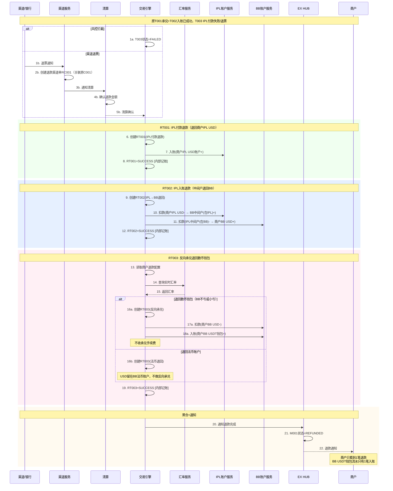

**异常总览流程图：**

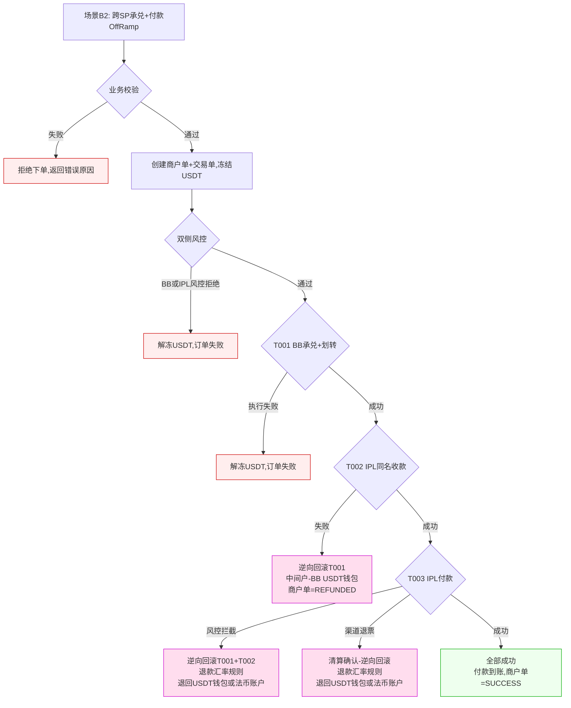

**场景B2异常结论：**

| 失败环节             | 资金位置    | 处理方式                                   | 是否需要退款单  |
| -------------------- | ----------- | ------------------------------------------ | --------------- |
| 业务校验             | 未扣款      | 拒绝下单                                   | ❌              |
| 风控拒绝（未承兑）   | 已冻结      | 解冻USDT                                   | ❌              |
| T001承兑执行失败     | 已冻结      | 解冻USDT                                   | ❌              |
| T002 IPL收款失败     | 中间户      | **逆向回滚T001**，退回USDT           | ✅（内部RT）    |
| T003 IPL付款风控拦截 | 商户IPL账户 | **逆向回滚T001+T002**，退款汇率规则  | ✅（内部RT×3） |
| T003 IPL付款渠道退票 | 商户IPL账户 | 清算确认→**逆向回滚**，退款汇率规则 | ✅（内部RT×3） |

---

## 6. 中间户机制（跨SP场景）

> 与 OnRamp 相同，详见 `onramp-complete.md` 第6章。

**OffRamp 中的资金流向（与 OnRamp 相反）：**

```
OnRamp（法币→数币）：
  IPL → BB：商户 IPL 账户 → BB 中间户(在 IPL) → IPL 中间户(在 BB) → BB 承兑

OffRamp（数币→法币）：
  BB → IPL：商户 BB USDT 钱包 → IPL 中间户(在 BB) → BB 中间户(在 IPL) → 商户 IPL 账户
```

---

## 7. 状态机

### 7.1 商户单状态机

```
                    ┌──────────┐
                    │ CREATED  │  业务校验通过后创建
                    └────┬─────┘
                         │
                         ▼
                   ┌──────────┐
                   │PROCESSING│  开始执行交易单链
                   └────┬─────┘
                        │
              ┌─────────┼─────────┐
              ▼                   ▼
        ┌──────────┐        ┌──────────┐
        │ SUCCESS  │        │  FAILED  │
        └──────────┘        └────┬─────┘
                                 │
                    ┌────────────┤
                    ▼            ▼
              ┌──────────┐ ┌─────────┐
              │ REFUNDING│ │CANCELLED│
              └────┬─────┘ └─────────┘
                   ▼
              ┌──────────┐
              │ REFUNDED │
              └──────────┘
```

**与 OnRamp 状态机的差异：**

- OffRamp 无 `AWAITING_FUNDS` 和 `EXPIRED` 状态（无预约单模式）
- OffRamp 的 `REFUNDING`/`REFUNDED` 主要用于承兑后付款失败的退款场景（B1、B2）

### 7.2 交易单状态机

```
CREATED → PROCESSING → SUCCESS
                    → FAILED → REFUNDING → REFUNDED
```

### 7.3 状态说明

| 状态       | 说明       | 触发条件                             |
| ---------- | ---------- | ------------------------------------ |
| CREATED    | 订单已创建 | 业务校验通过后创建                   |
| PROCESSING | 处理中     | 开始执行交易单链                     |
| SUCCESS    | 成功       | 所有交易单完成                       |
| FAILED     | 失败       | 任一交易单失败                       |
| CANCELLED  | 已取消     | 商户主动取消（仅限未开始执行的订单） |
| REFUNDING  | 退款中     | 承兑成功但付款失败，触发退款         |
| REFUNDED   | 已退款     | 退款完成                             |

---

## 8. 计费与汇率

### 8.1 计费项

| 费用类型   | 说明                           | 计费时机         | 适用场景 |
| ---------- | ------------------------------ | ---------------- | -------- |
| 承兑费     | 数币→法币承兑手续费           | 承兑交易单创建时 | 所有场景 |
| 付款手续费 | 法币付款手续费（仅带付款场景） | 付款交易单创建时 | B1、B2   |

> 完整的计费配置详见 `productfee.md`。

### 8.2 汇率机制

| 阶段     | 说明                                                     |
| -------- | -------------------------------------------------------- |
| 预汇率   | 商户下单时展示预估汇率和费用，仅供参考                   |
| 最终汇率 | 所有OffRamp场景均为即时单，下单时即锁定汇率              |
| 退款汇率 | 承兑后付款失败退回时，根据退款汇率规则决定（详见第11章） |

> 完整的汇率机制详见 `fx.md`。

---

## 9. 风控规则与异常退款汇总

### 9.1 风控分层

| 交易类型     | 风控方   | 检查内容                         |
| ------------ | -------- | -------------------------------- |
| BB 承兑      | BB 风控  | 承兑金额、商户风险等级、交易频率 |
| IPL 同名收款 | IPL 风控 | 收款合规（AML）                  |
| BB 付款      | BB 风控  | 付款金额、收款人AML              |
| IPL 付款     | IPL 风控 | 付款金额、收款人AML、贸易背景    |

### 9.2 关键规则

- **收款人预审核**：带付款场景需收款人通过风控审核（详见 `vaandpayees.md` 4.3）
- **限额**：单笔 100 ~ 50,000 USD（可配置）
- **收款人AML**：所有付款场景需对收款人做AML检查

### 9.3 异常退款设计原则与汇总

> **设计原则**（与 `refund.md` 一致）：
>
> - **商户端一致性**：商户只看到1笔退款/失败，内部多笔交易单是内部记账，商户不可见
> - **清算先行**：涉及手续费退还的退款，先由清算处理完再执行退款
> - **退款不再收承兑手续费**：承兑后失败退回数币钱包时，不再收承兑手续费
> - **退票 = 新渠道单**：渠道退票时生成一笔新的退款渠道单，关联原渠道单

**OffRamp 退款汇总表：**

| #  | 场景 | 失败环节                    | 资金位置    | 退回目标                 | 退款单        | 收费       | 商户感知 |
| -- | ---- | --------------------------- | ----------- | ------------------------ | ------------- | ---------- | -------- |
| 1  | A1   | 业务校验失败                | 未扣款      | 直接拒绝，不建单         | ❌            | 不收       | 下单失败 |
| 2  | A1   | 冻结/风控/承兑失败          | 已冻结      | 解冻退回BB USDT钱包      | ❌            | 不收       | 订单失败 |
| 3  | A2   | 业务校验失败                | 未扣款      | 直接拒绝，不建单         | ❌            | 不收       | 下单失败 |
| 4  | A2   | 冻结/风控失败               | 已冻结      | 解冻退回BB USDT钱包      | ❌            | 不收       | 订单失败 |
| 5  | A2   | IPL同名收款失败(T001已成功) | 中间户      | 逆向回滚→BB USDT钱包    | ✅(RT内部)    | 不收       | 订单退款 |
| 6  | B1   | 业务校验失败                | 未扣款      | 直接拒绝，不建单         | ❌            | 不收       | 下单失败 |
| 7  | B1   | 冻结/风控/承兑失败          | 已冻结      | 解冻退回BB USDT钱包      | ❌            | 不收       | 订单失败 |
| 8  | B1   | 付款风控拦截/渠道退票       | 商户BB法币  | 退款汇率规则→USDT或法币 | ✅(RT)        | 不收承兑费 | 订单退款 |
| 9  | B2   | 业务校验失败                | 未扣款      | 直接拒绝，不建单         | ❌            | 不收       | 下单失败 |
| 10 | B2   | 冻结/风控/承兑失败          | 已冻结      | 解冻退回BB USDT钱包      | ❌            | 不收       | 订单失败 |
| 11 | B2   | IPL收款失败(T001已成功)     | 中间户      | 逆向回滚→BB USDT钱包    | ✅(RT内部)    | 不收       | 订单退款 |
| 12 | B2   | IPL付款失败(T001+T002成功)  | 商户IPL法币 | 逆向回滚→退款汇率规则   | ✅(RT内部×3) | 不收承兑费 | 订单退款 |

**核心原则总结：**

1. **先校验再建单** → 业务校验通过后才创建商户单，校验失败直接拒绝请求，不创建任何单据（API和白牌统一）
2. **资金未离开商户钱包** → 解冻即可，不产生退款单
3. **资金在中间户**（跨SP场景） → 逆向回滚，创建内部退款交易单，不收承兑手续费
4. **承兑后付款失败** → 根据退款汇率规则决定退回数币钱包还是法币账户（详见第11章）
5. **商户端一致性** → 商户只看到1笔退款或失败，内部多笔交易单为内部记账

> 各场景的详细异常处理说明已穿插在第5章各场景中（5.2~5.5），包含异常表格、时序图和流程图。

---

## 10. 退款汇率规则（承兑后付款失败）

> 完整的退款流程详见 `refund.md` 第5章。本节仅摘要与 OffRamp 直接相关的退款汇率规则。

### 10.1 核心问题

OffRamp 带付款场景（B1、B2）中，承兑已完成（USDT→USD），但付款失败，需要退回。

**核心问题：退回数币还是法币？用什么汇率？**

### 10.2 商户退款配置

| 配置项                    | 默认值        | 说明                                                                         |
| ------------------------- | ------------- | ---------------------------------------------------------------------------- |
| `refund_rate_mode`      | `smart`     | `smart`=智能判断 / `original`=始终按原汇率 / `realtime`=始终按实时汇率 |
| `refund_rate_threshold` | `1%`        | smart模式下的容忍阈值                                                        |
| `refund_fee_policy`     | `no_refund` | 付款手续费：`no_refund`=不退 / `refund`=退回                             |

### 10.3 Smart模式算法（默认）

```
Off-Ramp退款（原交易 USDT→USD，付款失败退回）：
  original_rate = 原交易时 1 USDT = X USD
  realtime_rate = 退款时 1 USDT = Y USD

  如果 Y ≤ X（USDT贬值，BB不亏）：
    → 按实时汇率退回 refund_usd / Y 个USDT 到数币钱包 ✅
  如果 Y > X 且 (Y-X)/X ≤ 1%（BB小亏≤1%）：
    → 按原汇率退回 refund_usd / X 个USDT 到数币钱包 ✅
  如果 Y > X 且 (Y-X)/X > 1%（BB亏损超阈值）：
    → 退回 refund_usd 到法币账户（不做反向承兑）⚠️
```

**通用规则：**

- 退回数币钱包时，**不再收承兑手续费**
- **默认付款手续费不退**（特殊情况需走清算特殊流程）

---

## 11. 商户端功能清单

> 详细的商户端交互原型见配套文档。

| 功能模块              | 功能点                                      | 说明                     |
| --------------------- | ------------------------------------------- | ------------------------ |
| **发起OffRamp** | 选择数币/法币/金额/承兑到账户或付款给收款人 | 纯承兑 vs 带付款两种模式 |
| **收款人选择**  | 从已审核的收款人列表中选择（仅带付款场景）  | 详见 `vaandpayees.md`  |
| **预估展示**    | 展示预估汇率、费用、到账金额                | 下单前确认               |
| **订单列表**    | 查看所有OffRamp订单及状态                   | 支持筛选、搜索           |
| **订单详情**    | 查看订单详情、交易进度、退款信息            | 商户只看到商户单级别     |
| **退款详情**    | 查看退款金额、退款汇率、退回目标            | 承兑后付款失败时展示     |

---

## 12. 场景汇总对比

### 按场景分类

| 场景 | 配置   | 交易类型       | 交易单数 | SP       | 渠道单 | 收款人 |
| ---- | ------ | -------------- | -------- | -------- | ------ | ------ |
| A1   | 仅BB   | 纯承兑         | 1笔      | 单SP(BB) | ❌     | ❌     |
| A2   | BB+IPL | 纯承兑(跨SP)   | 2笔      | 双SP     | ❌     | ❌     |
| B1   | 仅BB   | 承兑+付款      | 2笔      | 单SP(BB) | ✅     | ✅     |
| B2   | BB+IPL | 承兑+跨SP+付款 | 3笔      | 双SP     | ✅     | ✅     |

### OnRamp vs OffRamp 对称关系

```
OnRamp（法币→数币）                    OffRamp（数币→法币）
┌──────────────────┐                  ┌──────────────────┐
│ A1: BB法币→数币   │  ◄──对称──►     │ A1: BB数币→法币   │
│ 纯承兑，1笔       │                  │ 纯承兑，1笔       │
└──────────────────┘                  └──────────────────┘
┌──────────────────┐                  ┌──────────────────┐
│ A2: IPL法币→数币  │  ◄──对称──►     │ A2: 数币→IPL法币  │
│ 跨SP，2笔         │                  │ 跨SP，2笔         │
└──────────────────┘                  └──────────────────┘
┌──────────────────┐                  ┌──────────────────┐
│ B1: BB VA收款→承兑│  ◄──对称──►     │ B1: 承兑→BB付款   │
│ 预约单，2笔       │                  │ 即时单，2笔       │
└──────────────────┘                  └──────────────────┘
┌──────────────────┐                  ┌──────────────────┐
│ B2: IPL VA→承兑   │  ◄──对称──►     │ B2: 承兑→IPL付款  │
│ 预约单，3笔       │                  │ 即时单，3笔       │
└──────────────────┘                  └──────────────────┘
```

### 核心差异

| 对比项               | OnRamp（法币→数币）        | OffRamp（数币→法币）                |
| -------------------- | --------------------------- | ------------------------------------ |
| **承兑方向**   | USD → USDT                 | USDT → USD                          |
| **触发模式**   | 即时单 + 预约单             | 仅即时单（无预约单）                 |
| **收款人**     | 不需要                      | 带付款场景需要                       |
| **退款复杂度** | 简单（解冻/退回法币账户）   | 复杂（退款汇率规则，退数币还是法币） |
| **状态机**     | 含 AWAITING_FUNDS / EXPIRED | 不含（无预约单）                     |

---

*最后更新：2026-02-22*
*文档版本：v1.0 — OffRamp 完整产品方案，4场景×先校验再建单，含异常处理和退款汇率规则*
