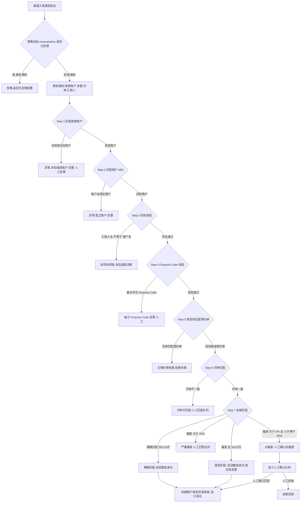
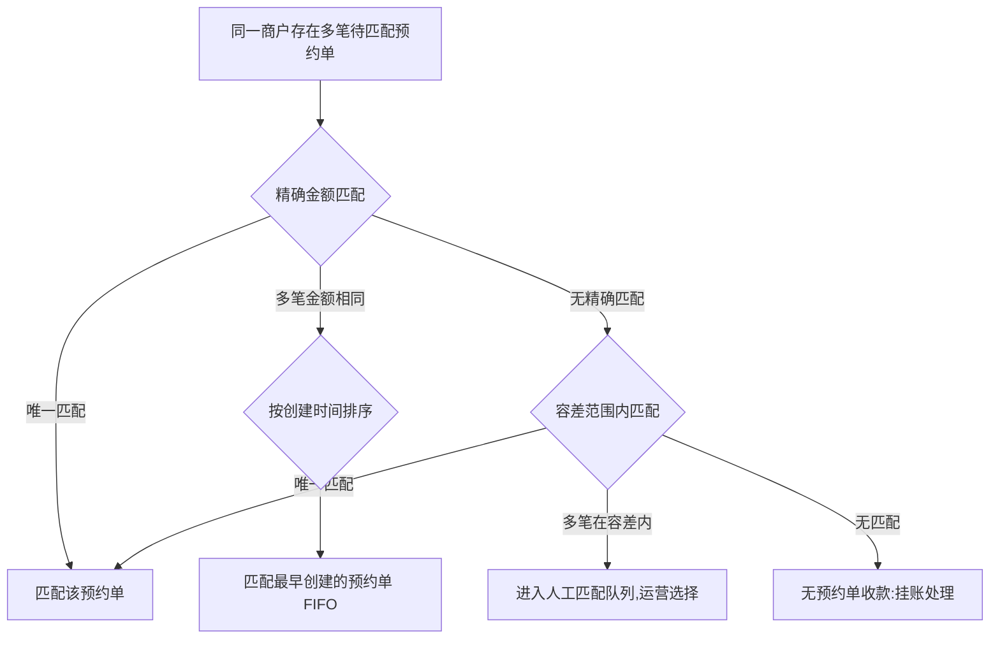
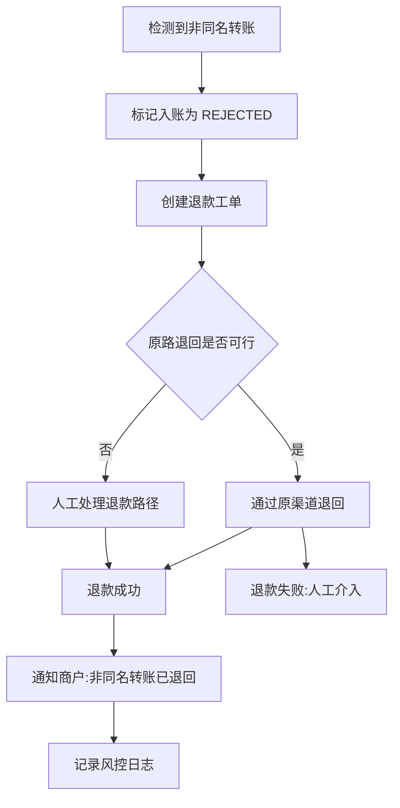
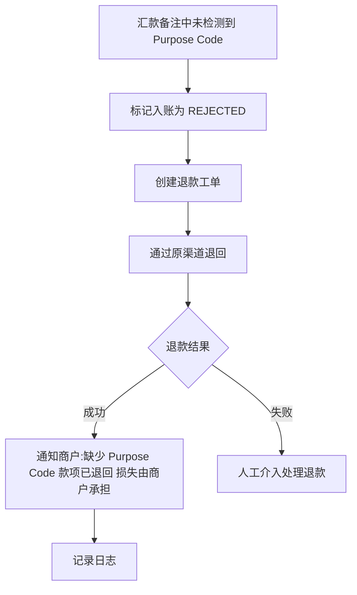
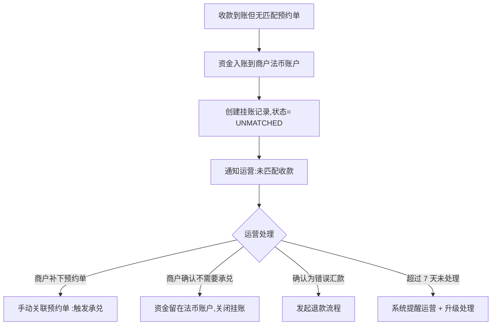
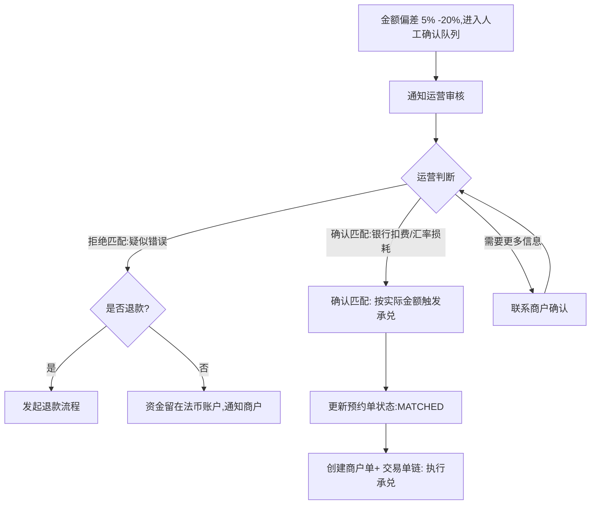
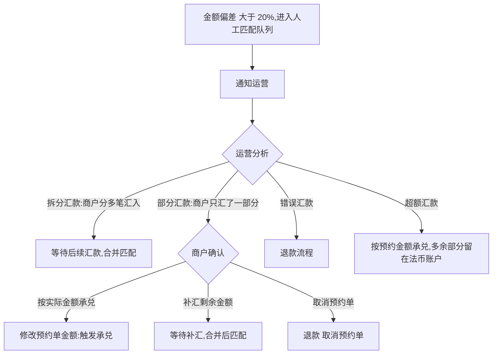
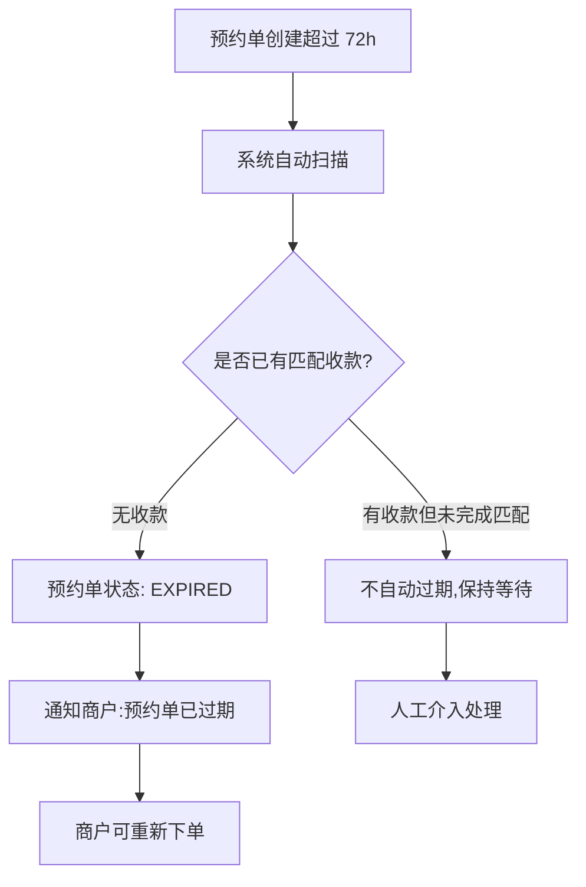
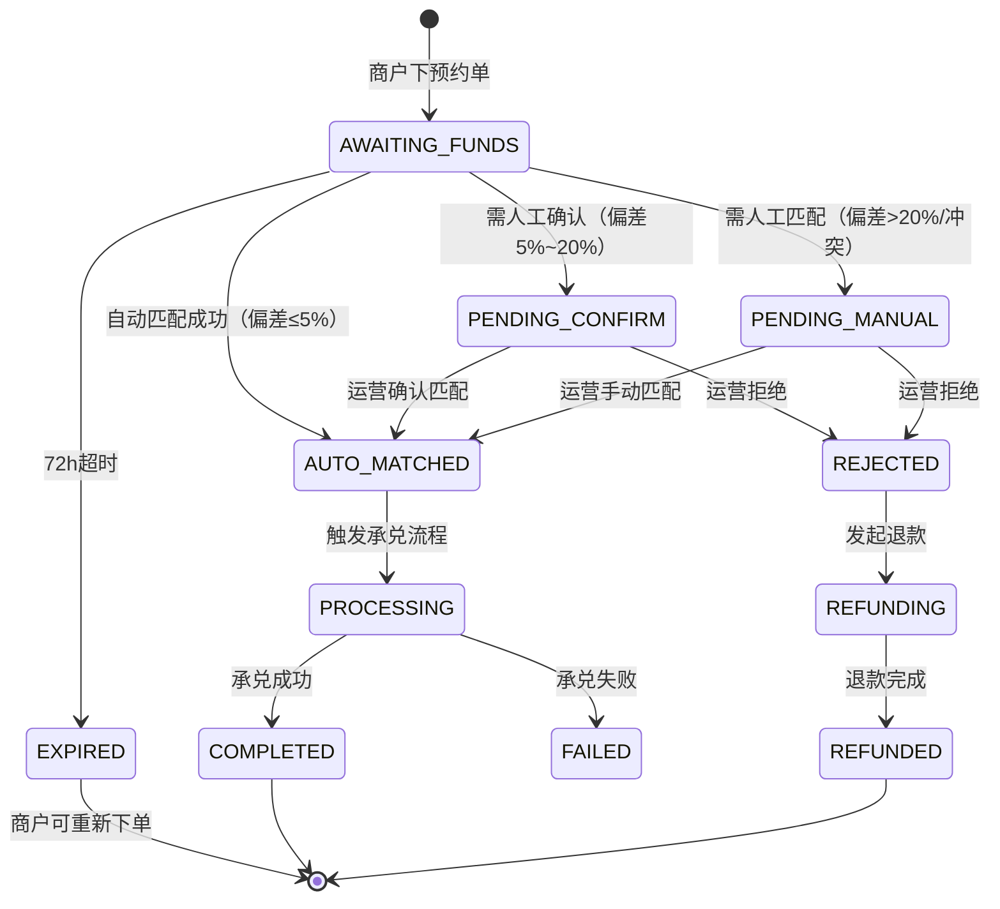

# OnRamp 产品需求文档（PRD）

> **文档类型**：产品需求文档（PRD）
> **产品名称**：OnRamp — 法币买入数币
> **版本**：v1.0
> **最后更新**：2026-02-21
> **配套文档**：`onramp-technical.md`（完整技术方案）、`mp-onramp-v2.html`（交互原型）

---

## 1. 产品概述

### 1.1 定义

**OnRamp = 法币 → 数币承兑**。商户将法币（USD 等）兑换为 USDT/USDC，入账到数币钱包。

### 1.2 核心价值

| 用户类型           | 痛点                                   | OnRamp 解决方案          |
| ------------------ | -------------------------------------- | ------------------------ |
| WEB2 外贸/服贸客户 | 买家需用数币付款，汇率不稳定或外汇管制 | 提供法币→稳定币承兑能力 |
| WEB3 行业客户      | 需要将法币转为数币进入 WEB3 生态       | 一站式法币入金+承兑      |

### 1.3 产品边界

| 范围        | 说明                               |
| ----------- | ---------------------------------- |
| ✅ 本期包含 | OnRamp（法币→数币）全流程         |
| ❌ 本期不含 | OffRamp（数币→法币）— 见独立 PRD |
| ❌ 本期不含 | 纯 FX 兑换（法币↔法币）           |

---

## 2. 角色与系统架构

### 2.1 平台角色

| 角色       | 英文                  | Portal | 在 OnRamp 中的职责                               |
| ---------- | --------------------- | ------ | ------------------------------------------------ |
| 平台管理员 | SaaS Admin            | SA     | 管理 SP 产品上架、全局配置                       |
| 服务提供商 | Service Provider (SP) | PP     | 提供承兑能力（BB）、法币账户能力（BB/IPL）       |
| 租户       | Tenant                | TP     | 为商户代理 OnRamp 产品，配置费率和法币账户优先级 |
| 商户       | Merchant              | MP     | 发起 OnRamp 交易，选择支付方式                   |

### 2.2 SP 角色定位

```
┌─────────────────────────────────────────────────────────────┐
│  EX 平台中的 SP                                              │
├──────────────┬──────────────────────────────────────────────┤
│  BB（承兑SP） │  核心能力：                                    │
│              │  · 数币钱包（USDT/USDC）                       │
│              │  · 承兑引擎（法币⇄数币）                       │
│              │  · BB 法币账户                                 │
│              │  · BB 代收付账户（自有渠道）                     │
│              │  · XPAY VA（BB 内部渠道，对 TP/MP 不透明）       │
│              │                                               │
│              │  BB 同时是 PP 角色，其渠道对 EX 透明，           │
│              │  对 TP/MP 不透明                                │
├──────────────┼──────────────────────────────────────────────┤
│  IPL（法币SP）│  核心能力：                                    │
│              │  · IPL 法币账户                                │
│              │  · VA 同名收款（多银行）                        │
│              │  · POBO 出款                                   │
│              │                                               │
│              │  与 BB 为集团内部合作，对外不暴露                 │
└──────────────┴──────────────────────────────────────────────┘

⚠️ XPAY 不是 SP，是 BB 的底层 Channel，不在 EX 生态中体现
⚠️ 商户不感知底层 SP（BB/IPL），只看到统一的"法币账户"和"数币钱包"
```

### 2.3 系统分层架构

```
┌─────────────────────────────────────────────────────────────┐
│                    商户端（MP Portal / API）                   │
│                    商户发起 OnRamp、查看订单                    │
├─────────────────────────────────────────────────────────────┤
│                    EX HUB（编排层）                            │
│                    商户单管理、业务校验、交易编排                 │
├─────────────────────────────────────────────────────────────┤
│                    交易引擎（Transaction Engine）              │
│                    交易单管理、计费、汇率、风控                  │
├──────────────┬──────────────────────────────────────────────┤
│  BB 账户服务  │  IPL 账户服务                                  │
│  BB 渠道服务  │  IPL 渠道服务                                  │
│  (PP 后台)    │  (PP 后台)                                    │
├──────────────┴──────────────────────────────────────────────┤
│                    底层渠道（Channel）                         │
│  BB 代收付账户 │ XPAY VA │ IPL VA │ 其他渠道                   │
│  ⚠️ 仅 PP 后台可见，EX 对 BB 渠道透明                          │
└─────────────────────────────────────────────────────────────┘
```

---

## 3. 商户配置与开通

### 3.1 商户配置组合

本期仅两种配置，承兑引擎固定在 BB，不存在仅 IPL 的情况：

| 配置模式           | 包含产品                            | 收款账户选项                                  | 适用场景             |
| ------------------ | ----------------------------------- | --------------------------------------------- | -------------------- |
| **仅 BB**    | BB 承兑 + BB 数币钱包 + BB 法币账户 | BB 代收付账户（可能含 XPAY VA，但对商户透明） | 通用客户             |
| **BB + IPL** | 上述全部 + IPL 法币账户             | BB 代收付账户 + IPL 同名 VA 账户（多银行）    | 有贸易背景的合规客户 |

### 3.2 开通规则

```
商户选择开通"承兑产品"时：

【默认开通（不需选择）】
1. BB 数币钱包 — 固定默认开通
2. BB 法币账户 — 固定默认开通
→ 推送 BB 审核，BB 审核通过即可使用

【商户可选】
3. 是否额外使用 IPL 法币账户？
   - 选择"是" → 额外推送 IPL 审核
   - 选择"否" → 不推送 IPL，只用 BB

【审核独立】
BB 审核通过 → BB 可用（数币钱包 + BB 法币账户 + 承兑）
IPL 审核通过 → IPL 可用（IPL 法币账户 + VA 收款）
BB 和 IPL 审核互不依赖，各自独立
```

### 3.3 租户签约与配置

租户（TP）在签约时决定商户可用的法币账户范围：

| TP 配置项      | 选项                      | 影响                                  |
| -------------- | ------------------------- | ------------------------------------- |
| 法币账户模式   | 仅 BB / 仅 IPL / BB + IPL | 决定商户可选的收款账户类型            |
| 法币账户优先级 | BB 优先 / IPL 优先        | 商户同时有 BB 和 IPL 时，系统默认选择 |

### 3.4 交易路由规则

```
场景1：商户只开通了 BB（没选 IPL）
→ 直接走 BB，无需路由

场景2：商户同时开通了 BB 和 IPL
→ 看 TP 配置的法币账户优先级：
   - BB 优先 → 默认走 BB
   - IPL 优先 → 默认走 IPL
→ 商户在下单时也可手动选择

本期不实现：按金额/币种/国家等复杂条件路由
```

---

## 4. 三单模型

### 4.1 模型概览

OnRamp 交易采用三层单据模型，每层对应不同的系统层级和可见性：

```
┌─────────────────────────────────────────────────────────────┐
│  商户单（Merchant Order）                                     │
│  · 归属：EX HUB（编排层）                                     │
│  · 可见性：MP ✅  TP ✅  PP ✅  SA ✅                          │
│  · 职责：面向商户的订单，聚合所有交易单状态                      │
│  · 1个商户单 → 1~N 笔交易单                                   │
├─────────────────────────────────────────────────────────────┤
│  交易单（Transaction）                                        │
│  · 归属：交易引擎（Transaction Engine）                        │
│  · 可见性：MP ❌  TP ✅  PP ✅  SA ✅                          │
│  · 职责：按 SP 拆分的具体交易（BB 交易单 / IPL 交易单）         │
│  · 每笔交易单归属一个 SP                                      │
│  · 包含：计费、汇率、风控、记账                                │
├─────────────────────────────────────────────────────────────┤
│  渠道单（Channel Order）                                      │
│  · 归属：SP 内部渠道服务                                      │
│  · 可见性：MP ❌  TP ❌  PP ✅（仅该 SP 的 PP）                │
│  · 职责：SP 调用底层渠道的执行记录                              │
│  · BB 的渠道单对 EX 透明（因为 EX 帮 BB 对接渠道）              │
│  · IPL 的渠道单仅 IPL PP 可见                                 │
└─────────────────────────────────────────────────────────────┘
```

### 4.2 各场景的单据结构

#### 场景 A：纯承兑（法币钱包余额 → 数币）— 即时单

适用：商户法币账户已有余额，直接承兑。即时完成。

**仅 BB 配置：**

```
商户单 M001 (OnRamp: USD→USDT)
    └── 交易单 T001 (BB): 承兑 — BB USD→USDT（内部账户划转）

单据数：1 商户单 + 1 交易单 + 0 渠道单
资金流：商户 BB USD 账户 → 商户 BB USDT 钱包
```

**BB + IPL 配置（从 IPL 法币账户承兑）：**

```
商户单 M001 (OnRamp: IPL USD→BB USDT)
    ├── 交易单 T001 (IPL): 同名提现 — IPL USD 转到 BB（通过中间户）
    └── 交易单 T002 (BB): 承兑 — BB USD→USDT

单据数：1 商户单 + 2 交易单 + 0 渠道单
资金流：商户 IPL USD 账户 → 中间户 → BB USD → 商户 BB USDT 钱包
```

#### 场景 B：银行转账收款 → 承兑 — 预约单

适用：商户先下预约单，外部汇款到账后自动触发承兑。

**仅 BB 配置（BB 代收付/XPAY VA 收款）：**

```
商户单 M001 (OnRamp: VA 收款 USD→USDT)
    ├── 交易单 T001 (BB): 收款 — 外部 USD 入到 BB 法币账户（渠道通知触发）
    │       └── 渠道单 C001 (BB PP): BB 代收付/XPAY 渠道执行记录
    └── 交易单 T002 (BB): 承兑 — BB USD→USDT

单据数：1 商户单 + 2 交易单 + 1 渠道单（仅 BB PP 可见）
资金流：外部汇款人 → 商户 BB USD 账户 → 商户 BB USDT 钱包
触发方式：渠道入账通知 → 匹配预约单 → 自动触发 T002
```

**BB + IPL 配置（IPL VA 收款 → 承兑）：**

```
商户单 M001 (OnRamp: IPL VA 收款→USD→USDT)
    ├── 交易单 T001 (IPL): VA 收款 — 外部 USD 入到 IPL 法币账户（渠道通知触发）
    │       └── 渠道单 C001 (IPL PP): IPL VA 渠道执行记录
    ├── 交易单 T002 (IPL): 同名提现 — IPL USD 转到 BB（通过中间户）
    └── 交易单 T003 (BB): 承兑 — BB USD→USDT

单据数：1 商户单 + 3 交易单 + 1 渠道单（仅 IPL PP 可见）
资金流：外部汇款人 → 商户 IPL USD 账户 → 中间户 → BB USD → 商户 BB USDT 钱包
触发方式：渠道入账通知 → 匹配预约单 → 自动触发 T002 + T003
```

### 4.3 单据关系汇总

| 场景 | 配置   | 支付方式          | 商户单 | 交易单                            | 渠道单     | 触发方式        |
| ---- | ------ | ----------------- | ------ | --------------------------------- | ---------- | --------------- |
| A1   | 仅 BB  | 法币钱包余额      | 1      | 1 (BB 承兑)                       | 0          | 商户即时发起    |
| A2   | BB+IPL | 法币钱包余额(IPL) | 1      | 2 (IPL 提现 + BB 承兑)            | 0          | 商户即时发起    |
| B1   | 仅 BB  | 银行转账(BB)      | 1      | 2 (BB 收款 + BB 承兑)             | 1 (BB PP)  | 预约单+渠道触发 |
| B2   | BB+IPL | 银行转账(IPL VA)  | 1      | 3 (IPL 收款 + IPL 提现 + BB 承兑) | 1 (IPL PP) | 预约单+渠道触发 |

---

## 5. 业务流程

### 5.1 两种支付模式

| 模式             | 名称             | 特点                                     | 单据   |
| ---------------- | ---------------- | ---------------------------------------- | ------ |
| **即时单** | 法币钱包余额扣款 | 账户已有余额，直接扣款承兑，实时完成     | 场景 A |
| **预约单** | 银行转账         | 商户先下预约单，等收款到账后自动触发承兑 | 场景 B |

### 5.2 即时单流程（法币钱包余额）

```
商户下单 → 业务校验 → 创建商户单+交易单 → 计费+汇率 →
冻结余额 → 风控 → 扣款+入账 → 交易完成 → 通知商户
```

**关键节点：**

1. 商户选择数币（USDT/USDC）、链（TRC-20/ERC-20/BEP-20）、法币金额
2. 选择"法币钱包余额"支付
3. 系统校验余额充足、产品启用、限额合规
4. 实时获取汇率+计费
5. 冻结法币余额 → 风控通过 → 确认扣款 → 数币入账
6. 商户单状态更新为 SUCCESS

### 5.3 预约单流程（银行转账）

```
商户下单（预约） → 业务校验 → 创建预约单 → 展示收款账户信息 →
商户线下汇款 → 渠道入账通知 → 匹配预约单 →
创建商户单+交易单 → 计费+汇率 → 风控 → 记账 → 通知商户
```

**关键节点：**

1. 商户选择数币、链、法币金额
2. 选择"银行转账"支付
3. 系统展示收款账户信息（BB 代收付 或 VA 账户）
4. 商户在银行端完成汇款（需同名转账 + Purpose Code）
5. 渠道收到入账通知 → 匹配预约单
6. 自动创建交易单链 → 承兑 → 数币入账
7. 商户单状态更新为 SUCCESS

### 5.4 收款账户选择逻辑

```
商户选择"银行转账"后：

仅 BB 配置：
→ 直接展示 BB 代收付账户信息（无需选择）

BB + IPL 配置：
→ 展示两个选项：
   ├── BB 代收付账户（适合所有汇款人）
   └── 同名 VA 账户（专属虚拟账户，按银行区分）
       ├── VA 1: DBS Bank (Hong Kong)
       ├── VA 2: OCBC Bank (Singapore)
       └── VA N: ...

商户选择后：
→ 展示对应账户详情（折叠式，点击展开）
→ 每个字段可单独复制
→ 底部提供"Download Account Info"和"Copy Details"

⚠️ VA 账户不暴露底层渠道名称（XPay/IPL），统一展示为"同名 VA 账户"
```

---

## 6. 中间户机制（跨 SP 场景）

### 6.1 适用场景

当商户配置为 BB + IPL 时，资金需要在两个 SP 之间流转，通过中间户完成：

```
BB 和 IPL 各自维护对方的中间户：
· BB 侧维护"IPL 中间户(在 BB)"
· IPL 侧维护"BB 中间户(在 IPL)"

资金通过中间户完成跨 SP 划转：
· IPL → BB：商户 IPL 账户 → BB 中间户(在 IPL) → IPL 中间户(在 BB) → BB 承兑
· BB → IPL：BB 承兑 → IPL 中间户(在 BB) → BB 中间户(在 IPL) → 商户 IPL 账户

中间户是记账手段，BB 和 IPL 之间有清算协议定期轧差
```

### 6.2 IPL 侧同名收款

```
IPL 作为持牌机构，将每笔跨 SP 入账视为"同名收款"（Collection）：
· 同名收款 = 付款人和收款人是同一商户
· 产生完整的收款交易记录
· 走 IPL 收款合规流程（AML 检查）
· 可在 IPL 清算/对账体系中追踪
```

---

## 7. 状态机

### 7.1 商户单状态机

```
                    ┌──────────┐
                    │ CREATED  │  商户提交订单
                    └────┬─────┘
                         │
              ┌──────────┴──────────┐
              │                     │
         即时单                  预约单
              │                     │
              ▼                     ▼
        ┌──────────┐         ┌──────────────┐
        │PROCESSING│         │AWAITING_FUNDS│  等待汇款到账
        └────┬─────┘         └──────┬───────┘
             │                      │
             │               渠道入账通知
             │                      │
             │                      ▼
             │               ┌──────────┐
             │               │PROCESSING│  匹配预约单，开始承兑
             │               └────┬─────┘
             │                    │
             ├────────────────────┤
             │                    │
        ┌────▼─────┐        ┌────▼─────┐
        │ SUCCESS  │        │  FAILED  │
        └──────────┘        └────┬─────┘
                                 │
                    ┌────────────┼────────────┐
                    ▼            ▼            ▼
              ┌──────────┐ ┌─────────┐ ┌──────────┐
              │ REFUNDING│ │CANCELLED│ │  EXPIRED │
              └────┬─────┘ └─────────┘ └──────────┘
                   ▼
              ┌──────────┐
              │ REFUNDED │
              └──────────┘
```

### 7.2 交易单状态机

```
CREATED → PROCESSING → SUCCESS
                    → FAILED → REFUNDING → REFUNDED
```

### 7.3 预约单状态机

```
CREATED → AWAITING_FUNDS → MATCHED → PROCESSING → COMPLETED
                        → EXPIRED（超时未收到汇款）
                        → CANCELLED（商户主动取消）
```

### 7.4 状态说明

| 状态           | 说明         | 触发条件                         |
| -------------- | ------------ | -------------------------------- |
| CREATED        | 订单已创建   | 商户提交                         |
| AWAITING_FUNDS | 等待汇款到账 | 预约单创建后                     |
| MATCHED        | 收款已匹配   | 渠道入账通知匹配到预约单         |
| PROCESSING     | 处理中       | 开始执行交易单链                 |
| SUCCESS        | 成功         | 所有交易单完成                   |
| FAILED         | 失败         | 任一交易单失败                   |
| EXPIRED        | 过期         | 预约单超时未收到汇款（默认 72h） |
| CANCELLED      | 已取消       | 商户主动取消预约单               |
| REFUNDING      | 退款中       | 收款到账但承兑失败，触发退款     |
| REFUNDED       | 已退款       | 退款完成                         |

---

## 8. 计费与汇率

### 8.1 计费项

| 费用类型   | 说明                              | 计费时机         |
| ---------- | --------------------------------- | ---------------- |
| 承兑费     | 法币→数币承兑手续费              | 承兑交易单创建时 |
| 收款手续费 | VA/代收付收款手续费（仅银行转账） | 收款交易单创建时 |
| 网络费     | 链上 Gas 费（如有）               | 数币入账时       |

### 8.2 汇率机制

```
预计费/预汇率（下单时）：
· 商户下单时展示预估汇率和费用
· 仅供参考，不作为最终结算依据

最终汇率（结算时）：
· 即时单：下单时即锁定汇率
· 预约单：资金到账时获取实时汇率
· 最终到账数币数量以实际到账法币金额 × 实时汇率计算
```

---

## 9. 风控规则

### 9.1 风控分层

| 交易类型     | 风控方   | 检查内容                   |
| ------------ | -------- | -------------------------- |
| BB 收款      | BB 风控  | 汇款人 AML、交易金额、频率 |
| BB 承兑      | BB 风控  | 承兑金额、商户风险等级     |
| IPL VA 收款  | IPL 风控 | 汇款人 AML、贸易背景合规   |
| IPL 同名提现 | IPL 风控 | 出款合规                   |

### 9.2 关键规则

- **同名转账**：银行转账必须为同名转账，第三方转账自动退回
- **Purpose Code**：银行转账备注必须包含 Purpose Code，否则自动退款
- **限额**：单笔 100 ~ 50,000 USD（可配置）
- **超时**：预约单 72h 未收到汇款自动过期

---

## 10. 商户端功能清单

### 10.1 下单页面

| 功能         | 说明                                  |
| ------------ | ------------------------------------- |
| 选择数币     | USDT / USDC                           |
| 选择链       | TRC-20 / ERC-20 / BEP-20              |
| 输入法币金额 | 实时计算预计获得数币数量              |
| 选择支付来源 | 银行转账 / 法币钱包余额               |
| 选择收款账户 | BB 代收付 / 同名 VA（仅 BB+IPL 配置） |
| 查看账户详情 | 折叠展示，点击展开，支持逐字段复制    |
| 费用摘要     | 汇率、手续费、预计到账                |
| 提交订单     | OTP 安全验证后提交                    |

### 10.2 订单列表页

| 功能     | 说明                              |
| -------- | --------------------------------- |
| 订单列表 | 展示所有 OnRamp 订单              |
| 状态筛选 | All / 待汇款 / 处理中 / 已完成    |
| 订单详情 | 点击查看订单摘要 + 收款账户信息   |
| 账户切换 | 在订单详情中切换 BB / VA 账户查看 |

### 10.3 VA 账户展示字段

商户端展示 VA 账户信息时，**不暴露底层渠道名称**（XPay/IPL），统一展示为"同名 VA 账户"：

| 字段                 | 示例                                    |
| -------------------- | --------------------------------------- |
| Account Name         | Shanghai Yue Network Technology Co, LTD |
| Account Type         | Hong Kong - Local Receiving Account     |
| Account Purpose      | Foreign Collection                      |
| Account Status       | Normal                                  |
| Account Region       | 香港                                    |
| Supported Currencies | CNH, HKD, USD, EUR, NZD                 |
| Bank Name            | DBS BANK (HONG KONG) LIMITED            |
| Account Number       | 7983709047                              |
| SWIFT Code           | DHBKHKHH                                |
| Bank Code            | 016                                     |
| Branch Code          | 478                                     |
| Bank Address         | FLOOR 11, THE CENTER, 99 QUEEN'S ROAD   |
| Postcode             | 999077                                  |
| City                 | HONG KONG                               |

---

## 11. 重要业务规则

### 11.1 同名转账规则

```
银行转账必须满足：
1. 汇款人名称 = 商户注册名称（同名转账）
2. 汇款备注包含 Purpose Code
3. 第三方转账 → 自动退回
4. 缺少 Purpose Code → 自动退款，损失由商户承担
```

### 11.2 预约单匹配规则

#### 11.2.1 匹配总流程

渠道入账通知到达后，系统按以下流程进行预约单匹配：



#### 11.2.2 匹配步骤详细说明

| Step | 匹配维度               | 匹配规则                                                     | 失败处理                |
| ---- | ---------------------- | ------------------------------------------------------------ | ----------------------- |
| 1    | **收款账户**     | 渠道通知中的收款账号 → 系统中的 VA/BB 代收付账户            | 未知账户 → 告警 + 人工 |
| 2    | **商户 MID**     | 收款账户 → 绑定的商户 MID                                   | 孤立账户 → 告警        |
| 3    | **同名校验**     | 汇款人名称 vs 商户注册名称（模糊匹配，忽略大小写/空格/标点） | 非同名 → 自动退款      |
| 4    | **Purpose Code** | 汇款备注中提取 Purpose Code                                  | 缺失 → 自动退款        |
| 5    | **预约单查找**   | 该商户 + 该收款账户 + 状态=AWAITING_FUNDS + 未过期           | 无预约单 → 挂账        |
| 6    | **币种**         | 入账币种 = 预约单币种                                        | 不匹配 → 人工队列      |
| 7    | **金额**         | 入账金额 vs 预约金额，按偏差比例分级处理                     | 见金额匹配规则          |

#### 11.2.3 金额匹配分级规则

| 偏差范围          | 级别        | 处理方式                               | 说明                     |
| ----------------- | ----------- | -------------------------------------- | ------------------------ |
| ≤ ±0.01（精确） | 🟢 自动     | 直接匹配，自动触发承兑                 | 最理想情况               |
| ±0.01 ~ ±5%     | 🟢 自动     | 自动匹配，**按实际到账金额承兑** | 银行扣费导致的正常偏差   |
| ±5% ~ ±20%      | 🟡 人工确认 | 进入人工确认队列，运营审核后决定       | 可能是部分汇款或汇率损耗 |
| > ±20%           | 🔴 人工处理 | 进入人工匹配队列，需运营手动处理       | 可能是错误汇款或拆分汇款 |

```
金额偏差计算公式：
偏差率 = |实际到账金额 - 预约金额| / 预约金额 × 100%

示例：
· 预约 200 USD，到账 199.50 USD → 偏差 0.25% → 🟢 自动匹配
· 预约 200 USD，到账 190.00 USD → 偏差 5.0% → 🟢 自动匹配（边界）
· 预约 200 USD，到账 175.00 USD → 偏差 12.5% → 🟡 人工确认
· 预约 200 USD，到账 100.00 USD → 偏差 50% → 🔴 人工处理
```

#### 11.2.4 多预约单冲突处理

当同一商户同一收款账户存在多笔待匹配预约单时：



#### 11.2.5 异常处理流程

##### 异常1：非同名转账 → 自动退款



##### 异常2：缺少 Purpose Code → 自动退款



##### 异常3：无预约单的收款 → 挂账处理



##### 异常4：金额大偏差 → 人工确认流程



##### 异常5：金额严重偏差 → 人工匹配



##### 异常6：预约单过期



#### 11.2.6 人工处理工作台

运营人员在 TP/SA 后台的人工处理工作台中处理匹配异常：

| 队列                   | 触发条件                                  | 运营操作                     | SLA |
| ---------------------- | ----------------------------------------- | ---------------------------- | --- |
| **人工确认队列** | 金额偏差 5%~20%                           | 确认匹配 / 拒绝 / 联系商户   | 4h  |
| **人工匹配队列** | 金额偏差 >20% / 币种不匹配 / 多预约单冲突 | 手动选择预约单 / 退款 / 挂账 | 8h  |
| **挂账队列**     | 无预约单的收款                            | 关联预约单 / 留在账户 / 退款 | 24h |
| **退款队列**     | 非同名 / 缺 Purpose Code / 人工决定退款   | 确认退款路径 / 执行退款      | 24h |
| **过期预约单**   | 72h 未收到汇款                            | 确认过期 / 延期 / 联系商户   | 48h |

#### 11.2.7 匹配结果状态流转



### 11.3 汇率确定规则

```
即时单：下单时锁定汇率，实时完成
预约单：资金到账时获取实时汇率
· 商户下单时展示的汇率仅为参考
· 最终到账数币 = 实际到账法币 ÷ 实时汇率 - 手续费
```

---

## 附录 A：术语表

| 术语         | 说明                                           |
| ------------ | ---------------------------------------------- |
| OnRamp       | 法币→数币承兑                                 |
| OffRamp      | 数币→法币承兑                                 |
| BB           | 承兑服务提供商，提供数币钱包+承兑引擎+法币账户 |
| IPL          | 法币服务提供商，提供 VA 收款+法币账户          |
| XPAY         | BB 的底层渠道（Channel），对 TP/MP 不透明      |
| VA           | Virtual Account，同名虚拟账户                  |
| 中间户       | BB 和 IPL 之间的清算中间账户                   |
| 预约单       | 商户先下单，等收款到账后自动触发承兑           |
| 即时单       | 法币余额直接扣款，实时承兑                     |
| Purpose Code | 银行转账备注中的用途代码                       |
| 同名转账     | 汇款人名称与商户注册名称一致                   |
| PP           | SP 后台（Payment Provider Portal）             |
| TP           | 租户后台（Tenant Portal）                      |
| MP           | 商户后台（Merchant Portal）                    |

---

## 附录 B：配套文档索引

| 文档             | 路径                             | 说明                                           |
| ---------------- | -------------------------------- | ---------------------------------------------- |
| 完整技术方案     | `onramp-technical.md`          | API 接口 + 数据模型 + 时序图 + 异常处理 + 对账 |
| 交互原型         | `../html/MP/mp-onramp-v2.html` | 商户端交互原型（含交互说明）                   |
| On/Off-Ramp 流程 | `on-offramp.md`                | On-Ramp + Off-Ramp 完整交易流程                |
| 产品开通流程     | `productionopening.md`         | 商户注册 + 产品开通 + 租户签约                 |

---

*最后更新：2026-02-21*
*文档版本：v1.0*
