# OnRamp（买入数币）产品方案 v1.0（单 SP 承兑策略）

> **文档类型**：产品需求文档 + 交易流程
> **产品名称**：OnRamp（买入数币）— 法币兑换为数币
> **版本**：v1.0
> **最后更新**：2026-02-26
> **基于**：`onramp-complete.md` 重写，反映单 SP 承兑策略下的简化流程
> **配套文档**：`offramp-v1.md`（OffRamp 卖出数币）、`productionopening-v2.md`（产品开通）、`refund.md`（退款）

---

## 目录

1. [产品概述](#1-产品概述)
2. [角色与系统架构](#2-角色与系统架构)
3. [账户模型与资金流规则](#3-账户模型与资金流规则)
4. [三单模型](#4-三单模型)
5. [业务流程与时序图](#5-业务流程与时序图)
   - 5.1 [场景总览](#51-场景总览)
   - 5.2 [场景 A1：即时单 — BB 法币账户直接承兑（仅 BB）](#52-场景-a1即时单--bb-法币账户直接承兑仅-bb)
   - 5.3 [场景 A2：即时单 — IPL 收付款账户→BB 承兑账户→上链](#53-场景-a2即时单--ipl-收付款账户bb-承兑账户上链)
   - 5.4 [场景 B1：预约单 — BB 代收付收款→承兑（仅 BB）](#54-场景-b1预约单--bb-代收付收款承兑仅-bb)
   - 5.5 [场景 B2：预约单 — IPL VA 收款→转入 BB 承兑账户→上链](#55-场景-b2预约单--ipl-va-收款转入-bb-承兑账户上链)
6. [状态机](#6-状态机)
7. [计费与汇率](#7-计费与汇率)
8. [风控规则与异常退款汇总](#8-风控规则与异常退款汇总)
9. [预约单匹配规则](#9-预约单匹配规则)
10. [校验规则详解](#10-校验规则详解)
11. [商户端功能清单](#11-商户端功能清单)
12. [场景汇总对比](#12-场景汇总对比)

---

## 1. 产品概述

### 1.1 定义

**OnRamp（买入数币）= 法币 → 数币承兑**。商户将法币（USD 等）兑换为数币（USDT/USDC），入账到数币钱包。

### 1.2 核心价值

| 用户类型           | 痛点                                   | 买入数币解决方案         |
| ------------------ | -------------------------------------- | ------------------------ |
| WEB2 外贸/服贸客户 | 买家需用数币付款，汇率不稳定或外汇管制 | 提供法币→稳定币承兑能力 |
| WEB3 行业客户      | 需要将法币转为数币进入 WEB3 生态       | 一站式法币入金+承兑      |

### 1.3 产品边界

| 范围        | 说明                                         |
| ----------- | -------------------------------------------- |
| ✅ 本期包含 | OnRamp（买入数币：法币→数币）全流程          |
| ❌ 本期不含 | OffRamp（卖出数币：数币→法币）— 见 `offramp-v1.md` |
| ❌ 本期不含 | 纯 FX 兑换（法币↔法币）                     |

### 1.4 与 onramp-complete.md 的核心变更

| 变更项           | 旧版（onramp-complete.md）           | 本版（v1.0）                                                                                 |
| ---------------- | ------------------------------------ | -------------------------------------------------------------------------------------------- |
| 场景 A2          | IPL 法币直接通过中间户承兑到 BB 数币 | **不存在**。IPL 法币需先转入 BB 承兑法币账户，再走标准承兑流程                         |
| 场景 B2          | IPL VA 收款→中间户→BB 承兑         | IPL VA 收款到 IPL 收付款账户→**转账到 BB 承兑法币账户（走风控/三单/计费）**→承兑上链 |
| IPL→BB 资金划转 | 中间户内部记账，无独立风控           | **独立交易单，走风控、业务校验、计费**                                                 |
| 账户命名         | BB 法币账户 / IPL 法币账户           | **BB 承兑法币账户（交易账户）** / **IPL 收付款法币账户**                         |

---

## 2. 角色与系统架构

### 2.1 平台角色

| 角色       | 英文                  | Portal | 在买入数币（OnRamp）中的职责               |
| ---------- | --------------------- | ------ | ------------------------------------------ |
| 平台管理员 | SaaS Admin            | SA     | 管理 SP 产品上架、全局配置                 |
| 服务提供商 | Service Provider (SP) | PP     | 提供承兑能力（BB）、法币账户能力（BB/IPL） |
| 租户       | Tenant                | TP     | 为商户代理 OnRamp（买入数币）产品，配置费率 |
| 商户       | Merchant              | MP     | 发起买入数币交易，选择支付方式              |

### 2.2 SP 角色定位

```
┌─────────────────────────────────────────────────────────────┐
│  EX 平台中的 SP                                              │
├──────────────┬──────────────────────────────────────────────┤
│  BB（承兑SP） │  核心能力：                                    │
│              │  · 数币钱包（USDT/USDC）                       │
│              │  · 承兑引擎（法币⇄数币）                       │
│              │  · BB 承兑法币账户（交易账户）                   │
│              │  · BB 代收付账户（自有渠道）                     │
│              │  · XPAY VA（BB 内部渠道，对 TP/MP 不透明）       │
├──────────────┼──────────────────────────────────────────────┤
│  IPL（法币SP）│  核心能力：                                    │
│              │  · IPL 收付款法币账户                           │
│              │  · VA 同名收款（多银行）                        │
│              │  · POBO 出款                                   │
│              │  与 BB 为集团内部合作，对外不暴露                 │
└──────────────┴──────────────────────────────────────────────┘

⚠️ 商户不感知底层 SP（BB/IPL），只看到统一的"承兑账户"和"收付款账户"
```

### 2.3 系统分层架构

```
┌─────────────────────────────────────────────────────────────┐
│                    商户端（MP Portal / API）                   │
│                    商户发起买入数币（OnRamp）、查看订单            │
├─────────────────────────────────────────────────────────────┤
│                    EX HUB（编排层）                            │
│                    商户单管理、业务校验、交易编排                 │
├─────────────────────────────────────────────────────────────┤
│                    交易引擎（Transaction Engine）              │
│                    交易单管理、计费、汇率、风控                  │
├──────────────┬──────────────────────────────────────────────┤
│  BB 账户服务  │  IPL 账户服务                                  │
│  BB 渠道服务  │  IPL 渠道服务                                  │
│  (PP 后台)    │  (PP 后台)                                    │
├──────────────┴──────────────────────────────────────────────┤
│                    底层渠道（Channel）                         │
│  BB 代收付账户 │ XPAY VA │ IPL VA │ 其他渠道                   │
└─────────────────────────────────────────────────────────────┘
```

---

## 3. 账户模型与资金流规则

### 3.1 两类法币账户

> **核心变更**：本版明确区分"承兑交易账户"和"收付款账户"，两者之间的资金划转是**独立交易**，需走完整的风控、三单、计费流程。

| 账户                                    | SP  | 用途                              | 承兑能力        |
| --------------------------------------- | --- | --------------------------------- | --------------- |
| **BB  法币账户**（承兑交易账户） | BB  | 承兑业务专用：法币⇄数币          | ✅ 可直接承兑   |
| **IPL 收付款法币账户**            | IPL | 收付款业务专用：VA 收款、法币付款 | ❌ 不可直接承兑 |

### 3.2 资金流规则

```
规则1：所有买入数币（OnRamp）承兑必须从 BB 法币账户发起
       → 不存在"从 IPL 法币直接买入数币"

规则2：IPL 收付款账户的资金要买入数币，必须先转到 BB 承兑法币账户
       → IPL 收付款账户 → BB 承兑法币账户（独立交易单，走风控/计费）
       → BB 承兑法币账户 → BB 数币钱包（承兑交易单）

规则3：IPL→BB 的资金划转是完整交易，不是内部记账
       → 创建独立交易单
       → 走业务校验、风控检查、计费
       → 有独立的异常处理流程

规则4：纯充值/提现/充币/提币不受影响
       → 同名充值到 IPL 收付款账户：不变
       → 同名充值到 BB 承兑法币账户：不变
       → 数币充币/提币：不变
```

### 3.3 买入数币（OnRamp）资金流全景

```
场景 A1（仅 BB，即时单）：
  BB 承兑法币账户 ──承兑──→ BB 数币钱包

场景 A2（IPL→BB，即时单）：
  IPL 收付款账户 ──转账(风控/计费)──→ BB 承兑法币账户 ──承兑──→ BB 数币钱包

场景 B1（仅 BB，预约单）：
  外部汇款人 ──BB代收付/VA──→ BB 承兑法币账户 ──承兑──→ BB 数币钱包

场景 B2（IPL VA，预约单）：
  外部汇款人 ──IPL VA──→ IPL 收付款账户 ──转账(风控/计费)──→ BB 承兑法币账户 ──承兑──→ BB 数币钱包
```

---

## 4. 三单模型

### 4.1 模型概览

买入数币（OnRamp）交易采用三层单据模型：

```
┌─────────────────────────────────────────────────────────────┐
│  商户单（Merchant Order）                                     │
│  · 归属：EX HUB（编排层）                                     │
│  · 可见性：MP ✅  TP ✅  PP ✅  SA ✅                          │
│  · 职责：面向商户的订单，聚合所有交易单状态                      │
├─────────────────────────────────────────────────────────────┤
│  交易单（Transaction）                                        │
│  · 归属：交易引擎（Transaction Engine）                        │
│  · 可见性：MP ❌  TP ✅  PP ✅  SA ✅                          │
│  · 职责：按业务步骤拆分的具体交易                               │
│  · 包含：计费、汇率、风控、记账                                │
├─────────────────────────────────────────────────────────────┤
│  渠道单（Channel Order）                                      │
│  · 归属：SP 内部渠道服务                                      │
│  · 可见性：MP ❌  TP ❌  PP ✅（仅该 SP）                      │
└─────────────────────────────────────────────────────────────┘
```

### 4.2 各场景的单据结构

| 场景 | 配置   | 支付方式         | 商户单 | 交易单                                 | 渠道单      | 触发方式        |
| ---- | ------ | ---------------- | ------ | -------------------------------------- | ----------- | --------------- |
| A1   | 仅 BB  | BB 法币余额      | 1      | 1（BB 承兑）                           | 0           | 商户即时发起    |
| A2   | BB+IPL | IPL 法币余额     | 1      | 2（IPL→BB 转账 + BB 承兑）            | 0           | 商户即时发起    |
| B1   | 仅 BB  | 银行转账(BB)     | 1      | 2（BB 收款 + BB 承兑）                 | 1（BB PP）  | 预约单+渠道触发 |
| B2   | BB+IPL | 银行转账(IPL VA) | 1      | 3（IPL 收款 + IPL→BB 转账 + BB 承兑） | 1（IPL PP） | 预约单+渠道触发 |

---

## 5. 业务流程与时序图

### 5.1 场景总览

| 模式             | 名称             | 特点                                     | 场景   |
| ---------------- | ---------------- | ---------------------------------------- | ------ |
| **即时单** | 法币账户余额扣款 | 账户已有余额，直接扣款承兑，实时完成     | 场景 A |
| **预约单** | 银行转账         | 商户先下预约单，等收款到账后自动触发承兑 | 场景 B |

---

### 5.2 场景 A1：即时单 — BB 法币账户直接承兑（仅 BB）

**场景：** 商户 BB 承兑法币账户已有 USD 余额，直接承兑为 USDT 到 BB 数币钱包。

**特点：** 纯承兑，无外部收付款，无渠道单。**与旧版完全一致。**

**单据结构（1 笔交易单）：**

```
商户单 M001 (OnRamp: USD→USDT)  ← 仅 BB
    └── 交易单 T001 (BB): 承兑 — BB USD→USDT（内部账户划转）

单据数：1 商户单 + 1 交易单 + 0 渠道单
资金流：商户 BB 承兑法币账户 → 商户 BB USDT 钱包
```

**时序图：**

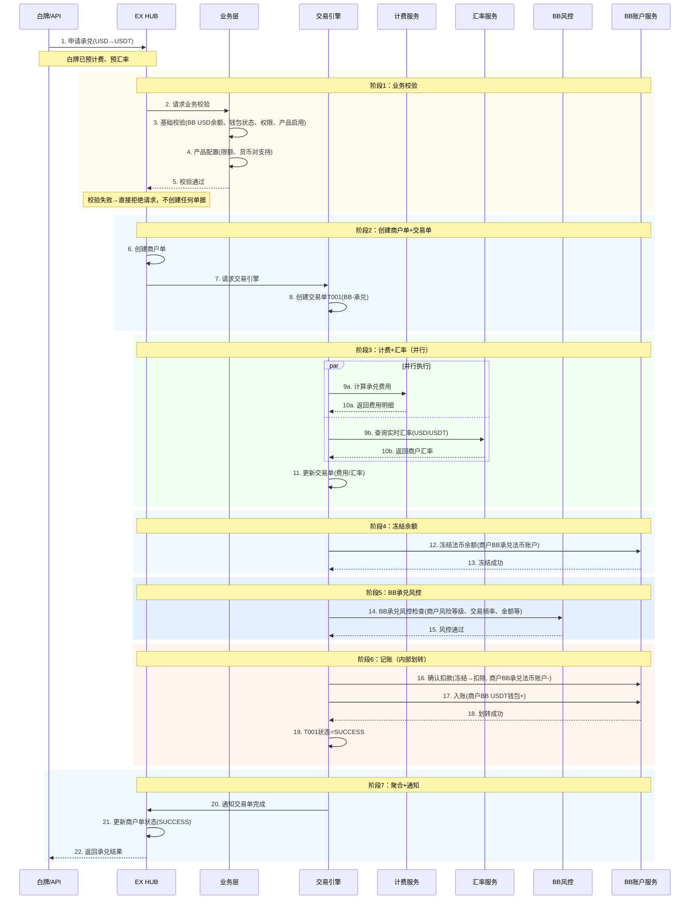

**说明：**

- **纯 BB 内部承兑**：BB 承兑法币账户 → BB 数币钱包，内部账户划转
- **先校验再建单**：校验失败直接拒绝，不创建任何单据
- **先计费后冻结**：计费+汇率确定后才冻结余额
- **先冻结后风控**：冻结 → 风控 → 通过后确认扣款；风控拒绝则解冻
- **手续费扣取方式（产品级配置）**：
  - **内扣**：冻结=输入金额，手续费从承兑金额中扣
  - **外扣**：冻结=输入金额+手续费，到账 USDT=输入金额/汇率

**异常处理：**

> 场景 A1 所有异常均为**解冻退回**，不产生退款单，不收费。

| 异常环节       | 触发条件                                | 处理方式                    | 商户感知                       |
| -------------- | --------------------------------------- | --------------------------- | ------------------------------ |
| 业务校验失败   | 余额不足/产品未启用/超限额/货币对不支持 | 直接拒绝，不创建商户单      | 下单失败，返回错误原因         |
| 冻结余额失败   | 并发占用余额                            | 商户单=FAILED               | 提示"余额不足，请稍后重试"     |
| BB承兑风控拒绝 | BB风控检测到异常                        | 解冻法币余额，商户单=FAILED | 提示"交易失败，请联系客户经理" |
| BB承兑执行失败 | 承兑引擎异常（重试3次耗尽）             | 解冻余额，商户单=FAILED     | 提示"系统异常，请稍后重试"     |

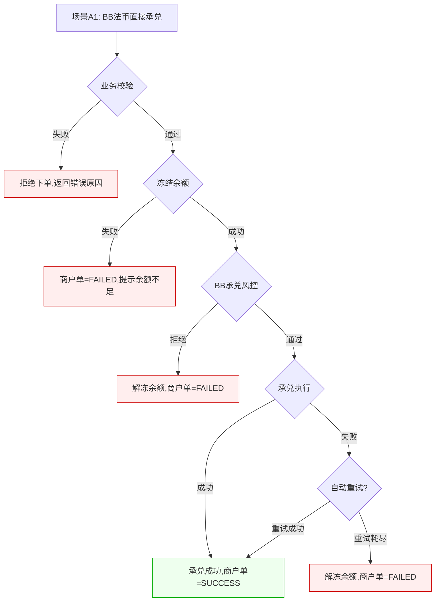

---

### 5.3 场景 A2：即时单 — IPL 收付款账户→BB 承兑账户→上链

> ⚠️ **核心变更**：旧版中 IPL 法币通过中间户直接到 BB 承兑。本版改为：IPL 收付款账户 → BB 承兑法币账户（独立交易单，走完整风控/三单/计费） → BB 承兑上链。**不存在从 IPL 法币直接买入数币。**

**场景：** 商户 IPL 收付款法币账户已有 USD 余额，希望买入数币（OnRamp）为 USDT。资金先从 IPL 收付款账户转入 BB 承兑法币账户，再由 BB 承兑为 USDT。

**特点：** 两笔交易单串行 — 划转 + 承兑，两次独立风控。

**单据结构（2 笔交易单）：**

```
商户单 M001 (OnRamp: IPL USD→BB USD→USDT)  ← BB 和 IPL 共享
    ├── 交易单 T001 (IPL→BB): 跨SP划转 — IPL 收付款账户→BB 承兑法币账户
    │       · 业务校验 ✅ · 风控 ✅ · 计费 ✅（划转手续费）
    └── 交易单 T002 (BB): 承兑 — BB USD→USDT
            · 风控 ✅ · 计费 ✅（承兑手续费）

单据数：1 商户单 + 2 交易单 + 0 渠道单
资金流：商户 IPL 收付款法币账户 → 商户 BB 承兑法币账户 → 商户 BB USDT 钱包
```

**业务流程：**

```
商户下单(买入数币, 来源=IPL法币) → 业务校验(IPL余额、BB钱包状态等) → 校验通过 →
创建商户单 → 创建T001(划转)+T002(承兑) →
T001: 冻结IPL余额 → 划转风控 → 计费(划转手续费) → 执行划转(IPL-→BB+) →
T002: BB承兑风控 → 计费(承兑费) → 汇率 → 执行承兑(BB法币-→BB数币+) →
商户单=SUCCESS → 通知商户
```

**时序图：**

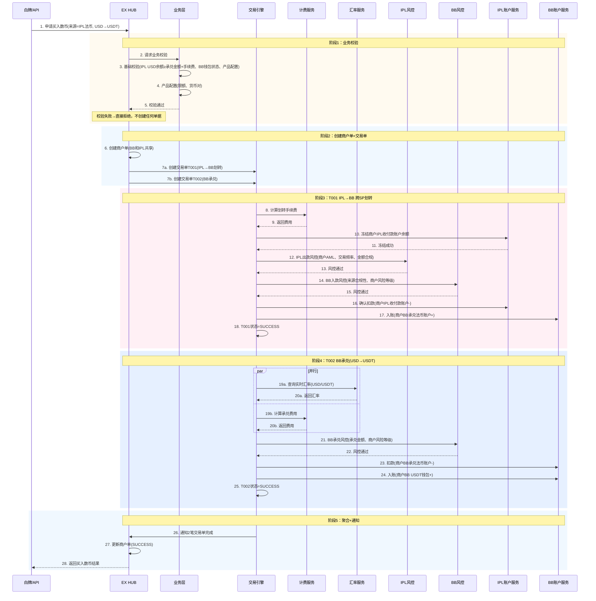

**说明：**

- **1 个商户单，2 笔交易单**：IPL→BB 划转 1 笔 + BB 承兑 1 笔
- **T001（IPL→BB 划转）**：从 IPL 收付款账户扣款，入到 BB 承兑法币账户。走 IPL 出款风控 + BB 入款风控，有划转手续费
- **T002（BB 承兑）**：BB 承兑法币账户 USD→USDT，走 BB 承兑风控
- **T001→T002 串行**：划转完成后才能承兑
- **两次独立风控**：T001（IPL 出款+BB 入款）+ T002（BB 承兑）
- **两笔独立计费**：划转手续费 + 承兑手续费

**异常处理：**

> 场景 A2 关键异常：T001 划转成功后 T002 承兑失败，**资金已在 BB 承兑法币账户**。需逆向回滚 T001。

| 异常环节                               | 触发条件                       | 处理方式                                                                  | 退款                      | 商户感知               |
| -------------------------------------- | ------------------------------ | ------------------------------------------------------------------------- | ------------------------- | ---------------------- |
| 业务校验失败                           | IPL 余额不足/产品未启用/超限额 | 直接拒绝，不创建任何单据                                                  | 无                        | 下单失败               |
| 冻结 IPL 余额失败                      | 并发占用余额                   | 商户单=FAILED                                                             | 无（未冻结）              | 余额不足，请重试       |
| IPL 出款风控拒绝（T001 阶段）          | IPL 风控拦截                   | 解冻 IPL 余额，T001=FAILED                                                | 无（解冻即恢复）          | 订单失败               |
| BB 入款风控拒绝（T001 阶段）           | BB 风控拦截                    | 解冻 IPL 余额，T001=FAILED                                                | 无（解冻即恢复）          | 订单失败               |
| T001 划转执行失败                      | 账户服务异常                   | 回滚，解冻 IPL 余额，T001=FAILED                                          | 无（解冻即恢复）          | 订单失败，请重试       |
| **BB 承兑风控拒绝（T001 成功）** | BB 承兑风控拦截                | T002=FAILED，**逆向回滚 T001**：创建 RT001，BB 承兑法币→IPL 收付款 | ✅（内部 RT），不收承兑费 | 订单退款，IPL 余额恢复 |
| **BB 承兑执行失败（T001 成功）** | BB 承兑引擎异常（重试 3 次）   | 同上，逆向回滚 T001                                                       | ✅（内部 RT），不收承兑费 | 订单退款，IPL 余额恢复 |

> **跨 SP 关键异常**：T001 已成功但 T002 失败时，资金在 BB 承兑法币账户，需逆向回滚 T001。创建内部退款交易单 RT001（商户不可见），将 BB 承兑法币账户资金退回商户 IPL 收付款账户。**划转手续费已扣不退，承兑手续费不收。**

**异常时序图（T001 成功后 T002 失败，逆向回滚）：**

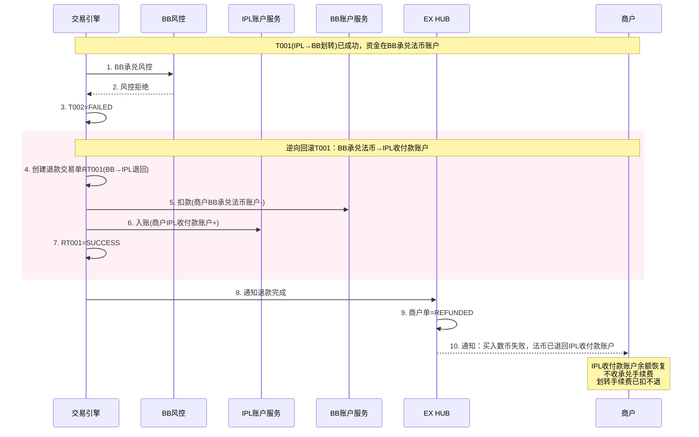

**异常总览流程图：**

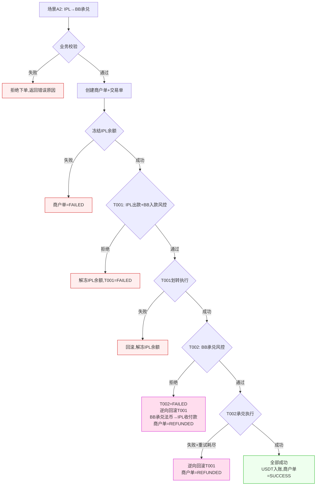

---

### 5.4 场景 B1：预约单 — BB 代收付收款→承兑（仅 BB）

**场景：** 外部汇款人通过 BB 代收付账户汇入 USD，收款到 BB 承兑法币账户后，承兑为 USDT 到 BB 数币钱包。

**特点：** 收款（渠道触发）+ 承兑，2 笔交易单串行。**与旧版完全一致。**

**单据结构（2 笔交易单）：**

```
商户单 M001 (OnRamp: BB 代收付收款→USD→USDT)  ← 仅 BB
    ├── 交易单 T001 (BB): 收款 — 外部 USD 入到 BB 承兑法币账户（渠道通知触发）
    │       └── 渠道单 C001 (BB PP): BB 代收付渠道执行记录
    └── 交易单 T002 (BB): 承兑 — BB USD→USDT

单据数：1 商户单 + 2 交易单 + 1 渠道单（仅 BB PP 可见）
资金流：外部汇款人 → 商户 BB 承兑法币账户 → 商户 BB USDT 钱包
触发方式：渠道入账通知 → 匹配预约单 → 自动触发 T002 承兑
```

**时序图：**

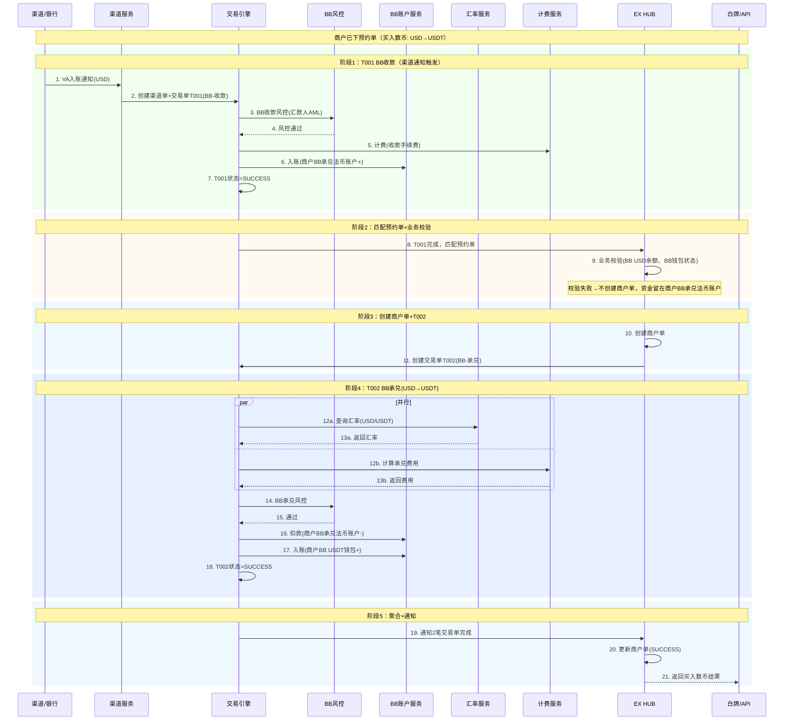

**说明：**

- **1 个商户单，2 笔交易单**：BB 收款 1 笔 + BB 承兑 1 笔
- **T001（BB 收款）**：渠道通知触发，外部 USD 入到商户 BB 承兑法币账户，走 BB 收款风控（汇款人 AML），有渠道单
- **T002（BB 承兑）**：BB USD→USDT，内部账户划转，走 BB 承兑风控
- **预约单模式**：商户先下预约单，收款到账后自动触发 T002 承兑
- **T001→T002 串行**：收款完成后才能承兑
- **计费**：收款手续费 + 承兑费用分别计算

**异常处理：**

> 场景 B1 关键特点：T001 收款成功后 T002 承兑失败，**资金留在商户 BB 承兑法币账户**，不退回汇款人。商户可用该余额重新发起买入数币（走场景 A1 即时单）。

| 异常环节                     | 触发条件                                 | 处理方式                                                             | 退款                             | 商户感知                     |
| ---------------------------- | ---------------------------------------- | -------------------------------------------------------------------- | -------------------------------- | ---------------------------- |
| 预约单超时                   | 72h 未收到汇款                           | 预约单=EXPIRED，不创建商户单                                         | 无（未收款）                     | 过期通知，可重新下单         |
| 收款风控拦截（T001 阶段）    | BB 收款风控拦截（汇款人 AML 不通过）     | 资金入账但冻结→通知合规→销售联系商户→清算确认手续费→退回原汇款人 | 退回汇款人（参考 refund.md 2.2） | "交易失败，请联系客户经理"   |
| 预约单匹配失败               | 非同名/缺 Purpose Code/无预约单/金额偏差 | 详见第 9 章"预约单匹配规则"异常处理                                  | 视情况                           | 视情况                       |
| BB 承兑风控拒绝（T001 成功） | 收款到账并匹配成功，但 BB 承兑风控拒绝   | T002=FAILED，资金留在商户 BB 承兑法币账户，商户单=FAILED             | 无需退款                         | 订单失败，收款已到账，可重试 |
| BB 承兑执行失败（T001 成功） | BB 承兑引擎异常（重试 3 次耗尽）         | 同上，资金留在商户 BB 承兑法币账户                                   | 无需退款                         | 订单失败，可重试             |

**异常总览流程图：**

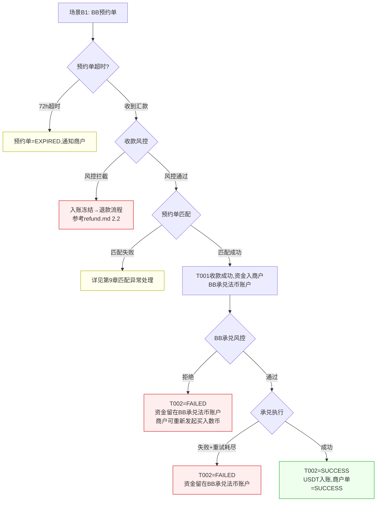

---

### 5.5 场景 B2：预约单 — IPL VA 收款→转入 BB 承兑账户→上链

> ⚠️ **核心变更**：旧版中 IPL VA 收款后通过中间户内部划转到 BB。本版改为：IPL VA 收款到 IPL 收付款账户 → 转账到 BB 承兑法币账户（独立交易单，走风控/三单/计费） → BB 承兑上链。

**场景：** 外部汇款人通过 IPL VA 汇入 USD，收款到 IPL 收付款法币账户后，通过跨 SP 划转到 BB 承兑法币账户，再承兑为 USDT 到 BB 数币钱包。

**特点：** 收款（渠道触发）+ 跨 SP 划转（风控/计费）+ 承兑，3 笔交易单串行。

**单据结构（3 笔交易单）：**

```
商户单 M001 (OnRamp: IPL VA收款→转BB→USDT)  ← BB 和 IPL 共享
    ├── 交易单 T001 (IPL): VA收款 — 外部USD入到IPL收付款法币账户（渠道通知触发）
    │       └── 渠道单 C001 (IPL PP): IPL VA 渠道执行记录
    ├── 交易单 T002 (IPL→BB): 跨SP划转 — IPL收付款账户→BB承兑法币账户
    │       · 业务校验 ✅ · 风控 ✅ · 计费 ✅（划转手续费）
    └── 交易单 T003 (BB): 承兑 — BB USD→USDT
            · 风控 ✅ · 计费 ✅（承兑手续费）

单据数：1 商户单 + 3 交易单 + 1 渠道单（仅 IPL PP 可见）
资金流：外部汇款人 → 商户 IPL 收付款法币账户 → 商户 BB 承兑法币账户 → 商户 BB USDT 钱包
触发方式：渠道入账通知 → 匹配预约单 → 自动触发 T002 + T003
```

**时序图：**

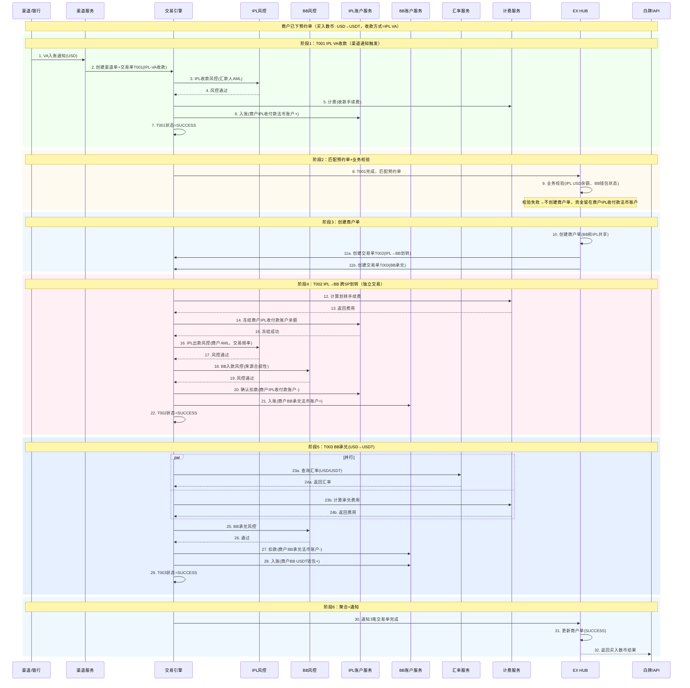

**说明：**

- **1 个商户单，3 笔交易单**：IPL VA 收款 1 笔 + IPL→BB 跨 SP 划转 1 笔 + BB 承兑 1 笔
- **T001（IPL VA 收款）**：渠道通知触发，外部 USD 入到商户 IPL 收付款法币账户，走 IPL 收款风控，有渠道单
- **T002（IPL→BB 划转）**：商户 IPL 收付款账户 → 商户 BB 承兑法币账户。**独立交易单**，走 IPL 出款风控 + BB 入款风控，有划转手续费
- **T003（BB 承兑）**：BB 承兑法币账户 USD→USDT，走 BB 承兑风控
- **预约单模式**：商户先下预约单，VA 收款到账后自动触发 T002 + T003
- **T001→T002→T003 串行**：收款完成才能划转，划转完成才能承兑
- **三次独立风控**：T001（IPL 收款）+ T002（IPL 出款+BB 入款）+ T003（BB 承兑）

**异常处理：**

> 场景 B2 是最复杂的异常场景，涉及 3 笔交易单、跨 SP 划转、收款风控+划转风控+承兑风控三层风控。

| 异常环节                                    | 触发条件                                    | 处理方式                                                                  | 退款                             | 商户感知                               |
| ------------------------------------------- | ------------------------------------------- | ------------------------------------------------------------------------- | -------------------------------- | -------------------------------------- |
| 预约单超时                                  | 72h 未收到汇款                              | 预约单=EXPIRED                                                            | 无                               | 过期通知，可重新下单                   |
| IPL 收款风控拦截（T001 阶段）               | IPL 收款风控拦截（汇款人 AML 不通过等）     | 资金入账但冻结→合规→销售→清算→退回原汇款人                            | 退回汇款人（参考 refund.md 2.2） | "交易失败，请联系客户经理"             |
| 预约单匹配失败                              | 非同名/缺 Purpose Code/无预约单/金额偏差    | 详见第 9 章"预约单匹配规则"异常处理                                       | 视情况                           | 视情况                                 |
| IPL 出款风控拒绝（T002 阶段，T001 已成功）  | T002 划转的 IPL 出款风控被拒绝              | T002=FAILED，T003 不创建，资金留在商户 IPL 收付款账户                     | 无需退款                         | 订单失败，收款已到账，可走场景 A2 重试 |
| BB 入款风控拒绝（T002 阶段，T001 已成功）   | T002 划转的 BB 入款风控被拒绝               | 同上，T002=FAILED，资金留在 IPL 收付款账户                                | 无需退款                         | 订单失败，可重试                       |
| T002 划转执行失败（T001 已成功）            | 账户服务异常                                | 回滚，T002=FAILED，资金留在 IPL 收付款账户                                | 无需退款                         | 订单失败，可重试                       |
| **BB 承兑风控拒绝（T001+T002 成功）** | BB 风控拒绝承兑（资金已在 BB 承兑法币账户） | T003=FAILED，**逆向回滚 T002**：创建 RT001，BB 承兑法币→IPL 收付款 | 不收承兑费，划转手续费已扣不退   | 订单退款，IPL 余额恢复                 |
| **BB 承兑执行失败（T001+T002 成功）** | BB 承兑引擎异常（重试 3 次耗尽）            | 同上，逆向回滚 T002，创建 RT001                                           | 不收承兑费                       | 订单退款                               |

> **跨 SP 关键异常**：T002 已成功但 T003 失败时，资金在 BB 承兑法币账户，需逆向回滚 T002。创建内部退款交易单 RT001（商户不可见），将 BB 承兑法币账户资金退回商户 IPL 收付款账户。

**异常时序图（T002 成功后 T003 失败，逆向回滚）：**

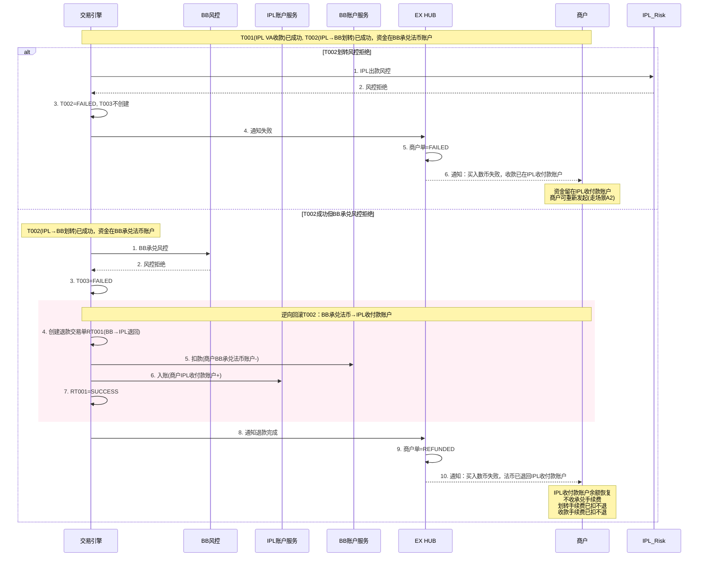

**异常总览流程图：**

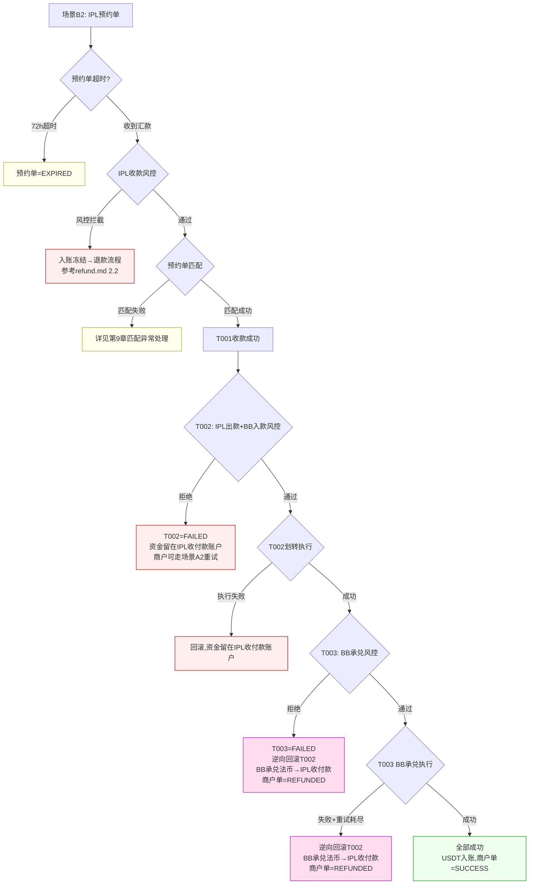

**场景 B2 异常结论：**

| 失败环节          | 资金位置        | 处理方式                                 | 是否需要退款单 |
| ----------------- | --------------- | ---------------------------------------- | -------------- |
| 业务校验/冻结     | 未扣款          | 拒绝下单                                 | ❌             |
| IPL 收款风控拦截  | 冻结在 IPL      | 退回汇款人（refund.md 2.2）              | ✅             |
| 预约单匹配失败    | 商户 IPL 收付款 | 详见第 9 章                              | 视情况         |
| T002 划转风控拒绝 | 商户 IPL 收付款 | 资金留在 IPL，商户可重试                 | ❌             |
| T002 划转执行失败 | 商户 IPL 收付款 | 回滚，资金留在 IPL                       | ❌             |
| BB 承兑风控拒绝   | BB 承兑法币账户 | **逆向回滚 T002**，退回 IPL 收付款 | ✅（内部 RT）  |
| BB 承兑执行失败   | BB 承兑法币账户 | 重试→**逆向回滚 T002**            | ✅（内部 RT）  |

---

### 5.6 收款账户选择逻辑

```
商户选择"银行转账"后：

仅 BB 配置：
→ 直接展示 BB 代收付账户信息（无需选择）

BB + IPL 配置：
→ 展示两个选项：
   ├── BB 代收付账户（适合所有汇款人）
   └── 同名 VA 账户（专属虚拟账户，按银行区分）
       ├── VA 1: DBS Bank (Hong Kong)
       ├── VA 2: OCBC Bank (Singapore)
       └── VA N: ...

商户选择后：
→ 展示对应账户详情（折叠式，点击展开）
→ 每个字段可单独复制
→ 底部提供"Download Account Info"和"Copy Details"

⚠️ VA 账户不暴露底层渠道名称（XPay/IPL），统一展示为"同名 VA 账户"
```

---

## 6. 场景对比总览

| 维度               | A1：BB 直接承兑     | A2：IPL→BB→承兑              | B1：BB VA 收款→承兑        | B2：IPL VA 收款→BB→承兑            |
| ------------------ | ------------------- | ------------------------------ | --------------------------- | ------------------------------------ |
| **触发方式** | 即时单（商户主动）  | 即时单（商户主动）             | 预约单（渠道入账触发）      | 预约单（渠道入账触发）               |
| **资金来源** | BB 承兑法币账户余额 | IPL 收付款法币账户余额         | 外部汇款（BB 代收付）       | 外部汇款（IPL VA）                   |
| **交易单数** | 1（承兑）           | 2（划转+承兑）                 | 2（收款+承兑）              | 3（收款+划转+承兑）                  |
| **渠道单**   | 0                   | 0                              | 1（BB PP）                  | 1（IPL PP）                          |
| **风控次数** | 1（BB 承兑）        | 2（IPL 出款+BB 入款, BB 承兑） | 2（BB 收款, BB 承兑）       | 3（IPL 收款, IPL 出+BB 入, BB 承兑） |
| **计费**     | 承兑费              | 划转费+承兑费                  | 收款费+承兑费               | 收款费+划转费+承兑费                 |
| **跨 SP**    | ❌                  | ✅（IPL→BB）                  | ❌                          | ✅（IPL→BB）                        |
| **关键异常** | 承兑失败→解冻      | T001 成功+T002 失败→逆向回滚  | T001 成功+T002 失败→留余额 | T002 成功+T003 失败→逆向回滚        |
| **退回目标** | 原账户解冻          | IPL 收付款账户                 | BB 承兑法币账户（留存）     | IPL 收付款账户                       |

---

## 7. 风控规则

### 7.1 分层风控

| 风控层级 | 触发场景               | 风控维度                         | 拦截后处理                 |
| -------- | ---------------------- | -------------------------------- | -------------------------- |
| 收款风控 | VA/代收付入账（B1/B2） | 汇款人 AML、制裁名单、交易频率   | 入账冻结→合规→退回汇款人 |
| 出款风控 | IPL 收付款账户出款     | 商户 AML、交易频率、金额合规     | 解冻/拒绝                  |
| 入款风控 | BB 承兑法币账户入款    | 来源合规性、商户风险等级         | 拒绝入账                   |
| 承兑风控 | BB 承兑执行前          | 承兑金额、商户风险等级、累计限额 | 拒绝承兑                   |

### 7.2 风控规则清单

| 规则编号 | 规则名称          | 适用场景     | 校验内容                       | 拦截处理           |
| -------- | ----------------- | ------------ | ------------------------------ | ------------------ |
| R001     | 商户 KYC/KYB 状态 | 全场景       | 商户 KYC/KYB 审核通过          | 拒绝下单           |
| R002     | 产品状态          | 全场景       | 买入数币（OnRamp）产品已启用   | 拒绝下单           |
| R003     | 单笔限额          | 全场景       | 单笔金额≤配置上限             | 拒绝下单           |
| R004     | 日累计限额        | 全场景       | 当日累计≤配置上限             | 拒绝下单           |
| R005     | 月累计限额        | 全场景       | 当月累计≤配置上限             | 拒绝下单           |
| R006     | 汇款人制裁名单    | B1/B2        | 汇款人不在制裁名单中           | 冻结入账资金       |
| R007     | 汇款人同名校验    | B2（IPL VA） | 汇款人 = VA 持有人（同名收款） | 匹配失败，资金挂起 |
| R008     | 交易频率          | A2/B2 划转   | 划转频率≤配置上限（防洗钱）   | 拒绝划转           |
| R009     | 承兑金额合规      | 全场景承兑   | 承兑金额在合规范围内           | 拒绝承兑           |
| R010     | Purpose Code 校验 | B1/B2        | 汇款附言包含有效 Purpose Code  | 匹配失败           |

---

## 8. 退款原则

> 详细退款流程参见 `refund.md`，此处仅列买入数币（OnRamp）特有规则。

### 8.1 退款触发条件

| 触发条件                            | 适用场景 | 退款类型           | 退回目标             |
| ----------------------------------- | -------- | ------------------ | -------------------- |
| 收款风控拦截                        | B1/B2    | 退回汇款人         | 原汇款人银行账户     |
| T001 成功+T002 承兑失败（A2）       | A2       | 逆向回滚内部交易单 | 商户 IPL 收付款账户  |
| T002 成功+T003 承兑失败（B2）       | B2       | 逆向回滚内部交易单 | 商户 IPL 收付款账户  |
| 预约单匹配后商户申请退款            | B1/B2    | 商户主动退款       | 原汇款人银行账户     |
| 承兑已完成后商户申请退款（卖出数币） | 全场景   | 走卖出数币（OffRamp）流程 | 不适用（走 OffRamp） |

### 8.2 退款手续费规则

| 费用类型   | 成功时收取 | T001 成功+承兑失败时 | 退回汇款人时     |
| ---------- | ---------- | -------------------- | ---------------- |
| 收款手续费 | ✅         | ✅（已扣不退）       | ✅（已扣不退）   |
| 划转手续费 | ✅         | ✅（已扣不退）       | 不适用           |
| 承兑手续费 | ✅         | ❌（不收）           | 不适用           |
| 退回手续费 | 不适用     | ❌（内部退不收费）   | ✅（退汇手续费） |

### 8.3 退款流程（参考 refund.md）

```
退款分类：
├── 内部逆向回滚（T001成功+T002失败 → BB承兑法币→IPL收付款）
│   └── 系统自动执行，商户不可见，不收承兑费
│
├── 退回汇款人（收款风控拦截/匹配失败/商户申请）
│   └── 参考 refund.md 2.2 流程：
│       1. 触发退款（系统自动/商户申请）
│       2. 确认手续费（收款费已扣不退 + 退汇手续费）
│       3. 清算确认
│       4. 执行退回（原路退回汇款人银行账户）
│
└── 承兑已完成后退款
    └── 不支持买入数币退款 → 需走卖出数币（OffRamp）流程将数币换回法币
```

---

## 9. 预约单匹配规则

> 适用于场景 B1 和 B2。

### 9.1 匹配维度

| 维度         | 必须匹配 | 说明                                           |
| ------------ | -------- | ---------------------------------------------- |
| 收款账户     | ✅       | VA / 代收付账户号必须一致                      |
| 金额         | ⚠️     | 允许一定偏差（±5% 或绝对值 ±50 USD，取大者） |
| 币种         | ✅       | 必须一致                                       |
| 汇款人姓名   | ⚠️     | B2（IPL VA）要求同名；B1（BB 代收付）不要求    |
| Purpose Code | ⚠️     | 有配置则校验，无配置则跳过                     |

### 9.2 匹配流程

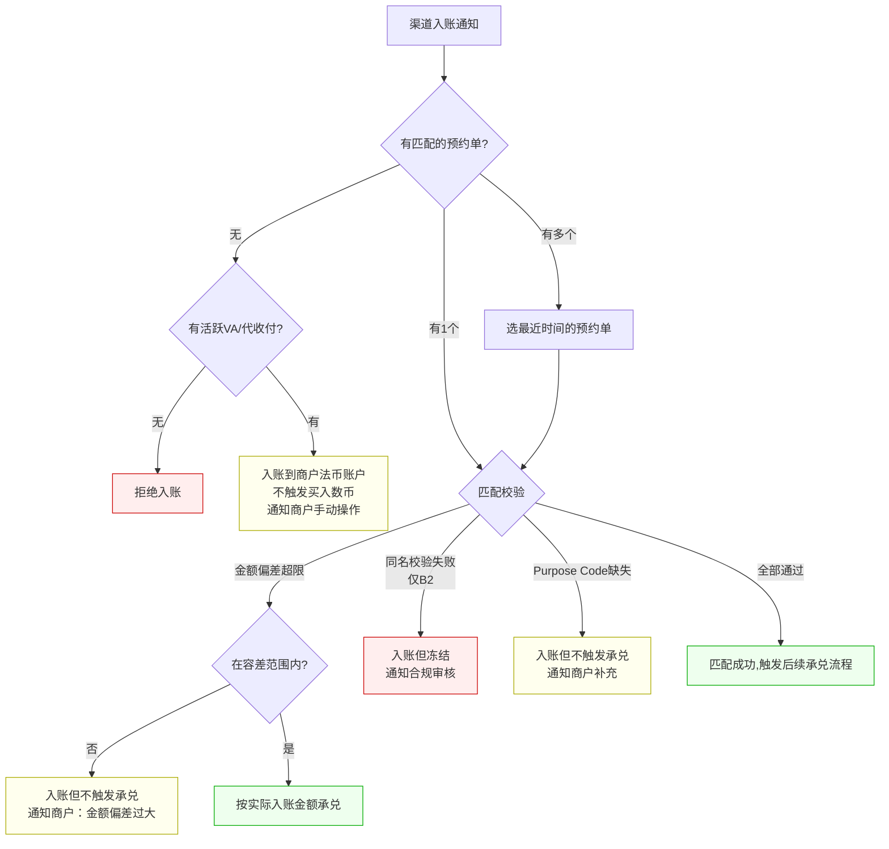

### 9.3 匹配异常处理

| 异常类型                  | 处理方式                           | 商户感知                      |
| ------------------------- | ---------------------------------- | ----------------------------- |
| 无匹配预约单              | 入账到商户法币账户，不触发买入数币  | 通知收款到账，可手动下买入数币单 |
| 金额偏差超限（>5%/50USD） | 入账但不触发承兑，通知商户确认     | 通知金额偏差，请确认操作      |
| 金额偏差在容差内          | 按实际入账金额承兑（非预约单金额） | 承兑金额=实际入账金额         |
| 同名校验失败（仅 B2）     | 入账但冻结，合规审核               | 通知交易待审核                |
| Purpose Code 缺失         | 入账但不触发承兑，通知商户补充     | 通知补充 Purpose Code         |
| 预约单已过期              | 入账到商户法币账户，不触发买入数币  | 通知收款到账，预约单已过期    |

---

## 10. 状态机

### 10.1 商户单状态机

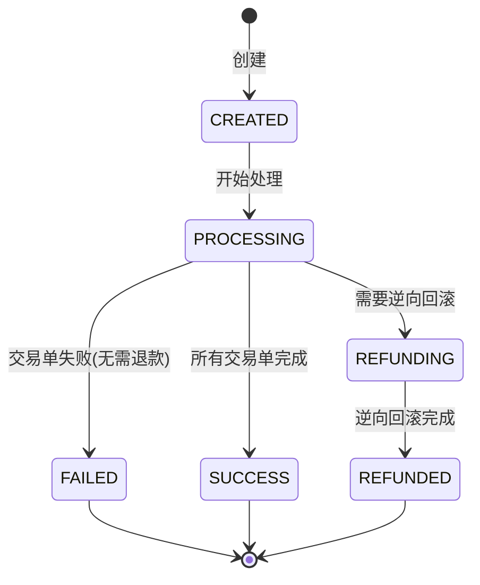

### 10.2 交易单状态机

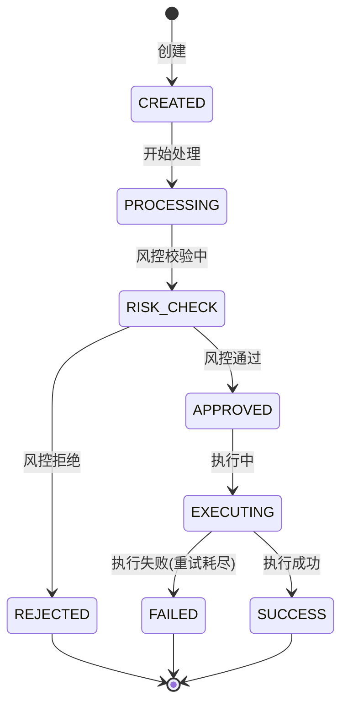

### 10.3 渠道单状态机（仅 B1/B2）

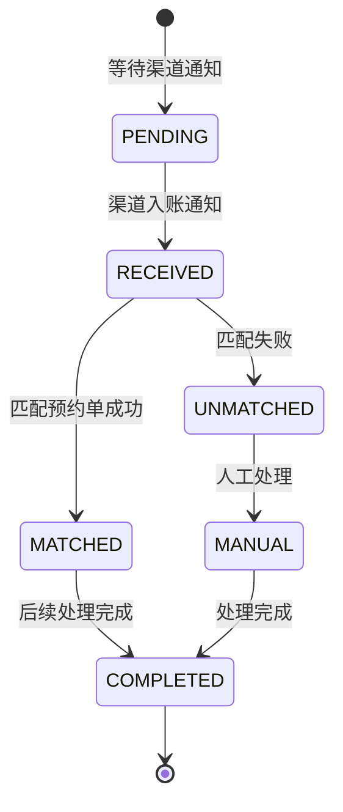

---

## 11. 与旧版差异总结

| 维度                       | 旧版（onramp-complete.md）          | 新版（onramp-v1.md）                                               |
| -------------------------- | ----------------------------------- | ------------------------------------------------------------------ |
| **IPL 直接承兑**     | 支持（IPL 法币直接买入数币）      | ❌**不支持**，必须先转 BB 再承兑                             |
| **IPL→BB 资金划转** | 中间户内部划转，无独立风控          | **独立交易单**，走风控/三单/计费                             |
| **A2 场景交易单数**  | 1 个商户单 + 2 个交易单（简单划转） | 1 个商户单 + 2 个交易单（划转有完整风控+计费）                     |
| **B2 场景交易单数**  | 1 个商户单 + 2 个交易单             | 1 个商户单 +**3 个交易单**（收款+划转+承兑）                 |
| **划转风控**         | 无独立风控                          | IPL 出款风控 + BB 入款风控（双重）                                 |
| **划转计费**         | 无独立计费                          | 有划转手续费                                                       |
| **跨 SP 异常处理**   | 简单回滚                            | **逆向回滚**：创建内部退款交易单 RT，BB 承兑法币→IPL 收付款 |
| **承兑引擎**         | BB 为主，IPL 可参与                 | **仅 BB**，IPL 仅做收付款                                    |
| **商户感知**         | IPL 和 BB 边界模糊                  | IPL=收付款账户，BB=承兑交易账户，边界清晰                          |

---

## 12. 术语表

| 中文             | 英文                           | 粤语（广东话） |
| ---------------- | ------------------------------ | -------------- |
| 买入数币         | OnRamp / Buy Crypto            | 買入數幣       |
| 法币             | Fiat Currency                  | 法币           |
| 数币             | Cryptocurrency / Digital Asset | 数字货币       |
| 承兑交易账户     | Exchange Trading Account       | 承兑交易户口   |
| 收付款账户       | Payment Account                | 收付款户口     |
| 商户单           | Merchant Order                 | 商户单         |
| 交易单           | Transaction                    | 交易单         |
| 渠道单           | Channel Order                  | 渠道单         |
| 三单模型         | Three-Order Model              | 三单模型       |
| 跨 SP 划转       | Cross-SP Transfer              | 跨 SP 划转     |
| 逆向回滚         | Reverse Rollback               | 逆向回滚       |
| 预约单           | Reservation Order              | 预约单         |
| 代收付           | Collection & Payment           | 代收付         |
| 风控             | Risk Control                   | 风控           |
| 计费             | Billing / Pricing              | 计费           |
| 汇率             | Exchange Rate                  | 汇率           |
| 白牌             | White Label                    | 白牌           |
| 服务提供商（SP） | Service Provider               | 服务提供商     |

---

## 13. 附录

### 13.1 相关文档

| 文档                        | 说明                                     |
| --------------------------- | ---------------------------------------- |
| `onramp-complete.md`      | 买入数币旧版完整文档（本文档基于此重写）  |
| `offramp-v1.md`           | 卖出数币（OffRamp）1.0 文档（对应本文档的反向流程） |
| `productionopening-v2.md` | 产品开通 v2（单 SP 策略下的开通流程）    |
| `refund.md`               | 退款流程文档（详细退款规则和流程）       |
| `sa-product-listing.md`   | 产品目录（账户类/收付类/业务类三层结构） |

### 13.2 版本记录

| 版本 | 日期       | 变更内容                                                    |
| ---- | ---------- | ----------------------------------------------------------- |
| 1.0  | 2025-07-15 | 基于 onramp-complete.md 重写：单 SP 承兑 + IPL→BB 风控三单 |
