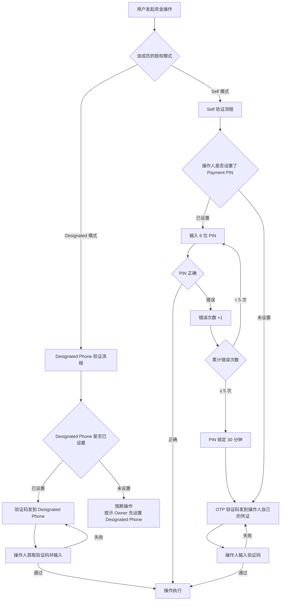
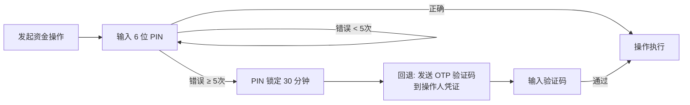
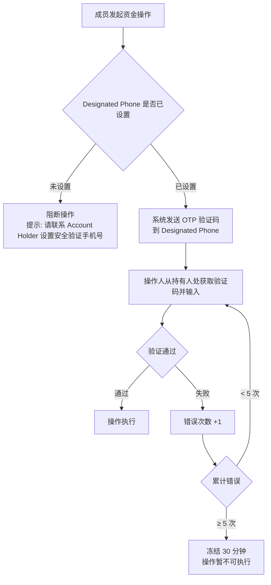
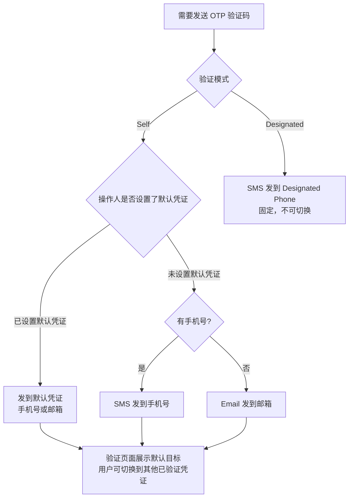

# EX Platform - 安全验证策略

> 版本：v1.3 | 更新日期：2026-02-24 | 关联文档：MP-register.md / mp-personal-profile.html

## 文档概述

本文档定义 EX 平台中**资金操作**（转账、兑换、付款、卡充值等）的安全验证策略。覆盖所有安全设置组合下的验证行为，明确验证码发送目标和回退机制。

**核心原则：**

- ✅ **任何资金操作都必须经过至少一次身份验证**，不存在"无验证直接执行"的情况
- ✅ **验证方式由两个维度决定**：操作人的角色授权模式（Self / Designated）+ 操作人的安全设置状态
- ✅ **Payment PIN 是便捷手段，不是安全降级**：PIN 替代的是 OTP 验证码，不是跳过验证
- ✅ **所有回退路径最终都指向 OTP 验证码**，确保任何情况下都有可用的验证方式

---

## 1. 前置概念

### 1.1 两种角色验证模式

资金操作的验证对象由 **Owner 为每个成员配置的授权模式** 决定：

| 模式                 | 含义               | 验证码发送目标                  | 配置者           |
| -------------------- | ------------------ | ------------------------------- | ---------------- |
| **Self**       | 操作人自己验证     | 操作人自己的凭证（手机号/邮箱） | Owner 为成员配置 |
| **Designated** | 发到指定安全手机号 | MID 的 Designated Phone         | Owner 配置号码   |

> **默认规则：** Owner 自己操作默认为 Self 模式。Owner 为成员配置模式后，成员按配置的模式验证。

### 1.2 安全设置项及其层级

| 设置项                     | 层级     | 状态            | 说明                                          |
| -------------------------- | -------- | --------------- | --------------------------------------------- |
| Login Password             | Identity | 已设置 / 未设置 | 登录密码                                      |
| Authenticator App (2FA)    | Identity | 未开启 / 已开启 | TOTP 动态令牌（Google Authenticator / Authy） |
| SMS 2FA                    | Identity | 未开启 / 已开启 | 短信验证码 2FA                                |
| Email 2FA                  | Identity | 未开启 / 已开启 | 邮件验证码 2FA                                |
| **Payment PIN**      | Identity | 未设置 / 已设置 | 6 位数字交易密码                              |
| **Designated Phone** | MID      | 未设置 / 已设置 | 安全验证手机号（仅 Owner 可配）               |

> **2FA 的范围说明：** 2FA 主要用于**登录验证**（密码之后的第二步）。资金操作验证使用的是 **OTP 验证码**（发到手机号/邮箱）或 **Payment PIN**，它们与登录 2FA 是独立的机制。但用户是否开启了 2FA 会影响整体安全等级评估（见第 5 章风险分级）。

### 1.3 凭证优先级

当需要发送 OTP 验证码时，系统使用用户在 **2FA 设置中配置的默认发送目标**，用户可在验证时切换：

| 场景 | 默认发送目标 | 是否可切换 |
|------|------------|----------|
| 用户已设置默认凭证（2FA 设置中指定） | 按设置的默认凭证发送 | ✅ 验证时可切换到其他已验证凭证 |
| 用户未设置默认凭证 | 手机号优先；无手机号则发邮箱 | ✅ 验证时可切换 |
| Designated 模式 | 固定发到 Designated Phone | ❌ 不可切换 |

> 用户至少有一个已验证凭证（注册时强制验证），所以 OTP 验证码始终有可用的发送目标。默认凭证在 **Security → Login & Authentication** 中设置。

---

## 2. 验证流程总览

### 2.1 主流程



---

## 3. Self 模式 — 所有安全设置组合

Self 模式下，操作人自己完成验证。以下列出所有可能的安全设置组合及对应行为：

### 3.1 组合矩阵

| #  | Payment PIN | 登录 2FA  | 验证方式                           | 说明                                  |
| -- | ----------- | --------- | ---------------------------------- | ------------------------------------- |
| S1 | ❌ 未设置   | ❌ 未开启 | **OTP 验证码** → 操作人凭证 | 最基础场景，验证码发到手机号/邮箱     |
| S2 | ❌ 未设置   | ✅ 已开启 | **OTP 验证码** → 操作人凭证 | 登录已有 2FA 保护，交易仍用 OTP       |
| S3 | ✅ 已设置   | ❌ 未开启 | **输入 PIN**                 | PIN 替代 OTP，快速验证                |
| S4 | ✅ 已设置   | ✅ 已开启 | **输入 PIN**                 | 登录有 2FA + 交易有 PIN，安全等级最高 |

### 3.2 场景详解

#### S1：无 PIN + 无 2FA（最基础）

```
用户状态：未设置 Payment PIN，未开启任何 2FA
安全等级：★☆☆（基础）
```


- 验证码有效期：2 分钟
- 同一凭证 60 秒内只能发送 1 次
- 连续 5 次输入错误，冻结该操作 30 分钟

> **这是唯一的验证手段。** 用户登录时也没有 2FA，意味着如果密码泄露，攻击者登录后仍需获取手机/邮箱验证码才能操作资金。

#### S2：无 PIN + 有 2FA

```
用户状态：未设置 Payment PIN，已开启 2FA（Authenticator / SMS / Email 任一）
安全等级：★★☆（中等）
```


- 交易验证流程与 S1 **完全相同**
- 安全等级更高是因为**登录环节已有 2FA 保护**（密码 + 2FA 才能进入系统）
- 即使攻击者获取了密码，还需要通过 2FA 才能登录，再需要 OTP 才能操作资金 → **双重保护**

#### S3：有 PIN + 无 2FA

```
用户状态：已设置 Payment PIN，未开启任何 2FA
安全等级：★★☆（中等）
```



- PIN 输入即时验证，无需等待验证码 → **体验最流畅**
- PIN 锁定后自动回退到 OTP 验证码 → **不会阻断业务**
- 适合国内用户习惯（类似支付宝/微信的交易密码）

> **注意：** 此场景下登录没有 2FA，仅靠密码保护。建议系统在 Security 页面提示用户开启 2FA 以提升整体安全等级。

#### S4：有 PIN + 有 2FA（最安全）

```
用户状态：已设置 Payment PIN，已开启 2FA
安全等级：★★★（最高）
```


- 交易验证流程与 S3 **完全相同**
- 但整体安全链路最强：登录（密码 + 2FA）→ 交易（PIN）
- 攻击者需要同时获取：密码 + 2FA 设备 + PIN → 三重保护

### 3.3 Self 模式安全链路对比

```
S1: [密码登录] ──────────────────── → [OTP验证码] → 操作执行
S2: [密码登录] → [2FA验证] ──────── → [OTP验证码] → 操作执行
S3: [密码登录] ──────────────────── → [PIN输入]   → 操作执行
S4: [密码登录] → [2FA验证] ──────── → [PIN输入]   → 操作执行
         ↑          ↑                      ↑
      知识因素    持有因素              知识因素/持有因素
```

---

## 4. Designated 模式

Designated 模式下，验证码**不发给操作人本人**，而是发到 MID 级别配置的安全手机号（Designated Phone）。

**前提条件：** Owner 已在 Security 页面设置 Designated Phone。



**关键规则：**

- Payment PIN **在 Designated 模式下不适用**（PIN 是操作人个人的，Designated 的目的是让指定第三方控制验证）
- Designated Phone 可以是 Owner 自己的手机号、财务总监的手机号、或任何 Owner 指定的号码
- 操作人需要**线下联系**持有 Designated Phone 的人获取验证码
- 这是一种**资金控制机制**：确保资金操作必须经过特定人知情并配合才能完成

**Designated Phone 未设置时的处理：**

| 场景                                  | 行为                                |
| ------------------------------------- | ----------------------------------- |
| 模式为 Designated 但未设置号码        | 操作被阻断，页面提示联系 Owner 设置 |
| Designated Phone 号码失效（无法接收） | 操作人联系 Owner 更新号码后重试     |

### 4.1 两种模式对比

| 维度                       | Self               | Designated                           |
| -------------------------- | ------------------ | ------------------------------------ |
| **验证码发给谁**     | 操作人自己         | Designated Phone 持有人              |
| **Payment PIN 可用** | ✅ 是              | ❌ 否                                |
| **操作人体验**       | 自主完成，无需等待 | 需线下联系持有人获取验证码           |
| **控制强度**         | 操作人自主         | 指定人把关                           |
| **适用场景**         | 信任成员自主操作   | 需要特定人（如财务总监）审核资金操作 |
| **Owner 是否知情**   | 否                 | 否（除非 DP 就是 Owner 号码）        |

---

## 6. 验证码发送规则

### 6.1 OTP 验证码规格

| 参数             | 资金操作 OTP                          | 非资金操作 OTP（安全设置/敏感管理）   |
| ---------------- | ------------------------------------- | ------------------------------------- |
| 长度             | 6 位数字                              | 6 位数字                              |
| **有效期** | **2 分钟**                      | **5 分钟**                      |
| 发送间隔         | 同一凭证 60 秒内只能发送 1 次         | 同一凭证 60 秒内只能发送 1 次         |
| 每日上限         | 同一凭证每天最多 20 次                | 同一凭证每天最多 10 次                |
| 错误上限         | 连续 5 次输入错误，冻结该操作 30 分钟 | 连续 5 次输入错误，冻结该操作 30 分钟 |

> **为什么资金操作有效期更短？** 资金操作验证码一旦泄露，攻击者可在有效期内完成转账。2 分钟窗口大幅降低截获验证码后的可利用时间。

### 6.2 发送目标选择逻辑



### 6.3 验证码页面展示

验证码输入页面需要展示以下信息：

| 模式           | 页面提示                                       | 示例                          |
| -------------- | ---------------------------------------------- | ----------------------------- |
| Self（手机号） | "验证码已发送至 +852 9641****"                 | 脱敏显示                      |
| Self（邮箱）   | "验证码已发送至 liux***@gmail.com"             | 脱敏显示                      |
| Designated     | "验证码已发送至安全验证手机号 +86 138****5678" | 脱敏显示，操作人可见号码后4位 |

---

## 8. 完整场景速查表

### 8.1 按操作人角色

| 操作人 | 授权模式   | PIN 状态 | 验证方式 | 验证码发给谁     |
| ------ | ---------- | -------- | -------- | ---------------- |
| 成员   | Self       | 未设置   | OTP      | 成员自己的凭证   |
| 成员   | Self       | 已设置   | PIN      | —               |
| 成员   | Designated | 任意     | OTP      | Designated Phone |

### 8.2 按安全设置组合（Self 模式）

| PIN | 登录2FA | 交易验证  | PIN锁定后 | 整体安全链路       |
| --- | ------- | --------- | --------- | ------------------ |
| ❌  | ❌      | OTP→自己 | —        | 密码 → OTP        |
| ❌  | ✅      | OTP→自己 | —        | 密码 → 2FA → OTP |
| ✅  | ❌      | PIN       | OTP→自己 | 密码 → PIN        |
| ✅  | ✅      | PIN       | OTP→自己 | 密码 → 2FA → PIN |

### 8.3 异常场景处理

| 异常场景                                     | 处理方式                                      |
| -------------------------------------------- | --------------------------------------------- |
| Designated Phone 未设置，但模式为 Designated | 阻断操作，提示联系 Owner 设置安全验证手机号   |
| Designated Phone 无法接收验证码              | 操作人联系 Owner 更新号码，期间操作暂不可执行 |
| 操作人无任何已验证凭证                       | 不可能出现（注册时强制验证至少一个）          |
| PIN 锁定 + OTP 也连续失败 5 次               | OTP 冻结 30 分钟，期间无法操作                |
| Self 模式下操作人手机号和邮箱都失效          | 提示联系平台客服恢复凭证                      |

---

## 9. UI 交互规范

### 9.1 验证弹窗样式

资金操作确认时，系统弹出验证弹窗，样式根据验证方式不同而变化：

**PIN 验证弹窗：**

```
┌─────────────────────────────────┐
│  🔒 输入交易密码                  │
│                                 │
│  请输入 6 位交易密码以确认操作     │
│                                 │
│     ○ ○ ○ ○ ○ ○                │
│                                 │
│  忘记交易密码？                   │
│                                 │
│  [ 取消 ]          [ 确认 ]      │
└─────────────────────────────────┘
```

**OTP 验证弹窗（Self）：**

```
┌─────────────────────────────────┐
│  📱 输入验证码                    │
│                                 │
│  验证码已发送至 +852 9641****     │
│                                 │
│     ○ ○ ○ ○ ○ ○                │
│                                 │
│  有效期 5 分钟 · 重新发送 (52s)   │
│                                 │
│  [ 取消 ]          [ 确认 ]      │
└─────────────────────────────────┘
```

**OTP 验证弹窗（Designated 模式）：**

```
┌─────────────────────────────────┐
│  � 输入安全验证码                │
│                                 │
│  验证码已发送至安全验证手机号      │
│  +86 138****5678                │
│  请联系安全负责人获取验证码        │
│                                 │
│     ○ ○ ○ ○ ○ ○                │
│                                 │
│  有效期 5 分钟 · 重新发送 (52s)   │
│                                 │
│  [ 取消 ]          [ 确认 ]      │
└─────────────────────────────────┘
```

### 9.2 PIN 错误提示（逐步升级）

**第 1-2 次错误：**

```
┌─────────────────────────────────┐
│  🔒 输入交易密码                  │
│                                 │
│  ⚠ 交易密码错误，请重试           │
│  连续错误 5 次将锁定 30 分钟      │
│                                 │
│     ○ ○ ○ ○ ○ ○                │
│                                 │
│  忘记交易密码？                   │
│  [ 取消 ]          [ 确认 ]      │
└─────────────────────────────────┘
```

**第 3-4 次错误：**

```
┌─────────────────────────────────┐
│  🔒 输入交易密码                  │
│                                 │
│  ⚠ 交易密码错误，还剩 N 次机会    │
│                                 │
│     ○ ○ ○ ○ ○ ○                │
│                                 │
│  忘记交易密码？                   │
│  [ 取消 ]          [ 确认 ]      │
└─────────────────────────────────┘
```

**第 5 次错误 → PIN 锁定，自动切换 OTP：**

```
┌─────────────────────────────────┐
│  ⚠️ 交易密码已锁定               │
│                                 │
│  连续错误 5 次，PIN 已锁定 30 分钟│
│  已切换到验证码验证方式            │
│                                 │
│  验证码已发送至 +852 9641****     │
│                                 │
│     ○ ○ ○ ○ ○ ○                │
│                                 │
│  有效期 5 分钟 · 重新发送 (52s)   │
│  [ 取消 ]          [ 确认 ]      │
└─────────────────────────────────┘
```

---

## 10. 与登录 2FA 的关系说明

### 10.1 为什么分开

| 维度               | 登录 2FA                           | 资金操作验证                                   |
| ------------------ | ---------------------------------- | ---------------------------------------------- |
| **保护什么** | 账户入口（防止未授权登录）         | 资金安全（防止登录态下的未授权操作）           |
| **触发时机** | 登录时（密码之后）                 | 每笔资金操作时                                 |
| **验证频率** | 每次登录一次                       | 每笔操作一次                                   |
| **设置位置** | Security → Login & Authentication | Security → Transaction Verification           |
| **层级**     | Identity 级                        | Identity 级（PIN）/ MID 级（Designated Phone） |

### 10.2 安全链路全景

```
┌─────────────────────────────────────────────────────────────────┐
│                        完整安全链路                               │
│                                                                 │
│  登录阶段                          操作阶段                      │
│  ─────────                        ─────────                     │
│  [密码/验证码/OTP] → [2FA可选] → 进入系统 → [PIN/OTP] → 执行操作 │
│       ↑                  ↑                      ↑               │
│    第一因素           第二因素              交易验证因素           │
│  (Login &          (Login &             (Transaction             │
│   Authentication)   Authentication)      Verification)           │
│                                                                 │
│  ← Security Tab: Login & Authentication →  ← Transaction →      │
│                                              Verification        │
└─────────────────────────────────────────────────────────────────┘
```

### 10.3 用户引导建议

| 用户当前状态             | 系统建议                                      |
| ------------------------ | --------------------------------------------- |
| 无密码 + 无 2FA + 无 PIN | 🔴 "建议设置登录密码和交易密码，提升账户安全" |
| 有密码 + 无 2FA + 无 PIN | 🟡 "建议开启 2FA 和设置交易密码"              |
| 有密码 + 有 2FA + 无 PIN | 🟢 "可设置交易密码，资金操作更便捷"           |
| 有密码 + 有 2FA + 有 PIN | 🟢 "安全设置完善 ✓"                          |

---

## 11. 操作分类：哪些需要资金验证，哪些不需要

### 11.1 分类原则

| 类型                        | 判断标准                                                                     | 验证机制                           | OTP 有效期       |
| --------------------------- | ---------------------------------------------------------------------------- | ---------------------------------- | ---------------- |
| **💰 资金操作**       | 操作人主动发起、导致账户**余额结构发生变化**（金额减少/增加/币种变动） | Self/Designated 模式（PIN 或 OTP） | **2 分钟** |
| **🔐 安全设置操作**   | 修改 Identity 级别的凭证或安全配置                                           | 固定 OTP，不走 PIN                 | 5 分钟           |
| **⚠️ 敏感管理操作** | 不涉及资金，但影响账户权限、数据安全或系统集成                               | 固定 OTP，不走 PIN                 | 5 分钟           |
| **📋 普通操作**       | 查看、配置、管理类，不涉及资金流动，不影响权限/安全                          | 登录态即可，无需二次验证           | —               |

> **资金操作的判断关键：** 钱是否留在体系内**不是**判断依据。换汇（USD→HKD）虽然资金未离开平台，但账户余额结构发生了变化（USD 减少、HKD 增加），属于主动发起的资金指令，必须验证。

### 11.2 资金操作（需要 PIN / OTP 验证）

以下操作触发 Self 或 Designated 模式验证流程：

| 操作                              | 菜单位置                          | 说明                                     |
| --------------------------------- | --------------------------------- | ---------------------------------------- |
| **法币付款（Payout）**      | Transfer Out → Payouts           | 向第三方付款，账户余额减少               |
| **链上付币（Crypto Send）** | Transfer Out → Payouts           | 向外部地址转出加密货币                   |
| **同名提现**                | Transfer Out → Payouts           | 提现到自己的银行账户                     |
| **同名提币**                | Transfer Out → Payouts           | 提币到自己的外部钱包                     |
| **付款**                    | Transfer Out → Remittance Orders | 收→换→付编排，涉及出金                 |
| **法币兑换（FX）**          | Assets → Exchange                | 法币之间兑换，余额结构变动               |
| **On-Ramp（法币换U）**      | Assets → Exchange                | 法币买入加密货币                         |
| **Off-Ramp（U换法币）**     | Assets → Exchange                | 加密货币卖出为法币                       |
| **卡充值（Card Top-up）**   | Cards                             | 向虚拟卡充值，账户余额减少               |
| **同名充值**                | Assets → Fiat Accounts           | 从外部充值到账户（入金，部分场景需验证） |
| **同名充币**                | Assets → Crypto Wallet           | 从外部充币到钱包（入金，部分场景需验证） |

> **注意：** 入金操作（充值/充币/VA 收款/链上收款）通常由对手方发起，商户侧无需主动触发资金验证。但**主动发起的出金类操作**（付款、提现、提币、兑换）必须验证。

### 11.3 账户与安全设置操作（固定 OTP 验证，不走 PIN）

以下操作属于 **Identity 级**，验证码固定发到操作人自己的凭证，不受 Self/Designated 模式影响，Payment PIN **不适用**：

| 操作                                        | 位置                                 | 前置验证                             |
| ------------------------------------------- | ------------------------------------ | ------------------------------------ |
| **修改邮箱**                          | Profile → Contact Info              | 验证当前凭证 OTP → 验证新邮箱 OTP   |
| **修改手机号**                        | Profile → Contact Info              | 验证当前凭证 OTP → 验证新手机号 OTP |
| **修改登录密码**                      | Security → Login Password           | 验证当前凭证 OTP（或输入旧密码）     |
| **开启/关闭 Authenticator App (2FA)** | Security → Login & Authentication   | 验证当前凭证 OTP                     |
| **开启/关闭 SMS 2FA**                 | Security → Login & Authentication   | 验证手机号 OTP                       |
| **开启/关闭 Email 2FA**               | Security → Login & Authentication   | 验证邮箱 OTP                         |
| **设置 Payment PIN**                  | Security → Transaction Verification | 验证登录密码或 OTP                   |
| **修改 Payment PIN**                  | Security → Transaction Verification | 输入当前 PIN + OTP 双重验证          |
| **重置 Payment PIN**                  | Security → Transaction Verification | 验证 OTP                             |
| **设置/修改 Designated Phone**        | Security → Designated Phone         | 仅 Owner 可操作，验证 OTP            |

### 11.4 敏感管理操作（固定 OTP 验证，不走 PIN）

以下操作**不涉及资金，但影响账户权限、数据安全或系统集成**，需要 OTP 验证，OTP 有效期 **5 分钟**：

| 操作                              | 位置                | 说明                                |
| --------------------------------- | ------------------- | ----------------------------------- |
| **邀请成员**                | Settings → Members | 新增 MID 访问权限，影响账户安全边界 |
| **删除/移除成员**           | Settings → Members | 撤销 MID 访问权限                   |
| **修改成员角色**            | Settings → Members | 权限升降级（如 Member → Admin）    |
| **变更 Owner**              | Settings → Members | 最高权限转移，需双方验证            |
| **查看卡号明文（PAN/CVV）** | Cards               | 敏感支付凭证，PCI DSS 要求验证      |
| **重置 API Key**            | Developer           | 影响所有 API 集成，属高风险操作     |
| **导出报表/对账文件**       | Reports             | 含敏感交易数据的批量导出            |
| **删除/注销 MID**           | Settings            | 不可逆操作，需 Owner 验证           |

> **注意：** 敏感管理操作的验证码固定发到**操作人自己的 Identity 凭证**，不受 Self/Designated 模式影响，Payment PIN **不适用**。

### 11.5 普通操作（登录态即可，无需二次验证）

以下操作**不涉及资金流动**，也**不修改安全凭证**，登录后直接操作：

| 操作类别                | 具体操作                                                 |
| ----------------------- | -------------------------------------------------------- |
| **个人信息**      | 修改昵称、修改语言偏好                                   |
| **查看类**        | 查看账户余额、查看交易记录、查看报表、查看订单           |
| **收款工具管理**  | 创建/管理 VA（虚拟账户）、管理加密收款地址               |
| **通讯录管理**    | 新增/编辑/删除 Beneficiary（收款人）、Remitter（汇款人） |
| **商户配置**      | 修改商户名称、配置 Webhook、API Key 查看                 |
| **成员管理**      | 邀请成员、修改成员角色、移除成员（Owner/Admin 权限）     |
| **发票/订阅管理** | 创建 Invoice、创建 Subscription Plan                     |
| **卡管理**        | 申请虚拟卡、查看卡信息（非明文）、冻结/解冻卡            |
| **开发者设置**    | 查看 API Key（非重置）、配置 Webhook URL                 |

### 11.6 操作分类总览图

```
所有操作
├── 💰 资金操作（PIN 或 OTP，有效期 2 分钟）
│   ├── 出金类：Payouts / Crypto Send / 同名提现 / 同名提币
│   ├── 兑换类：FX / On-Ramp / Off-Ramp（余额结构变化，即使钱留在体系内）
│   ├── 卡充值：Card Top-up
│   └── 编排类：Remittance Orders（含出金步骤）
│
├── 🔐 安全设置操作（固定 OTP，有效期 5 分钟，不走 PIN）
│   ├── 修改邮箱 / 手机号
│   ├── 修改登录密码
│   ├── 2FA 开启/关闭
│   └── Payment PIN 设置/修改/重置
│
├── ⚠️ 敏感管理操作（固定 OTP，有效期 5 分钟，不走 PIN）
│   ├── 邀请/删除/修改成员角色
│   ├── 变更 Owner
│   ├── 查看卡号明文（PAN/CVV）
│   ├── 重置 API Key
│   └── 导出报表 / 删除 MID
│
└── 📋 普通操作（登录态即可，无需二次验证）
    ├── 查看类（余额、记录、报表）
    ├── 通讯录管理（Beneficiary / Remitter）
    ├── 收款工具管理（VA / 加密地址）
    ├── 商户配置
    └── 开发者设置（查看 API Key / 配置 Webhook）
```

---

## 12. 2FA 与 Payment PIN 的核心区别

### 12.1 一句话区别

|                    | 2FA                                        | Payment PIN                                |
| ------------------ | ------------------------------------------ | ------------------------------------------ |
| **保护什么** | **账户入口**（防止别人登录你的账户） | **资金操作**（防止登录后未授权转账） |

### 12.2 全维度对比

| 维度                        | 2FA（双因素认证）                              | Payment PIN（交易密码）                |
| --------------------------- | ---------------------------------------------- | -------------------------------------- |
| **触发时机**          | 登录时（输入密码之后）                         | 每次发起资金操作时                     |
| **保护目标**          | 账户入口安全                                   | 资金操作安全                           |
| **验证方式**          | Authenticator App（TOTP）/ SMS OTP / Email OTP | 6 位数字 PIN（本地输入，无需网络等待） |
| **设置层级**          | Identity 级（全局，所有 MID 通用）             | Identity 级（全局，所有 MID 通用）     |
| **是否强制**          | 否，可选开启                                   | 否，可选设置                           |
| **未设置时的回退**    | 无 2FA → 仅凭密码登录（安全等级低）           | 无 PIN → 发 OTP 验证码到手机号/邮箱   |
| **适用模式**          | 登录场景                                       | 仅 Self 模式下的资金操作               |
| **Designated 模式下** | 不参与                                         | 不适用（验证码发到 Designated Phone）  |
| **攻击防护**          | 防止密码泄露后的账户入侵                       | 防止登录态下的未授权资金转移           |
| **用户体验**          | 登录时多一步，每次登录操作一次                 | 资金操作时快速输入，比等验证码更快     |
| **类比**              | 银行卡 + 短信验证码（登录网银）                | 支付宝/微信支付密码（付款时输入）      |

### 12.3 为什么要分开设计

**场景一：只有 2FA，没有 PIN**

```
攻击者获取密码 → 2FA 阻止登录 ✅
攻击者同时获取 2FA 设备 → 成功登录 → 发起转账 → 需要 OTP 验证码 ✅
（OTP 发到手机号，攻击者没有手机 → 转账被阻止）
```

**场景二：只有 PIN，没有 2FA**

```
攻击者获取密码 → 直接登录（无 2FA 阻拦）⚠️
攻击者登录后发起转账 → 需要 PIN → 攻击者不知道 PIN ✅
（PIN 保护了资金，但账户已被入侵，可以查看数据）
```

**场景三：2FA + PIN 都有（推荐）**

```
攻击者获取密码 → 2FA 阻止登录 ✅
即使突破 2FA 登录 → 转账需要 PIN ✅
即使 PIN 被锁定 → 回退 OTP 发到手机号 ✅
三重保护，攻击者需要同时突破三道防线
```

**结论：两者互补，不可替代**

- 2FA = **门锁**（防止进门）
- Payment PIN = **保险箱密码**（进门后保护财产）
- 缺少任何一个都会有安全盲区

### 12.4 国内用户习惯对照

| 国内产品                     | 对应 EX 功能             | 说明                            |
| ---------------------------- | ------------------------ | ------------------------------- |
| 微信/支付宝 登录密码         | Login Password           | 账户入口                        |
| 微信/支付宝 短信验证码登录   | OTP 登录方式             | 无密码登录                      |
| 微信/支付宝 手势密码/Face ID | 2FA（Authenticator App） | 登录第二因素                    |
| **支付宝支付密码**     | **Payment PIN**    | **付款时输入的 6 位密码** |
| 银行短信验证码（付款时）     | OTP（无 PIN 时的回退）   | 付款验证码                      |

> 国内用户熟悉"支付密码"概念，Payment PIN 就是这个角色。向国内用户解释时，直接类比支付宝支付密码即可。

### 12.5 设置建议

| 用户类型                              | 推荐配置                          | 原因                         |
| ------------------------------------- | --------------------------------- | ---------------------------- |
| **个人用户（低频操作）**        | 开启 SMS 2FA + 不设 PIN           | 简单，OTP 验证码足够         |
| **个人用户（高频操作）**        | 开启 2FA + 设置 PIN               | PIN 比等验证码更快捷         |
| **企业 Owner**                  | 开启 Authenticator 2FA + 设置 PIN | 最高安全等级                 |
| **企业成员（Designated 模式）** | 无需设置 PIN                      | Designated 模式下 PIN 不适用 |
| **国内用户（习惯交易密码）**    | 设置 Payment PIN                  | 符合使用习惯，体验更好       |

---

## 附录 A：术语表

| 术语           | 英文                            | 粤语                         | 说明                                                |
| -------------- | ------------------------------- | ---------------------------- | --------------------------------------------------- |
| 交易密码       | Payment PIN                     | 交易密碼                     | 6 位数字，用于 Self 模式下的资金操作快速验证        |
| 二次验证       | 2FA (Two-Factor Authentication) | 雙重驗證                     | 登录时的第二验证因素（Authenticator / SMS / Email） |
| OTP 验证码     | One-Time Password               | 一次性密碼                   | 一次性验证码，通过 SMS 或 Email 发送                |
| 安全验证手机号 | Designated Phone                | 指定安全電話號碼             | MID 级配置，Designated 模式下验证码的接收号码       |
| 操作人         | Operator                        | 操作人                       | 发起资金操作的用户                                  |
| 账户所有者     | Owner / Account Holder          | 帳戶擁有人                   | MID 的所有者，拥有最高权限                          |
| 验证码         | Verification Code / OTP         | 驗證碼                       | 系统发送的一次性数字验证码                          |
| 资金操作       | Funds Operation                 | 資金操作                     | 涉及账户余额变动的操作（付款、兑换、提现等）        |
| 登录凭证       | Login Credential                | 登入憑證                     | 用于登录的邮箱或手机号                              |
| 指定模式       | Designated Mode                 | 指定模式                     | 验证码发到指定安全手机号的授权模式                  |
| 自主模式       | Self Mode                       | 自主模式                     | 操作人自己完成验证的授权模式                        |

## 附录 B：关联文档

| 文档                     | 说明                      |
| ------------------------ | ------------------------- |
| MP-register.md §7.6     | Payment PIN 设置流程      |
| MP-register.md §7.7     | Designated Phone 设置流程 |
| MP-register.md §7.8     | 资金操作验证流程（完整）  |
| MP-register.md §8.7     | MID 级操作权限授权        |
| mp-personal-profile.html | Security Tab UI 原型      |

---

*最后更新：2026-02-24*
*文档版本：v1.3*
*作者：EX Product Team*
