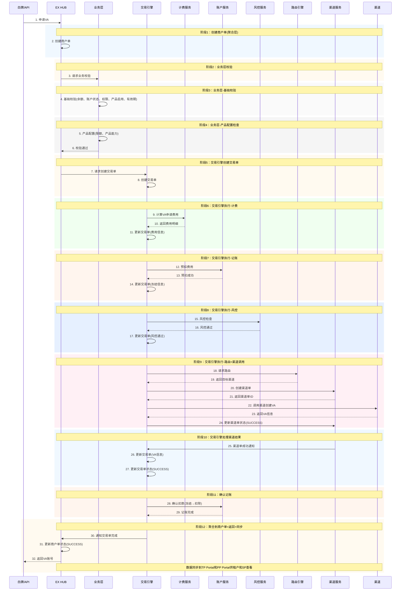
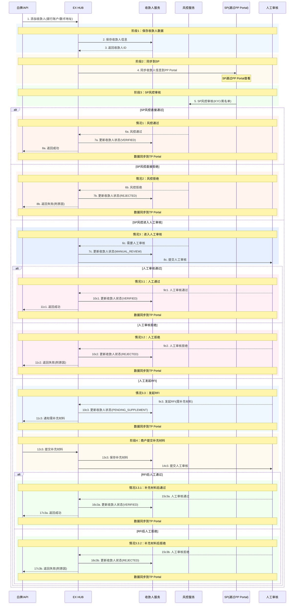

## 各交易类型详细流程

### 4.1 VA申请（商户主动发起）

**单据流转：** 商户单 → 交易单 → 渠道单



**说明：**

- **商户单**：聚合层，汇总交易单结果
- **交易单**：核心执行层，交易引擎驱动执行计费、记账、风控、路由等所有业务逻辑
  - 先记账冻结费用，失败后返回
- **渠道单**：渠道调用层
- 商户通过白牌或API接入EX系统
- 数据通过Portal展示：MP(商户)、TP(租户)、PP(SP)

---

### 4.2 VA 展示排序与重复能力处理

#### 4.2.1 背景

商户同时开通 BB 和 IPL 后，两个 SP 可能都提供 VA 收款能力。需要明确：

1. 商户端展示多个 VA 时的排序规则
2. BB 和 IPL 提供重复 VA 能力时的处理策略

#### 4.2.2 本期规则

**VA 展示排序：**

```
本期规则（业务侧不做自定义排序）：
- BB 的 VA/代收付账户统一排在上面（优先展示）
- IPL 的 VA 账户排在下面
- 同一 SP 内的多个 VA 按创建时间正序排列

排序优先级：BB > IPL（固定，本期不可配置）
```

**重复 VA 能力去重：**

```
当 BB 和 IPL 对同一币种/地区提供了重复的 VA 能力时：
- 本期统一使用 BB 的能力（BB 优先）
- IPL 的重复能力不展示给商户
- 仅 IPL 独有的能力（BB 不具备的币种/地区）才展示 IPL VA

示例：
┌──────────────────────────────────────────────────────┐
│  BB VA 能力          IPL VA 能力        商户端展示     │
├──────────────────────────────────────────────────────┤
│  USD (HK)            USD (HK)          BB USD (HK)   │  ← 重复，用BB
│  HKD (HK)            HKD (HK)          BB HKD (HK)   │  ← 重复，用BB
│  —                   EUR (HK)          IPL EUR (HK)   │  ← IPL独有，展示
│  —                   CNH (HK)          IPL CNH (HK)   │  ← IPL独有，展示
└──────────────────────────────────────────────────────┘
```

**去重判断维度：**

| 维度 | 说明                                |
| ---- | ----------------------------------- |
| 币种 | VA 支持的收款币种（USD/HKD/EUR 等） |
| 地区 | VA 所在地区（HK/SG/UK 等）          |

> 同一币种+同一地区 = 重复能力，本期统一用 BB。

#### 4.2.3 技术实现建议

```
排序字段建议：
- VA 记录增加 sort_order 字段（int），用于控制展示顺序
- 本期默认值：BB 的 VA sort_order = 100，IPL 的 VA sort_order = 200
- 前端按 sort_order 升序排列
- sort_order 值越小越靠前

去重逻辑：
- 查询商户所有可用 VA 时，按 (currency, region) 分组
- 同组内如果 BB 和 IPL 都有，只返回 BB 的
- 同组内如果只有 IPL 有，返回 IPL 的

代码层面建议确认：
✅ sort_order 字段是否已支持（或需新增）
✅ 去重逻辑是否在查询层做（推荐）还是前端做
```

#### 4.2.4 下期规划

```
下期（Phase 2）考虑：
☐ TP 端配置 VA 展示优先级（覆盖默认的 BB 优先）
☐ 商户端选择隐藏/显示特定 VA
☐ 去重策略可配置（不一定 BB 优先，可按 TP 配置）
```

---

### 4.3 收款人添加（商户主动发起）

**单据流转：** 收款人数据 → EX风控 → SP风控 → 人工审核（可选）→ RFI流程（可选）



**说明：**

- **阶段1：保存收款人数据** → EX HUB保存
- **阶段2：同步到SP** → 通过PP Portal展示给SP
- **阶段3：SP风控审核** → SP通过PP Portal进行风控审核

**审核结果：**

1. **风控直接通过** → 收款人状态：VERIFIED
2. **风控直接拒绝** → 收款人状态：REJECTED
3. **进入人工审核** → 收款人状态：MANUAL_REVIEW
   - 3.1 **人工通过** → 收款人状态：VERIFIED
   - 3.2 **人工拒绝** → 收款人状态：REJECTED
   - 3.3 **发起RFI** → 收款人状态：PENDING_SUPPLEMENT
     - 商户提交补充材料
     - 人工再次审核
     - 3.3.1 **补充材料后通过** → 收款人状态：VERIFIED
     - 3.3.2 **补充材料后拒绝** → 收款人状态：REJECTED

- 所有状态变更同步到TP Portal供租户查看
- SP通过PP Portal查看和审核收款人信息

---
