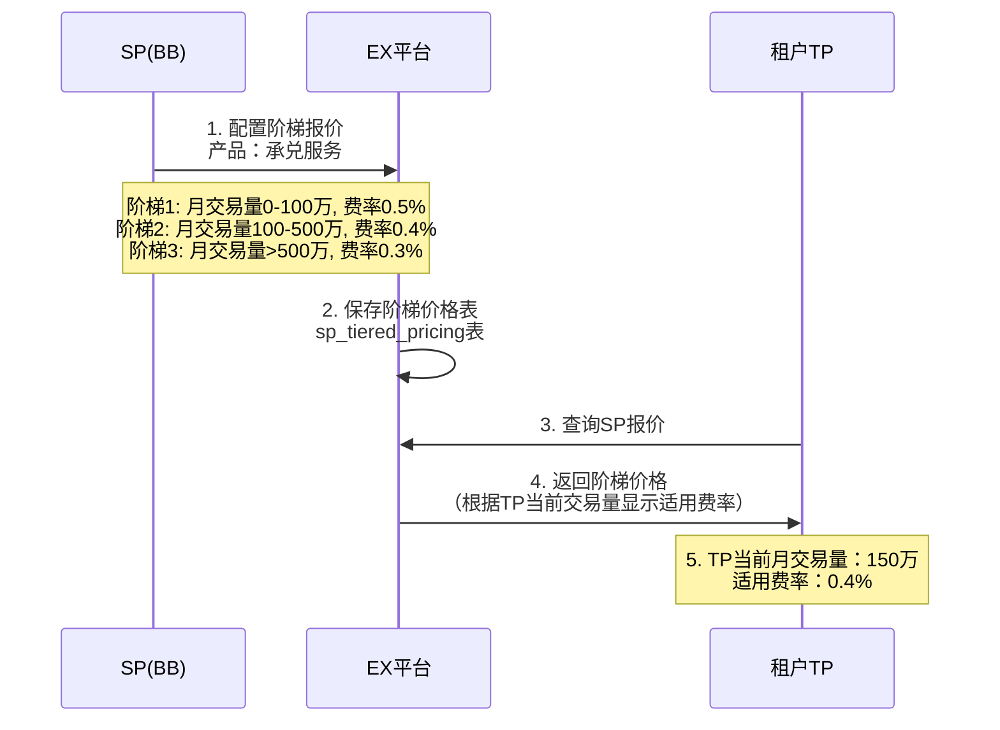
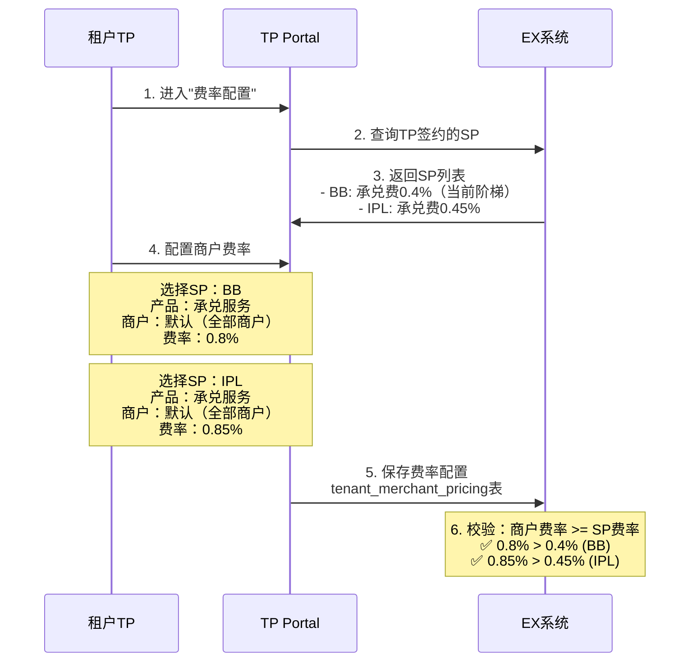
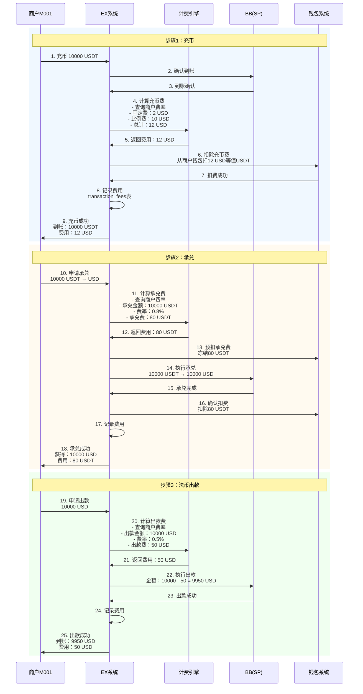
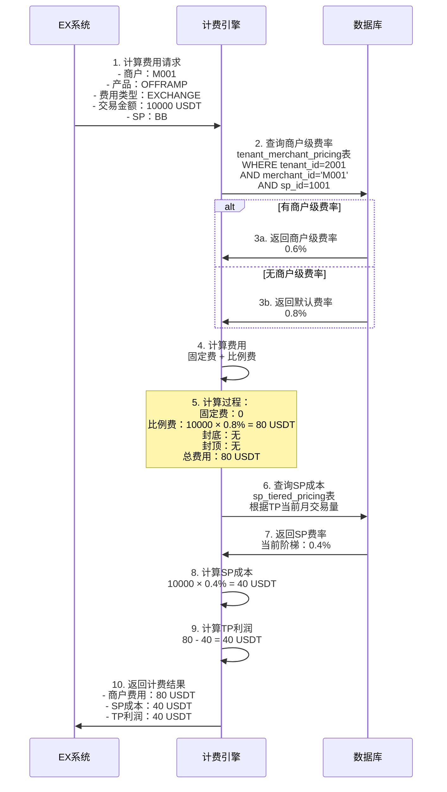
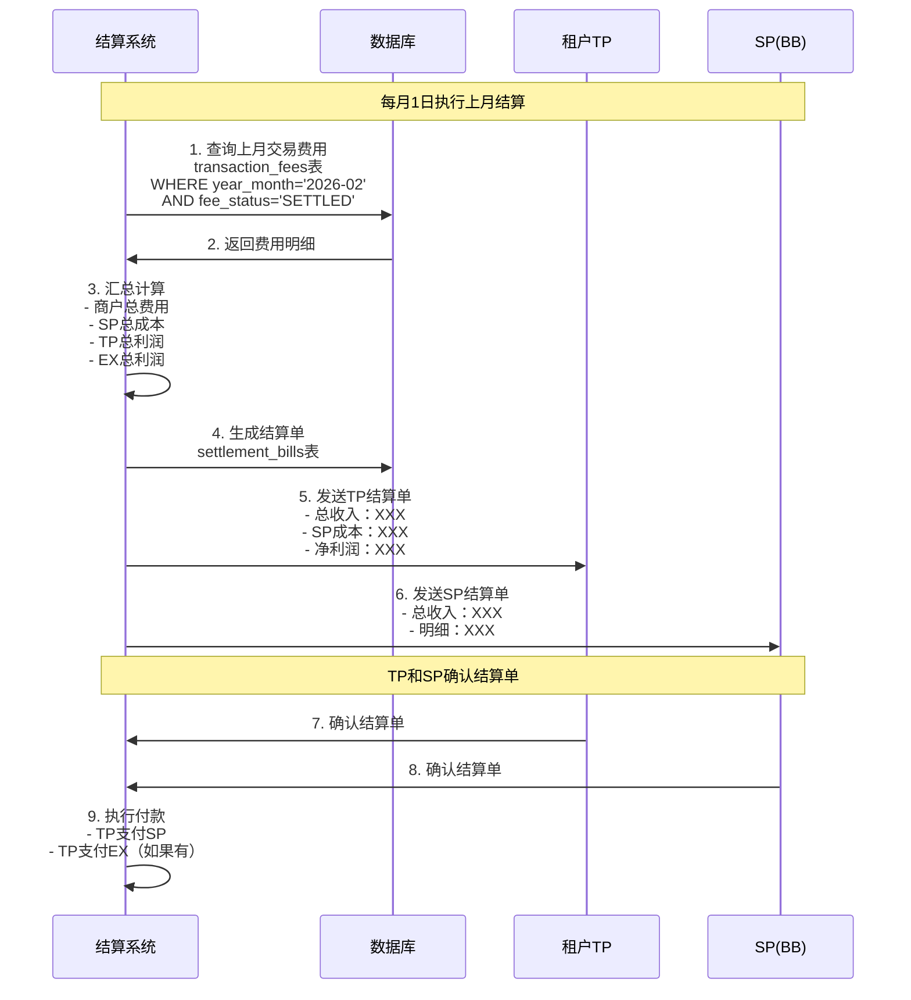
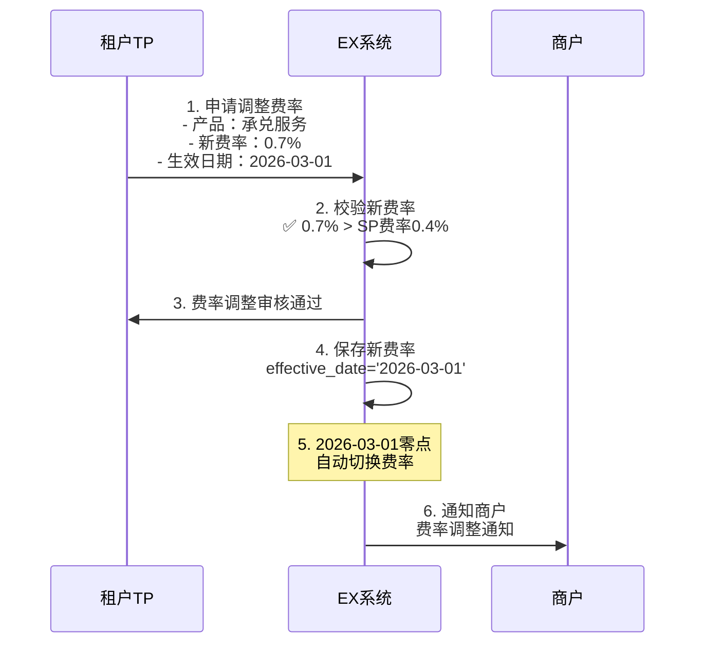

# 产品计费方案设计

## 文档概述

本文档详细描述了EX平台的产品计费体系，包括：
- 产品分类和计费模型
- 费率配置层级（SP阶梯价→TP→商户）
- 计费规则和计算逻辑
- 分润结算流程

**核心设计理念：**
- ✅ **灵活计费**：支持固定费+比例费，支持封顶封底
- ✅ **阶梯定价**：SP对TP提供阶梯价，TP对商户灵活定价
- ✅ **分步计费**：每个环节独立计费，透明清晰
- ✅ **多币种支持**：固定费支持USD，比例费按交易币种
- ✅ **商户友好**：MVP期间不暴露SP，统一费率展示

---

## 目录

1. [产品分类和计费模型](#产品分类和计费模型)
2. [费率配置层级](#费率配置层级)
3. [计费规则详解](#计费规则详解)
4. [完整交易计费示例](#完整交易计费示例)
5. [数据表设计](#数据表设计)
6. [计费流程时序图](#计费流程时序图)
7. [分润结算逻辑](#分润结算逻辑)

---

## 产品分类和计费模型

### 1.1 产品分类

#### **产品1：数币钱包（Crypto Wallet）**
- **功能**：充币、提币、余额管理
- **开通规则**：开通任何数币相关产品时自动开通
- **计费项**：
  - 充币费（Deposit Fee）
  - 提币费（Withdrawal Fee）

#### **产品2：Onramp（法币→数币）**
- **功能**：法币入金 → 承兑 → 数币
- **计费项**：
  - VA收款费（IPL VA / XPAY VA）
  - 大账户收款费（BB大账户）
  - 承兑费（法币→数币）

#### **产品3：Offramp（数币→法币）**
- **功能**：数币 → 承兑 → 法币出款
- **计费项**：
  - 承兑费（数币→法币）
  - 法币出款费（BB大账户 / XPAY / IPL）

---

### 1.2 计费模型

**支持的计费方式：**

#### **方式1：固定费（Fixed Fee）**
```
每笔固定金额，如：5 USD/笔
支持币种：USD（本期）
```

#### **方式2：比例费（Percentage Fee）**
```
按交易金额的百分比，如：0.5%
支持封顶（Cap）和封底（Floor）
```

#### **方式3：混合模式（Fixed + Percentage）**
```
固定费 + 比例费，如：2 USD + 0.3%
两项费用相加
```

#### **方式4：阶梯定价（Tiered Pricing）**
```
根据交易金额或交易量，不同阶梯不同费率
适用于：SP对TP的报价，EX对TP的报价
```

---

### 1.3 费率配置示例

#### **示例1：充币费（固定+比例+封顶封底）**
```json
{
  "product": "CRYPTO_WALLET",
  "fee_type": "DEPOSIT",
  "fixed_fee": {
    "amount": 2,
    "currency": "USD"
  },
  "percentage_fee": {
    "rate": 0.001,
    "min_fee": 1,
    "max_fee": 50,
    "currency": "USD"
  }
}
```

**计算示例：**
```
充币金额：10000 USDT
固定费：2 USD
比例费：10000 × 0.1% = 10 USD
封顶：min(10, 50) = 10 USD
总费用：2 + 10 = 12 USD
```

#### **示例2：承兑费（纯比例）**
```json
{
  "product": "OFFRAMP",
  "fee_type": "EXCHANGE",
  "percentage_fee": {
    "rate": 0.005,
    "min_fee": null,
    "max_fee": null
  }
}
```

**计算示例：**
```
承兑金额：10000 USDT
比例费：10000 × 0.5% = 50 USDT
总费用：50 USDT
```

---

## 费率配置层级

### 2.1 配置层级概览

```
┌─────────────────────────────────────────────────────────────┐
│                    费率配置层级                              │
└─────────────────────────────────────────────────────────────┘

场景1：TP与SP直签
┌──────────────┐
│   SP (BB)    │  阶梯报价给TP
│              │  - 月交易量 0-100万: 0.5%
│              │  - 月交易量 100-500万: 0.4%
│              │  - 月交易量 >500万: 0.3%
└──────┬───────┘
       │
       ▼
┌──────────────┐
│   TP (TP001) │  给商户报价
│              │  - 默认费率: 0.8%
│              │  - VIP商户: 0.6%
└──────┬───────┘
       │
       ▼
┌──────────────┐
│ 商户 (M001)  │  看到统一费率
│              │  - 承兑费: 0.6%
└──────────────┘

场景2：TP通过EX签约SP
┌──────────────┐
│   SP (BB)    │  底价给EX
│              │  - 承兑费: 0.3%
└──────┬───────┘
       │
       ▼
┌──────────────┐
│   EX平台     │  阶梯报价给TP
│              │  - 月交易量 0-100万: 0.5%
│              │  - 月交易量 100-500万: 0.4%
│              │  - 月交易量 >500万: 0.35%
└──────┬───────┘
       │
       ▼
┌──────────────┐
│   TP (TP001) │  给商户报价
│              │  - 默认费率: 0.8%
└──────┬───────┘
       │
       ▼
┌──────────────┐
│ 商户 (M001)  │  看到统一费率
│              │  - 承兑费: 0.8%
└──────────────┘
```

---

### 2.2 SP阶梯报价配置

**说明：** SP对TP提供阶梯定价，根据月交易量或月交易笔数。



**数据示例：**
```json
{
  "sp_id": 1001,
  "sp_name": "BB",
  "tenant_id": 2001,
  "product_code": "OFFRAMP_EXCHANGE",
  "pricing_type": "TIERED",
  "tiers": [
    {
      "tier_level": 1,
      "volume_min": 0,
      "volume_max": 1000000,
      "fee_rate": 0.005,
      "currency": "USD"
    },
    {
      "tier_level": 2,
      "volume_min": 1000000,
      "volume_max": 5000000,
      "fee_rate": 0.004,
      "currency": "USD"
    },
    {
      "tier_level": 3,
      "volume_min": 5000000,
      "volume_max": null,
      "fee_rate": 0.003,
      "currency": "USD"
    }
  ]
}
```

---

### 2.3 TP对商户报价配置

**说明：** TP可以为不同SP配置不同费率，也可以为不同商户配置不同费率。

#### **配置方式1：按SP配置（推荐）**



#### **配置方式2：统一费率（可选）**

```
TP勾选"全部SP统一费率"
- 承兑服务: 0.8%（适用于BB和IPL）

系统自动校验：
- BB底价0.4% < 0.8% ✅
- IPL底价0.45% < 0.8% ✅
```

#### **配置方式3：商户级费率（可选）**

```
TP为VIP商户M001单独配置：
- 承兑服务(BB): 0.6%
- 承兑服务(IPL): 0.65%

优先级：商户级费率 > 默认费率
```

---

### 2.4 商户侧费率展示（MVP）

**MVP期间：不暴露SP，统一展示**

```
商户M001看到的费率：
┌────────────────────────────────────┐
│ 产品费率                            │
├────────────────────────────────────┤
│ 充币费：2 USD + 0.1% (封顶50 USD)  │
│ 提币费：5 USD + 0.1% (封顶50 USD)  │
│ 承兑费(法→数)：0.8%                │
│ 承兑费(数→法)：0.8%                │
│ 法币出款费：0.5%                    │
└────────────────────────────────────┘

说明：商户不知道背后走的是BB还是IPL
实际执行时，系统根据路由规则选择SP
```

**未来版本：可选暴露SP**

```
商户M001看到的费率（可选展示）：
┌────────────────────────────────────┐
│ 产品费率                            │
├────────────────────────────────────┤
│ 承兑费(数→法)                       │
│  - 通道1: 0.8%                     │
│  - 通道2: 0.85%                    │
│ 法币出款费                          │
│  - 通道1: 0.5%                     │
│  - 通道2: 0.55%                    │
└────────────────────────────────────┘
```

---

## 计费规则详解

### 3.1 数币钱包计费

#### **充币费（Deposit Fee）**

**计费时机：** 充币到账确认后

**计费公式：**
```
充币费 = 固定费 + max(min(充币金额 × 比例费率, 封顶), 封底)
```

**配置示例：**
```json
{
  "product": "CRYPTO_WALLET",
  "fee_type": "DEPOSIT",
  "sp_id": 1001,
  "sp_name": "BB",
  "fixed_fee": {
    "amount": 2,
    "currency": "USD"
  },
  "percentage_fee": {
    "rate": 0.001,
    "min_fee": 1,
    "max_fee": 50,
    "currency": "USD"
  }
}
```

**计算示例：**
```
场景1：充币 1000 USDT
固定费：2 USD
比例费：1000 × 0.1% = 1 USD
封底：max(1, 1) = 1 USD
总费用：2 + 1 = 3 USD

场景2：充币 100000 USDT
固定费：2 USD
比例费：100000 × 0.1% = 100 USD
封顶：min(100, 50) = 50 USD
总费用：2 + 50 = 52 USD
```

---

#### **提币费（Withdrawal Fee）**

**计费时机：** 提币申请时预扣

**计费公式：** 同充币费

**配置示例：**
```json
{
  "product": "CRYPTO_WALLET",
  "fee_type": "WITHDRAWAL",
  "sp_id": 1001,
  "sp_name": "BB",
  "fixed_fee": {
    "amount": 5,
    "currency": "USD"
  },
  "percentage_fee": {
    "rate": 0.001,
    "min_fee": 1,
    "max_fee": 50,
    "currency": "USD"
  }
}
```

---

### 3.2 Onramp计费

#### **VA收款费**

**计费时机：** 法币到账确认后

**计费公式：**
```
VA收款费 = 收款金额 × 费率
```

**配置示例：**
```json
{
  "product": "ONRAMP",
  "fee_type": "VA_COLLECTION",
  "sp_id": 1002,
  "sp_name": "IPL",
  "percentage_fee": {
    "rate": 0.003,
    "currency": "USD"
  }
}
```

**计算示例：**
```
收款金额：10000 USD
VA收款费：10000 × 0.3% = 30 USD
```

---

#### **大账户收款费**

**计费时机：** 法币到账确认后

**计费公式：** 同VA收款费

**配置示例：**
```json
{
  "product": "ONRAMP",
  "fee_type": "ACCOUNT_COLLECTION",
  "sp_id": 1001,
  "sp_name": "BB",
  "percentage_fee": {
    "rate": 0.002,
    "currency": "USD"
  }
}
```

---

#### **承兑费（法币→数币）**

**计费时机：** 承兑完成后

**计费公式：**
```
承兑费 = 承兑金额 × 费率
```

**配置示例：**
```json
{
  "product": "ONRAMP",
  "fee_type": "EXCHANGE",
  "sp_id": 1001,
  "sp_name": "BB",
  "percentage_fee": {
    "rate": 0.005,
    "currency": "USD"
  }
}
```

**计算示例：**
```
承兑金额：10000 USD → 10000 USDT
承兑费：10000 × 0.5% = 50 USD（或等值USDT）
```

---

### 3.3 Offramp计费

#### **承兑费（数币→法币）**

**计费时机：** 承兑完成后

**计费公式：**
```
承兑费 = 承兑金额 × 费率
```

**配置示例：**
```json
{
  "product": "OFFRAMP",
  "fee_type": "EXCHANGE",
  "sp_id": 1001,
  "sp_name": "BB",
  "percentage_fee": {
    "rate": 0.005,
    "currency": "USDT"
  }
}
```

**计算示例：**
```
承兑金额：10000 USDT → 10000 USD
承兑费：10000 × 0.5% = 50 USDT
```

---

#### **法币出款费**

**计费时机：** 出款成功后

**计费公式：**
```
出款费 = 出款金额 × 费率
```

**配置示例：**
```json
{
  "product": "OFFRAMP",
  "fee_type": "PAYOUT",
  "sp_id": 1002,
  "sp_name": "IPL",
  "percentage_fee": {
    "rate": 0.003,
    "currency": "USD"
  }
}
```

**计算示例：**
```
出款金额：10000 USD
出款费：10000 × 0.3% = 30 USD
商户实际收到：10000 - 30 = 9970 USD
```

---

## 完整交易计费示例

### 4.1 Offramp完整流程计费

**场景：** 商户M001完成一笔Offramp交易

```
步骤1：充币 10000 USDT
步骤2：承兑 10000 USDT → 10000 USD
步骤3：法币出款 10000 USD
```

#### **费率配置**

**TP配置的商户费率：**
```json
{
  "merchant_id": "M001",
  "pricing": {
    "deposit": {
      "fixed_fee": {"amount": 2, "currency": "USD"},
      "percentage_fee": {"rate": 0.001, "min_fee": 1, "max_fee": 50}
    },
    "exchange": {
      "percentage_fee": {"rate": 0.008}
    },
    "payout": {
      "percentage_fee": {"rate": 0.005}
    }
  }
}
```

#### **计费计算**

```
步骤1：充币费
- 固定费：2 USD
- 比例费：10000 × 0.1% = 10 USD
- 封顶：min(10, 50) = 10 USD
- 充币费合计：2 + 10 = 12 USD

步骤2：承兑费
- 承兑金额：10000 USDT
- 承兑费：10000 × 0.8% = 80 USDT

步骤3：出款费
- 出款金额：10000 USD
- 出款费：10000 × 0.5% = 50 USD
- 商户实际收到：10000 - 50 = 9950 USD

商户总成本：
- 充币费：12 USD（约12 USDT）
- 承兑费：80 USDT
- 出款费：50 USD
- 总计：92 USDT + 50 USD
```

#### **分润计算**

**假设SP费率：**
```
BB充币费：1 USD + 0.05%
BB承兑费：0.3%
BB出款费：0.3%
```

**分润：**
```
充币费分润：
- 商户支付：12 USD
- SP成本：1 + (10000 × 0.05%) = 6 USD
- TP利润：12 - 6 = 6 USD

承兑费分润：
- 商户支付：80 USDT
- SP成本：10000 × 0.3% = 30 USDT
- TP利润：80 - 30 = 50 USDT

出款费分润：
- 商户支付：50 USD
- SP成本：10000 × 0.3% = 30 USD
- TP利润：50 - 30 = 20 USD

TP总利润：6 USD + 50 USDT + 20 USD
```

---

### 4.2 Onramp完整流程计费

**场景：** 商户M001完成一笔Onramp交易

```
步骤1：VA收款 10000 USD
步骤2：承兑 10000 USD → 10000 USDT
步骤3：提币 10000 USDT
```

#### **费率配置**

```json
{
  "merchant_id": "M001",
  "pricing": {
    "va_collection": {
      "percentage_fee": {"rate": 0.003}
    },
    "exchange": {
      "percentage_fee": {"rate": 0.008}
    },
    "withdrawal": {
      "fixed_fee": {"amount": 5, "currency": "USD"},
      "percentage_fee": {"rate": 0.001, "min_fee": 1, "max_fee": 50}
    }
  }
}
```

#### **计费计算**

```
步骤1：VA收款费
- 收款金额：10000 USD
- VA收款费：10000 × 0.3% = 30 USD

步骤2：承兑费
- 承兑金额：10000 USD
- 承兑费：10000 × 0.8% = 80 USD

步骤3：提币费
- 固定费：5 USD
- 比例费：10000 × 0.1% = 10 USD
- 封顶：min(10, 50) = 10 USD
- 提币费合计：5 + 10 = 15 USD

商户总成本：30 + 80 + 15 = 125 USD
商户实际收到：10000 USDT
商户净成本：125 USD
```

---

## 数据表设计

### 5.1 SP阶梯定价表 (sp_tiered_pricing)

```sql
CREATE TABLE sp_tiered_pricing (
    id BIGINT PRIMARY KEY AUTO_INCREMENT,
    sp_id BIGINT NOT NULL COMMENT 'SP ID',
    tenant_id BIGINT COMMENT '租户ID，NULL表示通用价格',
    product_code VARCHAR(50) NOT NULL COMMENT '产品代码',
    fee_type VARCHAR(50) NOT NULL COMMENT '费用类型：DEPOSIT/WITHDRAWAL/EXCHANGE/PAYOUT',
    tier_level INT NOT NULL COMMENT '阶梯级别',
    volume_min DECIMAL(18,2) COMMENT '交易量下限',
    volume_max DECIMAL(18,2) COMMENT '交易量上限，NULL表示无上限',
    volume_currency VARCHAR(10) COMMENT '交易量币种',
    
    -- 固定费
    fixed_fee_amount DECIMAL(18,2) COMMENT '固定费金额',
    fixed_fee_currency VARCHAR(10) COMMENT '固定费币种',
    
    -- 比例费
    percentage_fee_rate DECIMAL(10,6) COMMENT '比例费率',
    percentage_min_fee DECIMAL(18,2) COMMENT '比例费封底',
    percentage_max_fee DECIMAL(18,2) COMMENT '比例费封顶',
    percentage_currency VARCHAR(10) COMMENT '比例费币种',
    
    effective_date DATE COMMENT '生效日期',
    expiry_date DATE COMMENT '失效日期',
    status VARCHAR(20) DEFAULT 'ACTIVE' COMMENT '状态',
    created_at TIMESTAMP DEFAULT CURRENT_TIMESTAMP,
    updated_at TIMESTAMP DEFAULT CURRENT_TIMESTAMP ON UPDATE CURRENT_TIMESTAMP,
    
    INDEX idx_sp_tenant (sp_id, tenant_id),
    INDEX idx_product_fee (product_code, fee_type),
    INDEX idx_status (status)
) COMMENT 'SP阶梯定价表';
```

**示例数据：**
```sql
-- BB对TP001的承兑费阶梯价
INSERT INTO sp_tiered_pricing VALUES 
(1, 1001, 2001, 'OFFRAMP', 'EXCHANGE', 1, 0, 1000000, 'USD', NULL, NULL, 0.005, NULL, NULL, 'USD', '2026-02-01', NULL, 'ACTIVE', NOW(), NOW()),
(2, 1001, 2001, 'OFFRAMP', 'EXCHANGE', 2, 1000000, 5000000, 'USD', NULL, NULL, 0.004, NULL, NULL, 'USD', '2026-02-01', NULL, 'ACTIVE', NOW(), NOW()),
(3, 1001, 2001, 'OFFRAMP', 'EXCHANGE', 3, 5000000, NULL, 'USD', NULL, NULL, 0.003, NULL, NULL, 'USD', '2026-02-01', NULL, 'ACTIVE', NOW(), NOW());
```

---

### 5.2 TP商户定价表 (tenant_merchant_pricing)

```sql
CREATE TABLE tenant_merchant_pricing (
    id BIGINT PRIMARY KEY AUTO_INCREMENT,
    tenant_id BIGINT NOT NULL COMMENT 'TP ID',
    merchant_id VARCHAR(50) COMMENT '商户ID，NULL表示默认费率',
    sp_id BIGINT NOT NULL COMMENT 'SP ID',
    product_code VARCHAR(50) NOT NULL COMMENT '产品代码',
    fee_type VARCHAR(50) NOT NULL COMMENT '费用类型',
    
    -- 固定费
    fixed_fee_amount DECIMAL(18,2) COMMENT '固定费金额',
    fixed_fee_currency VARCHAR(10) COMMENT '固定费币种',
    
    -- 比例费
    percentage_fee_rate DECIMAL(10,6) COMMENT '比例费率',
    percentage_min_fee DECIMAL(18,2) COMMENT '比例费封底',
    percentage_max_fee DECIMAL(18,2) COMMENT '比例费封顶',
    percentage_currency VARCHAR(10) COMMENT '比例费币种',
    
    effective_date DATE COMMENT '生效日期',
    expiry_date DATE COMMENT '失效日期',
    status VARCHAR(20) DEFAULT 'ACTIVE' COMMENT '状态',
    created_at TIMESTAMP DEFAULT CURRENT_TIMESTAMP,
    updated_at TIMESTAMP DEFAULT CURRENT_TIMESTAMP ON UPDATE CURRENT_TIMESTAMP,
    
    UNIQUE KEY uk_tenant_merchant_sp_product (tenant_id, merchant_id, sp_id, product_code, fee_type),
    INDEX idx_tenant_merchant (tenant_id, merchant_id),
    INDEX idx_status (status)
) COMMENT 'TP商户定价表';
```

**示例数据：**
```sql
-- TP001的默认费率（所有商户）
INSERT INTO tenant_merchant_pricing VALUES 
(1, 2001, NULL, 1001, 'CRYPTO_WALLET', 'DEPOSIT', 2, 'USD', 0.001, 1, 50, 'USD', '2026-02-01', NULL, 'ACTIVE', NOW(), NOW()),
(2, 2001, NULL, 1001, 'OFFRAMP', 'EXCHANGE', NULL, NULL, 0.008, NULL, NULL, 'USDT', '2026-02-01', NULL, 'ACTIVE', NOW(), NOW());

-- TP001为VIP商户M001的特殊费率
INSERT INTO tenant_merchant_pricing VALUES 
(3, 2001, 'M001', 1001, 'OFFRAMP', 'EXCHANGE', NULL, NULL, 0.006, NULL, NULL, 'USDT', '2026-02-01', NULL, 'ACTIVE', NOW(), NOW());
```

---

### 5.3 交易费用记录表 (transaction_fees)

```sql
CREATE TABLE transaction_fees (
    id BIGINT PRIMARY KEY AUTO_INCREMENT,
    transaction_id VARCHAR(100) NOT NULL COMMENT '交易ID',
    merchant_id VARCHAR(50) NOT NULL COMMENT '商户ID',
    tenant_id BIGINT NOT NULL COMMENT 'TP ID',
    sp_id BIGINT NOT NULL COMMENT 'SP ID',
    
    product_code VARCHAR(50) NOT NULL COMMENT '产品代码',
    fee_type VARCHAR(50) NOT NULL COMMENT '费用类型',
    
    transaction_amount DECIMAL(18,8) NOT NULL COMMENT '交易金额',
    transaction_currency VARCHAR(10) NOT NULL COMMENT '交易币种',
    
    -- 商户侧费用
    merchant_fixed_fee DECIMAL(18,8) COMMENT '商户固定费',
    merchant_percentage_fee DECIMAL(18,8) COMMENT '商户比例费',
    merchant_total_fee DECIMAL(18,8) NOT NULL COMMENT '商户总费用',
    merchant_fee_currency VARCHAR(10) NOT NULL COMMENT '商户费用币种',
    
    -- SP侧成本
    sp_fixed_fee DECIMAL(18,8) COMMENT 'SP固定费',
    sp_percentage_fee DECIMAL(18,8) COMMENT 'SP比例费',
    sp_total_fee DECIMAL(18,8) NOT NULL COMMENT 'SP总成本',
    sp_fee_currency VARCHAR(10) NOT NULL COMMENT 'SP费用币种',
    
    -- TP利润
    tenant_profit DECIMAL(18,8) NOT NULL COMMENT 'TP利润',
    tenant_profit_currency VARCHAR(10) NOT NULL COMMENT 'TP利润币种',
    
    -- EX利润（如果有）
    ex_profit DECIMAL(18,8) COMMENT 'EX利润',
    ex_profit_currency VARCHAR(10) COMMENT 'EX利润币种',
    
    fee_status VARCHAR(20) DEFAULT 'PENDING' COMMENT '费用状态：PENDING/SETTLED/REFUNDED',
    settled_at TIMESTAMP COMMENT '结算时间',
    created_at TIMESTAMP DEFAULT CURRENT_TIMESTAMP,
    
    INDEX idx_transaction (transaction_id),
    INDEX idx_merchant (merchant_id),
    INDEX idx_tenant (tenant_id),
    INDEX idx_created (created_at),
    INDEX idx_status (fee_status)
) COMMENT '交易费用记录表';
```

**示例数据：**
```sql
-- Offramp交易的承兑费记录
INSERT INTO transaction_fees VALUES 
(1, 'TXN202602030001', 'M001', 2001, 1001, 'OFFRAMP', 'EXCHANGE', 
 10000, 'USDT', 
 NULL, 80, 80, 'USDT',
 NULL, 30, 30, 'USDT',
 50, 'USDT',
 NULL, NULL,
 'SETTLED', '2026-02-03 12:00:00', NOW());
```

---

### 5.4 TP月度交易量统计表 (tenant_monthly_volume)

```sql
CREATE TABLE tenant_monthly_volume (
    id BIGINT PRIMARY KEY AUTO_INCREMENT,
    tenant_id BIGINT NOT NULL COMMENT 'TP ID',
    sp_id BIGINT NOT NULL COMMENT 'SP ID',
    product_code VARCHAR(50) NOT NULL COMMENT '产品代码',
    year_month VARCHAR(7) NOT NULL COMMENT '年月，格式：2026-02',
    
    total_volume DECIMAL(18,2) NOT NULL COMMENT '总交易量',
    total_count INT NOT NULL COMMENT '总交易笔数',
    volume_currency VARCHAR(10) NOT NULL COMMENT '交易量币种',
    
    current_tier_level INT COMMENT '当前阶梯级别',
    current_tier_rate DECIMAL(10,6) COMMENT '当前阶梯费率',
    
    updated_at TIMESTAMP DEFAULT CURRENT_TIMESTAMP ON UPDATE CURRENT_TIMESTAMP,
    
    UNIQUE KEY uk_tenant_sp_product_month (tenant_id, sp_id, product_code, year_month),
    INDEX idx_year_month (year_month)
) COMMENT 'TP月度交易量统计表';
```

**示例数据：**
```sql
-- TP001在BB的2月承兑交易量
INSERT INTO tenant_monthly_volume VALUES 
(1, 2001, 1001, 'OFFRAMP', '2026-02', 1500000, 150, 'USD', 2, 0.004, NOW());
```

---

## 计费流程时序图

### 6.1 Offramp交易计费流程



---

### 6.2 费率查询和计算流程



---

## 分润结算逻辑

### 7.1 分润参与方

```
┌─────────────────────────────────────────────────────────────┐
│                    分润参与方                                │
└─────────────────────────────────────────────────────────────┘

场景1：TP与SP直签
┌──────────────┐
│   商户M001   │  支付费用
└──────┬───────┘
       │ 80 USDT
       ▼
┌──────────────┐
│   TP (TP001) │  收取费用，支付SP成本
└──────┬───────┘
       │ 30 USDT (SP成本)
       ▼
┌──────────────┐
│   SP (BB)    │  收取成本
└──────────────┘

TP利润：80 - 30 = 50 USDT

场景2：TP通过EX签约SP
┌──────────────┐
│   商户M001   │  支付费用
└──────┬───────┘
       │ 80 USDT
       ▼
┌──────────────┐
│   TP (TP001) │  收取费用，支付EX成本
└──────┬───────┘
       │ 40 USDT (EX报价)
       ▼
┌──────────────┐
│   EX平台     │  收取费用，支付SP成本
└──────┬───────┘
       │ 30 USDT (SP成本)
       ▼
┌──────────────┐
│   SP (BB)    │  收取成本
└──────────────┘

TP利润：80 - 40 = 40 USDT
EX利润：40 - 30 = 10 USDT
```

---

### 7.2 分润结算周期

**结算周期：** 月度结算（T+1月）

**结算流程：**



---

### 7.3 结算单示例

#### **TP结算单（2026年2月）**

```
┌─────────────────────────────────────────────────────────────┐
│              TP001 - 2026年2月结算单                         │
├─────────────────────────────────────────────────────────────┤
│ 产品：Offramp承兑服务                                        │
│ SP：BB                                                       │
├─────────────────────────────────────────────────────────────┤
│ 交易统计：                                                   │
│  - 总交易量：1,500,000 USD                                  │
│  - 总交易笔数：150笔                                         │
│  - 平均单笔：10,000 USD                                     │
├─────────────────────────────────────────────────────────────┤
│ 费用收入：                                                   │
│  - 商户总费用：12,000 USDT (1.5M × 0.8%)                   │
├─────────────────────────────────────────────────────────────┤
│ SP成本：                                                     │
│  - 当前阶梯：Tier 2 (100万-500万)                           │
│  - 阶梯费率：0.4%                                           │
│  - SP总成本：6,000 USDT (1.5M × 0.4%)                      │
├─────────────────────────────────────────────────────────────┤
│ 净利润：                                                     │
│  - TP利润：6,000 USDT                                       │
│  - 利润率：50%                                              │
├─────────────────────────────────────────────────────────────┤
│ 应付款项：                                                   │
│  - 应付BB：6,000 USDT                                       │
│  - 付款期限：2026-03-15                                     │
└─────────────────────────────────────────────────────────────┘
```

---

## 附录

### A. 费率配置最佳实践

#### **1. SP阶梯价设置建议**

```
推荐阶梯设置：
- Tier 1: 0-100万，费率较高（如：0.5%）
- Tier 2: 100-500万，费率中等（如：0.4%）
- Tier 3: 500万以上，费率较低（如：0.3%）

优势：
- 激励TP增加交易量
- 大客户享受更优惠费率
- SP保持竞争力
```

#### **2. TP商户定价建议**

```
定价策略：
- 默认费率：SP费率 + 50%-100%加价
- VIP商户：SP费率 + 30%-50%加价
- 测试商户：可设置更低费率

示例：
- SP费率：0.4%
- 默认商户：0.8% (100%加价)
- VIP商户：0.6% (50%加价)
```

#### **3. 封顶封底设置建议**

```
充币/提币费：
- 封底：1-5 USD（避免小额交易亏损）
- 封顶：50-100 USD（避免大额交易费用过高）

承兑费：
- 一般不设封顶封底
- 或设置较高封顶（如：1000 USD）
```

---

### B. 计费币种转换规则

**原则：** 尽量使用交易币种计费，减少汇率风险

```
充币USDT：
- 固定费：2 USD → 按实时汇率转换为USDT
- 比例费：直接用USDT计算

承兑(USDT→USD)：
- 费用：用USDT计算
- 从商户USDT钱包扣除

法币出款：
- 费用：用USD计算
- 从出款金额中扣除
```

---

### C. 费率调整流程



---

## 总结

本文档设计了完整的产品计费体系，核心特点：

✅ **灵活计费**：支持固定费+比例费，支持封顶封底  
✅ **阶梯定价**：SP对TP提供阶梯价，激励交易量增长  
✅ **分步计费**：每个环节独立计费，透明清晰  
✅ **多层配置**：SP阶梯价 → TP默认费率 → TP商户费率  
✅ **商户友好**：MVP期间统一展示，不暴露SP差异  
✅ **分润清晰**：自动计算TP利润，月度结算  

**关键数据表：**
1. `sp_tiered_pricing` - SP阶梯定价
2. `tenant_merchant_pricing` - TP商户定价
3. `transaction_fees` - 交易费用记录
4. `tenant_monthly_volume` - TP月度交易量统计

**计费流程：**
1. 交易发起 → 查询费率 → 计算费用 → 扣费 → 记录
2. 月度汇总 → 生成结算单 → 确认 → 付款

---

*最后更新：2026-02-03*  
*文档版本：v1.0*
