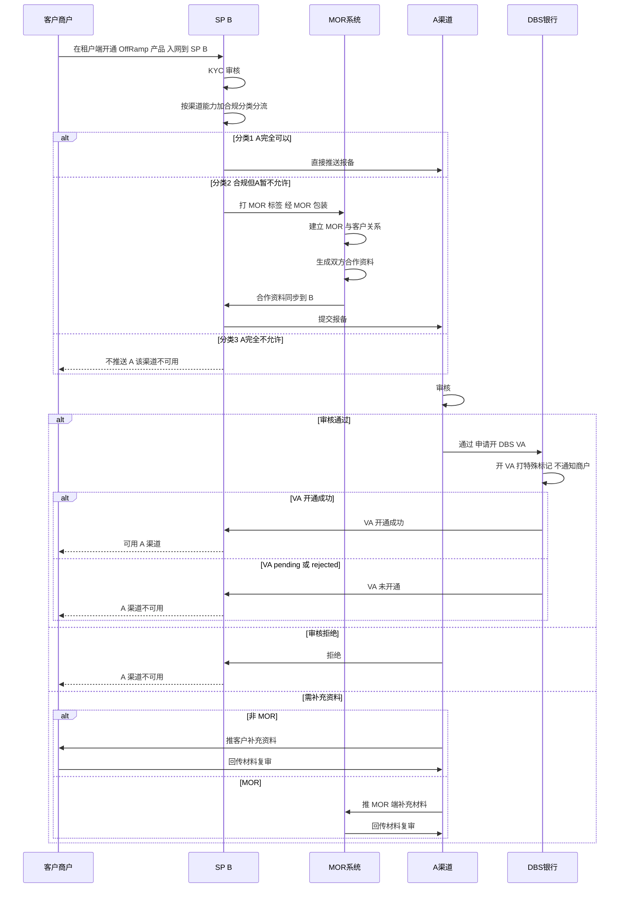
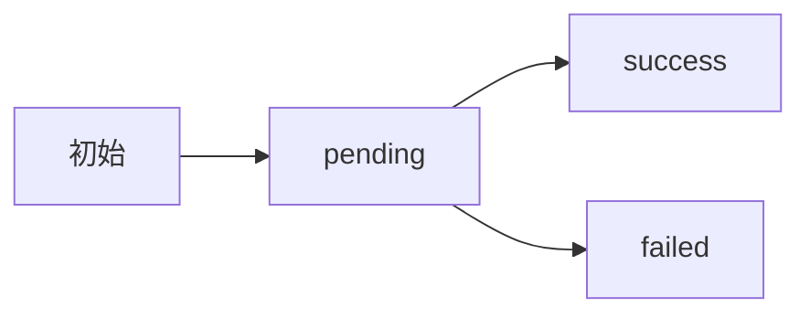
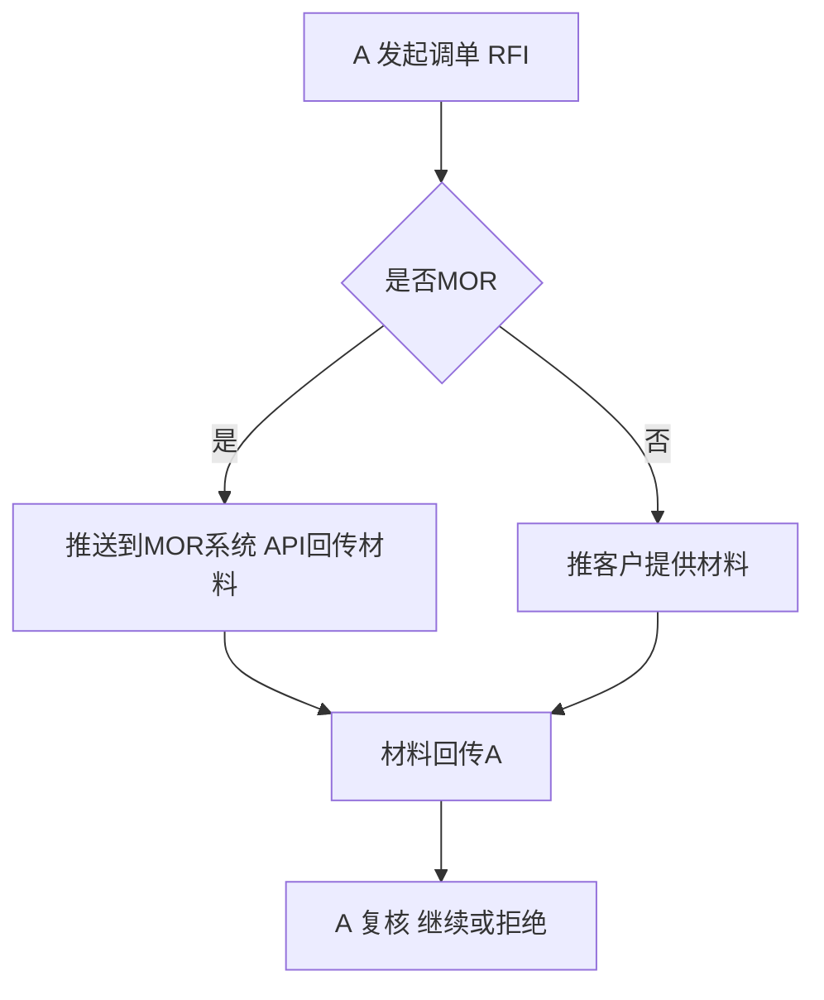
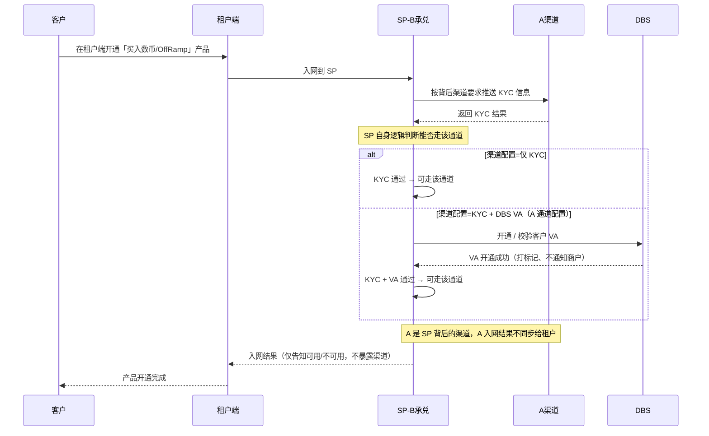
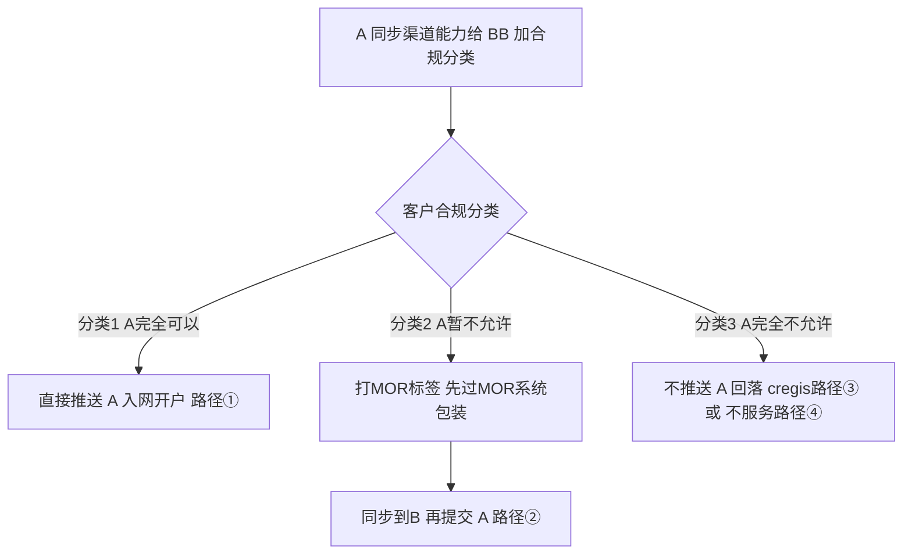
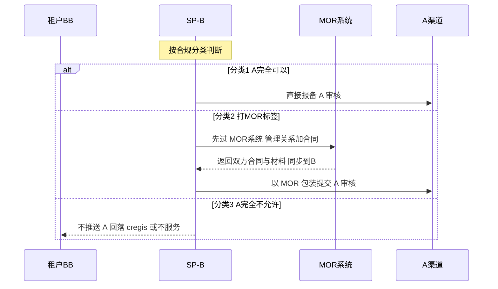
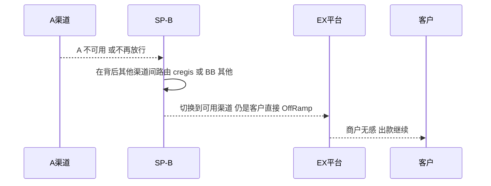
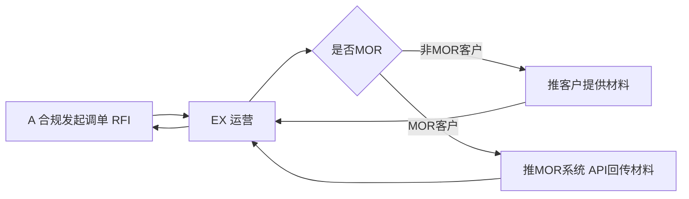

# B-A OffRamp 解决方案（渠道报备 + MOR 系统 + 交易）

> **文档定位**：本文描述 **客户经 SP（B）走 A 渠道做 OffRamp** 的完整方案，覆盖 **① 前置准备（A-B 合规对齐、A 能力维护、MOR 系统搭建）② 渠道报备流程（入网 BB → 是否报备 A → A 审核 → 开 DBS VA）③ 交易流程（OffRamp + 调单 RFI）**。
>
> **MOR 升级为单独部署的独立系统**（一个系统可有多家 MOR 公司）：对「**A 不能直接服务但在合规范围内**」的客户，在报备 A 之前 **先经 MOR 系统** 完成 MOR 公司与客户的关系管理、双方合同与材料包装；**调单（RFI）按是否 MOR 分流**。
>
> 已取消主子账户体系；客户始终只发起「一笔 OffRamp」。

---

## 一、背景

**目标：提升客户的 OffRamp 客户体验。**

终端商户在做 OffRamp 时，常遇到以下体验问题：

- **操作链路长**：商户需要自己在多个机构入网、自行开户收款，再手工发起出款，步骤繁琐、耗时长。
- **入网门槛不一**：部分商户能在法币渠道直接入网出款，部分商户因业务画像 / 渠道政策无法直接在法币渠道入账，体验割裂。
- **出款时效与确定性差**：跨账户的多步操作容易卡单，商户难以一站式完成。

**解决思路**：**统一为「客户直接 OffRamp」**——商户在租户端 **只发起一笔 OffRamp**，由 **SP（B）承兑、A 或其他渠道出款**，承兑 + 出款一步到位。对 **A 不能直接服务但在合规范围内** 的客户，**报备 A 前先经 MOR 系统包装**（合同 / 材料），商户无需感知底层链路即可获得「一笔下单、直接到账」的体验。**不再使用主子账户 / 主账户中转 / A-A 划转。**

---

## 二、角色与定位

分层模型：**租户（BB / 其他租户）→ SP（B）→ 渠道（A / cregis / 其他）**，旁挂 **MOR 系统（单独部署的独立子系统）**。**不再有主账户 / 子账户层级。**

| 角色               | 说明                                                                                                                                                                                            |
| ------------------ | ----------------------------------------------------------------------------------------------------------------------------------------------------------------------------------------------- |
| **租户**     | 展业主体（类似大代理）：BB 或其他租户，对终端商户展业的入口 / 品牌方；商户在租户端完成所有操作                                                                                                  |
| **SP（B）**  | KYC 审核主体 + 资金承接（承兑）主体：接收入网、按背后渠道要求推送 / 审核 KYC、判断可走通道；负责 OffRamp 承兑（数币→法币）。报备 A 前对接 MOR 系统拿到包装好的合同 / 材料                      |
| **A**        | SP（B）背后的法币渠道（channel / PSP）：负责法币入账与出款；做渠道报备审核（通过 / 拒绝 / 需补充资料）、合规调单（RFI）；入网结果不同步给租户                                                   |
| **MOR 系统** | **单独部署的独立系统**：一个系统可有多家 MOR 公司；管理 **MOR 公司 ↔ 客户** 关联关系，提供 **双方合同**、**Agent 生成材料**，并 **对接 API 回传调单（RFI）材料** |
| **DBS**      | VA（虚拟账户）开户银行；VA 用于**客户验证**（开户不通知、打特殊标记，非真实交易 VA，见第六节）                                                                                            |

### 关键原则

1. **分层关系**：租户 = 展业主体；**SP = B** = KYC 审核 + 承兑主体；**A  = 渠道**。入网到 SP，由 SP 推送 / 审核 KYC 并判断可走通道，可在多渠道间路由（见第七节）。
2. **统一客户直接 OffRamp**：**取消主子账户 / 主账户中转 / A-A 划转**；所有客户都用自有账户直接 OffRamp。
3. **对终端商户做 fully KYC**（走 cregis 等免 KYC 渠道的场景另见 `EX OffRamp解决方案.md` 阶段 1）。
4. **MOR 经独立系统显式包装**：对「A 不能直接服务但在合规范围内（分类 2）」的客户，**报备 A 前先过 MOR 系统**（关系管理 + 双方合同 + 材料包装）；调单（RFI）按是否 MOR 推送 MOR 端。
5. **商户只操作一笔**：商户端只发起一笔 OffRamp，承兑 + 出款一步到位。

---

## 三、前置准备

### 3.1 A-B 之间的 KYC/KYB 与合规分类（提前对齐）

- 提前完成 **A-B 之间的 KYC/KYB 等对齐**，例如 **industries 映射**；
- 由 **B 合规整理一份分类清单**，把客户业务画像（industries 等）映射为三类：

| 分类   | 含义                          | 报备处理                                                                    |
| ------ | ----------------------------- | --------------------------------------------------------------------------- |
| 分类 1 | A 合规完全可以                | industries A 完全支持；直接推送到 A                                         |
| 分类 2 | 在合规范围内、但 A 暂不允许   | industries A 不支持，但是场景合规；自动打 MOR 标签，经 MOR 系统包装后报备 A |
| 分类 3 | A 完全不允许（对 A 风险较大） | 对A 有较大风险；不推送 A                                                    |

### 3.2 A 能力的基本维护

- **渠道能力配置： industries ；(A-B 映射好)**
- **渠道能力配置：同名 / 非同名** 。

### 3.3 MOR 系统基础功能（单独部署）

> **单独部署的独立系统**，一个系统中可有 **多家 MOR 公司**。第一期需具备：

1. **登录**：邮箱 + 验证码/初始密码-改密码；
2. **MOR-客户关联关系**：增删改查；
3. **Agent 生成材料**；合同/invoice
4. **对接 API**：回传调单（RFI）材料。

---

## 四、渠道报备流程

> **目标**：客户入网 BB 后，按 **渠道能力 + 合规分类** 决定是否报备 A、是否经 MOR，并最终 **开 DBS VA** 决定 A 渠道是否可用。**这是渠道报备场景**（与第五节的交易场景区分）。

### 4.1 报备一体流程（入网 BB → 渠道可用）

> 从 **客户入网 BB** 开始，到 **A 渠道可用 / 不可用** 为止，按角色泳道串成一条完整链路：**客户入网 → SP（B）按渠道能力加合规分类分流 → 分类 2 经 MOR 系统包装 → 提交 A 审核 → 审核通过开 DBS VA → 按 VA 状态判定渠道可用性**。审核「需补充资料」时按 **是否 MOR** 分别回到 MOR 端或客户补充，再回 A 复审。

**关键节点：**

1. **客户入网 BB**：在租户端开通「买入数币 / OffRamp」，入网到 SP（B）；
2. **SP（B）分流**：按 **渠道能力（如 industries）+ 合规分类** 判断——分类 1 直接推 A；分类 2 自动打 **MOR 标签** 经 MOR 系统包装后推 A；分类 3 不推 A；
3. **MOR 包装**（仅分类 2）：MOR 系统先 **建立 MOR 与客户关系**，再 **生成双方合作资料**，同步到 B 后再提交 A；
4. **A 审核**：通过 / 拒绝 / 需补充资料（非 MOR 推客户、MOR 推 MOR 端，补充后回 A 复审）；
5. **开 DBS VA**：审核通过后开 VA（打特殊标记、不通知商户，见第六节）；
6. **渠道可用性**：VA 开通成功 → **可用 A 渠道**；pending / rejected → **A 渠道不可用**。

**报备一体流程（时序图）：**

---

## 五、交易流程（OffRamp）与调单（RFI）

### 5.1 OffRamp（客户直接 OffRamp）

- 交易流程 **参考 `EX OffRamp解决方案.md` / 现有中间户 OffRamp 流程**：商户发一笔 OffRamp，B 承兑（数币→法币）后由 A（或其他渠道）出款，承兑 + 出款一步到位；
- **OffRamp 状态机**：**初始 → pending → success / failed**。

### 5.2 调单（RFI，单独流程）

- 交易中若 A 发起 **合规调单**，**用 RFI**，并 **判断是否 MOR**：
  - **是 MOR** → **推送到 MOR 系统**（MOR 经 API 回传材料）；
  - **非 MOR** → 推 **客户** 提供材料；
- **RFI 是单独流程**，**不能复用原来的「待补充资料」**；若用「待补充资料」，会导致 **客户 pending**（阻塞交易）。

> **反向（退票 / 退款）**：沿用现有「不做反向承兑」原则——承兑已完成，法币按原额退回法币账户，状态 RETURNED；客户如需换回数币自行 OnRamp（见 `refund.md`，并见第六节 Case 4 正反向）。

---

## 六、产品 Case（细节补充）

> 本节补充入网、收款人、MOR 处理、OffRamp 正反向、渠道切换的细节，与第三～五节的流程相互引用。

### Case 1：商户入网

**入网动作**：客户在 **租户端** 开通「买入数币 / OffRamp」产品 → **入网到 SP（B）**。**SP 是 KYC 审核与资金承接主体**：SP 按 **背后渠道（A）的要求推送 KYC 信息**，KYC 结果返回 **SP**；由 **SP 自身逻辑判断能否走该通道**：

- **渠道配置「仅 KYC」**：KYC 通过即可走该通道；
- **渠道配置「KYC + DBS VA」**：需 KYC 通过 **且 DBS VA 开通成功** 才可走（由 A 通道配置决定）。

**信息同步策略（需明确控制）**：

- **注册信息不向背后渠道（A）同步**：避免渠道直接触达终端商户、绕过租户与平台 / SP。
- **可只向渠道（A）同步 KYC 信息**：由于 KYC 中的 **开户人主体不等于注册的登录 user**，同步 KYC 不会暴露注册用户身份，因此 **KYC 信息可同步给渠道**。
- 结论：**注册信息（登录/联系方式）不同步，KYC 资料可同步给渠道**，在满足渠道合规的同时控制信息边界。
- **A 渠道的入网结果不同步给租户**：由于 **A 是 SP（B）背后的渠道**，A 是否入网成功属于底层渠道细节，对租户透明、**不向租户同步**；租户侧只感知「商户可用 / 不可用」，不感知具体走哪个渠道。

**客户默认开 DBS 的 VA（关键细节）**：

- 客户 **入网完成后立即开通 DBS 的 VA 做验证**；
- **开通成功** 才算 A 可走、继续后续流程；**开通不成功 = A 走不通**，转 SP 其他渠道；
- **开户不通知商户**，并 **增加一个特殊标记**——让 **合规也知道这个 VA 是用于验证、不是真实交易 VA**；
- VA 的用途见 Case 4（作为 **渠道准入 / 客户验证手段**，而非实际入账通道；OffRamp 过程中不再重复校验）。

> **待确认（DBS）**：需再跟 **A 合规确认**——是否 **所有客户都批量开 VA**、其 **成本** 与 **风险**。

**入网时序图：**

> **待办**：明确注册信息 / KYC 信息同步给 SP 的字段清单与开关；明确 DBS VA 的标记规则与「不通知商户」的实现方式。

### Case 1.1：准入分流决策流程（如何决定走哪条路径）

> 同步自 `MOR-E-落地方案.md`，并按本文 **合规分类 1/2/3（3.1）** 对齐。**机制前提**：**A 将渠道能力同步给 BB**（可系统维护渠道能力），BB 据此 + 合规分类判断客户路径。

1. **分类 1（A 完全可以）** → **直接推送 A 入网、开户**（走 **路径①**）。
2. **分类 2（合规范围内但 A 暂不允许）** → **打 MOR 标签**，报备 A 前 **先过 MOR 系统**（关系 + 双方合同 + 材料包装）→ 同步到 B → 提交 A（走 **路径②**）。
3. **分类 3（A 完全不允许）** → **不推送 A**，回落 **cregis（路径③）** 或 **不服务（路径④）**。

> **与本文流程的对应**：**路径①**（A 正常能走）= **第五节 OffRamp**（A 直接出款）；**路径②**（MOR 包装）= 同样走 **第五节 OffRamp**，但 **报备 A 前先经 MOR 系统包装**（见 Case 3）；**路径③ / 路径④**（cregis / 不服务）详见 `MOR-E-落地方案.md`。

### Case 2：收款人 / 提现账户规则

终端商户在 OffRamp 前需先 **添加收款人**（提现 / 收款银行账户，经 EX 审核后可用）；OffRamp 时选择目标收款人出款。

- **统一直接 OffRamp**：可添加 **多个收款人**，**允许付给第三方收款人**（贸易付款 / 代发等），按渠道与合规要求同步给渠道 A；
- **经 MOR 的客户**：收款人 / 合规约束由 **MOR 系统按 MOR 公司与客户的关系处理**。

> **待办**：定义收款人同步给渠道 A 的字段与范围、同名校验规则、第三方收款人审核流程。

### Case 3：MOR 客户的处理（经 MOR 系统）

> **已取消主子账户关系。** 对 **分类 2（合规范围内但 A 暂不允许）** 的客户：

- **经 MOR 系统包装**：打上 MOR 标签后，**报备 A 前先过 MOR 系统**——MOR 系统管理 **MOR 公司与客户关系**，生成 **双方合同**、**Agent 材料**，把客户包装成 A 可服务；
- **同步链路**：MOR 系统产出的合同 / 材料 **同步到 B**，再由 B **提交到 A** 审核；
- **调单应答**：交易期的 RFI 由 **MOR 系统经 API 回传材料**（见第五节 5.2）。

**决策时序图：**

> **待办**：明确 MOR 系统与 B / A 的接口边界与字段（关系、合同、材料、RFI 回传）。

### Case 4：商户直接 OffRamp（正向 + 反向）

**适用**：**所有客户**（统一走「客户直接 OffRamp」）。

**关键变更**：

- **原方案**：双边入网（A、B 都入网），由 **客户自行开 VA 入账**；
- **统一改为「中间户模式」**：**不再经过 VA 入账**，数币经承兑直接进入法币账户；
- **VA 的新定位**：保留开 VA，但其 **主要作用是增加一种客户验证方式**（例如校验该客户是否在 **DBS 黑名单** 中），不再承担入账职能。
- **VA 是入网后的渠道准入、不是每笔 OffRamp 的步骤**：**入网完成后就直接开 DBS VA 做验证**——**开不成功 = A 走不通**（转 SP 其他渠道）；**开成功才继续走 A**。后续每笔 OffRamp **不再重复做 VA 校验**。

> 本 case 直接沿用 **现有 EX 中间户 OffRamp 流程**（参见 `OnOfframp/prd/offramp-v1.md`、`refund.md`），不另画时序图，仅核对并补充正反向。

**正向流程（出款，现有 EX 中间户流程）**：

1. 商户在 B 持有数币，在租户端发起一笔 OffRamp（承兑 + 出款，一步到位）；
2. **B 承兑**（数币 USDT → 法币 USD），法币进入 **中间户法币账户**（中间户模式，不经客户 VA）；
3. 由中间户法币账户 **出款 / 付款** 给收款人（或划转到商户法币账户后提现）。

> - **前置**：DBS VA 已在 **入网完成后** 开通作为渠道准入（开不成功 = A 走不通，转 SP 其他渠道）；OffRamp 过程中 **不再做 VA 校验**。
> - **收款人**：直接 OffRamp 可选 **多个 / 第三方收款人**（见 Case 2「收款人 / 提现账户规则」）。
> - **单据**：1 个商户单 + 承兑、出款两笔交易单，与现有 OffRamp 交易单 / 三单模型一致。

**反向流程（退款 / 退票，沿用现有「不做反向承兑」原则）**：

出款可能因 **风控拦截（未送渠道）** 或 **渠道退票（银行拒绝 / 退汇）** 失败，按现有退回标准处理：

1. **风控拦截**：未送渠道，直接置出款交易单 FAILED；**渠道退票**：渠道退票通知 → 清算确认退款金额；
2. **不做反向承兑**：承兑已完成（USDT→USD），**法币按原额退回到（商户 / 中间户）法币账户**；
3. 商户如需换回数币，**自行发起 OnRamp**（新交易、正常计费）；
4. 商户侧只看到 **1 笔退回**，原商户单状态 = RETURNED，法币账户 1 笔退回入账。

> - **不做反向承兑的原因**（与现有 `refund.md` 一致）：①业界标准 ②避免汇率风险 ③避免客户被收两次承兑费 ④避免套利；原承兑手续费不退、默认付款手续费不退（特殊情况走清算）。

> **待办**：Case 4 正反向与现有 `refund.md` 的单据 / 状态机对齐（不做反向承兑、法币按原额退回法币账户）。

### Case 5：渠道不可用与切换

客户的可走渠道可能随风控 / 渠道状态变化：

- **A 开户未成功 / A 不放行**：由 SP（B）切到 **其他渠道**（cregis / BB 其他渠道），仍是客户直接 OffRamp（见第八节）；
- **A 不能直接服务**：按 Case 1.1 判断是否 **经 MOR 系统包装** 或 **回落 cregis / 不服务**；
- 切换对商户透明。

**渠道切换时序图：**

> **租户要信息**：当租户（BB）需向商户索取信息（付款 / 收款 / 补充资料 / 合规材料）时，**直接对接该商户本身**（不再有主账户中转，无需重定向）；经 MOR 的客户由 **MOR 系统** 处理。

> **待办**：定义渠道可用性判定（开户状态 / 渠道放行）、自动路由与人工干预边界、在途订单处理。

---

## 七、调单路径（RFI）

法币渠道（A）发起合规调单（**RFI，单独流程，不复用「待补充资料」**）时，材料按 **是否 MOR** 分流：

- **链路**：A 合规 RFI → **EX 运营** → 按是否 MOR 分流 → 材料提供方 → 回 A。
- **非 MOR 客户**：由 **客户本人** 提供调单材料。
- **MOR 客户**：由 **MOR 系统经 API 回传** 贸易背景 / 资金来源等材料。
- **状态**：RFI 是单独流程；若误用「待补充资料」会让 **客户 pending**、阻塞交易（见第五节 5.2）。

> **待办**：定义各场景 RFI 材料清单（贸易背景 / 资金来源 / 凭证）、SLA 与话术模板；MOR 系统回传 API 字段。

---

## 八、渠道路由与渠道切换

**分层与路由**：**租户 = BB / 其他租户，SP = B，渠道 = A / cregis / BB 其他**。SP（B）可对接多个底层渠道，A 只是其中之一；当 A 不可用时，由 SP 在 **其他渠道** 间路由。路由对商户透明。

### 8.1 A 开户未成功 —— 改走 SP 的其他渠道

- 若 **A 没有开户成功**，则不能走 A；由 **SP（B）背后的其他渠道**（cregis / BB 其他）承接出款，仍是客户直接 OffRamp。

### 8.2 已走过一笔后，A 渠道不再放行 —— 渠道切换

- 业务中可能出现「先走通了一笔、之后 A 渠道不再允许该客户走」的情况：**直接修改渠道路由**，切到 SP 的其他可用渠道即可（**无主子账户关系需要解除**）。

> **待办**：定义渠道可用性判定（开户状态 / 渠道放行状态）、自动路由与人工干预边界。

---

## 九、待办汇总

| 编号 | 待办事项                                                                           | 关联章节          |
| ---- | ---------------------------------------------------------------------------------- | ----------------- |
| 1    | A-B 合规分类 1/2/3 的字典与 industries 映射维护                                    | 3.1               |
| 2    | A 能力基本维护：industries 路由、同名 / 非同名路由                                 | 3.2               |
| 3    | MOR 系统（单独部署）：多 MOR 公司、登录、关系 CRUD、Agent 材料、回传 API           | 3.3 / Case 3      |
| 4    | 注册信息 / KYC 信息同步给 SP 的字段清单与开关（注册不同步、KYC 可同步）            | Case 1            |
| 5    | DBS VA 标记规则与「不通知商户」实现；与 A 合规确认是否批量开、成本 / 风险          | Case 1 / 4.4      |
| 6    | 渠道报备落地：A 渠道能力同步 BB、报备分流、A 审核结果回传、开 VA 状态              | 第四节 / Case 1.1 |
| 7    | 收款人同步给渠道 A 的范围 / 字段、同名校验、第三方收款人审核                       | Case 2            |
| 8    | OffRamp 状态机（初始-pending-success/failed）与 RFI 单独流程、与「待补充资料」区分 | 第五节 / 第七节   |
| 9    | Case 4 正反向与`refund.md` 对齐（不做反向承兑、退回法币账户、单据 / 状态机）     | Case 4            |
| 10   | 渠道可用性判定、自动路由与人工干预边界、在途订单处理                               | Case 5 / 第八节   |

---

> **说明**：**已取消主子账户**；所有客户统一走「客户直接 OffRamp」，对分类 2（合规内但 A 暂不允许）的客户由 **单独部署的 MOR 系统包装**（报备 A 前先过 MOR、调单推 MOR），商户始终只发起一笔 OffRamp。

