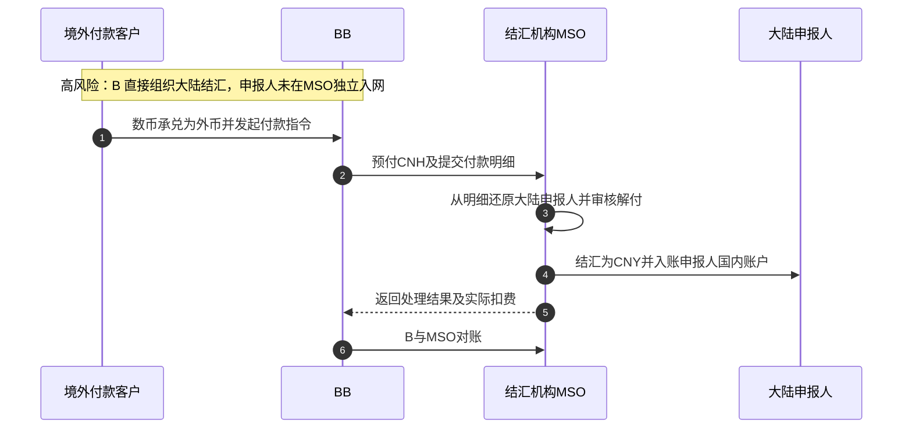
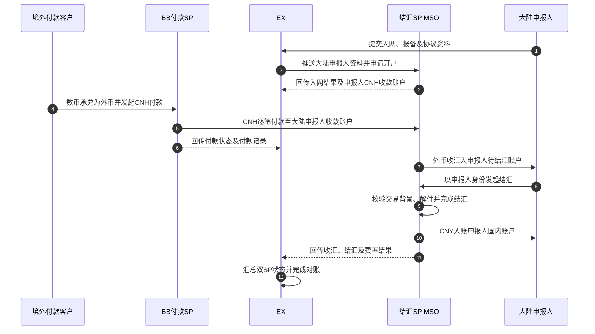
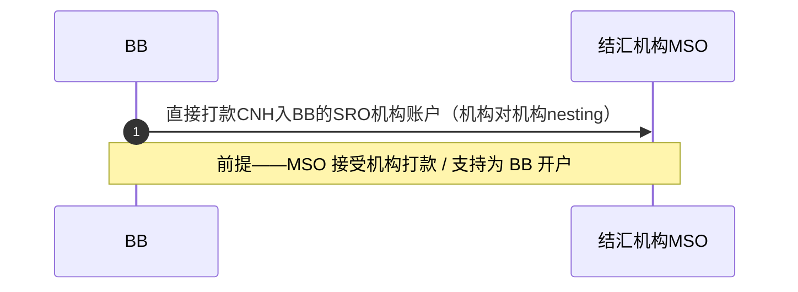
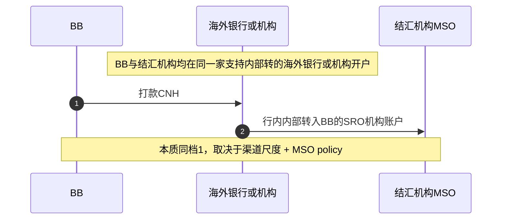
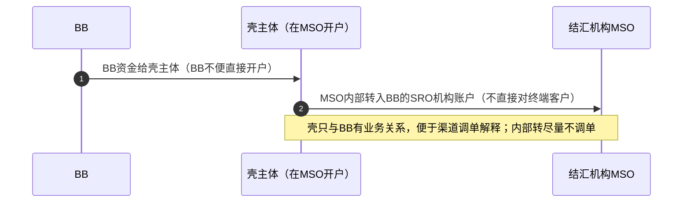
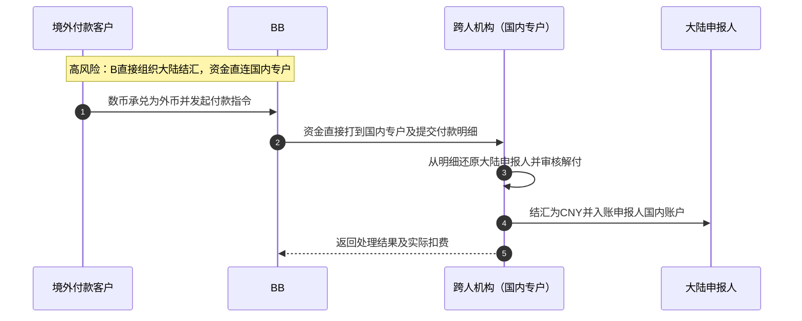
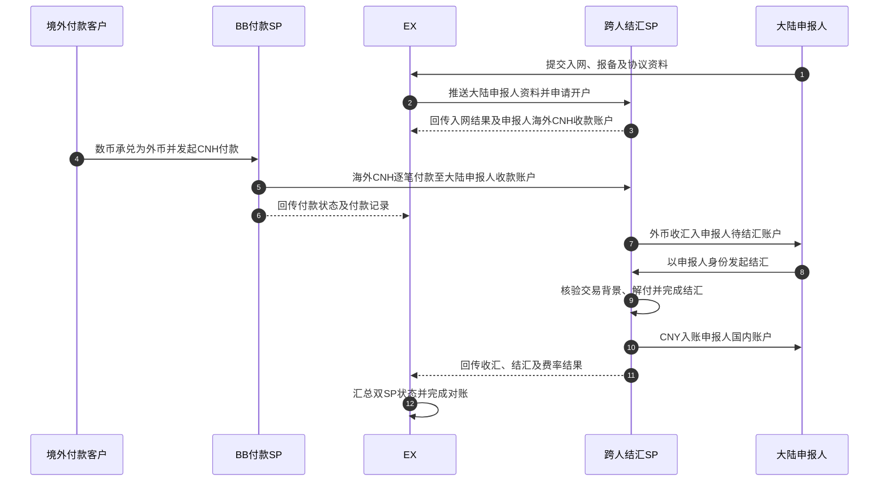
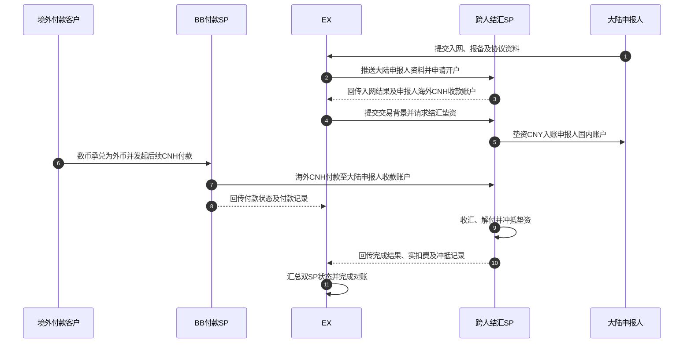

# CNY 结汇 SP 通用能力要求（泛化版）

> 日期：2026-07-20 ｜ 文档类型：能力需求 / 架构讨论
> 关联：`CNYsettlement.md`（首个结汇 SP 实例 = 鲲鹏 KUN 的完整 PRD）
> 定位：本文档**跳出单一 SP**，先给出「CNY 结汇 SP」在 EX 多 SP 架构下的**两大整体方案及其风险**，再按方案拆解各能力模块（入网 / 收汇 / 解付 / 下发 / 余额查询 / 对账 / 费率）的时序图、前置要求与非功能性要求，供后续评估 / 接入具体结汇机构（如 photonpay、legtage、xt、鲲鹏及潜在新 SP）时对照。

---

## 一、范围与前提

### 1.1 服务对象与资金方向

> **本方案服务的实际业务：香港 / 其他地区的付款客户，付款给中国大陆的收款人；中国大陆收款人同时是结汇申报人（下称「大陆申报人」），由结汇机构为其办理结汇。**
>
> **BB 不服务中国大陆客户。** BB 只服务境外付款客户，提供数币承兑及外币付款；大陆申报人不是 BB 客户，不在 BB 开户、不在 BB 操作，也不由 BB 向其下发 CNY。

| 角色                              | 地域 / 服务方                | 职责                                                                                                                                 |
| --------------------------------- | ---------------------------- | ------------------------------------------------------------------------------------------------------------------------------------ |
| **境外付款客户**            | 香港 / 其他地区；BB 服务对象 | 在 BB 持有数币或法币，完成数币承兑（如适用）及外币付款                                                                               |
| **大陆申报人 = 国内收款人** | 中国大陆；结汇机构服务对象   | 接收境外付款、完成报备与结汇，CNY 结汇入其国内账户                                                                                   |
| **结汇机构**                | MSO 或跨人                   | 为大陆申报人入网、收汇核验、解付及结汇                                                                                               |
| **BB 机构账户（SRO）**      | 海外                         | **仅纯渠道预付时适用**的 BB 本人机构资金 / 收款账户；Referral 下不需要该账户，BB 直接付款至大陆申报人在结汇机构开立的 CNH 账户 |

### 1.2 法币背景 vs 数币背景

| 背景                       | 现状       | 资金处理                                                                                                           |
| -------------------------- | ---------- | ------------------------------------------------------------------------------------------------------------------ |
| **法币背景付款客户** | SP 已具备  | 境外付款客户从其法币账户付款，结汇机构按大陆申报人的身份办理收汇、解付和结汇                                       |
| **数币背景付款客户** | 本文档重点 | 境外付款客户先在 BB 将数币承兑为外币，再向大陆申报人发起外币付款；结汇机构根据大陆申报人的报备资料核验并结汇为 CNY |

> 数币背景链路拆为两段：**① 境外付款客户在 BB 完成数币承兑及外币付款；② 大陆申报人在结汇机构侧收汇、解付及结汇。** BB 不触达大陆申报人。

### 1.3 能力模块清单

| 模块        | 一句话定义                                                |
| ----------- | --------------------------------------------------------- |
| 入网 / 报备 | 大陆申报人在结汇机构侧建立可结汇身份并签署对客协议        |
| 外币付款    | 境外付款客户在 BB 完成外币付款，资金按 rail 进入结汇链路  |
| 收汇        | 结汇机构将收汇明细匹配到大陆申报人                        |
| 解付        | 结汇机构核验外币来款及交易明细，确认可结汇额度            |
| 结汇入账    | 结汇机构将外币结汇为 CNY，并入账至大陆申报人的国内账户    |
| 余额查询    | 查询大陆申报人在结汇机构的 CNH 待结汇余额及 CNY 余额      |
| 对账        | EX 账本、BB 付款记录与结汇机构收汇 / 结汇记录的一致性核对 |
| 费率        | EX 计费结果与结汇机构实扣金额的一致性同步                 |

---

## 二、方案总览：维度、原则与术语

> 结汇链路的可行性与风险，主要由 **① 境外付款客户与大陆申报人是否明确隔离**、**② 结汇由谁对大陆申报人办理**、**③ BB 是否作为付款 SP 直接支付至申报人的 CNH 账户** 决定，而非单纯看合作哪家机构。

### 2.1 设计三原则

- **服务边界原则（最关键）**：BB **只服务香港 / 其他地区付款客户**；大陆申报人由结汇 SP 服务。境外付款客户在 BB 仅做「数币承兑（如适用）/ 外币付款 / 跨 SP 转账」，**结汇动作必须由大陆申报人在结汇 SP 侧完成**。
- **双 SP 编排原则（Referral 主线）**：BB 是付款 SP，结汇机构是结汇 SP。BB 将 CNH **直接付款至大陆申报人在结汇机构开立的 CNH 收款账户**；大陆申报人仅在结汇机构侧结汇。BB 与结汇机构**不直接系统同步**，均通过 EX 接入、编排、回传状态及对账。
- **资金效率原则（仅纯渠道预付适用）**：资金模式优先级 **机构垫资 ＞ 预付 + 垫资结合 ＞ 纯预付**；该原则仅用于纯渠道的机构间资金安排，不适用于 Referral 的客户逐笔 CNH 付款。
- **展业风险原则**：BB 直接面向大陆申报人提供结汇、或将 CNY 下发给大陆申报人，均越过 BB 服务边界。纯渠道合作仅作高风险对照方案，**不推荐且不落地**。

### 2.2 术语与角色

| 术语                               | 含义                                                                                                         |
| ---------------------------------- | ------------------------------------------------------------------------------------------------------------ |
| **境外付款客户**             | 香港 / 其他地区客户，BB 的客户；支付外币，不办理中国大陆结汇                                                 |
| **大陆申报人（国内收款人）** | 中国大陆的外币收款及结汇主体；在结汇机构入网、报备并完成结汇；本方案中与国内 CNY 收款人一致                  |
| **大陆申报人 CNH 收款账户**  | 结汇机构为大陆申报人开立的外币收款 / 待结汇账户；Referral 下 BB 的 CNH 逐笔直接付款至该账户                  |
| **BB 机构账户（SRO）**       | 仅纯渠道预付时，BB 在结汇机构或海外银行开立的机构资金 / 收款账户；**Referral 不使用该账户**            |
| **壳（贸易）主体**           | 仅纯渠道下 BB 不能直接预付时，用于承接 BB 机构资金的中间主体；不直接向大陆申报人付款                         |
| **nesting**                  | 仅纯渠道下，BB 的机构预付资金进入结汇机构或共同海外银行体系、落到 BB 机构账户（SRO）的入账动作               |
| **双 SP 编排**               | Referral 下 BB（付款 SP）与结汇机构（结汇 SP）均接入 EX；两者不直接系统同步，EX 编排订单、接收状态并完成对账 |

### 2.3 四个正交维度

| 维度                  | 取值                                              | 说明                                                                       |
| --------------------- | ------------------------------------------------- | -------------------------------------------------------------------------- |
| **① 持牌主体** | 海外 MSO（其他牌照亦可） / 跨人（国内受央行监管） | 决定合规约束；跨人是受限路径                                               |
| **② 合作模式** | 纯渠道 /**Referral（主线）**                | 纯渠道由 B 直接组织结汇（高风险）；Referral 由结汇 SP 对大陆申报人办理结汇 |
| **③ 资金模式** | Referral 逐笔付款 / 纯渠道垫资 / 预付             | Referral 无机构预付；纯渠道按资金效率择优                                  |
| **④ 入账方式** | 申报人 CNH 账户直付 / 机构预付 rail               | Referral 使用申报人 CNH 账户直付；§3.3 的机构预付 rail 仅适用于纯渠道     |

### 2.4 方案一：与 MSO 合作（MSO 本身具备结汇能力，其他牌照亦可）

| 子方案                            | 合作模式           | 境外付款客户操作                                           | 大陆申报人操作                | 资金模式                           | 风险                                                                   |
| --------------------------------- | ------------------ | ---------------------------------------------------------- | ----------------------------- | ---------------------------------- | ---------------------------------------------------------------------- |
| **一·① 纯渠道**           | 纯渠道（渠道直连） | 在 B 发起外币付款及结汇指令                                | 不在 MSO 独立入网             | B 预付 CNH                         | ⚠️**高（不推荐，保留对照）**：B 实质组织大陆结汇，服务边界不清 |
| **一·② Referral（主线）** | Referral           | 在 BB 做数币承兑（如适用），逐笔 CNH 付款至申报人 CNH 账户 | 在 MSO 入网、报备、收汇及结汇 | 无机构预付；BB 直付申报人 CNH 账户 | 低：BB 服务境外付款客户；MSO 对大陆申报人办理结汇；由 EX 编排双 SP     |

### 2.5 方案二：与跨人合作（国内、受央行监管）

| 子方案                                       | 合作模式 | 境外付款客户操作                                               | 大陆申报人操作               | 资金模式                               | 风险                                                                |
| -------------------------------------------- | -------- | -------------------------------------------------------------- | ---------------------------- | -------------------------------------- | ------------------------------------------------------------------- |
| **二·① 直连打专户**                  | 纯渠道   | 在 B 发起外币付款及结汇指令                                    | 不在跨人独立入网             | B 资金直达跨人国内专户                 | ⚠️**最高（排除）**：B 实质组织结汇且资金直连国内专户        |
| **二·② Referral + 海外结算（主线）** | Referral | 在 BB 做数币承兑（如适用），逐笔 CNH 付款至申报人海外 CNH 账户 | 在跨人入网、报备、收汇及结汇 | 无机构预付；BB 海外直付申报人 CNH 账户 | 中低：境外段与国内结汇段隔离，避开 BB 直连国内专户；由 EX 编排双 SP |

### 2.6 小结

- **主线 = Referral 双 SP**：BB 服务境外付款客户并作为付款 SP；MSO / 跨人服务大陆申报人并作为结汇 SP。纯渠道（一·① / 二·①）仅保留为风险对照。
- **Referral 资金方向**：境外付款客户 → BB（数币承兑 / 外币付款）→ **大陆申报人在结汇 SP 开立的 CNH 收款账户** → 结汇 SP 为大陆申报人收汇、解付与结汇 → **大陆申报人国内 CNY 账户**。
- **状态与对账**：BB 与结汇 SP 不直接系统同步；两者均向 EX 回传状态，EX 统一编排订单、同步状态与对账。§3.3 的 SRO / nesting rail 仅用于纯渠道的机构预付，不进入 Referral 链路。
- **跨人特殊约束**：B 不得直连跨人国内专户；须采用 **Referral + 海外开户 + 海外结算**，由跨人对大陆申报人完成国内结汇。

---

## 三、方案一（与 MSO 合作）各子方案流程

> 每个子方案单独给出端到端流程（入网 → 预付 / 收款 → 解付 → 下发 → 对账 / 费率），不再合并到一张图。

### 3.1 一·① 纯渠道（B 组织大陆结汇，⚠️高风险 · 不推荐 · 保留）

> ⚠️ **不推荐、仅保留作风险对照**：境外付款客户在 B 操作时，B 同时组织大陆申报人与结汇，服务边界不清。B 不能直接服务大陆申报人或向其下发 CNY。

**资金流**：境外付款客户 → BB（数币承兑 / 外币付款）→ MSO 机构资金池 → MSO 按明细识别大陆申报人 → MSO 结汇 CNY → 大陆申报人国内账户。

- **风险**：B 实质组织中国大陆结汇，且大陆申报人未由 MSO 独立服务；展业与合规风险最高，EX 对 B↔MSO 的定价 / 对账可见性也较弱。
- **非功能性要求**：预付余额需实时可查；大陆申报人身份、交易背景与结汇凭证必须可追溯；失败资金保留可重发。

### 3.2 一·② Referral（MSO 对大陆申报人结汇，主线推荐）

**要点**：MSO **本身具备结汇能力**（其他牌照亦可）。**大陆申报人**通过 EX API 被推送至 MSO 入网、报备并签署对客协议（非网页跳转），MSO 为其开立 CNH 收款 / 待结汇账户。BB 作为付款 SP，仅服务境外付款客户并完成数币承兑（如适用）和外币付款；**BB 将 CNH 逐笔直接付款至大陆申报人的 MSO CNH 账户**。大陆申报人作为 MSO 客户，在 MSO 侧完成收汇、解付和结汇。BB 与 MSO 不直接系统同步，均通过 EX 接入。

**资金流**：境外付款客户 → BB（数币承兑 / 外币付款）→ 大陆申报人 MSO CNH 收款账户 → MSO 收汇、解付及结汇 → 大陆申报人国内 CNY 账户。

- **账户结构**：大陆申报人仅在 MSO 开立 CNH 收款 / 待结汇账户；Referral **不要求 BB 在 MSO 开户，也不使用 BB SRO 机构账户**。
- **结汇资金终点**：CNY 由 **MSO 直接入账大陆申报人国内账户**，不经过 BB。
- **同步 / 对账**：BB 回传付款状态，MSO 回传大陆申报人维度的收汇、解付、结汇和实扣费用；**BB 与 MSO 无直接系统同步**，EX 统一编排、关联订单与对账。
- **非功能性要求**：入网 / 报备秒级返回、失败返回原因；付款、收汇、解付与结汇逐笔可追溯；CNY 入账 T+0~T+1。

### 3.3 纯渠道的机构预付：nesting 三档 rail

> **本节仅适用于一·①纯渠道的机构预付，不适用于 Referral。** Referral 下 BB 的 CNH 逐笔直接付款至大陆申报人 CNH 收款账户。以下三档讨论纯渠道下 BB 的机构预付 CNH 如何进入结汇机构、落到 **BB 机构账户（SRO）**。**优先级：档 1 → 档 2 → 档 3**。

**档 1 · 机构直接打款（优先）**：MSO 为 **BB**开 SRO 机构账户，BB 直接打款入该账户。前提 = MSO 接受机构打款 / 支持 BB 开户。

**档 2 · 同行内部转账**：BB 与结汇机构在**同一家支持内部转的海外银行 / 机构**开户，走行内内部转账入 BB 的 SRO 机构账户。本质同档 1，取决于该渠道尺度 + MSO policy；用支持内部转的渠道可提高周转、降低预付 / 垫资占用。

**档 3 · 壳主体转(待定)**：BB **不能/不便在 MSO 直接开户**时，改由**壳主体**在 MSO 开户，BB 资金经壳主体内部转入 **BB 在 MSO 的 SRO 机构账户**（**不直接对终端客户**——壳主体与客户无关系，渠道调单难解释；壳↔BB 有业务关系可解释）。需 MSO 支持内部转，且**内部转尽量不调单**。

- **对比**：档 1 / 档 2 本质相同（直接 / 同行内部转），差异在渠道与 MSO 的政策尺度；档 3 通过壳主体规避 BB 直连开户，但依赖 MSO 内部转能力与"不调单"支持。**三档仅解决纯渠道的机构资金 nesting，资金终点统一为 BB 机构账户（SRO）**；不进入 Referral 链路。
- **非功能性要求**：三档均需机构资金入账可逐笔追溯并回传 EX；档 3 下壳主体 → BB 机构账户的内部转须与付款明细可对应。

---

## 四、方案二（与跨境人民币机构「跨人」合作）各子方案流程

> 跨人在国内受央行监管，**直连打款到国内专户最差**（二·①，排除）。可行路径只有 **二·② Referral + 海外开户 + 海外结算**；BB 逐笔付款至大陆申报人在跨人开立的**海外 CNH 收款账户**，不复用 §3.3 的纯渠道 nesting rail。跨境专户通常仅服务**中国大陆申报人**，而非 BB 的境外付款客户。

### 4.1 二·① 直连打专户（B 组织大陆结汇，⚠️最高风险 · 排除）

> ⚠️ **排除**：B 直接组织大陆结汇，资金直连跨人**国内专户**（受央行监管）；大陆申报人亦未由跨人独立服务。仅作对照，不作为落地方案。

**资金流**：境外付款客户 → BB（数币承兑 / 外币付款）→ 跨人国内专户 → 跨人按明细识别大陆申报人 → 跨人结汇 CNY → 大陆申报人国内账户。

- **风险**：B 直接组织结汇 + 国内专户直连、受央行监管，B 与跨人风险都最大；EX 无定价 / 对账可见性。

### 4.2 二·② Referral + 海外开户 + 海外结算（跨人对大陆申报人结汇，主线）

**要点**：BB 与跨人均在**海外银行 / 机构**开户，BB 的付款经**海外结算**避免直连跨人国内专户。**大陆申报人**通过 EX API 推送至跨人入网、报备并签署对客协议（非网页跳转），跨人为其开立海外 CNH 收款 / 待结汇账户；境外付款客户在 BB 仅做数币承兑（如适用）及外币付款。BB 作为付款 SP，逐笔直接付款至该账户；跨人作为结汇 SP，以大陆申报人身份完成收汇、解付和国内结汇。两者仅通过 EX 编排和回传状态。

**资金流**：境外付款客户 → BB（数币承兑 / 外币付款）→ 大陆申报人跨人海外 CNH 收款账户 → 跨人收汇、解付及结汇 → 大陆申报人国内 CNY 账户。

- **核心约束**：**必须海外开户 + 海外结算**，避免 BB 资金直连国内专户；不复用 §3.3 的纯渠道 rail。
- **结汇资金终点**：CNY 由 **跨人直接入账大陆申报人国内账户**，不经过 BB。
- **同步 / 对账**：BB 回传付款状态，跨人回传大陆申报人维度的收汇、解付、结汇和实扣费用；**BB 与跨人无直接系统同步**，EX 统一编排、关联订单与对账。
- **非功能性要求**：入网秒级；付款、收汇、解付、结汇及海外结算逐笔可追溯并回传 EX；CNY 入账 T+0~T+1。

#### 4.2.1 资金模式变体：跨人垫资（优先）

**要点**：跨人基于大陆申报人的授信，在完成入网、交易背景审核和结汇条件确认后，先将 CNY 入账**大陆申报人国内账户**；境外付款客户后续在 BB 发起 CNH 付款，BB 逐笔付款至大陆申报人的跨人海外 CNH 收款账户，跨人完成收汇解付后冲抵垫资。垫资只改变跨人对大陆申报人的放款与实际收汇的时点，不改变双 SP 边界。

**资金流**：跨人垫资 → 大陆申报人国内 CNY 账户；随后境外付款客户 → BB → 大陆申报人跨人海外 CNH 收款账户 → 跨人收汇解付 → 冲抵垫资。

- **风险 / 成本**：垫资由跨人承担，需评估大陆申报人授信额度、垫资利息与回收；**垫资利息 / 资金成本是否计入对客费额待确认**。
- **非功能性要求**：垫资额度实时可查；垫资、后续收汇和冲抵关系须逐笔可追溯。

---

## 五、待确认事项

- [ ] **鲲鹏（KUN）的具体资金流**待调研补充，归入方案一 / 二某子方案的参考案例。
- [ ] **121010（出口退税）**申报逻辑需单独立项讨论，本文档不覆盖。
- [ ] **纯渠道模式（一·① / 二·①）"B 直接做结汇业务"的展业风险**需法务出具意见，明确 B 与机构双方的责任边界（数币业务敏感）。
- [ ] **跨人垫资（4.2.1）**的授信额度、垫资利息 / 资金成本归属、垫资回收机制待确认。
- [ ] 纯渠道模式下 EX 是否能获取 B-机构之间的对账 / 费率数据，需明确接口开放范围。
- [ ] **BB 机构账户（SRO）**的落地：BB 可在哪些 MSO / 海外银行开户，是 nesting 档 1 能否成立的前提。
- [ ] **入账 rail 三档的可行性**：档 1（MSO 是否为 BB 开户 / 接受机构打款）、档 2（可用的同行海外银行 / 机构 + 尺度）、档 3（壳主体合规资质 + MSO 是否支持"内部转不调单"、壳 → BB 机构账户的记账与调单解释）需逐项与 MSO / 银行确认。
- [ ] **客户操作原则的落地**：如何将**境外付款客户**在 BB 的动作限定为"数币承兑（如适用）/ 外币付款 / 跨 SP 转账"而非结汇；大陆申报人须在结汇 SP 侧完成结汇，前端与协议如何界定待确认。
- [ ] **跨人海外结算路径**：跨人在海外可用的银行 / 机构、海外结算与国内结汇的衔接合规性待确认。
- [ ] 各方案下"解付与收汇解耦"的接口设计（是否支持异步上传明细）待逐机构 API 确认。
- [ ] 费率同步的接口字段与重试 / 幂等机制待补充（可参考 `CNYsettlement.md` UC-09 的对客费额同步设计）。
- [ ] 跨境专户仅服务**大陆申报人**的限制，以及其对境外付款客户 → 大陆申报人业务范围的影响待评估。
