# 结汇 SP 解决方案（Settlement SP · 鲲鹏）

> 日期：2026-06-21（2026-07-01 重排版 + 申报人报备）｜ 文档类型：方案 / PRD
> 关联：`ex-three-layer-solution.md`（EX 四层架构）、`settlement-API-solution/acquiring-pf-settlement-solution.md`
> 定位：本文档描述 **EX 多 SP 架构下「结汇 SP」** 的背景、架构、需求、能力、对接、业务流程与产品用例。首个结汇 SP 实例 = **鲲鹏（KUN）**。

---

## 一、多 SP 背景

- **EX 定位：不碰钱**。EX 是账本 / 路由 / 编排 + 渠道聚合层，资金始终落在背后的 SP / PSP，由持牌方承担资金与合规责任。
- 因此 EX 上的每一种「资金能力」（收款、付款、换汇、承兑、结汇……）都对应**一个或多个背后 SP**来实际提供资金服务；EX 只做能力编排与账本镜像。
- **多 SP** = 同一类能力可由多个 SP 提供，EX 按租户配置 / 路由规则选择由哪个 SP 落地，不绑死单一 SP。
- 结汇（CNH/CNY 结汇）是其中一类资金能力，由「结汇 SP」提供，本文以 **鲲鹏（KUN）** 为首个结汇 SP。

---

## 二、多 SP 架构

> 关键区分：**有资金中心（BB）** 的链路 vs **无资金中心** 的链路。

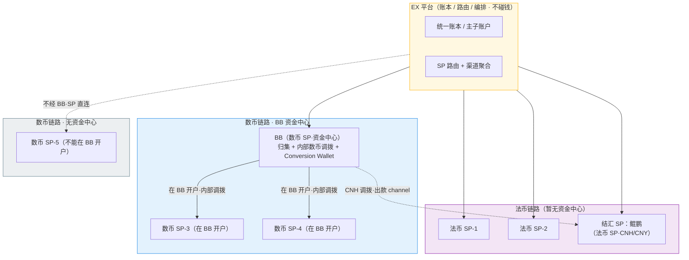

| 链路类型                          | 资金中心      | 说明                                                                                                                                                          |
| --------------------------------- | ------------- | ------------------------------------------------------------------------------------------------------------------------------------------------------------- |
| **数币链路（BB 资金中心）** | **BB**  | 多个数币 SP（如 SP3、SP4）都在 BB 开户，资金在 BB 内部做数币调拨 / 归集；这些 SP 同时作为 BB 的 channel（出款渠道）                                           |
| **法币链路**                | 暂无资金中心  | 法币（VND/USD/CNH/CNY 等）由多 SP 各自处理，目前没有统一资金中心，EX 仅做账本与路由聚合；结汇 SP（鲲鹏）属于法币 SP（CNH/CNY），由 BB 付款渠道把 CNH 调拨落地 |
| **数币链路（无资金中心）**  | 无（SP 直连） | 个别数币 SP（如 SP5）不能在 BB 开户 / BB 不能服务的场景 → 不走 BB 资金中心，由该 SP 单独承接                                                                 |

- **数币 + BB 资金中心**：多个数币 SP（SP3、SP4 …）都在 BB 开户，资金在 BB 内部做数币调拨 / 归集；SP 同时作为 BB 的出款 channel；换汇通过 BB 的 Conversion Wallet 完成。
- **法币多 SP**：各 SP 自行处理资金，EX 不设资金中心，仅做账本 / 路由；结汇 SP 鲲鹏属于法币 SP（CNH/CNY），由 BB 付款渠道把 CNH 调拨落地。
- **数币 + 无资金中心**：个别数币 SP（SP5）不能在 BB 开户 / BB 不能服务的场景，直连该 SP，不经 BB。

---

## 三、结汇 SP 需求背景

- **客户画像**人民币结汇需求（把外币结汇成 CNH/CNY 落地给国内收款人）。
- **租户侧**：部分租户自己已有合作的结汇通道，因此不一定要用 EX 现成的法币结汇 —— 结汇能力需可按租户 / 商户**按需开通**，而非默认全开。
- **结论**：结汇 SP（鲲鹏）作为 EX 上的一种**可选结汇能力**，由租户决定是否签约、由商户按需开通。

---

## 四、结汇 SP — 鲲鹏（KUN）的能力

| 能力                      | 说明                                                                  |
| ------------------------- | --------------------------------------------------------------------- |
| **跨境人民币**      | 提供跨境人民币结汇能力                                                |
| **仅接受 CNH**      | 只能接受 CNH（离岸人民币）入金，不接受 CNY 直接入金                   |
| **收款方类型**      | 可对个人账，也可对企业账（结汇收款人可为个人 / 企业）                 |
| **明细 + 资金同推** | 订单明细与资金同时推送（资金到账与明细绑定推送，便于核验入账）        |
| **POBO 代付**       | 支持 POBO（Payment On Behalf Of）：商户信息提供给鲲鹏，由鲲鹏代为付款 |

---

## 五、结汇 SP — 鲲鹏的对接

接口清单待补充（TBD），以下为按业务流程推导的对接点，待与鲲鹏确认具体接口字段 / 鉴权 / 回调。

> ⚠️ 待鲲鹏提供 API 文档后，补充：鉴权方式、字段定义、限额、币种、回调重试 / 幂等、对账接口、**境内客户信息报备（申报人）接口**。

---

## 六、结汇业务流程

> 大前提：EX 将租户作为 SP 签约（EX 与租户先建立 SP 级签约关系），租户才能在其下开通结汇并对接鲲鹏。该签约对应的 SP 协议见 §八待办（SP 协议）。

1. **租户签约**：租户签订鲲鹏作为结汇渠道。
2. **商户开通（默认不开，需手动）**：租户给客户开通付款产品-结汇配置并配置 SP=鲲鹏；开通时把客户推送鲲鹏做直客入网，鲲鹏返回入网成功后，EX 直接给商户开通鲲鹏的 CNH 账户。
3. **数币充值**：商户在 BB 做数币充值，到账后 OffRamp 到 BB 的 USD 钱包。
4. **换汇**：客户在 BB（界面看到的是 Conversion Wallet）做 USD→CNH 换汇。
5. **跨 SP 转账（调拨）至鲲鹏 CNH**：客户把 BB 的 CNH 调拨到鲲鹏的 CNH。
   - **首次转账到鲲鹏 CNH 账户时**：需先**填写申报人信息**（根据中国大陆监管要求，结汇需补充申报人信息），并签署**结汇机构对客协议**，报备成功后方可调拨（详见 UC-13）。
6. **资金落地 + 到账通知**：背后资金从 BB 的付款渠道 → 鲲鹏；鲲鹏收到 CNH 后给 EX 发到账通知。
7. **上传明细**：客户上传订单明细。
8. **审核入账**：鲲鹏审核入账并给出入账结果。
9. **生成结汇额度**：根据审核通过的订单明细生成结汇额度（额度与明细金额挂钩，作为可结汇上限）。
10. **发起结汇**：客户在结汇额度内发起结汇；CNY 收款人可提前在 EX 配置（开了结汇功能），也可结汇前新增；CNY 收款人不同步给 BB，只同步给鲲鹏。

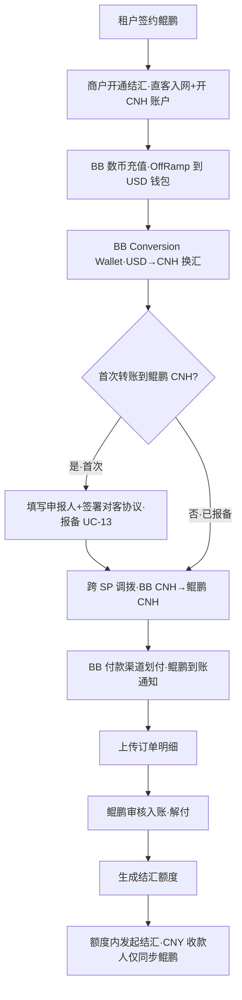

---

## 七、结汇 SP — 产品 Case

> 统一 PRD 用例格式：用例信息表（编号 / 角色 / 前置 / 触发）· 主流程 · 异常 / 备选流程 · 业务规则（BR）· 数据字段 · 状态流转 · 交互要求 · 验收标准（AC）· 流程图。
> 用例编号：UC-01 ~ UC-13；每个用例的流程用流程图（flowchart）表示。

### Case 1：租户签约（UC-01）

| 项       | 内容                                                                                                                           |
| -------- | ------------------------------------------------------------------------------------------------------------------------------ |
| 用例编号 | UC-01                                                                                                                          |
| 参与角色 | 租户（操作）、EX（系统）、鲲鹏（结汇 SP）                                                                                      |
| 前置条件 | ① 租户已入驻 EX 且状态正常；② 鲲鹏已在 EX 完成 SP 级接入（机构级协议 + 联调通过）；③ 已具备「结汇渠道签约」配置项与协议模板 |
| 触发条件 | 租户在后台点击「签约鲲鹏作为结汇渠道」                                                                                         |

**主流程（主成功场景）**

1. 租户进入「结汇渠道签约」页，查看鲲鹏渠道协议（费率、能力）。
2. 租户签约鲲鹏的结汇能力（费率、能力）。
3. EX 校验租户状态正常、鲲鹏 SP 接入状态有效。
4. （如需）EX 向鲲鹏登记租户级渠道关系并获确认。
5. EX 记录 租户-鲲鹏 渠道关系，置 已签约，记录签约时间、协议版本。
6. EX 返回签约成功；该租户下商户开通配置中 SP=鲲鹏 变为可选。

**异常 / 备选流程**

- A1 租户状态异常 / 鲲鹏 SP 接入状态异常：第 3 步校验失败，拒绝并提示原因，保持 未签约。
- A2 鲲鹏登记失败 / 超时：置 签约中，支持重试；超过重试上限置失败。
- A3 重复签约：幂等返回 已签约，不重复建关系。
- A4 协议未确认 / 中途退出：不落库，保持 未签约。

**业务规则**

- BR1（正向）签约成功是该租户下商户可开通结汇的唯一前提。
- BR2（正向）协议版本与费率随签约快照留存，后续变更需重新确认。
- BR3（反向）未签约 / 失效租户：商户开通时不展示鲲鹏 SP 选项。
- BR4（反向）签约幂等；重复提交不产生多条关系。

**数据 / 字段要求**

| 字段         | 说明             | 必填 |
| ------------ | ---------------- | ---- |
| tenantId     | 租户 ID          | 是   |
| spCode       | SP 标识（=鲲鹏） | 是   |
| protocolVer  | 签约协议版本     | 是   |
| feeConfigRef | 关联费率配置     | 否   |
| signStatus   | 签约状态         | 是   |
| signTime     | 签约时间         | 是   |

**状态流转**：未签约 →（提交）签约中 →（成功）已签约 →（终止 / 到期）失效

**交互要求**：租户后台展示「结汇渠道签约」入口、协议详情、签约状态（未签约 / 签约中 / 已签约 / 失效）、重试入口。

**验收标准**

- AC1 签约成功后，该租户商户开通配置可选 SP=鲲鹏。
- AC2 未签约 / 失效租户不可选鲲鹏。
- AC3 重复签约幂等，仅一条有效关系。
- AC4 校验失败有明确原因提示且状态不变。

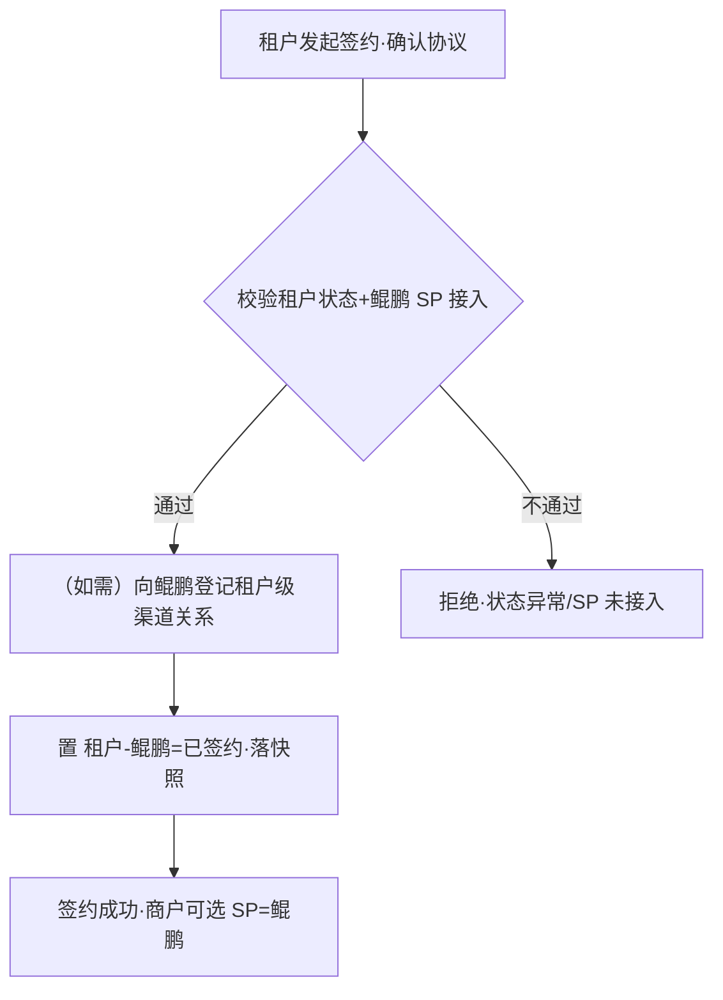

### Case 2：商户—功能开通 / 关闭（UC-02）

| 项       | 内容                                                                            |
| -------- | ------------------------------------------------------------------------------- |
| 用例编号 | UC-02                                                                           |
| 参与角色 | 租户（操作）、EX（系统）、鲲鹏（直客入网 + 开户）                               |
| 前置条件 | ① 租户已签约鲲鹏（UC-01）；② 商户已存在于该租户下；③ 具备客户 KYB / 入网资料 |
| 触发条件 | 租户为商户开通「付款产品-结汇配置」并配 SP=鲲鹏；或发起关闭                     |

**主流程（开通·主成功场景）**

1. 租户为商户开通「付款产品-结汇配置」，选择 SP=鲲鹏。
2. EX 校验商户 KYB / 入网资料完整性。
3. 推送鲲鹏做直客入网：若鲲鹏需要补充额外入网信息，则要求客户补充齐全后再推送；若不需要则直接推送。
4. 鲲鹏返回入网成功。
5. EX 直接为商户开通 CNH 账户（无需再送鲲鹏做开通）。
6. EX 置结汇配置 已开通，商户可发起结汇。

**异常 / 备选流程**

- A1 资料不全：第 2 步前置校验拦截，不推送鲲鹏。
- A2 入网失败 / 超时 / 未返回成功：置 入网失败，不开通 CNH 账户，支持重试。
- A3 开户失败：置 开户失败，可重试。
- A4 关闭功能：置 已关闭，新结汇和跨 SP 转账单被拒；存量在途订单不中断。
- A5 重复开通：幂等返回当前状态。

**业务规则**

- BR1（正向）结汇能力默认不开通，须租户手动逐商户开通。
- BR2（正向）开通链路必须「先入网成功 → 由 EX 直接开 CNH 账户（不再送鲲鹏开通）」，顺序不可逆。
- BR3（反向）入网未成功不得开户。
- BR4（反向）关闭后仅拒绝新单；在途调拨 / 结汇按既有状态走完。
- BR5（反向）开通 / 关闭幂等。
- BR6（正向）直客入网推送前，若鲲鹏要求补充额外入网信息，须客户补全后才推送；不需要则直接推送。

**数据 / 字段要求**

| 字段          | 说明            | 必填 |
| ------------- | --------------- | ---- |
| merchantId    | 商户 ID         | 是   |
| tenantId      | 所属租户        | 是   |
| kybRef        | KYB 资料引用    | 是   |
| spCode        | =鲲鹏           | 是   |
| onboardStatus | 入网状态        | 是   |
| cnhAcctNo     | 鲲鹏 CNH 账户号 | 否   |
| settleStatus  | 结汇配置状态    | 是   |

**状态流转**：未开通 →（提交）入网中 →（入网成功）开户中 →（开户成功）已开通 →（关闭）已关闭；异常分支：入网失败 / 开户失败

**交互要求**：开通为手动操作；展示入网中 / 入网成功 / 入网失败 / 开户中 / 已开通 / 已关闭状态；提供重试与关闭入口。

**验收标准**

- AC1 入网成功后商户获 CNH 账户且可发起结汇。
- AC2 入网 / 开户失败有明确状态与重试入口，不开账户。
- AC3 关闭后新单被拒、存量不中断。
- AC4 开通 / 关闭幂等。

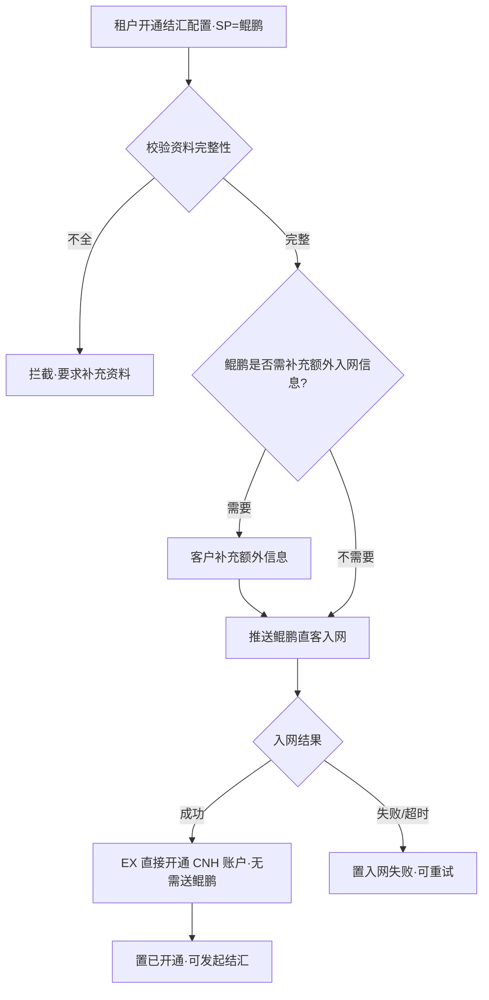

### Case 3：商户账户（UC-03）

| 项       | 内容                                                   |
| -------- | ------------------------------------------------------ |
| 用例编号 | UC-03                                                  |
| 参与角色 | 商户（查询）、EX（镜像账户 + 对账）、鲲鹏（CNH 账户）  |
| 前置条件 | 商户已通过鲲鹏直客入网并开通 CNH 账户（UC-02）         |
| 触发条件 | 鲲鹏推送账户事件（到账 / 扣款 / 退回）；或商户查询账户 |

**主流程（主成功场景）**

1. 鲲鹏推送账户事件（到账 / 扣款 / 退回）到 EX。
2. EX 记账并更新该商户 CNH 账户余额镜像，生成流水。
3. EX 定时 / 逐笔与鲲鹏对账。
4. 对账一致：商户可查询余额、流水、入账明细。

**异常 / 备选流程**

- A1 商户未入网 / 已关闭：无 CNH 账户，相关操作拒绝。
- A2 账户冻结 / 风控锁定：仅可查询，不可调拨 / 结汇。
- A3 EX 镜像与鲲鹏不一致：触发对账告警，挂起争议金额，转人工核对。
- A4 重复事件：按事件流水号幂等，不重复记账。

**业务规则**

- BR1（正向）EX 账本为鲲鹏账户的镜像，以鲲鹏为资金真实源、EX 为账务编排。
- BR2（正向）每笔资金动作均生成可追溯流水。
- BR3（反向）冻结态账户操作受限。
- BR4（反向）账户事件按流水号幂等去重。

**数据 / 字段要求**

| 字段       | 说明                 | 必填 |
| ---------- | -------------------- | ---- |
| cnhAcctNo  | CNH 账户号           | 是   |
| balance    | 余额                 | 是   |
| acctStatus | 正常 / 冻结          | 是   |
| txnId      | 事件流水号（幂等键） | 是   |
| txnType    | 到账 / 扣款 / 退回   | 是   |

**状态流转**：账户：正常 ⇄ 冻结；事件：待记账 →（记账）已入账 →（对账）已对平 / 争议挂起

**交互要求**：商户可查看 CNH 账户余额、流水、入账明细及账户状态（正常 / 冻结）。

**验收标准**

- AC1 账户余额 / 流水准确，与鲲鹏对账一致。
- AC2 冻结态操作受限、仅可查询。
- AC3 重复事件不重复记账（幂等）。
- AC4 不一致时有告警与争议挂起。

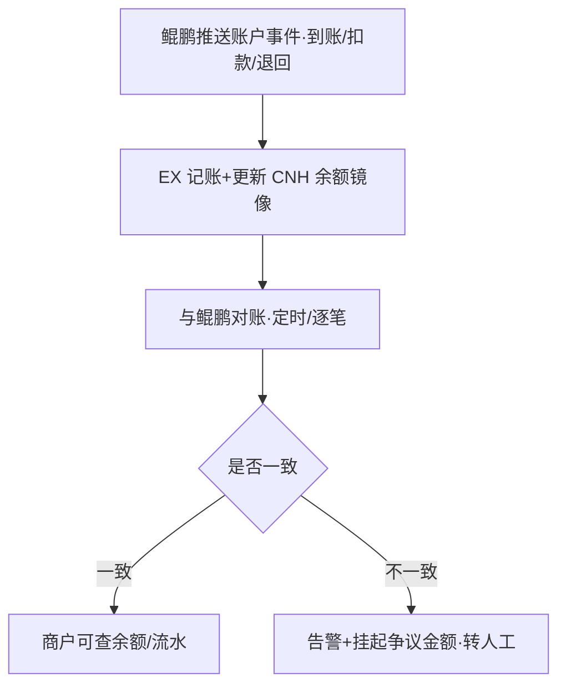

### Case 4：换汇（USD→CNH）（UC-04）

| 项       | 内容                                                                                  |
| -------- | ------------------------------------------------------------------------------------- |
| 用例编号 | UC-04                                                                                 |
| 参与角色 | 客户（操作）、BB Conversion Wallet（换汇执行）、EX（报价 / 账本）                     |
| 前置条件 | ① 商户 BB 已有 USD 余额（数币充值后 OffRamp 而来）；② 已配置 USD→CNH 汇率（UC-08） |
| 触发条件 | 客户在 BB Conversion Wallet 选择 USD→CNH 并提交                                      |

**主流程（主成功场景）**

1. 客户在 BB Conversion Wallet 选择 USD→CNH，输入金额。
2. BB 向 EX 取实时汇率（含加点），返回报价与有效期。
3. 客户在汇率有效期内确认。
4. BB 校验余额、汇率有效性、限额。
5. BB 扣 USD、加 CNH，生成换汇流水；EX 同步账本镜像。

**异常 / 备选流程**

- A1 USD 余额不足：拒绝，不扣款。
- A2 汇率过期 / 缺失：需重新报价，不成交。
- A3 超单笔 / 单日限额：拒绝并提示。

**业务规则**

- BR1（正向）按生效汇率快照成交，成交后落该笔快照。
- BR2（正向）换汇为 BB 内 Conversion Wallet 行为，CNH 入 BB CNH 余额。
- BR3（反向）余额不足 / 汇率过期 / 超限均不成交、不扣款。

**数据 / 字段要求**

| 字段       | 说明         | 必填 |
| ---------- | ------------ | ---- |
| merchantId | 商户 ID      | 是   |
| fromCcy    | USD          | 是   |
| toCcy      | CNH          | 是   |
| amount     | 换汇金额     | 是   |
| rateSnap   | 成交汇率快照 | 是   |
| feeAmount  | 手续费       | 否   |

**状态流转**：处理中 → 成功 / 失败

**交互要求**：本期可以接受实时汇率（1 分钟刷新）与刷新倒计时、换汇金额、预计到账 CNH。（可参考 a 的交互）

**验收标准**

- AC1 BB 的 USD/CNH 余额变动正确，账本一致。
- AC2 余额不足不扣款。

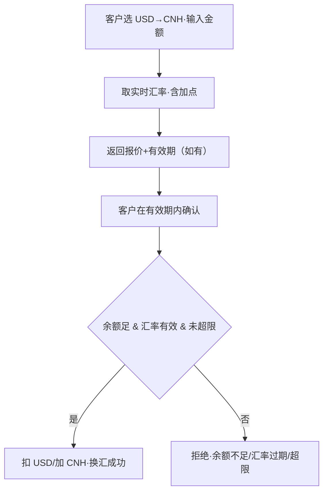

> 待办：[ ] BB 的换汇路径（USD→CNH 在 BB 内如何成交 / 落地）待资金确认。

### Case 5：鲲鹏收汇流程（BB → 鲲鹏收款 / 跨 SP 转账）（UC-05）

| 项       | 内容                                                                                                                                         |
| -------- | -------------------------------------------------------------------------------------------------------------------------------------------- |
| 用例编号 | UC-05                                                                                                                                        |
| 参与角色 | 客户（发起）、EX（编排 / 账本）、BB（付款渠道）、鲲鹏（收汇 SP）                                                                             |
| 前置条件 | ① 商户在 BB 有 CNH 余额；② 已开通鲲鹏 CNH 账户；③**若为首次转账到鲲鹏 CNH 账户：须先完成申报人报备并签署结汇机构对客协议（UC-13）** |
| 触发条件 | 客户发起把 BB 的 CNH 付给鲲鹏（鲲鹏收款 / 收汇）                                                                                             |

> 说明：此处为直客行为（鲲鹏直客收汇），非 BB 行为，因此不存在「备款」一说。

**主流程（主成功场景）**

1. 客户发起 CNH 调拨（BB→鲲鹏收款）。
2. **首次校验**：若客户首次转账到鲲鹏 CNH 账户，先要求填写申报人信息 + 签署结汇机构对客协议并报备成功（UC-13）；已报备则跳过。
3. EX 校验 BB 的 CNH 余额并锁定。
4. 资金经 BB 付款渠道 → 鲲鹏划付。
5. 鲲鹏收汇到账后给 EX 发到账通知。
6. EX 更新两侧账本（BB CNH 减、鲲鹏 CNH 增），幂等记账。

**异常 / 备选流程**

- A1 CNH 余额不足 / 鲲鹏账户异常或冻结：拒绝。
- A2 调拨在途失败：重试；最终失败 → 解锁 / 退回 BB CNH。
- A3 到账通知超时：置 处理中，对账补偿，不重复记账（幂等）。
- A4 鲲鹏调单（收汇需补充单据）：鲲鹏对该笔收汇要求调单 →
  - 若为订单明细：进入「上传订单明细 / 解付」（UC-06）直接上传订单明细；
  - 若为其他资料：线下提供给鲲鹏。
- A5 **申报人未报备 / 报备中 / 报备失败**：首次转账被拦截，引导至 UC-13 完成 / 重试报备后再发起。

**业务规则**

- BR1（正向）背后资金走 BB 付款渠道至鲲鹏，以鲲鹏到账通知为记账依据。
- BR2（正向）记账幂等，按调拨单号去重。
- BR3（反向）失败资金退回 BB CNH，不丢不重。
- BR4（约束）本流程为直客行为（鲲鹏直客），非 BB 行为，不涉及备款。
- BR5（正向）鲲鹏调单时：订单明细走 UC-06 上传；其他资料线下提供。
- BR6（正向）**首次转账到鲲鹏 CNH 账户前，申报人须报备成功**（UC-13）；后续转账不再重复填写（可在申报人模块变更后重新报备）。

**数据 / 字段要求**

| 字段        | 说明                        | 必填 |
| ----------- | --------------------------- | ---- |
| transferId  | 收汇 / 调拨单号（幂等键）   | 是   |
| merchantId  | 商户 ID                     | 是   |
| amount      | CNH 金额                    | 是   |
| fromAcct    | BB CNH                      | 是   |
| toAcct      | 鲲鹏 CNH                    | 是   |
| status      | 收汇状态                    | 是   |
| declarantId | 关联申报人（首次报备生成）  | 是   |
| docRequired | 鲲鹏是否调单                | 否   |
| docType     | 调单类型（订单明细 / 其他） | 否   |

**状态流转**：处理中 →（到账）已到账 / 失败 →（退回）已退回；（如调单）待补单据

**交互要求**：展示收汇金额、来源（BB）/ 目标（鲲鹏）、状态（处理中 / 到账 / 失败 / 退回）；首次转账引导申报人报备（UC-13）；如鲲鹏调单，提示补单据（订单明细上传 / 其他资料线下提供）。

**验收标准**

- AC1 到账通知后鲲鹏 CNH 增、BB CNH 减、金额一致。
- AC2 失败可退回 BB CNH。
- AC3 记账幂等不重复。
- AC4 鲲鹏调单时正确区分订单明细（走 UC-06 上传）与其他资料（线下提供）。
- AC5 首次转账未报备申报人时被拦截，报备成功后可正常发起。

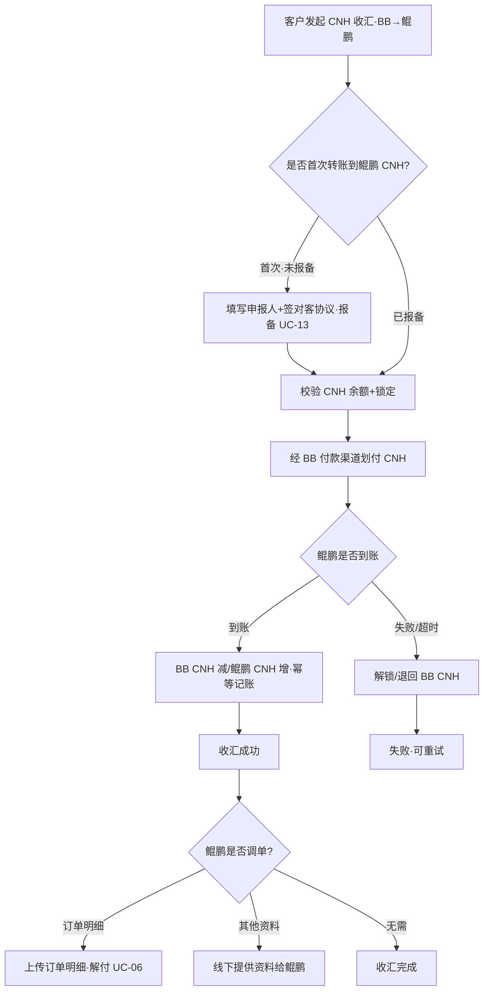

> 待办：[ ] BB 的付款渠道确认，需要时以 mtc 等不展示 BB 名称的方式呈现。

### Case 6：上传订单明细 / 解付（UC-06）

> 对鲲鹏而言称为**解付**：收汇与订单明细匹配后完成解付，资金可用于结汇下发。

| 项       | 内容                                                    |
| -------- | ------------------------------------------------------- |
| 用例编号 | UC-06                                                   |
| 参与角色 | 客户（上传）、EX（编排 / 额度）、鲲鹏（审核 / 解付）    |
| 前置条件 | ① 鲲鹏收汇已到账（UC-05）；② 鲲鹏要求订单明细（调单） |
| 触发条件 | 客户上传订单明细                                        |

> 说明：本流程为直客行为，不涉及备款。其他资料类调单不走本 Case，线下提供（见 UC-05）。

**主流程（主成功场景）**

1. 客户上传订单明细。
2. 鲲鹏审核入账，将收汇与订单明细匹配。
3. 匹配成功 → 解付（鲲鹏侧）；EX 据审核通过的订单明细生成结汇额度（作为可结汇上限）。
4. 解付完成，资金可用于结汇下发（UC-07）。

**异常 / 备选流程**

- A1 明细未过审 / 不匹配：驳回，转人工或要求重新上传。
- A2 部分匹配：按鲲鹏回执处理，未匹配部分保留待补。
- A3 其他资料类调单：不走本 Case，线下提供（见 UC-05）。

**业务规则**

- BR1（正向）解付以「收汇与订单明细匹配」为准。
- BR2（正向）审核通过后据明细生成结汇额度（可结汇上限）。
- BR3（约束）本流程为直客行为，不涉及备款。

**数据 / 字段要求**

| 字段           | 说明            | 必填 |
| -------------- | --------------- | ---- |
| detailId       | 明细 / 解付单号 | 是   |
| merchantId     | 商户 ID         | 是   |
| transferId     | 关联收汇单号    | 是   |
| orderDetailRef | 订单明细引用    | 是   |
| auditStatus    | 入账审核状态    | 是   |
| settleQuota    | 生成的结汇额度  | 是   |

**状态流转**：待上传明细 →（上传）审核中 →（匹配通过 / 解付）已解付·生成额度 / 驳回

**交互要求**：上传订单明细；展示审核 / 解付状态与生成的结汇额度。

**验收标准**

- AC1 收汇与明细匹配后完成解付并生成结汇额度。
- AC2 不匹配 / 驳回有明确状态与重传入口。
- AC3 解付额度与明细金额一致。

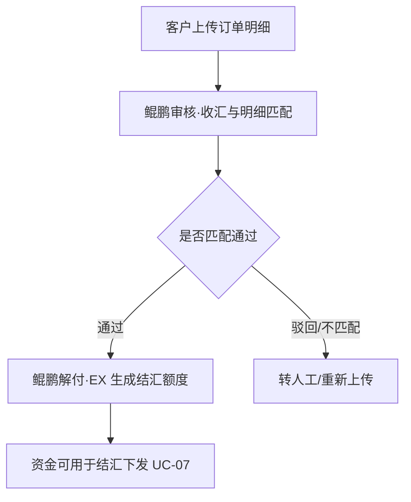

### Case 7：下发流程（UC-07）

| 项       | 内容                                                             |
| -------- | ---------------------------------------------------------------- |
| 用例编号 | UC-07                                                            |
| 参与角色 | 客户（发起）、EX（编排 / 账本）、鲲鹏（结汇 / 付款）、CNY 收款人 |
| 前置条件 | ① 已解付并生成结汇额度（UC-06）；② 已配置 CNY 收款人（UC-11）  |
| 触发条件 | 客户在结汇额度内发起结汇下发                                     |

> 说明：本流程为直客行为，不涉及备款。

**主流程（主成功场景）**

1. 客户在结汇额度内发起结汇，指定 CNY 收款人（个人 / 企业）。
2. EX 下发结汇指令（CNY 收款人仅同步鲲鹏）。
3. 鲲鹏将 CNH 结汇为 CNY，向收款人付款（支持 POBO，商户信息已给鲲鹏）。
4. 明细与资金同推核验；EX 记录结汇结果与流水。

**异常 / 备选流程**

- A1 收款人无效 / 触发风控：不放款，转人工或退回。
- A2 部分成功 / 失败：按鲲鹏回执置状态，失败资金保留在鲲鹏 CNH 账户可重发。
- A3 结汇前新增收款人：允许，且仅同步鲲鹏。

**业务规则**

- BR1（正向）结汇下发须在解付 / 额度内进行。
- BR2（正向）支持 POBO，商户信息提供给鲲鹏由其代付。
- BR3（反向）CNY 收款人信息不同步 BB，仅同步鲲鹏。
- BR4（反向）失败资金不丢，保留在鲲鹏 CNH 账户可重发。
- BR5（约束）直客行为，不涉及备款。

**数据 / 字段要求**

| 字段         | 说明                     | 必填 |
| ------------ | ------------------------ | ---- |
| settleId     | 结汇单号                 | 是   |
| merchantId   | 商户 ID                  | 是   |
| quotaRef     | 结汇额度引用             | 是   |
| payeeId      | CNY 收款人（仅同步鲲鹏） | 是   |
| payeeType    | 个人 / 企业              | 是   |
| amountCNH    | 结汇 CNH 金额            | 是   |
| settleStatus | 结汇状态                 | 是   |

**状态流转**：待结汇 →（发起）结汇中 →（成功）已结汇 / 失败 / 驳回

**交互要求**：在额度内发起结汇；可选择或结汇前新增 CNY 收款人；展示结汇结果与收款人到账状态。

**验收标准**

- AC1 额度内发起，结汇成功、CNY 收款人到账。
- AC2 CNY 收款人仅同步鲲鹏，不落 BB。
- AC3 失败资金保留可重发，全链路可追踪可对账。

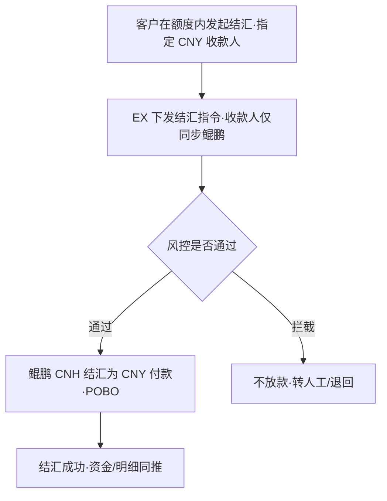

### Case 8：汇率配置（UC-08）— BB 的 USD-CNH

| 项       | 内容                                             |
| -------- | ------------------------------------------------ |
| 用例编号 | UC-08                                            |
| 参与角色 | 运营（配置）、EX（计算 / 生效）、汇率源          |
| 前置条件 | 具备汇率源 / 报价能力（USD↔CNH 等）；有配置权限 |
| 触发条件 | 运营配置汇率；或换汇 / 结汇时取价                |

**主流程（主成功场景）**

1. 运营配置汇率来源、加点（点差）、有效期 / 刷新频率，可按租户 / 商户维度。
2. EX 拉取 / 接收基准汇率，计算报价 = 基准 + 加点。
3. 在有效期且未超阈值时报价生效，可供换汇 / 结汇成交。
4. 成交时取生效汇率并落该笔成交快照。

**异常 / 备选流程**

- A1 汇率过期 / 缺失：不允许换汇。
- A2 报价偏离阈值（异常波动）：暂停成交 / 需复核。

**业务规则**

- BR1（正向）成交价以生效汇率快照为准。
- BR2（正向）支持租户 / 商户维度差异化加点。
- BR3（反向）过期 / 异常汇率不可成交。

**数据 / 字段要求**

| 字段     | 说明              | 必填 |
| -------- | ----------------- | ---- |
| rateId   | 汇率配置 ID       | 是   |
| ccyPair  | USD/CNH 等        | 是   |
| source   | 汇率来源          | 是   |
| spread   | 加点（点差）      | 是   |
| validTtl | 有效期 / 刷新频率 | 是   |
| scope    | 租户 / 商户维度   | 否   |

**状态流转**：未生效 →（配置）生效中 →（过期 / 超阈值）暂停

**交互要求**：汇率配置后台；前端展示实时汇率与刷新提示、有效期倒计时。

**验收标准**

- AC1 成交价 = 生效汇率快照。
- AC2 过期 / 异常汇率不可成交。
- AC3 维度配置生效正确。

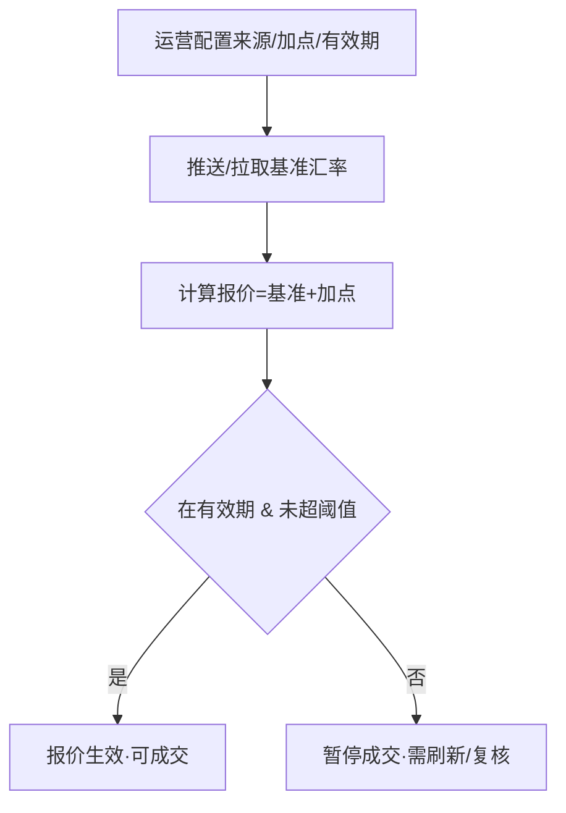

### Case 9：计费配置（UC-09）

| 项       | 内容                                                                 |
| -------- | -------------------------------------------------------------------- |
| 用例编号 | UC-09                                                                |
| 参与角色 | 运营 / SP（配置底价）、租户（配置客户费率）、EX（匹配 / 计提）、客户 |
| 前置条件 | 结汇 / 调拨等收费项已定义；有配置权限                                |
| 触发条件 | SP / 租户配置费率；或交易触发计费                                    |

**多层计费模型**

- **第一层：SP → EX 底价** —— SP（鲲鹏 / 平台）对 EX 的成本价 / 底价，作为计费下限。
- **第二层：EX → 租户 底价** —— EX 在 SP 底价之上对租户的价（含 EX 毛利），作为租户对外费率的下限。
- **第三层：租户 → 客户 对外费率** —— 租户在底价之上对**客户（商户）**设定的对外费率；对外费率不得低于上层底价（差额即租户毛利，呼应分佣 UC-10）。

**计费因子（各层均适用）**

- **收款人类型**：个人 / 企业（可设差异化费率）。
- **付款方式**：银行账户 / 钱包（本期只有银行账户）。
- **是否使用 POBO**：使用 / 不使用（可设差异化费率）。
- **计费方式**：按笔 / 按比例 / 阶梯（支持阶梯配置）。
- **可叠加维度**：租户 / 商户 / 产品 / 业务类型（换汇 / 调拨 / 结汇）。

**主流程（主成功场景）**

1. SP / 运营配置 SP→EX 底价、EX→租户 底价（含计费因子：收款人个人 / 企业、是否 POBO、按笔 / 比例 / 阶梯）。
2. 租户在底价之上配置 租户→客户 费率（同样支持上述计费因子与阶梯）；EX 校验不低于上层底价。
3. 客户发起交易（换汇 / 调拨 / 结汇）。
4. EX 按交易上下文（收款人类型、是否 POBO、金额阶梯、维度）匹配各层生效费率：以 租户→客户 费率对客户计费、以各层底价计成本。
5. 计提费用，落账单与流水，返回交易结果与费用明细。

**异常 / 备选流程**

- A1 未配置费率：走默认规则或拒绝交易（按产品定义）。
- A2 费率变更：不影响存量已成交订单，仅对生效后新单生效。
- A3 对外费率低于上层底价：拒绝保存 / 拦截，提示不得低于底价。
- A4 计费因子缺失（无法判定收款人类型 / POBO / 阶梯档）：按默认档或拒绝（按产品定义）。

**业务规则**

- BR1（正向）计费分层：SP→EX 底价、EX→租户 底价、租户→客户 对外费率。
- BR2（约束）下层费率不得低于上层底价（租户→客户 ≥ EX→租户 ≥ SP→EX）。
- BR3（正向）计费因子支持：收款人个人 / 企业、是否 POBO、阶梯（按笔 / 比例 / 阶梯），可多维度叠加。
- BR4（正向）费用在对应环节计提并落账单；成本与对外费分别记账。
- BR5（反向）变更不溯及存量。

**数据 / 字段要求**

| 字段        | 说明                                       | 必填 |
| ----------- | ------------------------------------------ | ---- |
| feeId       | 费率配置 ID                                | 是   |
| feeLayer    | 计费层级（SP→EX / EX→租户 / 租户→客户） | 是   |
| feeType     | 按笔 / 比例 / 阶梯                         | 是   |
| tierConfig  | 阶梯配置（区间 → 费率）                   | 否   |
| payeeType   | 计费因子-收款人（个人 / 企业）             | 是   |
| poboFlag    | 计费因子-是否使用 POBO                     | 是   |
| scope       | 租户 / 商户 / 产品维度                     | 是   |
| bizType     | 换汇 / 调拨 / 结汇                         | 是   |
| effectiveAt | 生效时间                                   | 是   |

**状态流转**：草稿 →（发布）生效中 →（变更）新版本生效（旧版本对存量保留）

**交互要求**：计费配置后台分底价（SP→EX、EX→租户）与对外费率（租户→客户）配置面；可按收款人类型 / 是否 POBO 维护阶梯；账单 / 流水体现费用明细与计费口径（成本价 / 对外价）。

**验收标准**

- AC1 实际扣费 = 匹配到的 租户→客户 费率；成本 = 各层底价。
- AC2 收款人个人 / 企业、是否 POBO、阶梯档命中正确。
- AC3 对外费率低于上层底价时被拦截。
- AC4 费率变更不影响存量已成交订单；账单可核对。

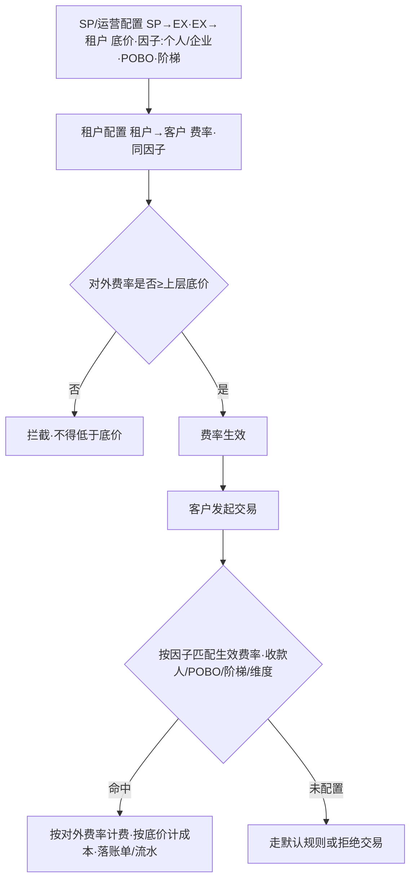

### Case 10：分佣返点（UC-10）

| 项       | 内容                                                            |
| -------- | --------------------------------------------------------------- |
| 用例编号 | UC-10                                                           |
| 参与角色 | EX（汇总 / 结算）、租户 / 渠道（受益方）                        |
| 前置条件 | 已定义分佣 / 返点规则（租户 / 渠道维度）；计费数据可用（UC-09） |
| 触发条件 | 结算周期到达；或交易 / 退款变动                                 |

**主流程（主成功场景）**

1. 返点增加：EX 给租户返；SP 给 EX 返。
2. EX 周期汇总交易并按交易量 / 费率差计算分佣返点。
3. 对应主体（租户 / 渠道）按周期结算。
4. 结算生成分佣报表与流水。

**异常 / 备选流程**

- A1 规则缺失：不分佣。
- A2 退款 / 撤销订单：对应回滚分佣。

**业务规则**

- BR1（正向）按交易量 / 费率差计算，周期结算给对应主体。
- BR2（反向）退款 / 撤销联动回滚分佣。
- BR3（反向）规则缺失不分佣。

**数据 / 字段要求**

| 字段         | 说明        | 必填 |
| ------------ | ----------- | ---- |
| rebateRuleId | 分佣规则 ID | 是   |
| beneficiary  | 租户 / 渠道 | 是   |
| period       | 结算周期    | 是   |
| baseAmount   | 计佣基数    | 是   |
| rebateAmount | 分佣金额    | 是   |

**状态流转**：待结算 →（结算）已结算；异常：部分回滚（退款联动）

**交互要求**：分佣规则配置 + 结算报表 + 流水。

**验收标准**

- AC1 分佣金额 = 规则计算。
- AC2 与交易 / 退款联动正确（含回滚）。
- AC3 报表可核对。

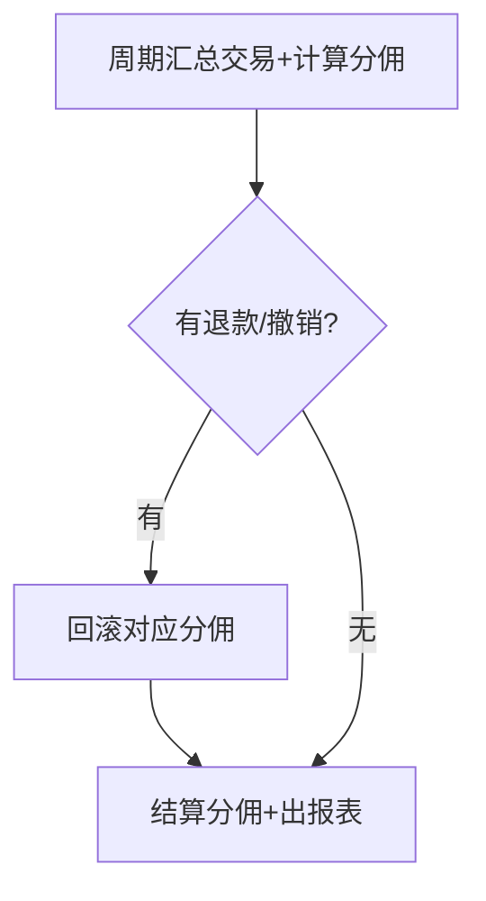

### Case 11：添加人民币收款人（UC-11）

| 项       | 内容                                              |
| -------- | ------------------------------------------------- |
| 用例编号 | UC-11                                             |
| 参与角色 | 商户（添加）、EX（校验 / 保存）、鲲鹏（如需同步） |
| 前置条件 | 商户已开通结汇能力（UC-02）                       |
| 触发条件 | 商户在收款人管理中添加人民币（CNY）收款人         |

**主流程（主成功场景）**

1. 商户（已开通结汇能力）进入收款人管理，添加人民币（CNY）收款人（个人 / 企业）。
2. EX 校验收款人信息（户名 / 账号 / 类型等）。
3. 若鲲鹏需要同步收款人，则 EX 将收款人同步到鲲鹏；若不需要则仅在 EX 保存。
4. 收款人可用于结汇（UC-07）。

**异常 / 备选流程**

- A1 商户未开通结汇能力：交互上选择不到 / 不可添加（入口隐藏或置灰）。
- A2 收款人信息无效 / 重复：拒绝 / 去重。
- A3 同步鲲鹏失败：重试；最终失败置 同步失败，不可用于结汇。

**业务规则**

- BR1（正向）仅当商户开通结汇能力，才能添加 CNY 收款人。
- BR2（反向）未开通结汇能力：交互上选择不到（不可添加）。
- BR3（正向）若鲲鹏需要同步收款人则同步到鲲鹏；不需要则仅 EX 保存；均不同步 BB。
- BR4 收款人可提前添加，也可结汇前新增（呼应 UC-07）。

**数据 / 字段要求**

| 字段       | 说明             | 必填 |
| ---------- | ---------------- | ---- |
| payeeId    | 收款人 ID        | 是   |
| merchantId | 商户 ID          | 是   |
| payeeType  | 个人 / 企业      | 是   |
| payeeName  | 收款人户名       | 是   |
| payeeAcct  | 收款账号         | 是   |
| syncKun    | 是否需同步鲲鹏   | 是   |
| syncStatus | 同步状态（如需） | 否   |

**状态流转**：草稿 →（校验）有效 →（如需同步）同步中 → 已同步 / 同步失败

**交互要求**：仅已开通结汇能力的商户可见「收款人管理」入口与添加按钮；未开通则隐藏 / 置灰（选择不到）。

**验收标准**

- AC1 开通结汇能力的商户可添加 CNY 收款人。
- AC2 未开通的商户交互上无法添加（选择不到）。
- AC3 需同步时收款人同步到鲲鹏；不需要不同步；均不同步 BB。

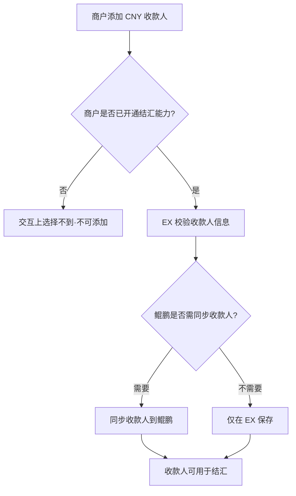

### Case 12：付款产品配置—人民币付款（UC-12）【本期暂不实现】

> ⚠️ 本期暂不配置：因法币能力还未迁移到 EX，人民币付款产品配置待法币能力迁移后再做处理。本用例先占位、记录诉求，不纳入本期交付范围。

| 项       | 内容                                       |
| -------- | ------------------------------------------ |
| 用例编号 | UC-12                                      |
| 参与角色 | 租户（配置）、EX（产品配置）、商户         |
| 前置条件 | 法币能力已迁移到 EX（本期未满足）          |
| 触发条件 | 租户为商户配置「付款产品-人民币付款」      |
| 本期状态 | 暂不实现（待法币能力迁移后重新评估与详设） |

**范围说明（本期）**

- 本期不提供人民币付款产品的配置与开通；结汇能力走 Case 1~7。
- 待法币能力迁移到 EX 后，再补充：产品配置项、SP 路由、账户体系、计费与风控等完整用例。

**待办**

- [ ] 法币能力迁移到 EX 的范围与时间表。
- [ ] 迁移后补全 UC-12 的主流程 / 业务规则 / 字段 / 验收标准。

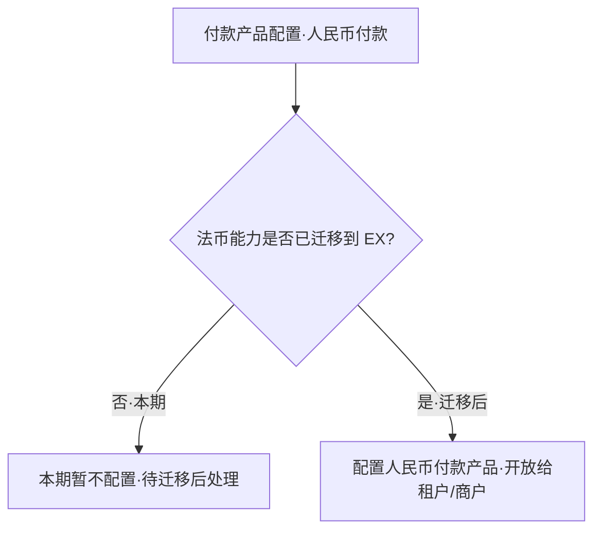

### Case 13：申报人信息报备与管理（UC-13）

> **背景**：根据中国大陆监管要求，结汇需补充**申报人**信息。客户**首次转账到鲲鹏 CNH 账户**（UC-05）时，需填写申报人信息、签署**结汇机构对客协议**，并向渠道（鲲鹏）**报备**成功后方可调拨。报备后续复用；申报人变更后可重新报备。

| 项       | 内容                                                                                  |
| -------- | ------------------------------------------------------------------------------------- |
| 用例编号 | UC-13                                                                                 |
| 参与角色 | 客户（填写 / 签署）、EX（校验 / 报备编排 / 状态管理）、鲲鹏（境内客户信息报备受理）   |
| 前置条件 | ① 商户已开通结汇能力（UC-02）；② 客户**首次**发起转账到鲲鹏 CNH 账户（UC-05） |
| 触发条件 | 首次转账到鲲鹏 CNH 时触发申报人填写；或客户在「申报人信息」模块主动新增 / 修改        |

**申报人默认带出逻辑**

| 客户主体类型             | 默认带出                                                                        | 可否修改                                                       |
| ------------------------ | ------------------------------------------------------------------------------- | -------------------------------------------------------------- |
| **中国大陆企业**   | 带出该**中国大陆企业信息**（企业信息 + UBO 信息）作为申报人               | 可修改 / 重新填写申报人                                        |
| **非中国大陆企业** | 默认带出**中国的 UBO 信息**作为申报人（默认取**第一个**中国籍 UBO） | 若有多个中国 UBO，可改选其他 UBO；也可**重新填写**申报人 |

**主流程（主成功场景）**

1. 客户首次转账到鲲鹏 CNH 触发申报人填写（或从「申报人信息」模块进入）。
2. EX 按客户主体类型**默认带出**申报人信息（中国大陆企业→企业+UBO；非大陆企业→默认第一个中国 UBO）。
3. 客户确认 / 修改申报人信息（非大陆企业可改选其他中国 UBO，或重新填写）。
4. 页面**下方展示结汇机构对客协议**，客户阅读并签署。
5. EX 校验申报人信息完整性与协议签署，向渠道（鲲鹏）发起**境内客户信息报备**。
6. 鲲鹏受理并返回报备结果；EX 记录报备信息与**报备状态**。
7. 报备成功 → 该客户可继续 UC-05 的转账 / 调拨；报备信息在「申报人信息」模块可查。

**异常 / 备选流程**

- A1 信息不完整 / 未签署协议：拦截，不发起报备。
- A2 报备失败 / 超时：置 报备失败，支持修改后重试。
- A3 无中国籍 UBO（非大陆企业）：提示需手动填写符合要求的申报人。
- A4 申报人变更：客户在模块内修改并**重新报备**，以最新报备成功记录为准。

**业务规则**

- BR1（正向）首次转账到鲲鹏 CNH 前，申报人须报备**成功**（呼应 UC-05 BR6）。
- BR2（正向）中国大陆企业：默认带出企业信息 + UBO 信息作为申报人。
- BR3（正向）非中国大陆企业：默认带出中国 UBO（默认第一个），可改选其他中国 UBO 或重新填写申报人。
- BR4（正向）申报人填写页下方须展示并签署**结汇机构对客协议**，签署后方可报备。
- BR5（正向）**报备状态按渠道维度记录**；当前仅一个 SP，界面**不展示 SP 名称**（后续多 SP 时再按渠道分别展示）。
- BR6（正向）申报信息与协议签署留快照；变更后重新报备生成新记录。
- BR7（约束）申报人信息用于结汇合规报备，仅同步给渠道（鲲鹏），不同步 BB。

**数据 / 字段要求**

> 具体字段以**鲲鹏「境内客户信息报备」**规范为准（TBD，待鲲鹏提供）。以下为按监管报备推导的字段集合。

| 字段            | 说明                                          | 必填           |
| --------------- | --------------------------------------------- | -------------- |
| declarantId     | 申报人 ID                                     | 是             |
| merchantId      | 所属商户 ID                                   | 是             |
| subjectType     | 客户主体类型（中国大陆企业 / 非中国大陆企业） | 是             |
| declarantType   | 申报人类型（企业 / 个人-UBO）                 | 是             |
| entityName      | 企业名称                                      | 企业申报必填   |
| uscc            | 统一社会信用代码 / 营业执照号                 | 企业申报必填   |
| regAddress      | 注册地址                                      | 否             |
| legalRep        | 法定代表人                                    | 否             |
| uboName         | UBO / 申报人姓名                              | 是             |
| uboIdType       | 证件类型                                      | 是             |
| uboIdNo         | 证件号码                                      | 是             |
| uboNationality  | 国籍（非大陆企业默认取中国籍 UBO）            | 是             |
| uboShareRatio   | UBO 持股比例                                  | 否             |
| selectedUboRef  | 选中的 UBO（多个时，默认第一个，可改选）      | 非大陆企业必填 |
| contactPhone    | 联系电话                                      | 否             |
| agreementVer    | 结汇机构对客协议版本                          | 是             |
| agreementSigned | 是否已签署对客协议                            | 是             |
| reportStatus    | 报备状态（按渠道）                            | 是             |
| reportTime      | 报备时间                                      | 否             |

**申报人信息模块（管理）**

- **查看报备信息**：展示已提交的申报人信息（企业 / UBO、证件、协议版本等）。
- **报备状态**：按**渠道**展示报备状态（未报备 / 报备中 / 报备成功 / 报备失败）；**当前仅一个 SP，不展示 SP 名称**。
- **操作**：支持新增 / 修改申报人（改选 UBO 或重写）并**重新报备**；查看协议签署记录。

**状态流转**：未报备 →（提交 + 签约）报备中 →（成功）报备成功 / 报备失败 →（变更）重新报备（新记录）

**交互要求**：

- 首次转账到鲲鹏 CNH 时弹出 / 跳转申报人填写页，按主体类型默认带出信息，非大陆企业多 UBO 可下拉改选（默认第一个），支持重新填写。
- 填写页**下方展示结汇机构对客协议**并要求签署。
- 提供「申报人信息」模块查看报备信息与**报备状态（按渠道，单 SP 不显示 SP 名称）**，支持修改后重新报备。

**验收标准**

- AC1 中国大陆企业默认带出企业 + UBO 信息；非大陆企业默认带出第一个中国 UBO，可改选 / 重写。
- AC2 未签署对客协议或信息不全时不能报备。
- AC3 报备成功后方可进行首次转账（UC-05）；报备失败可修改重试。
- AC4 申报人模块可查看报备信息与按渠道的报备状态；单 SP 场景不展示 SP 名称。
- AC5 申报人信息仅同步鲲鹏，不同步 BB。

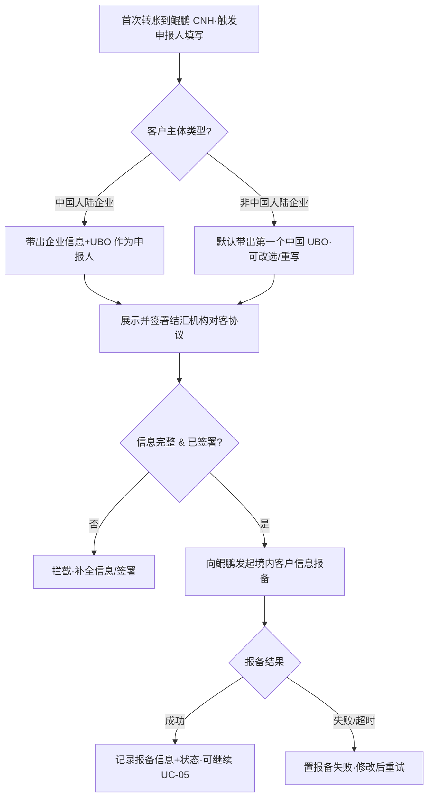

---

## 八、待办（Backlog）

### 8.1 协议 / 合同

- [X] 租户协议（对应 §六 大前提）：是否需要增加内容。
- [X] 鲲鹏协议（机构级）：EX ↔ 鲲鹏 的结汇渠道合作协议。
- [ ] 商户开通协议（鲲鹏直客协议）：商户开通结汇能力 / 直客入网的协议与授权（KYB 授权、收款人授权、POBO 授权）。
- [ ] **结汇机构对客协议**（UC-13）：申报人填写页下方签署的对客协议模板、版本管理与留痕。

### 8.2 风险与合规

- [ ] BB 风险隔离方案：如何将 BB 的风险从 EX / 租户 / 商户链路中排除——
  - 明确 BB 仅作为资金中心 / 出款 channel，资金与合规责任归属界定；
  - BB 与鲲鹏的责任边界（调拨在途、到账通知、对账争议归属）；
  - 业务 / 资金切割：BB 不能做的业务由其他 SP 承接，避免风险串联。
- [X] EX 切割与风险披露，避免 BB 风险牵连 EX 与租户品牌。—— 无风险。

### 8.3 待确认

1. BB 资金托管合规边界：BB 如果提供资金托管服务，是否与做承兑 / 支付服务一样的监管要求（如禁止行业、KYC/AML、牌照资质等都一致）？需与合规确认托管与收付 / 承兑在资质与禁限行业上的异同。
2. **鲲鹏「境内客户信息报备」字段规范**（UC-13）：待鲲鹏提供，用以确定申报人字段的最小集合、格式与报备 / 回执接口。

---

*关联文档：`ex-three-layer-solution.md`、`settlement-API-solution/acquiring-pf-settlement-solution.md`、`vietnam-payment-web3-report.md`*