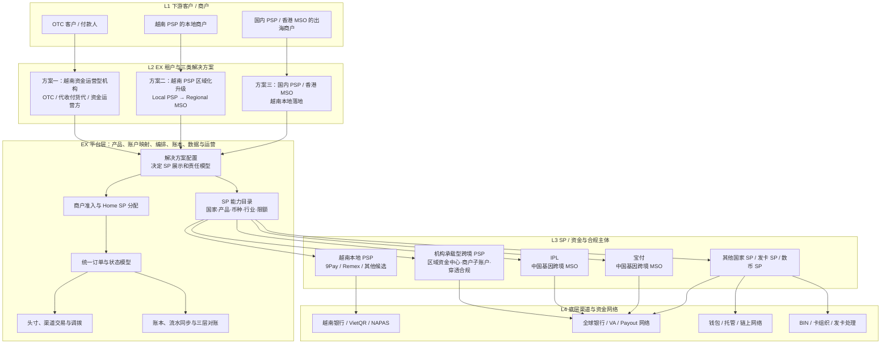

# 越南业务 · 三类解决方案与 EX 多 SP 架构

> 文档类型：业务架构 / SP 接入策略讨论稿
> 关联文档：`../ProductArchetect/ex-abe-positioning-strategy-reference.md`、`vietnam-otc-system-prd-v1.md`、`vietnam-psp-tenant-solution.md`
> 版本：v2.0
> 日期：2026-07-12

---

## 0. 核心结论

越南业务不应先问“EX 要接 IPL、宝付还是 9Pay/Remex”，而应先明确 EX 向哪类机构提供什么解决方案。不同方案中，同一家机构可能扮演租户、SP 或底层渠道等不同角色。

建议将越南业务拆为三类解决方案：

1. **越南资金运营方案**：面向 OTC，以及实质上从事代收付、承兑和头寸运营的货代、贸易服务商等；
2. **越南 PSP 区域化升级方案**：帮助越南本地 PSP 从本地支付机构升级为可服务跨境商户的支付机构；
3. **国内 PSP / 香港 MSO 越南落地方案**：帮助中国内地 PSP、香港 MSO 及类似机构获得越南本地收付和结算能力。

三套方案需要接入的 SP 不相同：

```text
越南资金运营方案
→ 需要本地收付、钱包、承兑和可同步头寸的执行机构

越南 PSP 区域化升级方案
→ 需要中国、香港、新加坡及其他地区的跨境能力 SP

香港 MSO 越南落地方案
→ 需要越南本地持牌 PSP、银行网络和本地结算能力
```

因此，EX 的多 SP 不是把所有 SP 平级放进一个路由池，而是建立：

> **租户解决方案 → 法律责任模型 → 产品能力 → SP 角色 → 账户与路由规则**

---

## 1. 方案一：越南资金运营方案

### 1.1 目标客户

核心客户是主做越南市场的 OTC。以下机构如果实质业务模式相同，也可以进入该方案：

- 大型货代；
- 使用自有头寸提供先行交割的承兑服务商。

不建议只按“货代”或“大卖家”名称归类。进入该方案的判断条件应是：

```text
是否同时管理多个资金账户或钱包？
是否为客户代收、代付或承兑？
是否使用自有头寸先行交割？
是否需要在不同渠道间换汇、补仓或调拨？
```

满足其中多个条件时，更准确的统一定义是：

> **越南资金运营型机构（Treasury Operator）**

OTC 是该类机构的核心形态，货代和大卖家只有在实际经营客户资金或多渠道头寸时才进入该方案。只管理自身贸易收支的大卖家，更接近企业财资客户，不应被默认归为 OTC。

### 1.2 方案定位

EX 提供一套透明的资金运营系统：

- 客户与合同；
- 对客报价；
- 客户交易；
- 银行、PSP 和钱包账户；
- 渠道余额与可交割头寸；
- 渠道承兑、换汇和调拨；
- 客户交易、渠道交易和余额对账。

SP 对 OTC 显式展示，因为 OTC 本身就是资金运营者，需要知道资金实际位于哪家机构、哪个账户以及可执行什么操作。

### 1.3 应接入什么样的越南 SP

该方案需要的不是一家“全能 PSP”，而是四类可运营资源。

| SP 类型 | 需要的能力 | 接入价值 |
| --- | --- | --- |
| 越南本地收付 PSP | VND 大账户/VA、入账流水、本地付款、余额查询 | 完成客户法币入金和 VND 交割 |
| 本地银行或银行合作型 PSP | 稳定账户、银行回单、批量付款、日终对账 | 提高资金安全和对账质量 |
| 钱包/托管服务商 | USDT/USDC 地址、链上监听、出币、余额、KYT | 完成数币收付和头寸管理 |
| 合规承兑/流动性提供方 | VND/USD 与 USDT/USDC 双向承兑、报价、成交状态 | 补充或处置 OTC 头寸 |

优先接入的越南 SP 应满足：

1. 接受 OTC 或资金运营型机构的真实业务模式；
2. 明确允许其账户接收约定范围内的第三方付款；
3. 能提供付款人、金额、时间、流水号等入账明细；
4. 支持 API、文件或稳定报表同步余额和流水；
5. 可以明确区分收款、付款、换汇和承兑能力；
6. 有清晰的限额、资金隔离、冻结和退款处理机制；
7. 能配合 AML、付款人识别和异常交易调查；
8. 支持真实外部流水号和日终对账。

9Pay/Remex 等本地机构只有满足上述条件，才适合成为 OTC 方案的资金渠道。不能只因为“本地汇率好”就接入。

### 1.4 建议的 SP 组合

一期不宜接入过多同质机构，建议形成：

```text
1—2 家越南本地收付 PSP
+ 1 家稳定银行/银行合作渠道
+ 1 家钱包或托管服务商
+ 1 家可合规提供双向承兑的流动性机构
```

同一家 SP 可以同时提供两项能力，但系统仍要按能力和账户分别登记，不能因为机构名称相同就把所有余额合并。

### 1.5 关键边界

- 付款人可以不注册 EX，但不能因此被定义为无需身份识别；
- OTC、实际收款 SP 和承兑机构仍需按适用规则保留付款人及交易信息；
- 客户资金、自有头寸和渠道在途资金必须区分；
- EX 负责系统、账本和数据同步，不因提供系统自动成为资金主体；
- OTC 在渠道后台直接完成的承兑和调拨，必须通过 API、文件或人工认领回到 EX。

---

## 2. 方案二：越南 PSP 区域化升级方案

### 2.1 目标客户

目标客户是已经拥有越南本地牌照、银行网络和商户资源的 PSP，例如 9Pay、Remex 或类似本地机构。

它们通常已经具备：

- VND 收款和付款；
- 越南银行关系；
- 本地商户准入；
- 本地合规和客服；
- 本地品牌与销售团队。

它们的缺口不是“再接一家越南 PSP”，而是如何升级为能够服务跨境商户的区域型PSP。

### 2.2 方案定位

EX 帮助越南 PSP 建设：

- 跨境产品体系；
- 多币种账户和 VA；
- 中国、香港、新加坡及其他地区收付款；
- FX 和跨境结算；
- 商户、产品、账本、费率、分润和运营系统；
- 多 SP 能力目录和统一对账。

越南 PSP 保留自己的本地能力、品牌和客户关系；EX 向其补充区域跨境能力。

### 2.3 应接入什么样的 SP

该方案重点接入的不是越南 SP，而是其他市场的跨境 SP。

| SP 类型 | 代表能力 | 作用 |
| --- | --- | --- |
| 全球收款能力 SP | IPL、宝付等 | 中国/香港/新加坡商户、跨境 VA、全球付款、FX |
| **机构承载型跨境 PSP** | 机构主账户、下游商户子账户/VA、穿透 KYB、统一资金中心、跨区域清算 | 让越南 PSP 不必在每个国家逐一对接银行和自建资金中心 |
| 目标国家本地 SP | 各国本地收付机构 | 扩展特定国家的 VA 和 Payout |
| 发卡 SP | BIN、VCC、卡交易处理 | 为电商、广告和 SaaS 商户提供发卡 |
| 数币合规 SP | 钱包、KYT、承兑 | 在允许的 B2B 场景补充数币结算 |

其中最关键、也是当前分类中缺少的一类，是：

> **可以服务越南本地 PSP 的海外机构承载型跨境 PSP（Sponsor PSP / Settlement PSP）。**

越南 PSP 如果每进入一个国家都自行寻找银行、开设资金账户、建设 VA、付款和清结算，将面临很高的商务、合规、技术和流动性成本。机构承载型 PSP 已经在多个国家建立自己的银行和资金中心，越南 PSP 可以在其机构体系下获得多个地区的账户和收付能力。

建议结构：

```text
越南 PSP
└─ 海外机构承载型 PSP 的机构主账户
   ├─ 国家/币种资金中心
   ├─ 下游商户子账户或 VA
   ├─ Collection / Payout / FX
   ├─ 下游商户穿透资料
   └─ 统一余额、流水和对账
```

这里的“统一”只发生在该机构承载型 PSP 自己的账户体系内，不是 EX 把多家 SP 的余额合并。

#### 机构承载型跨境 PSP 的准入要求

这类 PSP 必须明确提供并在合同中接受：

1. 可以把越南 PSP 作为机构客户，而不是普通贸易商户；
2. 明确允许越南 PSP 服务自己的下游商户；
3. 支持下游商户子账户、VA 或可识别的商户级账本；
4. 能够接收和保存下游商户、UBO、付款人和交易背景数据；
5. 明确越南 PSP 与其自身在 KYB、AML、交易监控和可疑交易报告中的责任；
6. 提供多个国家/币种的 Collection、Payout 和 FX；
7. 提供机构主账户、商户子账户、余额、流水和清结算报表；
8. 支持冻结、退款、退汇和商户退出时的资金处理；
9. 对机构客户有明确的额度、保证金、备付金和流动性规则；
10. API 能表达机构、下游商户、账户和交易四层标识。

只有满足这些条件，才可以称为“受控机构承载”。如果海外 PSP 只允许服务越南 PSP 自己的公司资金，不允许承载其下游客户，那么它只是普通企业账户或跨境收付 SP，不能解决越南 PSP 的区域资金中心问题。


IPL 与宝付在这里都可以成为越南 PSP 的外部跨境能力候选方，但需要分别确认其是否接受上述机构承载模式：

- IPL 可作为中国背景及主流跨境场景的推荐 SP；
- 宝付承接其明确接受、且与 IPL 存在合规政策或能力差异的场景；
- 如果两者能力相同，不应在越南 PSP 前台形成两个无差别选项；
- 越南 PSP 的本地 VND 能力继续由其自身承接。

因此不能仅因为 IPL/宝付具有全球收付能力，就推定其能为越南 PSP 提供 nesting。是否能做取决于其牌照、银行账户协议、机构客户政策和下游商户穿透能力。

### 2.4 四种责任模型

接入外部 SP 前，必须先确定商户、资金和合规关系。

| 模型 | 下游商户由谁开户/KYB | 资金主体 | 适用性 |
| --- | --- | --- | --- |
| 商户逐户开户 | 外部 SP 最终审核 | 外部 SP | 合规清晰，首期优先 |
| 转介模式 | 外部 SP | 外部 SP | 最轻，但本地 PSP 控制较弱 |
| 受控机构承载模式 | 越南 PSP 采集和持续管理，机构承载型 PSP 穿透审核/复核 | 机构承载型 PSP 的机构账户体系，按合同区分商户权益 | 区域化终局；需明确允许下游商户和机构资金中心 |
| 越南 PSP 自营 | 越南 PSP | 越南 PSP | 需要其牌照范围和跨境结构允许 |

“Nesting”不能被当成一个技术功能。只有外部 PSP 明确允许机构账户承载下游商户、能够穿透识别和持续监控，并提供商户级账户与账本时，受控机构承载模式才成立。否则应使用商户逐户开户或转介模式。

### 2.5 推荐一期

建议分两阶段推进：

**第一阶段：逐户开户验证业务**

```text
越南 PSP 获客和采集资料
→ EX 统一产品与资料流
→ IPL/宝付等外部 SP 逐户最终审核
→ 各 SP 账户和余额独立
→ EX 提供统一运营视图和对账
```

该模式牺牲部分开户体验，但能先验证真实客户需求、SP 接受度和跨境交易量，避免一开始就建立高风险机构嵌套结构。

**第二阶段：引入一家机构承载型跨境 PSP**

```text
越南 PSP 作为机构客户
→ 海外 PSP 提供区域资金中心
→ 越南 PSP 采集和管理下游商户
→ 海外 PSP 完成穿透审核/复核
→ 下游商户获得商户级 VA/子账户
→ EX 同步机构、商户、账户、交易和资金账本
```

第二阶段的目标不是把合规责任藏在一个总账户下，而是减少越南 PSP 逐国建设资金中心的成本，同时保持下游商户可识别、资金可归属、交易可穿透。

---

## 3. 方案三：国内 PSP / 香港 MSO 越南落地方案

### 3.1 目标客户

目标客户包括：

- 中国内地跨境 PSP；
- 香港 MSO；
- 新加坡等地区、但主要服务中国出海商户的支付机构；
- 已具备跨境能力、但缺越南本地落地能力的机构。

它们通常已经拥有：

- 中国、香港、新加坡或全球收付款能力；
- 多币种账户和跨境 FX；
- 中国出海商户资源；
- 自有合规、账户和运营系统。

它们需要的是越南本地 VND 收款、付款、银行网络和本地合规落地。

### 3.2 方案定位

EX 提供：

- 越南本地 SP 能力目录；
- 越南本地收款、付款和结算产品；
- SP 接入、路由、订单和状态标准化；
- 本地账户和余额视图；
- 交易、退款、异常和对账；
- 本地 SP SLA 和运营管理。

此方案下，IPL、宝付等机构也可能成为 EX 的租户，而不是 EX 的默认 SP。

### 3.3 应接入什么样的越南 SP

需要接入的核心是越南本地持牌和本地执行能力：

| SP 类型 | 能力要求 |
| --- | --- |
| 越南本地 PSP | VND 收款/付款、本地商户服务、API 和对账 |
| 越南银行/银行合作方 | 企业账户、批量付款、资金安全和银行回执 |
| 本地支付网络能力方 | VietQR、NAPAS 或其他适用本地支付方式 |
| 本地 FX/结算合作方 | 合规的 VND 与目标外币结算能力 |

选择本地 SP 时，应优先看：

1. 牌照和产品范围；
2. 是否接受境外 PSP/MSO 的机构合作模式；
3. 是否允许服务其下游商户，以及穿透要求；
4. 能否提供商户级 VA、付款人信息和回单；
5. Collection、Payout、Refund 是否完整；
6. VND 资金如何结算到境外或目标币种；
7. API、回调、余额、流水和对账质量；
8. 单笔/日/月限额及提额能力；
9. 冻结、退汇、争议和异常处理 SLA；
10. 是否愿意接受 EX 的统一数据和运营标准。

9Pay/Remex 可以作为候选，但需要分别验证上述能力，不能仅以“越南本地 PSP”标签判断。

### 3.4 Home SP 原则

国内 PSP / 香港 MSO 的下游商户，不建议按每笔交易动态切换多个资金 SP。

建议：

```text
租户配置推荐越南 SP
→ 商户开户时确定 Home SP
→ 该商户的主要 VND 收款、付款、换汇和余额在 Home SP 内闭环
→ Home SP 不覆盖的特殊能力才开通“其他 SP”
```

同一商户不能把 USD 默认放在一个 SP、VND 默认放在另一个 SP，再让 EX 将其包装成统一余额。能力跟随真实资金账户。

### 3.5 本地 SP 组合

建议至少形成：

- 1 家主力本地 SP：产品完整、API 和对账稳定；
- 1 家差异化 SP：补行业、限额、支付方式或灾备；
- 必要的银行/FX 合作方。

第二家 SP 的接入理由必须是明确能力差集或业务连续性，不能只是制造“多一个选择”。

---

## 4. 三类方案与 SP 接入矩阵

| 解决方案 | 谁掌握客户 | 谁经营头寸 | SP 是否显式 | 越南侧重点接入 | 境外侧重点接入 |
| --- | --- | --- | --- | --- | --- |
| 越南资金运营方案 | OTC/资金运营方 | 租户自己 | 完全显式 | 本地收付 PSP、银行、钱包、承兑机构 | 按真实调拨需要补充 |
| 越南 PSP 区域化升级 | 越南 PSP | 越南 PSP/机构承载型 PSP 按模型 | 自有能力显式，外部能力按产品表达 | 租户自身本地能力 | **机构承载型跨境 PSP**、IPL、宝付、目标国家 SP、发卡/数币 SP |
| 国内 PSP/香港 MSO 越南落地 | 国内 PSP/香港 MSO | Home SP/租户按合同 | 推荐 SP 弱化，法律主体披露 | 越南 PSP、银行、本地网络、FX | 租户自身已有能力 |

---

## 5. EX 多 SP 四层业务架构



### 5.1 四层角色

| 层级 | 角色 | 关键问题 |
| --- | --- | --- |
| L1 | 租户的下游客户/商户 | 谁使用收付、承兑或跨境产品 |
| L2 | EX 租户 | 使用哪一类解决方案，谁拥有客户和经营决策 |
| EX 平台 | 横向系统与编排层 | 如何配置责任模型、账户、路由、订单、数据和对账 |
| L3 | SP/资金与合规主体 | 谁开户、持有资金、审核交易和承担持牌责任 |
| L4 | 银行、钱包、支付网络 | 实际如何完成收款、付款、清算和链上执行 |

EX 不应把 L3 SP 和 L4 渠道混为一层。同一家机构在不同合作结构中可能是 L3 SP，也可能只是另一个 SP 底下的 L4 执行渠道。

---

## 6. SP 接入决策流程

```text
第一步：服务哪一类解决方案？
├─ 越南资金运营 → 看本地收付、钱包、承兑、余额流水和对账
├─ 越南 PSP 区域化 → 看境外 VA、Payout、FX、中国和其他地区能力
└─ 国内 PSP/HK MSO 落地 → 看越南牌照、本地网络、机构合作和 VND 结算

第二步：SP 在该方案中是什么角色？
├─ 租户自身能力
├─ L3 资金与合规主体
└─ L4 底层执行渠道

第三步：采用什么责任模型？
├─ 商户逐户开户
├─ 转介
├─ 合规允许的机构承载
└─ 租户自营

第四步：是否形成明确能力差集？
├─ 是 → 接入并限定产品范围
└─ 否 → 不因“多 SP”概念重复接入

第五步：是否达到运营准入要求？
牌照 + API/文件 + 余额流水 + 对账 + SLA + 异常处理
```

---

## 7. 建议优先级

### 第一优先级：越南资金运营方案

原因：需求明确、系统已经开始定义，能够快速验证客户、交易、头寸、调拨和对账价值。

SP 接入重点：

- 1—2 家越南本地收付 PSP；
- 1 家钱包/托管服务商；
- 1 家承兑或流动性机构；
- 优先完成余额、流水和交易状态同步。

### 第一至第二优先级：越南 PSP 区域化升级

原因：与 EX 多租户、多产品和多 SP 能力高度匹配，也能把 IPL/宝付等跨境能力输出给越南本地机构。

首期建议采用商户逐户开户模型验证真实需求；同时并行寻找一家明确接受越南 PSP 及其下游商户的机构承载型跨境 PSP，作为区域资金中心的中期核心合作方。

### 第二优先级：国内 PSP / 香港 MSO 越南落地

原因：商业价值较大，但对越南本地 SP 的机构合作、牌照、资金路径和 SLA 要求更高。

建议先选一家主力本地 SP 做完整闭环，再以明确能力差集接第二家。

---

## 8. 待确认事项

- [ ] 哪些越南 OTC/货代实际属于资金运营型机构，哪些只是企业财资客户；
- [ ] 9Pay、Remex 分别支持哪些账户、入账明细、付款、FX、承兑和 API 能力；
- [ ] 本地 SP 是否明确接受第三方付款和 OTC/资金运营业务模式；
- [ ] 越南 PSP 使用 IPL/宝付跨境能力时，首期采用逐户开户还是转介；
- [ ] IPL 与宝付对越南 PSP 的机构合作和下游商户穿透政策；
- [ ] 哪些海外 PSP 可以把越南 PSP 作为机构客户，并提供商户子账户、VA、区域资金中心和受控机构承载；
- [ ] 机构承载型 PSP 的银行账户协议是否允许下游客户资金，资金权益和破产隔离如何处理；
- [ ] 国内 PSP/HK MSO 接入越南 SP 时，谁是下游商户的最终资金主体；
- [ ] 越南本地 SP 的主力/差异化评估矩阵和 SLA；
- [ ] EX 能否取得所有 SP 的余额、流水、交易状态、退款和对账数据；
- [ ] 各方案的客户资金、自有资金和在途资金如何在账本中隔离。

---

## 9. 最终原则

1. 不按 SP 名称设计方案，先按租户经营模式设计解决方案；
2. 货代和大卖家只有实际经营多渠道头寸、代收付或承兑时才进入资金运营方案；
3. 越南 PSP 方案的核心是补境外跨境能力，不是再接一家越南 PSP；
4. 国内 PSP/HK MSO 方案的核心是接入越南本地持牌落地能力；
5. 同一家机构可能在一个方案中是租户，在另一个方案中是 SP；
6. Nesting 是需要审查的责任结构，不是默认产品功能；
7. 普通商户采用 Home SP，OTC 等专业资金运营方才显式管理多个 SP；
8. 外部 SP 必须形成明确能力差集或灾备价值；
9. 资金、能力和账户跟随真实 SP，不制造虚假统一余额；
10. 所有 SP 的订单、流水、余额、风险和对账数据必须回流 EX。
