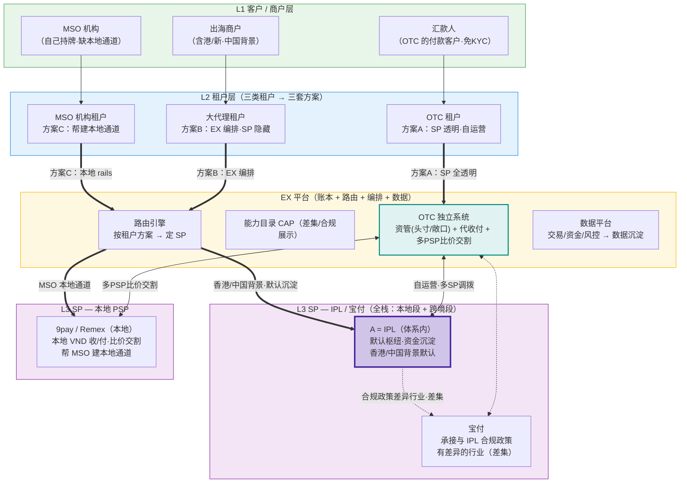

# 越南业务 · 多 SP 业务架构与 SP 选择逻辑

> 文档类型：业务架构 / 路由推理（讨论稿）
> 关联：`../ProductArchetect/ex-abe-positioning-strategy-reference.md`（§6 可执行架构、§4.4 能力差集原则、§4.5 沉淀约束、§2.6 与本地共生）、`vietnam-payment-web3-report.md`、`vietnam-psp-tenant-solution.md`

---

## 一、背景：越南业务的三个 SP

当前有 3 个可支持越南业务的 SP，基因与定位各不相同：

| SP                     | 类型         | 是否体系内             | 能力范围                          | 基因 / 擅长                                          |
| ---------------------- | ------------ | ---------------------- | --------------------------------- | ---------------------------------------------------- |
| **A = IPL**      | 中国基因 MSO | **是（体系内）** | **本地段 + 跨境段（全栈）** | 服务国内出海商户（含香港、新加坡等），已具备越南本地渠道 |
| **宝付**         | 中国基因 MSO | 否                     | **本地段 + 跨境段（全栈）** | 与 IPL 同类，服务国内出海商户；承接与 IPL 合规政策有差异的行业 |
| **9pay / Remex** | 越南本地 PSP | 否                     | 本地段为主                        | 熟悉越南本国业务，本地 VND 收 / 付、本地清结算与合规 |

> ⚠️ **关键更新**：IPL 已经有越南本地渠道，能自己闭环完成「本地段 + 跨境段」；宝付亦然。因此 **SP 选择不再是"按段各归一家"**——IPL / 宝付 在很多场景下能独立完成整条链路。

**两组基因（仍然成立）**：

- **A / 宝付（中国基因）**：天然更懂"国内出海商户"（含港新），且现已全栈。
- **9pay / Remex（本地基因）**：天然更懂"越南本地生意"，是帮助 MSO 机构落地本地通道的合作方。

> 因为 IPL / 宝付 已全栈，**"选哪个 SP"不再由"段"唯一决定，而是先由"租户类型"决定方案，再在方案内定 SP**（见 §二、§三）。

---

## 二、关键认知转变：从"按段选 SP"到"按租户分方案"

**转变前（上一版设想）**：段决定 SP —— 本地段给本地 PSP、跨境段给 A。

**转变后（当前事实）**：IPL / 宝付 已全栈，能独立完成整条链路，本地段不再必须外包本地 PSP。于是真正的分水岭变成了**租户类型**——不同租户对"SP 是否暴露、资金谁来碰、是否需要本地通道建设"的诉求完全不同。

因此存在**两种 SP 暴露模式**，按租户匹配：

| 模式                    | 谁碰资金 / 调拨          | SP 是否对客暴露            | 适用租户           |
| ----------------------- | ------------------------ | -------------------------- | ------------------ |
| **A. SP 透明暴露**（自运营） | 租户自己代收 + 自己在 SP 间调拨 | **完全暴露**（租户就是运营方） | **OTC**            |
| **B. SP 隐藏 + 差集**（EX 编排） | EX 编排、默认枢纽沉淀    | 隐藏，仅露"默认 + 差集补充" | **大代理**         |
| **C. 帮建本地通道**     | MSO 自己持牌运营         | EX 提供本地 SP 作其 rails   | **MSO 机构**       |

> 模式 B 就是参考文档 §4.4 / §6.1 的经典 ABE 模型（默认 SP 枢纽 + 能力差集）；模式 A、C 是本轮针对越南实际租户新增的两套方案。

---

## 三、三类租户 × 三套方案（核心）

### 3.1 OTC 方案 —— 独立系统 · SP 完全暴露 · 资管 + 代收付

**租户画像**：OTC 前期**代收客户（汇款人）资金**，自己在不同 SP / PSP 间做资金调拨与交割。因为 OTC 本身就是运营方，**对它完全暴露 SP 没有问题**（不存在"分流沉淀"的顾虑）。

**结论：给 OTC 单独搭一套系统**（资管 + 代收付），SP 全透明。

**第一期方案要点**：

- **客户（汇款人）不需要 KYC**：KYC / 合规责任由 OTC 主体承担，汇款人只是付款方。
- **代收 + 头寸交割模式**：OTC 代收客户法币后，用**自备头寸**给客户做交割。例：代收了客户法币、OTC 手上有 100U，即可**直接把 U 汇出**给指定地址（不等法币回流）。
- **多 PSP 择优交割**：OTC 收到的法币，可在 **9pay / Remex 等本地 PSP** 间**比价、找合适汇率**做交割 / 兑换。
- **系统性质**：一套 **资管（头寸 / 库存 / 敞口管理）+ 代收付（Collection / Payout）** 系统。

**关键能力清单**：

- 汇款人代收（免 KYC 收款入口）、头寸 / 库存管理、U 与法币双向交割；
- 多 PSP 汇率比价与路由（就低成本 / 就优汇率交割）；
- SP / PSP 全透明的调拨与对账台账；
- OTC 主体级 KYC / 风控（对汇款人做必要的 KYT / 反洗钱筛查）。

> 边界提示：汇款人免 KYC ≠ 无合规。OTC 需承担主体级 KYB/KYC、KYT 与可疑交易监控，EX 侧保留账本与风控数据（呼应参考文档 §2.5 监管边界）。

### 3.2 大代理方案 —— 按客户主要地区定默认 SP（EX 编排 · SP 隐藏）

**租户画像**：大代理是纯租户、不自己碰资金 / 不自运营 SP，由 EX 编排。适用参考文档 §6.1「默认 SP 枢纽 + 差集补位」模型，SP 对客隐藏。

**按大代理客户的主要地区定默认 SP**：

- **香港 / 中国人背景的客户** → **默认 IPL**（体系内、资金沉淀 A）。
- **与 IPL 合规政策有差异的行业** → 由 **宝付承接**（差集补位：IPL 做不了 / 政策不覆盖的行业，宝付接）。

**判定逻辑（沿用能力差集原则 §4.4）**：

- IPL 能做且达 SLA 的地区 / 行业 → 路由 IPL，不展示宝付同类；
- IPL 因**合规政策**不能覆盖的行业 → 宝付显式承接（这是"能力差集"的合规版：差的是合规准入，不是技术能力）；
- 客户看到的永远是「IPL 默认 + 宝付补充（合规差集）」，不并列两个雷同选项。

### 3.3 MSO 机构方案 —— 帮它建本地通道（对接 9pay / Remex）

**租户画像**：MSO 机构自己持牌、要在越南展业，缺的是**本地落地通道**。

**方案**：EX 对接 **9pay / Remex 这类本地 PSP，帮 MSO 机构建设本地通道**（本地 VND 收 / 付、本地清结算），MSO 用自己的牌照与品牌运营，本地 rails 由 EX 编排提供。

- 本地闭环资金归本地体系（VND 资本管制），EX 赚**系统费 + 数据**；
- 呼应参考文档 §2.6「帮本地机构做生意、与本地共生」的定位。

---

## 四、越南业务架构图



**读图要点**：

- **三类租户 → 三条不同路径**：OTC 走独立系统（SP 透明）、大代理走 EX 编排（SP 隐藏）、MSO 走本地通道建设。
- **IPL / 宝付 同层全栈**：都能做本地 + 跨境；IPL 为默认枢纽（加粗），宝付承接合规差异行业。
- **OTC 系统**（青色）：自运营，横跨 IPL / 宝付 / 本地 PSP 做调拨与多 PSP 比价交割。
- **9pay / Remex**：既是 OTC 的交割 PSP，也是帮 MSO 机构落地的本地 rails。

---

## 五、SP 选择逻辑：先分租户，再定 SP

**第一层：先判租户类型（决定方案与 SP 暴露模式）**

```
租户是谁？
├─ OTC（自代收 + 自调拨）        → 方案A：独立系统 · SP 完全暴露
│                                   （OTC 自己在 IPL/宝付/本地PSP 间比价调拨交割）
├─ 大代理（纯租户 · EX 编排）    → 方案B：SP 隐藏 · 默认+差集
│                                   → 进入第二层
└─ MSO 机构（自持牌 · 缺本地）   → 方案C：EX 对接 9pay/Remex 帮建本地通道
```

**第二层：大代理方案内，按客户主要地区 / 行业定 SP**

```
大代理客户的主要地区 / 行业？
├─ 香港 / 中国人背景             → 默认 IPL（体系内 · 资金沉淀 A）
└─ 与 IPL 合规政策有差异的行业   → 宝付承接（合规差集，显式补充）
   （IPL 能做且达 SLA 的 → 走 IPL，不展示宝付同类）
```

### 决策矩阵

| 租户类型   | 方案 / SP 暴露         | 首选 SP                            | 逻辑依据                                        |
| ---------- | ---------------------- | ---------------------------------- | ----------------------------------------------- |
| **OTC**    | 独立系统 · SP 全透明   | **IPL + 宝付 + 9pay/Remex（自选）** | OTC 自运营、自调拨；多 PSP 比价交割，暴露无碍   |
| **大代理·港/中背景** | EX 编排 · SP 隐藏 | **IPL（默认）**              | 体系内、资金沉淀 A，客户不感知 SP               |
| **大代理·合规差异行业** | EX 编排 · SP 隐藏 | **宝付（差集补充）**      | IPL 政策不覆盖的行业由宝付承接                  |
| **MSO 机构** | 帮建本地通道         | **9pay / Remex（本地 rails）** | MSO 自持牌运营，EX 提供本地通道，赚系统费+数据  |

### 选择的判据（简版）

- **判据一·租户**：OTC → 透明自运营；大代理 → 隐藏编排；MSO → 帮建本地通道。
- **判据二·地区/合规（仅大代理）**：港/中背景 → IPL 默认；合规差异行业 → 宝付差集。
- **判据三·IPL 优先沉淀**：大代理场景下 IPL 能做且达 SLA 就默认 IPL，不与宝付并列。

---

## 六、每个 SP 的定位与边界

**A = IPL（默认枢纽 · 全栈）**

- 角色：大代理场景默认 SP、资金沉淀地；本地 + 跨境全栈；OTC 场景作为可选调拨 SP。
- 边界：MSO 合规下不承接数币背景资金；部分行业受合规政策限制（由宝付补位）。

**宝付（合规差集补位 · 全栈）**

- 角色：承接与 IPL 合规政策有差异的行业 / corridor；OTC 场景作为可选调拨 SP。
- 边界：大代理场景**不与 IPL 并列展示**，仅作差集补充；IPL 政策补齐后展示面收窄。

**9pay / Remex（本地专家）**

- 角色：本地 VND 收 / 付与本地清结算；OTC 的比价交割 PSP；MSO 机构的本地 rails。
- 边界：本地闭环资金归本地体系；EX 赚系统费 + 数据（呼应 §2.6 与本地共生）。

---

## 七、待办 / 待确认

- [ ] **OTC 独立系统 PRD**：头寸 / 敞口管理、免 KYC 代收入口、U↔法币交割、多 PSP 比价路由、全透明调拨对账台账。
- [ ] **OTC 合规边界**：汇款人免 KYC 的前提下，OTC 主体级 KYB/KYC/KYT 与可疑交易监控责任划分（关联参考文档 §2.5）。
- [ ] **大代理地区 / 行业 → SP 映射表**：明确哪些行业属于"IPL 合规政策差异"、由宝付承接。
- [ ] **IPL 越南能力 / SLA 基线**：全栈后哪些币种 / 方向 / 行业达标（决定宝付差集面）。
- [ ] **MSO 本地通道建设 SOP**：9pay / Remex 接入、MSO 品牌 / 牌照运营与 EX 编排的责任边界。
- [ ] **CAP 配置**：把"租户方案 → SP 暴露 / 路由"固化到能力目录，展示权 / 路由权归 EX。

---

*关联文档：`../ProductArchetect/ex-abe-positioning-strategy-reference.md`、`vietnam-payment-web3-report.md`、`vietnam-psp-tenant-solution.md`、`CNYsettlement.md`*
