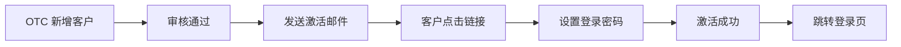

# 越南 OTC 客户端 PRD（v1.0 MVP）

> **文档类型**：产品需求文档 / HTML Demo 交互依据  
> **产品形态**：OTC 客户简易端，Web 系统  
> **目标**：让客户可以查看报价、提交交易、跟踪交易状态、处理退票/退款  
> **核心约束**：OTC 不持有客户资金，客户端不展示余额，仅展示交易状态和资金去向  
> **日期**：2026-07-12  
> **参考**：`vietnam/vietnam-otc-operation-prd-v1.md`

---

## 1. 背景与目标

### 1.1 客户端定位

OTC 客户端是面向已合作且已激活客户的 Web 系统。客户通过客户端完成：

- 激活账号并设置登录密码；
- 查看当前可交易报价；
- 发起 On Ramp / Off Ramp 交易；
- 跟踪每笔交易的状态和资金去向；
- 处理成功后的退票/退款；
- 维护基础账户信息。

### 1.2 1.0 MVP 目标

1. 客户通过激活链接设置密码并登录；
2. 客户查看 6 组货币对的实时报价；
3. 客户发起交易并获取付款指引；
4. 客户查看交易记录，状态覆盖 pending、成功、失败、退票/退款；
5. 客户在成功交易发生退票时，可查看退票原因并确认退款安排；
6. 客户端不展示余额、渠道、头寸、调拨等 OTC 内部信息。

### 1.3 1.0 不做

- 客户自助注册；
- 客户余额/钱包/资产账户；
- 客户间转账；
- 复杂 KYC（KYB/KYT 在 OTC 运营端完成）；
- 法币与法币直接换汇；
- 数币与数币直接互换。

### 1.4 交易范围

1.0 只做 **On Ramp / Off Ramp**，即法币与数币之间的兑换。

- **数币**：USDT、USDC；
- **法币**：USD、VND、CNH；
- **方向**：
  - On Ramp：USD/VND/CNH → USDT/USDC；
  - Off Ramp：USDT/USDC → USD/VND/CNH。
- **支持的货币对（双向）**：USDT/USD、USDT/VND、USDT/CNH、USDC/USD、USDC/VND、USDC/CNH。

---

## 2. 用户与角色

### 2.1 客户

客户是已与 OTC 签订合作协议并被 OTC 在运营端录入系统的主体。

- 客户状态：待激活 → 已激活 → 已停用；
- 一个客户账号对应一个邮箱/手机号；
- 客户不能注册，只能由 OTC 发送激活邮件。

### 2.2 与客户相关的风险等级

#### 风险等级来源

客户的风险等级由 OTC 运营端的风控模块计算，客户端只展示结论性提示，不展示风险标签、分数或服务商原始报告。

#### 风险等级与客户端表现

| 风险等级 | 客户端状态 | 交易影响 | 页面交互 |
| --- | --- | --- | --- |
| 低风险 | 正常 | 可直接创建交易 | 报价牌/发起交易正常可用 |
| 中风险 | 交易提交后显示“等待 OTC 复核” | 需 OTC 人工复核，复核期间可查看进度 | 交易列表显示“待复核”；交易详情展示复核提示；复核通过/拒绝后推送通知 |
| 高风险 | 限制交易 | 不能创建新交易 | 报价牌禁用“发起交易”入口；提示“账户受限，请联系 OTC” |
| 禁止合作 | 已停用 | 不能登录或不能创建交易 | 登录时提示账户停用；禁止进入交易相关页面 |

#### 交易风控流程

```text
客户提交交易
→ 客户端校验交易字段和限额
→ 请求 OTC 系统创建订单
→ 系统执行 KYB/KYT 风控检查
→ 低风险：返回付款/收款指引，交易进入待入账
→ 中风险：交易标记为“待复核”，客户端展示等待提示，OTC 复核后通知客户
→ 高风险/禁止合作：拒绝交易，提示客户联系 OTC
```

#### 页面交互规则

- 报价牌：中风险客户仍可查看报价和试算，但提交按钮显示“提交后需 OTC 复核”；高风险/禁止合作客户隐藏交易入口；
- 发起交易页：提交前展示风险提示文案；中风险客户提交后弹窗告知“已提交，等待 OTC 复核”；
- 交易列表：中风险交易卡片展示“待复核”标签；
- 交易详情：
  - 低风险：正常展示付款/收款指引和状态；
  - 中风险：顶部展示“OTC 复核中”提示，禁用付款/打币操作；复核通过后自动切换为正常指引；
  - 复核拒绝：状态变为已失败，展示拒绝原因；
- 消息/通知：复核结果、高风险限制、禁止合作停用均通过站内通知或邮件推送。

#### 风控成本说明

客户端不展示风控服务成本、费用明细和计费方式。MVP 阶段风控相关成本由平台承担，不纳入交易手续费或运营成本核算，也不向客户单独收取风控费用。

---

## 3. 信息架构

```text
首页 / 报价牌
收款/付款信息维护
  ├─ 数币地址簿
  └─ 法币账户簿
发起交易
  ├─ 交易试算
  ├─ 提交交易
  └─ 付款/打币指引
交易记录
  ├─ 全部交易
  ├─ 处理中（Pending）
  ├─ 已成功
  ├─ 已失败
  └─ 退票/退款
账户设置
  ├─ 个人信息
  ├─ 登录密码
  └─ 安全退出
```

---

## 4. 激活与登录

### 4.1 开通与激活

客户由 OTC 在运营端录入并发送激活邮件。

```text
OTC 在运营端新增客户 → 审核通过 → 发送激活邮件
→ 客户点击邮件链接 → 设置登录密码 → 激活成功 → 自动跳转登录页


```

### 4.2 激活页

激活链接包含一次性 token，过期后需联系 OTC 重发。

字段：

- 登录邮箱/手机号（只读，来自 OTC 录入）；
- 登录密码；
- 确认密码。

校验：

- 密码 8—32 位；
- 至少包含大写字母、小写字母、数字和特殊字符中的三类；
- 两次密码一致；
- token 有效且未使用过；
- 激活链接失效时提示“请联系 OTC 重发激活邮件”。

### 4.3 登录页

字段：

- 登录账号（邮箱或手机号）；
- 登录密码。

操作：

- 登录；
- 显示/隐藏密码；
- 忘记密码（点击后提示联系 OTC 重置）。

状态提示：账号或密码错误、账号待激活、账号已停用。

MVP 客户端不使用 Google Authenticator。

---

## 5. 首页 / 报价牌

### 5.1 页面结构

```text
客户名称与风险等级提示
↓
可交易货币对报价牌
↓
当前可用交易额度（非余额）
↓
最近 3—5 笔交易
↓
"发起交易"主按钮
```

### 5.2 报价牌

按货币对展示两个方向的对客汇率：

| 货币对 | 客户买 U | 客户卖 U |
| --- | --- | --- |
| USDT/VND | 1 USDT = 25,500 VND | 1 USDT = 24,500 VND |

每张报价卡展示：

- 货币对；
- 方向；
- 对客汇率；
- 最小/最大交易金额（客户卖出币种）；
- 报价有效期倒计时；
- 锁价时长提示；
- 预计手续费提示；
- “立即交易”按钮。

状态：

- 有效：可立即交易；
- 即将失效：显示倒计时；
- 已过期/参考价异常：显示“暂不可交易”，按钮禁用。

### 5.3 额度提示

展示客户当日的单笔/日累计剩余额度，不是余额。

例如：

- 今日 USDT/VND 客户买 U 剩余额度：500,000,000 VND；
- 今日 USDT/VND 客户卖 U 剩余额度：20,000 USDT。

### 5.4 不展示的信息

客户端明确不展示：

- 客户余额；
- OTC 渠道和头寸；
- 参考汇率、Markup、OTC 渠道成本；
- 调拨记录；
- 其他客户信息。

---

## 6. 收款/付款信息维护

客户需要先维护好自己的数币地址和法币账户，才能在发起交易时被选用。

### 6.1 数币地址簿

客户可以添加、查看、编辑和删除自己的数币地址。

| 字段 | 说明 |
| --- | --- |
| 地址别名 | 例如“主钱包”“运营钱包”，便于客户识别 |
| 数币币种 | USDT / USDC |
| 网络/链 | TRC20 / ERC20 / BEP20 等 |
| 钱包地址 | 客户实际持有并控制的地址 |
| 地址用途标签 | 买入收款 / 卖出打款 / 通用 |
| 状态 | 启用 / 停用 |

规则：

- 买入数币时，只能从“买入收款”或“通用”标签的地址中选择接收地址；
- 卖出数币时，只能从“卖出打款”或“通用”标签的地址中选择付款地址；
- 地址添加后无需 OTC 审核即可使用，但风控会对交易地址执行 KYT；
- 地址停用后不能用于新建交易，但不影响进行中的交易。

### 6.2 法币账户簿

客户可以添加、查看、编辑和删除自己的法币账户。

| 字段 | 说明 |
| --- | --- |
| 账户别名 | 例如“主付款账户”“VND 收款账户” |
| 账户币种 | USD / VND / CNH |
| 账户类型 | 银行账户 / 电子钱包 |
| 银行/钱包名称 | 例如 Vietcombank、MoMo 等 |
| 账户名 | 账户持有人姓名或企业名 |
| 账号/IBAN/钱包 ID | 实际收款/付款账号 |
| 账户用途标签 | 买入汇款 / 卖出收款 / 通用 |
| 状态 | 启用 / 停用 |

规则：

- 买入数币时，只能从“买入汇款”或“通用”标签的账户中选择付款账户；
- 卖出数币时，只能从“卖出收款”或“通用”标签的账户中选择收款账户；
- 账户币种必须与交易中的对应法币币种一致；
- 账户添加后无需 OTC 审核即可使用，但 OTC 端可以查看并提示异常。

### 6.3 页面入口

- 首页报价牌“发起交易”前，若客户没有可用地址/账户，提示先维护；
- 交易试算页提供“添加地址/账户”快捷入口；
- 交易记录和详情页展示本次交易选用的地址/账户快照，不可修改。

---

## 7. 发起交易

### 7.1 交易方向

客户端将交易明确区分为两类：

- **买入数币（On Ramp）**：客户支付法币，获得 USDT/USDC；
- **卖出数币（Off Ramp）**：客户支付 USDT/USDC，获得法币。

两个方向的交易流程在“客户应付/应收”“OTC 收付款账户”“状态命名”上保持一致，仅在资金方向上相反。

### 7.2 买入数币流程

#### 7.2.1 交易试算

客户选择“买入数币”方向：

```text
选择货币对（例如 USDT/VND）
→ 选择/添加提币地址（接收 USDT 的地址）
→ 选择/添加汇款账户（客户付款的 VND 银行账户）
→ 输入买入数币数量
→ 系统根据对客汇率和手续费计算客户应付法币金额
→ 客户选择打款币种（仅限系统已维护的法币币种）
→ 生成试算快照并开始锁价倒计时
→ 客户确认并提交
```

试算页展示：

- 买入数币数量和币种；
- 客户应付法币金额和币种；
- 当前对客汇率；
- 适用报价来源（全局 / 客户专属）；
- 手续费类型、费率和预计手续费金额；
- 锁价剩余时间；
- 单笔和当日剩余额度；
- 是否需要 OTC 人工确认；
- 客户风险等级提示（中风险客户显示“交易需 OTC 复核”）；
- 已选提币地址和汇款账户快照。

#### 7.2.2 提交交易

确认页汇总：

- 买入数币数量；
- 客户应付法币金额；
- 对客汇率、报价来源；
- 预计手续费；
- 客户汇款账户信息；
- OTC 收款大账户信息（由 OTC 资金模块维护，客户不可选择）；
- 提币地址和网络；
- 客户风险等级提示；
- 订单有效期倒计时。

提交后生成交易 ID，交易进入 **待入账** 状态。

#### 7.2.3 付款指引

交易提交成功后展示付款指引页面：

- 应付法币金额和币种；
- OTC 收款大账户（银行名称、账户名、账号/二维码）；
- 付款备注 / 订单 ID，必须要求客户填写；
- 已选汇款账户信息（只读）；
- 已选提币地址（只读）；
- 报价及订单有效期倒计时；
- “复制账户信息”和“复制备注”按钮；
- “我已付款”按钮。

“我已付款”交互：

- 客户点击后系统向 OTC 发送入账提醒；
- 客户可以填写实际付款账户后四位、付款人姓名、TxID/银行流水号等可选信息；
- “我已付款”不代表系统已经确认入账，OTC 仍需核对渠道流水后点击确认；
- 超过订单有效期未点击“我已付款”，订单自动失效，客户需重新下单。

#### 7.2.4 买入数币状态流

```text
待入账 → 待出账 → 出账成功 / 出账失败
```

说明：

- **待入账**：客户已提交交易，等待 OTC 确认法币到账；
- **待出账**：OTC 已确认法币到账，等待 OTC 向客户提币地址出币；
- **出账成功**：数币已到达客户提币地址，交易完成；
- **出账失败**：因地址异常、链上失败、风控等原因无法出币，需要 OTC 处理退款或重新出账。

### 7.3 卖出数币流程

#### 7.3.1 交易试算

客户选择“卖出数币”方向：

```text
选择货币对（例如 USDT/VND）
→ 选择/添加打款数币地址（客户支付 USDT 的地址）
→ 选择/添加收款账户（客户接收 VND 的银行账户）
→ 输入卖出数币数量
→ 系统根据对客汇率和手续费计算客户预计到账法币金额
→ 客户选择地址网络（若打款地址支持多网络）
→ 生成试算快照并开始锁价倒计时
→ 客户确认并提交
```

试算页展示：

- 卖出数币数量和币种；
- 客户预计到账法币金额和币种；
- 当前对客汇率；
- 适用报价来源（全局 / 客户专属）；
- 手续费类型、费率和预计手续费金额；
- 锁价剩余时间；
- 单笔和当日剩余额度；
- 是否需要 OTC 人工确认；
- 客户风险等级提示；
- 已选打款地址和收款账户快照。

#### 7.3.2 提交交易

确认页汇总：

- 卖出数币数量；
- 客户预计到账法币金额；
- 对客汇率、报价来源；
- 预计手续费；
- 客户打款数币地址和网络；
- OTC 收款钱包地址和网络（由 OTC 资金模块维护，客户不可选择）；
- 客户收款账户信息；
- 客户风险等级提示；
- 订单有效期倒计时。

提交后生成交易 ID，交易进入 **待入账** 状态。

#### 7.3.3 打币指引

交易提交成功后展示打币指引页面：

- 应付数币数量和币种；
- OTC 收款钱包地址和网络（TRC20/ERC20 等）；
- 付款备注 / 订单 ID，必须要求客户填写在链上备注或 TxID 中；
- 已选打款地址（只读）；
- 已选收款账户（只读）；
- 报价及订单有效期倒计时；
- “复制地址”和“复制备注”按钮；
- “我已打币”按钮。

“我已打币”交互：

- 客户点击后系统向 OTC 发送入账提醒；
- 客户填写 TxID/链上交易哈希；
- “我已打币”不代表系统已经确认入账，OTC 仍需核对链上确认后点击确认；
- 超过订单有效期未点击“我已打币”，订单自动失效，客户需重新下单。

#### 7.3.4 卖出数币状态流

```text
待入账 → 待出账 → 出账成功 / 出账失败
```

说明：

- **待入账**：客户已提交交易，等待 OTC 确认数币到账；
- **待出账**：OTC 已确认数币到账，等待 OTC 向客户收款账户出款；
- **出账成功**：法币已到达客户收款账户，交易完成；
- **出账失败**：因账户异常、银行退票、风控等原因无法出款，需要 OTC 处理退款或重新出款。

### 7.4 锁价与失效

锁价规则同时适用于买入和卖出：

- 试算生成时保存报价 ID、版本、参考汇率快照、Markup、对客汇率和手续费；
- 倒计时内提交，交易使用该快照；
- 倒计时结束后，“确认交易”按钮禁用，提示“报价已失效，请刷新”；
- OTC 修改报价不会改变仍在锁价有效期内的试算；
- 报价被紧急停用时，未提交试算立即失效。

---

## 8. 交易记录与状态

### 8.1 交易状态

客户端统一展示的状态：

| 客户端可见状态 | 说明 |
| --- | --- |
| 处理中（Pending） | 交易已提交，处于待入账、待出账或 OTC 复核中 |
| 成功 | 出账已成功，交易完成 |
| 失败 | 交易无法完成，已取消或出账失败且无法继续 |
| 退票/退款中 | 成功交易后因退票、链上回滚、客户申诉等需要退回资金 |
| 已退款 | 退款已完成 |

买入数币内部状态：

```text
待入账 → 待出账 → 出账成功 / 出账失败
```

卖出数币内部状态：

```text
待入账 → 待出账 → 出账成功 / 出账失败
```

OTC 复核会插入到“待入账”前：

```text
已提交 → OTC 复核中 → 待入账 → 待出账 → 出账成功 / 出账失败
```

### 8.2 Pending 说明

处理中状态包含多个内部子状态，客户端统一显示“处理中”，但可展开查看简要进度：

买入数币：

```text
已提交 → 待付款 → 待入账 → 待出账 → 成功
```

卖出数币：

```text
已提交 → 待打币 → 待入账 → 待出账 → 成功
```

若需要 OTC 人工复核，进度条增加“OTC 复核中”。

### 8.3 成功

交易出账成功并完成对账后，客户端显示“成功”。

展示：

- 交易 ID；
- 货币对和方向（买入数币 / 卖出数币）；
- 成交汇率；
- 客户实际支付/到账金额；
- 手续费；
- 付款/收款地址或账户信息；
- 出账时间；
- 下载/查看凭证入口（如有）。

### 8.4 失败

失败原因包括：

- 客户未在有效期内付款/打币，订单自动失效；
- OTC 复核拒绝（中/高风险触发）；
- 入账金额不一致且无法协商；
- 出账失败且资金已原路退回；
- 客户主动取消（在待付款/待打币状态下可操作）。

失败交易展示失败原因和预计处理建议。

### 8.5 退票/退款

#### 8.5.1 触发场景

交易出账成功后可能因以下原因发生退回：

- 买入数币：链上出币后被退回、客户地址错误导致无法到账、风控复核后发现地址风险；
- 卖出数币：银行退票、收款账户异常、链上/银行回滚、客户申诉。

#### 8.5.2 客户端退票流程

```text
交易出账成功
→ 系统检测到退回触发（OTC 端操作或渠道通知）
→ 交易状态变为“退票/退款中”
→ 客户端展示退回原因和退款金额/币数量
→ 客户确认退款账户/地址（可原路退回或提供新账户/地址）
→ OTC 确认退款安排
→ 交易状态变为“退款中”
→ 客户收到退款
→ 交易状态变为“已退款”
```

退款记录关联原交易订单，客户可在交易详情中查看退款明细。

#### 8.5.3 客户端退票页面

展示：

- 原交易信息（ID、金额、时间）；
- 退回原因（由 OTC 填写，客户端可见）；
- 退款金额或币数量及币种；
- 退款方式：原路退回 / 退回至指定账户或地址；
- 客户确认退款账户/地址；
- 退款进度：退票/退款中 → 退款中 → 已退款；
- 联系 OTC 入口。

若退款为 OTC 主动发起（如渠道退票），客户只需查看进度和确认收款账户/地址；若需要客户主动确认，则提供“确认退款安排”按钮。

#### 8.5.4 退票后状态

- **退票/退款中**：已确认需要退票，等待客户或 OTC 确认退款账户/地址；
- **退款中**：退款已发起，等待渠道/链上确认到账；
- **已退款**：退款完成，交易闭环。

---

## 9. 交易详情

点击交易记录中的任意交易进入详情：

- 交易信息：货币对、方向、金额、汇率、手续费、实际到账金额；
- 付款指引：收款账户/钱包地址、付款备注；
- 当前状态与进度条；
- 退票/退款信息（如有）；
- 操作：
  - 待付款：复制付款信息、取消交易；
  - 处理中：查看进度、联系 OTC；
  - 成功：查看凭证；
  - 退票/退款：确认退款账户；
  - 已过期/已取消：重新发起交易。

---

## 10. 账户设置

### 10.1 个人信息

只读或受限修改：

- 客户名称（只读，由 OTC 维护）；
- 联系邮箱；
- 联系手机；
- 国家/地区；
- 主营业务。

客户修改邮箱/手机号需要 OTC 审核，MVP 不开放自助修改。

### 10.2 登录密码

- 修改当前密码；
- 输入旧密码、新密码、确认新密码；
- 密码强度要求与激活页一致。

### 10.3 安全退出

退出当前会话，清除本地登录状态。

---

## 11. 核心规则

1. 客户端不持有、不展示客户余额；
2. 客户资金直接支付给 OTC 指定收款账户/钱包，OTC 完成兑付；
3. 每笔交易必须保存报价快照、手续费快照和风控结果；
4. 中风险客户交易默认进入 OTC 人工复核，客户端展示“待复核”状态和复核结果通知；
5. 高风险/禁止合作客户不能创建新交易，客户端限制交易入口并提示联系 OTC；
6. 交易成功后发现资金异常，支持退票/退款流程；
7. 客户端不展示 OTC 渠道、头寸、调拨、风控详情和手续费成本；
8. 所有敏感操作（修改密码）需通过当前密码确认。

---

## 12. Demo 页面清单

| 页面 | 必要交互 |
| --- | --- |
| 激活页 | 设置密码、密码强度校验、激活成功跳转 |
| 登录页 | 账号密码登录、错误状态、忘记密码提示 |
| 首页 / 报价牌 | 报价卡展示、倒计时、立即交易；高风险/禁止合作客户限制交易入口 |
| 风险提示 | 中风险交易“OTC 复核中”提示、复核结果通知 |
| 数币地址簿 | 添加、编辑、删除地址，选择用途标签 |
| 法币账户簿 | 添加、编辑、删除账户，选择用途标签 |
| 买入数币试算 | 选择提币地址、汇款账户，输入买入数量，计算应付法币金额 |
| 卖出数币试算 | 选择打款地址、收款账户，输入卖出数量，计算预计到账法币金额 |
| 提交交易 | 确认方向、金额、地址/账户、OTC 收款信息 |
| 付款/打币指引 | 复制 OTC 收款信息、我已付款/我已打币 |
| 交易列表 | 全部 / Pending / 成功 / 失败 / 退票退款筛选 |
| 交易详情 | 进度条、退款确认、重新发起 |
| 账户设置 | 个人信息、修改密码、退出 |

---

## 13. MVP 验收标准

1. 客户可以通过激活链接设置密码并登录；
2. 客户登录后可以看到当前可交易报价；
3. 客户可以维护数币地址簿和法币账户簿，并标记用途；
4. 客户可以按 6 组货币对分别进行买入数币和卖出数币的试算；
5. 中风险客户交易提交后，客户端展示“OTC 复核中”状态、复核结果通知，并限制付款/打币操作；
6. 买入数币时，客户端计算客户应付法币金额并展示 OTC 收款大账户；
7. 卖出数币时，客户端计算客户预计到账法币金额并展示 OTC 收款钱包地址；
8. 交易提交后，买入方向展示付款指引和“我已付款”按钮，卖出方向展示打币指引和“我已打币”按钮；
9. 交易状态区分为买入数币和卖出数币，均覆盖待入账、待出账、出账成功、出账失败；
10. 交易记录覆盖 Pending、成功、失败、退票/退款状态；
11. 成功交易发生退回时，客户端展示退回原因和退款进度；
12. 客户端不展示余额、渠道、头寸、调拨、风控详情和成本；
13. 风控服务成本不向客户单独收费，也不在交易手续费中分摊；
14. 客户可以修改登录密码和安全退出。

---

## 14. 待确认

1. 客户端激活链接默认有效期；
2. 客户忘记密码是否支持自助重置还是必须联系 OTC；
3. 退票/退款时客户是否可以指定新的退款账户，还是必须原路退回；
4. 退票原因展示给客户的信息粒度；
5. 成功交易后多长时间内可以发起退票/退款。
