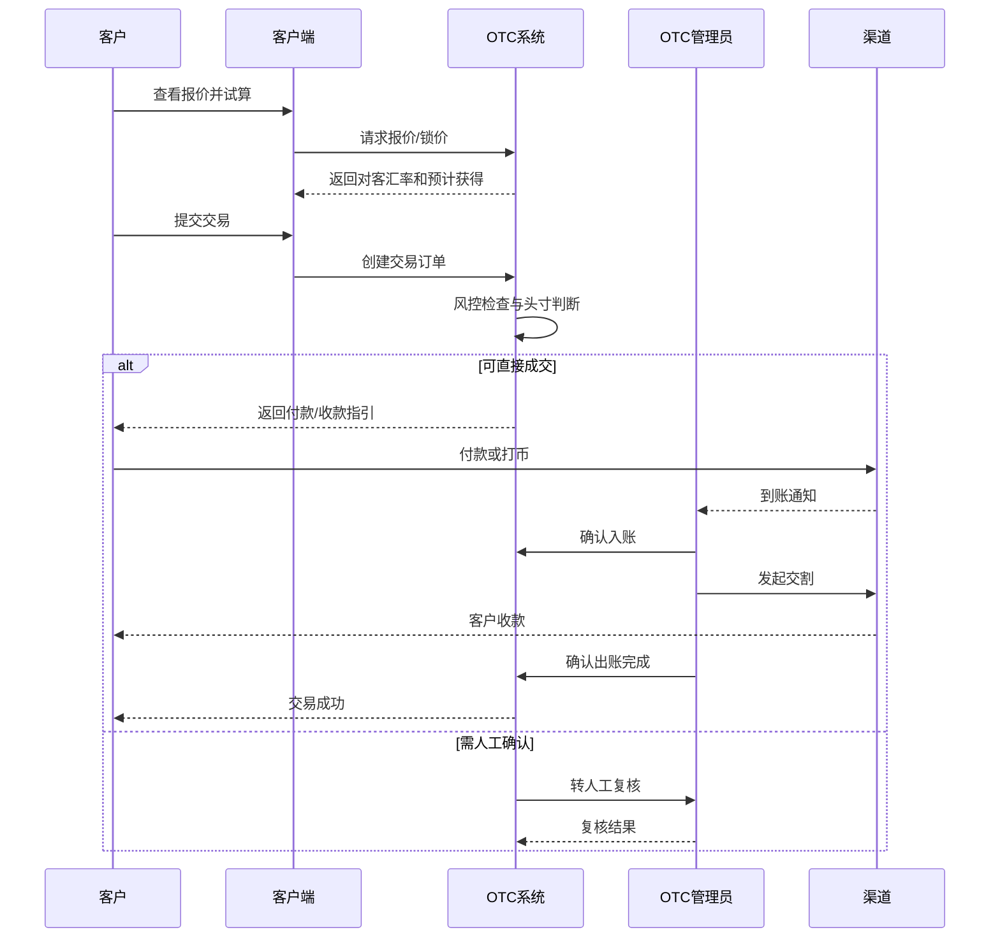
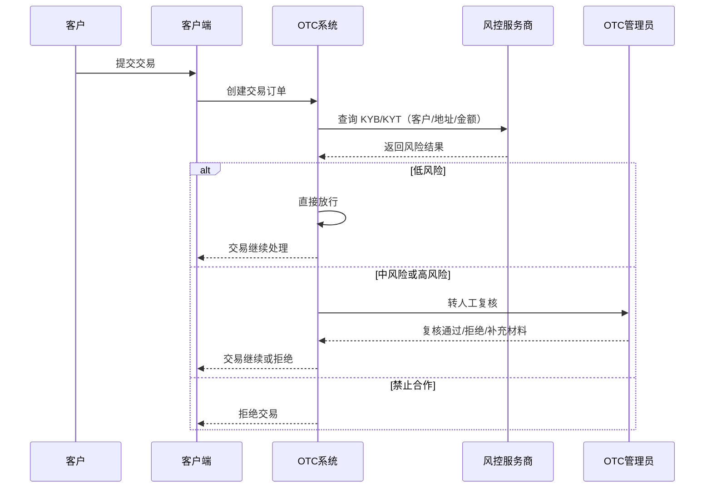
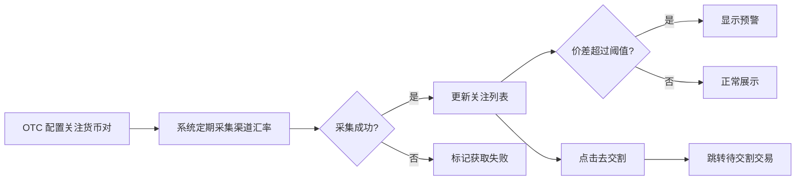
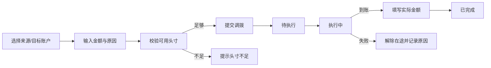
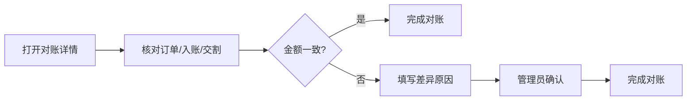

# 越南 OTC 运营后台 PRD（v1.0 MVP）

> **文档类型**：产品需求文档 / HTML Demo 交互依据  
> **产品形态**：OTC 运营后台 Web 系统  
> **目标**：用最小功能跑通客户、风控、报价、交易、头寸、调拨、对账和运营配置闭环  
> **日期**：2026-07-12  
> **参考**：`vietnam/vietnam-otc-solution.md`、`vietnam/vietnam-otc-client-prd-v1.md`、`vietnam/fiat-crypto-platform-interactive.html`、`vietnam/ex-otc-operations-demo.html`

---

## 1. 背景与目标

### 1.1 当前痛点

OTC 目前主要依靠聊天工具、银行/PSP 后台和 Excel 运营，痛点可归为三类：

**1. 资金安全与风控**

- 靠经验判断客户、地址和交易对手风险；
- 脏钱、冻卡、链上高风险地址、被动涉案；
- 购买的 KYT 工具只返回分数，无法直接转化为“能不能做”的决策；
- 不知道客户是否在黑名单，交易钱包地址能否收/付。

**2. 人工操作：报价、入账、对账**

- 对客报价依靠人工在聊天工具发送；
- 客户入账靠人工盯银行后台、PSP 后台和交易所钱包；
- 订单、银行流水、链上流水分散，对账靠 Excel；
- 价格更新不及时，容易因库存和市场波动亏点。

**3. 头寸不可视与调拨混乱**

- 不知道各银行、PSP 和钱包有多少头寸、可用多少；
- 不知道一笔交易能否直接成交，还是需要先调拨；
- 调拨靠微信/Telegram 通知财务，无凭证、无状态、无对账、责任不清；
- 付款时才发现余额不足，影响时效。

### 1.2 1.0 MVP 目标

1. OTC 可以维护客户和合作状态；
2. OTC 可以维护客户综合风险等级，查询交易钱包地址能否收/付；
3. OTC 可以维护对客汇率；
4. 客户可以登录简易系统查看报价、提交交易和查看进度；
5. OTC 可以查看并人工维护各渠道账户头寸；
6. 系统可判断交易“可直接成交”或“客户限额允许，但可出账头寸不足”；
7. OTC 可以记录调拨、入账和交割结果；
8. 每笔交易可以完成基础对账。

### 1.2.1 1.0 风控目标

本期风控只提供“能不能做”的决策信息：

- 客户综合风险等级：低风险、中风险、高风险、禁止合作；
- 黑名单/灰名单命中提示；
- 交易钱包地址 KYT 查询：能否收/能否付；
- 不建设复杂的风控列表、风控详情、风控工作台。

### 1.3 1.0 不做

- 公开注册和线上签约；
- 完整 KYC/KYB/KYT 风控工作台；
- 自动选择最优渠道；
- 自动执行调拨；
- 复杂多级审批；
- 会计级总账和财务报表；
- 自动利润核算；
- 所有银行、PSP 和钱包 API 对接；
- 复杂自定义角色权限；
- 多层级代理和分润。

一期允许通过人工录入和模拟数据更新渠道余额、流水和调拨状态。

### 1.4 交易范围（币种与方向）

1.0 只做 **On Ramp / Off Ramp**，即法币与数币之间的兑换，不做法币与法币之间的直接换汇。

- **数币**：USDT、USDC；
- **法币**：USD、VND、CNH；
- **方向**：
  - On Ramp（客户用法币买 U）：USD/VND/CNH → USDT/USDC；
  - Off Ramp（客户卖 U 换法币）：USDT/USDC → USD/VND/CNH。
- **支持的货币对（双向）**：USDT/USD、USDT/VND、USDT/CNH、USDC/USD、USDC/VND、USDC/CNH，共 6 组，每组均支持 On Ramp 和 Off Ramp 两个方向。
- 不支持：法币对法币（如 USD/VND 直接换汇）、数币对数币（如 USDT/USDC 互换）、本清单外的其他币种。

后续版本如需支持法币间换汇或更多币种，需单独评估。

---

---

## 2. 系统与用户

### 2.1 OTC 运营后台

供 OTC 内部人员使用，按支付机构常见模块划分：

- 客户管理；
- 风控管理（KYT/KYB）；
- 配置中心（客户费率、汇率）；
- 资金管理（渠道、收款工具、头寸、调拨、承兑/换汇）；
- 对账管理（渠道交易、客户交易、差错确认）；
- 设置中心（个人信息、安全、角色权限）。

### 2.2 客户简易端

客户简易端（客户端）功能详见 `vietnam-otc-client-prd-v1.md`。运营后台负责维护客户端不可见的渠道、头寸、调拨、风控详情和手续费成本信息。

### 2.3 角色

MVP 只设置两个内部角色：

| 角色 | 权限 |
| --- | --- |
| 管理员 | 全部功能、内部用户、停止合作、余额调整和调拨确认 |
| 操作员 | 客户、交易、报价、入账和交割操作；不能管理内部用户 |

客户为独立角色，只能访问客户简易端。

---

---

## 3. 信息架构

### 3.1 OTC 运营后台

```text
首页（Dashboard）

1. 客户管理
├─ 客户管理
│  ├─ 客户列表
│  ├─ 客户详情
│  │  ├─ 基本信息
│  │  ├─ 合作信息
│  │  ├─ 系统访问
│  │  ├─ 交易限额
│  │  ├─ 收付款信息（数币地址、法币账户）
│  │  └─ 交易记录
│  └─ 新增客户
├─ 客户协议
│  ├─ 协议列表
│  └─ 协议续约
└─ 客户交易
   ├─ 交易列表
   └─ 交易详情

2. 风控管理
├─ 客户综合风险等级
├─ 黑名单/灰名单提示
├─ KYT 查询记录
└─ 风险定级

3. 配置中心
├─ 客户费率配置
│  ├─ 费率列表
│  └─ 客户专属费率
└─ 汇率配置
   ├─ 参考汇率来源
   ├─ 汇率管理
   ├─ 对客报价
   └─ 汇率关注

4. 资金管理
├─ 渠道信息
├─ 收款工具
│  ├─ 收款账户（大账户）
│  └─ 收款钱包
├─ 渠道头寸
│  ├─ 头寸查询
│  └─ 头寸操作
├─ 头寸调拨
│  ├─ 调拨列表
│  └─ 创建调拨
│     （含跨渠道调拨、同渠道 A2A 转账）
└─ 承兑/换汇
   ├─ 承兑/换汇记录
   └─ 渠道间承兑

5. 对账管理
├─ 渠道交易
├─ 客户交易
└─ 差错确认

6. 设置中心
├─ 个人信息
├─ 安全设置
│  ├─ 登录密码
│  └─ Google Authenticator
└─ 角色权限
   ├─ 角色管理
   └─ 内部用户
```

### 3.2 模块与 PRD 章节映射

| 一级模块 | PRD 章节 | 说明 |
| --- | --- | --- |
| 客户管理 | §6 | 含客户列表/详情/生命周期、客户协议、客户交易 |
| 风控管理 | §7 | 含 KYB/KYT、综合风险等级、风险定级、查询记录 |
| 配置中心 | §8 | 含客户费率配置、汇率配置（参考汇率、对客报价） |
| 资金管理 | §9 | 含渠道信息、收款工具、渠道头寸、头寸调拨、承兑/换汇 |
| 对账管理 | §10 | 含渠道交易、客户交易、差错确认 |
| 设置中心 | §11 | 含个人信息、安全设置、角色权限 |

### 3.3 客户简易端

客户简易端（客户端）信息架构详见 `vietnam-otc-client-prd-v1.md`。

---

---

## 4. 登录与激活

### 4.1 OTC 内部用户激活

OTC 管理员在设置中心 → 内部用户中新增用户后，系统发送激活邮件。

```text
管理员新增内部用户
→ 填写姓名、登录邮箱、选择角色（管理员 / 操作员）
→ 保存并发送激活邮件
→ 用户点击激活链接
→ 设置登录密码
→ 激活成功 → 跳转登录页
```

激活链接包含一次性 token，默认有效期 24 小时。过期后管理员可重发激活邮件。

内部用户状态：

- 待激活：已创建账号，等待用户设置密码；
- 已激活：可以登录；
- 已停用：管理员停用，不能登录；
- 已锁定：连续登录失败次数达到阈值，自动锁定，管理员可解锁。


### 4.2 客户激活管理

```text
线下签订协议
→ OTC 在客户详情中填写客户邮箱
→ OTC 将客户转为已合作
→ 点击“发送激活邮件”
→ 客户点击链接设置密码
→ 客户登录简易端
```

不提供客户自助注册。客户激活链接由 OTC 运营端触发，客户简易端激活逻辑详见 `vietnam-otc-client-prd-v1.md` §4。


### 4.3 激活与登录密码

激活页面只完成密码设置，不要求短信验证码、邮箱验证码或 Google Authenticator 验证：

```text
点击邮件激活链接
→ 系统校验链接有效性
→ 设置登录密码
→ 再次输入密码
→ 激活成功
→ 返回登录页
```

密码要求：

- 8—32 位；
- 至少包含大写字母、小写字母、数字和特殊字符中的三类；
- 两次密码必须一致；
- 激活链接失效时提示联系 OTC/EX 管理员重发。

上述规则同时适用于 OTC 内部用户和客户。OTC 内部用户密码强度由系统统一校验；客户密码强度在客户端校验。

### 4.4 登录页

字段：登录账号、密码。登录账号支持登录邮箱或登录手机号。

操作：

- 登录；
- 显示/隐藏密码；
- 忘记密码；
- 登录后退出。

状态提示：账号或密码错误、待激活、已停用、激活链接失效。

登录规则：

- 登录只校验账号和密码；
- 不使用短信验证码登录；
- 不使用邮箱验证码登录；
- 不要求输入 Google Authenticator 动态码；
- Google Authenticator 仅用于敏感资金操作验证。

---

## 5. OTC Dashboard

Dashboard 参考 `fiat-crypto-platform-interactive.html` 的卡片布局，但只显示核心运营信息。

### 5.1 顶部指标

- 今日交易金额；
- 今日交易笔数；
- 待处理交易；
- 头寸预警账户数。

### 5.2 币种头寸

优先展示 USDT、VND、USD：

- 总账面余额；
- 已锁定；
- 可用头寸；
- 数据更新时间。

总余额为各渠道账户的统计视图，不代表可以从任意渠道直接使用。

### 5.3 待办事项

- 待确认入账：交易已进入 §6.11.1 的“待入账”状态（客户已提交交易或已获得付款指引），OTC 尚未核对渠道流水并点击“确认入账”（§6.11.6）；
- 待出账：入账已确认，等待 OTC 核对并点击“确认出账”（§6.11.7）；
- 客户限额允许，但可出账头寸不足：§6.11.3 判断为“客户限额允许，但可出账头寸不足”的交易，等待发起或完成调拨；
- 对账异常：§10.3 中状态为“金额差异”或“信息不符”的交易；
- 客户合同即将到期：合作结束日期临近（默认 30 天内）的已合作客户。

点击数字进入对应筛选后的列表。

### 5.4 最近记录

- 最近 5 笔交易；
- 最近 5 笔调拨。

---

---

## 6. 客户管理

### 6.1 信息拆分

客户详情拆为四部分：

| 部分 | 内容 |
| --- | --- |
| 基本信息 | 客户是谁、联系方式、所在国家和主营业务 |
| 合作信息 | 合作状态、合同、合作期限和停止原因 |
| 系统访问 | 是否已邀请、激活或停用 |
| 交易限额 | 客户各币种的单笔和日累计限额 |

合作状态和登录激活状态必须分开。

### 6.2 客户状态

#### 合作状态

```text
未合作 → 已合作 → 已停止
```

- 未合作：已录入资料，不能创建正式交易；
- 已合作：合同和期限完整，可以激活客户；
- 已停止：不能创建新交易，客户登录默认停用。

#### 系统访问状态

```text
未邀请 → 待激活 → 已激活 → 已停用
```

### 6.3 客户字段

#### 基本信息

- 客户 ID：系统生成；
- 昵称；
- 客户名称；
- 客户类型：个人/企业；
- 国家/地区；
- 主营业务；
- 联系人姓名；
- 联系邮箱；
- 联系手机；
- 备注；
- 创建和更新时间。

#### 合作信息

- 合作状态；
- 合同编号；
- 合同附件；
- 合作开始日期；
- 合作结束日期；
- 停止原因；
- 操作人和操作时间。

### 6.4 风险扫描

- 未合作客户可以点击“扫描客户信息”；
- Demo 模拟返回低、中、高风险标签；
- OTC 只看到风险等级和能否继续合作，不展示底层扫描报告；
- 系统保留扫描时间和结果；
- 高风险默认不能转为已合作。

MVP 不建设扫描记录列表和人工风控工作台。

### 6.5 客户列表

筛选：关键词、客户类型、国家、合作状态、访问状态、到期时间。

表格：客户 ID、昵称/客户名称、类型、国家、联系人、合作状态、访问状态、合作期限、更新时间、操作。

操作：查看、编辑、扫描、开始合作、发送激活邮件、停止合作。

支持按当前筛选条件导出；不导出合同附件和扫描报告。

### 6.6 新增客户

采用两步表单：

#### 第一步：基本信息

填写客户、主体和联系人信息。支持保存草稿。

#### 第二步：合作信息

上传合同附件、填写合作期限，然后提交扫描。

扫描允许合作后，在客户详情点击“开始合作”，状态变为已合作。系统询问是否立即发送激活邮件。

### 6.7 客户详情

页签：基本信息、合作信息、系统访问、交易限额、收付款信息、交易记录。

#### 6.7.1 收付款信息

OTC 可在客户详情查看客户在客户端维护的数币地址和法币账户，用于交易核对和退款确认。

| 类型 | 展示内容 | OTC 操作 |
| --- | --- | --- |
| 数币地址 | 地址别名、币种、网络、地址、用途标签、状态 | 查看、标记异常、备注 |
| 法币账户 | 账户别名、币种、类型、银行/钱包、账户名、账号、用途标签、状态 | 查看、标记异常、备注 |

规则：

- 数币地址和法币账户由客户在客户端自助维护，OTC 端只读；
- OTC 发现地址/账户异常时，可以标记为“待复核”，中风险交易默认进入人工确认；
- 交易快照保存当前选用的地址/账户，避免后续修改导致历史记录不一致；
- 退款时，OTC 可以选择原路退回，或引导客户在客户端指定新的退款地址/账户。

头部根据状态显示主操作：

- 未合作：扫描/开始合作；
- 已合作未邀请：发送激活邮件；
- 已合作：新建交易；
- 已停止：仅查看。

### 6.8 停止合作

弹窗要求填写停止原因，并提示：

- 客户不能创建新交易；
- 已有未完成交易仍需处理；
- 客户登录将被停用。

确认后更新合作和访问状态。


### 6.9 交易限额

在客户详情维护，按币种独立设置：

| 字段 | 类型 | 说明 |
| --- | --- | --- |
| 币种 | 下拉选择 | 限定 §1.4 支持的数币/法币 |
| 单笔最小金额 | 数字 + “不限最小金额”开关 | 开关打开时该字段不生效，任意金额都满足最小要求 |
| 单笔最大金额 | 数字 + “不限最大金额”开关 | 开关打开时该字段不生效，单笔不设上限 |
| 日累计限额 | 数字 + “不限日累计限额”开关 | 开关打开时当日累计金额不设上限 |
| 启用/停用 | 单选 | 停用等同于没有该币种的有效限额 |

交互规则：

- 三个限额字段互相独立，“不限最小/最大/日累计”可以分别打开，也可以三者都打开（表示该币种不限额）；
- 打开对应“不限”开关后，数字输入框禁用并清空，不校验数值；
- 若单笔最大金额和日累计限额都未设为“不限”，则单笔最大金额不得大于日累计限额；
- 若单笔最小金额和单笔最大金额都未设为“不限”，则最小金额不得大于最大金额。

判断逻辑：

```text
客户提交交易
→ 查该客户该币种是否存在启用中的限额配置
  → 不存在或已停用：进入人工确认
  → 存在：
    金额 ≥ 单笔最小金额（若未设为不限）
    且 金额 ≤ 单笔最大金额（若未设为不限）
    且 当日累计已用 + 本次金额 ≤ 日累计限额（若未设为不限）
    → 全部满足：按 §6.11.3 继续判断头寸，满足则直接成交
    → 任一不满足：进入人工确认
```

---

### 6.10 客户协议
MVP 客户协议以客户合作合同的形式管理，用于记录合作期限、费率、币种范围和续约信息。

#### 协议字段

| 字段 | 类型 | 说明 |

| --- | --- | --- |

| 协议编号 | 文本 | 系统生成或 OTC 手工录入 |

| 客户 | 关联 | 已合作客户 |

| 协议类型 | 单选 | 标准协议 / 补充协议 |

| 合作开始日期 | 日期 | 合同生效日 |

| 合作结束日期 | 日期 | 合同到期日 |

| 协议状态 | 单选 | 生效中 / 即将到期 / 已过期 / 已终止 |

| 附件 | 文件 | 合同扫描件或 PDF |

| 默认费率 | 文本 | 记录全局默认手续费说明 |

| 默认汇率 | 文本 | 记录默认 Markup 说明 |

| 备注 | 多行文本 | 特殊条款 |

#### 协议列表

入口：客户管理 → 客户协议。

筛选：客户、协议状态、到期时间范围、协议类型。

表格：协议编号、客户、开始日期、结束日期、剩余天数、状态、操作。

操作：查看、续约、终止。

#### 续约流程

```text

协议到期前 30 天，系统标记“即将到期”

→ OTC 点击“续约”

→ 上传新合同或延长结束日期

→ 填写续约原因

→ 保存后协议状态更新为“生效中”

→ 客户详情同步最新合作期限

```

#### 终止协议

终止协议前必须确认：

- 该客户下没有未完成的交易；

- 终止后客户不能创建新交易；

- 已停止客户的协议状态自动变为“已终止”。

终止后保留历史协议记录，便于审计和对账。

### 6.11.1 交易状态

交易按方向区分为两类：

- **买入数币（On Ramp）**：客户支付法币，OTC 向客户指定地址出币；
- **卖出数币（Off Ramp）**：客户支付数币，OTC 向客户指定法币账户出款。

两个方向统一使用以下状态命名：

```text
待入账 → 待出账 → 出账成功 / 出账失败 → 已对账
```

状态说明：

| 状态 | 说明 |
| --- | --- |
| 待入账 | 客户已提交交易，等待 OTC 确认对应方向的入账 |
| 待出账 | 入账已确认，等待 OTC 向客户完成出币/出款 |
| 出账成功 | OTC 已完成出币/出款，客户已收到资金 |
| 出账失败 | 出币/出款执行失败，需要 OTC 处理退款或重新出账 |
| 已取消 | 客户未付款/打币或 OTC 拒绝，交易终止 |
| 退票/退款中 | 出账成功后发生退回，正在处理退款 |
| 已退款 | 退款已完成 |
| 已对账 | 交易完成对账 |

客户视角状态：

| 状态 | 说明 |
| --- | --- |
| 处理中（Pending） | 交易已提交，处于待入账、待出账或 OTC 复核中 |
| 成功 | OTC 已完成出币/出款 |
| 失败 | 因风控、限额、头寸、渠道等原因无法完成，已取消 |
| 退票/退款 | 出账成功后，因 KYT 回溯、银行退票、客户申诉等原因需退回资金 |

运营后台内部状态：

```text
待人工确认（可选）
→ 待入账
→ 入账已确认
→ 待出账
→ 出账成功 / 出账失败
→ 已对账
```

异常状态：客户限额允许，但可出账头寸不足、入账异常、出账失败、已取消、对账异常、退票/退款中、已退款。



### 6.11.2 交易字段

- 交易 ID；
- 客户；
- 创建来源：客户提交；
- 交易方向；
- 卖出和买入币种/金额；
- 成交汇率；
- 付款人和收款人；
- 收付款账户/地址；
- 限额检查结果；
- 头寸检查结果；
- 指定收款渠道账户；
- 指定出账渠道账户；
- 关联入账和出账流水；
- 状态和时间。

### 6.11.3 可直接成交判断

“可直接成交”不是判断 OTC 全部账户加总后有没有钱，而是判断是否至少存在一个**可实际完成本次出币/出款的渠道账户**。

#### 6.11.3.1 先确定交割需求

| 交易方向 | 客户付给 OTC | OTC 需要出币/出款 | 需要检查的头寸 |
| --- | --- | --- | --- |
| On Ramp：客户买 U | 法币 | USDT/USDC | 可出币钱包的对应数币头寸 |
| Off Ramp：客户卖 U | USDT/USDC | 法币 | 可付款账户的对应法币头寸 |

系统根据客户预计获得金额，确定：目标出币/出款币种、目标金额、收款国家、收款方式和预计出账时间。

#### 6.11.3.2 候选交割账户

一个渠道账户只有同时满足以下条件，才进入候选集合：

1. 账户状态为启用；
2. 支持目标出币/出款币种；
3. 支持本次出币/出款动作：法币付款或数币出币；
4. 支持客户收款国家、银行账户类型或链网络；
5. 付款名义满足本次交易要求；
6. 单笔和当日渠道限额足够；
7. 余额数据未过期；
8. 渠道不在维护中；
9. 账户没有头寸异常。

不满足上述条件的余额不能参与“可直接成交”判断。例如，一个只能收款不能付款的 VND 账户，即使余额充足，也不能用于 VND 出款。

#### 6.11.3.3 可出账头寸公式

每个候选账户独立计算：

```text
可出账头寸
= 账面可用余额
− 已被客户交易锁定的头寸
− 执行中调拨的在途流出
− OTC 设置的最低保留额
− 已提交但渠道尚未记账的待扣减金额
```

以下金额不计入可出账头寸：

- 待确认客户入账；
- 在途调拨流入；
- 冻结余额；
- 其他币种余额；
- 需要先换汇才能使用的余额；
- 数据已过期的账户余额。

判断规则：

```text
任一候选账户可出账头寸 ≥ 客户应得金额 + 预计交割手续费
→ 头寸充足

所有候选账户均不足，但允许拆分交割且合计足够
→ MVP 进入人工确认，不自动拆分

候选账户合计也不足
→ 需要补充头寸
```

MVP 默认一笔客户交易从一个渠道账户完成交割，不自动跨多个账户拆分。

#### 6.11.3.4 完整判断顺序

```text
客户已合作且可登录
→ 报价有效且金额在报价范围
→ 客户单笔/日累计限额通过
→ 找到符合出币/出款条件的候选账户
→ 候选账户余额数据有效
→ 计算可出账头寸
→ 足够：锁定具体账户头寸，订单进入待入账
→ 不足：订单进入需要补充头寸
→ 数据过期/只能拆分：进入人工确认
```

结果：

| 结果 | 处理 |
| --- | --- |
| 可直接成交 | 锁定目标出币/出款币种头寸，进入待入账 |
| 人工确认 | 无限额、超限或余额数据过期 |
| 客户限额允许，但可出账头寸不足 | 客户限额允许，但交割头寸不足 |
| 不可交易 | 客户已停止、报价失效或无可用账户 |

### 6.11.4 头寸锁定与释放

客户提交交易且判断为可直接成交后：

1. 系统选中一个具体出账渠道账户；
2. 创建头寸锁定记录；
3. 账户“已锁定”增加；
4. 账户“可出账头寸”同步减少；
5. 交易详情记录锁定账户、金额和时间；
6. 客户端只显示交易已提交，不显示锁定账户。

释放场景：

- 客户未在订单有效期内付款；
- 交易被取消或拒绝；
- 入账异常导致交易终止；
- OTC 改用另一个出账渠道账户，原锁定先释放，新账户重新锁定。

实际出账成功后，锁定金额转为实际扣减；不能先释放再扣减，否则可能被另一笔交易重复占用。

### 6.11.5 交易列表

筛选：交易 ID、客户、方向、币种、状态、创建时间。

表格：交易 ID、客户、卖出、买入、汇率、限额结果、头寸结果、状态、创建时间、操作。

### 6.11.6 入账确认

点击“确认入账”打开弹窗：

- 收款渠道账户；
- 实际入账金额；
- 付款人；
- 外部流水号/TxID；
- 入账时间；
- 凭证；
- 备注。

金额或付款人不一致时提示异常，允许管理员填写说明后继续或标记入账异常。

### 6.11.7 客户出账流程

客户入账确认后，交易进入待出账。OTC 需要向客户完成出币或出款，有两种执行方式。

#### 方式 A：从 EX OTC 系统发起

适用于已经完成 API 对接的渠道：

```text
打开待出账交易
→ 系统再次检查锁定账户状态和头寸
→ 确认客户收款账户/钱包地址
→ Google Authenticator 验证
→ 点击“发起出账”
→ 系统向渠道提交付款/出币请求
→ 记录渠道交易 ID
→ 等待渠道返回处理中/成功/失败
→ 成功后扣减锁定头寸并更新客户交易
```

#### 方式 B：OTC 在渠道后台执行

适用于未接 API 或 OTC 习惯在 PSP/钱包后台操作：

```text
打开待出账交易
→ 点击“去渠道执行/记录外出账”
→ 系统展示建议出账渠道账户和客户收款信息
→ OTC 在渠道后台完成付款或出币
→ 回到 EX 填写渠道、账户、实际金额、手续费、外部流水号/TxID和时间
→ 可上传凭证
→ 系统校验是否存在已同步的相同渠道流水
→ 关联渠道流水
→ 标记出账成功
```

出账确认弹窗字段：

- 出账方式：系统发起/渠道后台执行；
- 出账渠道账户；
- 计划出账金额；
- 实际出账金额；
- 收款账户/钱包地址；
- 网络，数币时必填；
- 手续费及手续费币种；
- 外部流水号/TxID；
- 出账时间；
- 凭证；
- 备注。

成功后的账务动作：

1. 渠道账户账面余额按实际扣款更新或等待渠道余额同步；
2. 头寸锁定解除并转为实际扣减；
3. 客户交易记录实际出账金额和费用；
4. 交易进入出账成功；
5. 进入待对账。

实际出账金额与客户应得金额不一致时，不能直接完成；必须标记出账差异并填写原因。

### 6.11.8 出账失败与换账户

- 系统发起失败：保留或释放锁定取决于渠道是否明确未扣款；
- 渠道状态未知：进入“出账状态待确认”，不得立即用另一账户重试；
- 明确失败且未扣款：释放原账户锁定；
- 更换账户：重新执行候选账户检查并锁定新账户；
- 已扣款但客户未收到：进入异常工单和对账差异，不能重复出账。

### 6.11.9 交易详情

页签：交易信息、入账、出账、头寸/调拨、对账、操作记录。

页面顶部显示当前状态和唯一主操作，例如“确认入账”或“确认出账”。

---

---

### 6.11.10 退票/退款流程

交易出账成功后，仍可能因以下原因触发退票/退款：

- 银行/PSP 端发起退票（如客户付款账户被冻结、收款人信息错误、监管拦截）；
- 链上出币后被退回，或客户填写的提币地址错误导致无法到账；
- KYT 回溯发现交易钱包地址存在风险；
- 客户投诉或操作错误，经 OTC 确认需要退回资金。

退票/退款处理流程：

```text
发现异常
→ 系统发送通知给 OTC
→ OTC 单独录入实际退回金额/币数量
→ 暂停关联交易或对账状态
→ 记录退票/退款原因
→ 核对原交易入账和出账流水
→ 生成退款方案（退法币 / 退数币 / 按原路退回）
→ 与客户确认退款账户/地址
→ 发起退款出币/出款或客户线下打款
→ 更新交易状态为“已退款”
→ 记录退款流水并完成对账调整
```


退款处理原则：

- 买入数币（On Ramp）：若已出币成功，需协商退币或等值法币；若尚未出币，直接退回法币；
- 卖出数币（Off Ramp）：若已出款成功，需协商退款或等值数币；若尚未出款，直接退回数币；
- 退款金额/币数量可能因手续费、汇率波动、链上 gas 等与原交易金额不一致，OTC 需录入实际退回金额并填写差异原因；
- 退款交易必须与原交易关联，并支持客户端查看退款明细；
- 客户端在退款过程中只需确认退款账户/地址和查看进度，不直接发起退款。

---

---

## 7. 风控管理

### 7.1 风控目标

本期风控只提供“能不能做”的决策信息，不建设复杂的风控列表、风控详情或风控工作台：

- 客户综合风险等级；
- 黑名单/灰名单命中提示；
- 交易钱包地址 KYT 查询：能否收/能否付。

### 7.2 客户综合风险等级

#### 7.2.1 等级定义

风控模块综合 KYB 和 KYT 结果，给出客户综合风险等级：

| 风险等级 | 含义 | 交易影响 |
| --- | --- | --- |
| 低风险 | 无异常命中 | 可直接成交 |
| 中风险 | 命中灰名单或存在可疑特征 | 交易需 OTC 人工复核 |
| 高风险 | 命中严重风险标签 | 暂停交易，需补充材料或高级别复核 |
| 禁止合作 | 命中黑名单或明确不可做 | 不能创建新交易，已存在交易按失败处理 |

风险等级在客户详情页展示，并可由管理员手动调整。调整需记录原因。

#### 7.2.2 等级评估流程

```text
新增客户 / 提交交易
→ 系统调用风控服务商 KYB/KYT 接口
→ 返回命中标签和原始风险结论
→ 系统映射为低风险 / 中风险 / 高风险 / 禁止合作
→ 结果写入客户/交易风控快照
→ 中风险以上转人工复核
```

#### 7.2.3 风险等级页面

页面：风控管理 → 客户风险等级。

列表字段：

- 客户 ID / 名称；
- 当前风险等级；
- 最近评估时间；
- 命中标签（黑名单/灰名单/地址风险等，展示标签名，不展示服务商原始报告）；
- 待复核交易数；
- 操作：查看、调整等级、查看历史。

调整等级弹窗：

- 新等级；
- 调整原因；
- 是否同步暂停客户交易；
- 生效时间（立即/指定时间）。

规则：

- 手动调整后，系统不再自动覆盖，除非管理员手动恢复自动评估；
- 等级变更记录保存操作人、时间、原因；
- 高风险/禁止合作的客户，交易创建按钮禁用。

### 7.3 黑名单/灰名单检查

#### 7.3.1 检查范围

新增客户和交易提交时，系统检查客户是否命中黑名单/灰名单：

- 黑名单：客户主体、法人、董事、股东、关联地址、关联钱包地址命中，则禁止合作；
- 灰名单：存在可疑记录但证据不足，标记为中风险，交易需复核。

#### 7.3.2 命中结果展示

命中后在客户详情/交易详情显示风险提示卡片：

- 命中类型（主体/地址/关联人）；
- 风险等级（黑名单/灰名单）；
- 处理建议（禁止合作 / 复核 / 补充材料）；
- 命中时间。

不展示风控服务商原始证据链、分数或详细报告。

#### 7.3.3 黑名单/灰名单页面

页面：风控管理 → 名单命中记录。

列表字段：

- 客户 / 交易 ID；
- 命中对象类型（主体 / 法币账户 / 数币地址）；
- 命中值（脱敏展示）；
- 名单类型（黑名单 / 灰名单）；
- 命中时间；
- 当前处理状态（待处理 / 已复核 / 已处理）；
- 操作：查看、标记已处理。

搜索：客户名称、地址/账号（部分匹配）、名单类型、时间范围。

### 7.4 交易钱包地址 KYT 查询

#### 7.4.1 查询范围

每笔交易提交时，系统对交易涉及的数币钱包地址或银行账号执行 KYT 查询：

| 查询项 | 买入数币（On Ramp） | 卖出数币（Off Ramp） |
| --- | --- | --- |
| 客户付款钱包/账户 | 能否收 | — |
| 客户收款钱包/账户 | — | 能否付 |
| OTC 收款钱包/账户 | 能否收 | — |
| OTC 付款钱包/账户 | — | 能否付 |

#### 7.4.2 结果处理

KYT 结果只返回“能做/需复核/不能做”三类结论，不展示复杂分数：

- **能做**：地址/账户无异常，交易继续；
- **需复核**：地址/账户存在可疑特征，交易转 OTC 人工复核；
- **不能做**：地址/账户命中黑名单或高风险标签，交易直接拒绝。

#### 7.4.3 KYT 查询记录页面

页面：风控管理 → KYT 查询记录。

列表字段：

- 查询时间；
- 关联客户 / 交易 ID；
- 查询对象类型（数币地址 / 法币账户）；
- 查询值（脱敏）；
- 查询方向（收 / 付）；
- 结果（能做 / 需复核 / 不能做）；
- 风险标签；
- 操作：查看、重新查询。

规则：

- 同一地址/账户在一定时间内的重复查询可复用缓存结果，降低服务商调用成本；
- 查询记录不可删除，用于后续审计；
- 查询结果与交易快照绑定，不因后续重新查询而改变历史交易结论。

### 7.5 风控流程时序



风控服务商为外部服务，MVP 只采购并调用其 KYB/KYT 接口，不自行维护复杂规则库。

#### 7.5.1 人工复核页面

页面：风控管理 → 待复核交易。

列表字段：

- 交易 ID / 客户；
- 触发复核原因（客户中风险 / 地址 KYT 需复核 / 高风险待补充材料）；
- 风险标签摘要；
- 提交时间；
- 操作：通过、拒绝、要求补充材料、查看详情。

复核详情页：

- 交易基本信息；
- 客户风险等级和命中标签；
- 涉及的地址/账户 KYT 结果；
- 复核结论：通过 / 拒绝 / 补充材料；
- 复核意见；
- 操作记录。

复核通过后交易按正常流程继续；复核拒绝后交易标记为失败并通知客户；要求补充材料时，交易挂起并提示客户联系 OTC。

### 7.6 风控计费

MVP 阶段风控相关成本不纳入运营成本核算，也不向客户单独收费：

- 风控服务商的 KYB/KYT 调用费用由平台/OTC 承担；
- 交易手续费、Markup 中不包含风控成本分摊；
- 后续如风控成本过高，可先采用简单收费模式扩展，例如按客户数包月、按 KYT 查询次数阶梯计价，或作为增值服务单独报价；
- 任何收费模式上线前需在配置中心补充“风控服务计费规则”模块，并更新对客报价说明。

当前阶段只需在成本侧记录风控服务支出，不向客户展示。

---

## 8. 配置中心

### 8.1 客户费率配置
MVP 支持在全局对客报价基础上，为单个客户配置专属手续费和汇率 Markup。未配置的客户继承全局报价。

#### 配置入口

- 客户详情 → 手续费/汇率页签；

- 配置中心 → 客户费率配置列表；

- 也可以从全局对客汇率列表点击“按客户配置”快速跳转。

#### 客户专属汇率配置

| 字段 | 类型 | 说明 |

| --- | --- | --- |

| 客户 | 关联选择 | 选择已合作客户 |

| 货币对 | 下拉选择 | 限定 §1.4 支持的 6 组货币对 |

| 方向 | 单选 | 客户买 U / 客户卖 U |

| 继承全局 | 开关 | 打开时该货币对+方向完全使用 §8.2 的全局报价 |

| 自定义 Markup | 数字 | 覆盖全局 Markup；输入 `0` 表示按参考汇率平兑 |

| 生效时间 | 日期时间 | 默认立即生效 |

| 失效时间 | 日期时间 | 留空表示长期有效 |

| 状态 | 单选 | 启用 / 停用 |

覆盖规则：

- 同一客户同一货币对同一方向只能有一条启用中的配置；

- 新配置保存后，原启用配置自动失效；

- 自定义 Markup 与全局 Markup 独立，修改全局不影响已启用客户配置；

- 对客汇率 = 参考汇率 ×（1 ± 自定义 Markup%）。

#### 客户手续费配置

| 字段 | 类型 | 说明 |

| --- | --- | --- |

| 客户 | 关联选择 | 选择已合作客户 |

| 收费类型 | 单选 | 按比例 / 固定金额 / 混合 |

| 适用交易 | 多选 | On Ramp / Off Ramp / 全部 |

| 收费币种 | 下拉选择 | 卖出币种 / 买入币种 / 固定币种 |

| 费率 / 固定金额 | 数字 | 按比例收费输入百分比；固定金额收费输入数值 |

| 最低手续费 | 数字 | 按比例或混合收费时生效 |

| 最高手续费 | 数字 | 按比例或混合收费时生效 |

| 生效 / 失效时间 | 日期时间 | 同汇率配置 |

| 状态 | 单选 | 启用 / 停用 |

计费示例：

```text

收费类型：按比例

适用交易：On Ramp

收费币种：卖出币种（VND）

费率：0.5%

最低手续费：50,000 VND

客户支付 100,000,000 VND

手续费 = max(100,000,000 × 0.5%, 50,000) = 500,000 VND

客户实际用于兑汇的金额 = 99,500,000 VND

```

#### 交互规则

- 客户提交交易时，系统优先查找该客户该货币对该方向启用中的专属配置；

- 未找到则使用全局报价（§8.2）；

- 若同时配置了手续费和专属汇率，系统先计算专属汇率的兑汇金额，再扣减手续费；

- 客户试算页面展示“预计获得金额（已扣手续费）”；

- 专属配置变更不影响已创建交易的报价快照。

#### 列表展示

页面以卡片或表格展示所有客户的专属配置，支持按客户、货币对、方向、状态筛选：

- 客户 / 客户 ID；

- 货币对 + 方向；

- 当前 Markup / 费率；

- 生效/失效时间；

- 状态；

- 操作：编辑、停用、复制。

### 8.2 核心概念与统一口径

汇率模块包含三个不同概念：

| 概念 | 定义 | 是否对客户展示 |
| --- | --- | --- |
| 参考汇率 | 行情源或 OTC 人工录入的市场基准价 | 否 |
| Markup | OTC 在参考汇率上增加或扣减的点差 | 否 |
| 对客汇率 | 客户最终看到并用于试算、下单的汇率 | 是 |

MVP 的货币对统一写作：

```text
数币 / 法币
例如：USDT/VND
```

汇率含义统一为：

```text
1 单位数币 = X 单位法币
例如：1 USDT = 25,500 VND
```

所有列表、表单、报价牌、试算页和交易详情都必须使用该口径，不允许部分页面反向显示 `1 VND = X USDT`。

支持的货币对限定为 §1.4 的 6 组：USDT/USD、USDT/VND、USDT/CNH、USDC/USD、USDC/VND、USDC/CNH。

### 8.3 交易方向与计算逻辑

#### On Ramp：客户买 U

客户支付法币，获得 USDT/USDC。对客汇率越高，客户购买 1 U 需要支付的法币越多。

```text
On Ramp 对客汇率 = 参考汇率 ×（1 + Markup%）
客户获得数币 = 客户支付法币 ÷ 对客汇率
```

示例：

```text
参考汇率：1 USDT = 25,000 VND
Markup：2%
对客汇率：1 USDT = 25,500 VND
客户支付：255,000,000 VND
客户预计获得：10,000 USDT
```

#### Off Ramp：客户卖 U

客户支付 USDT/USDC，获得法币。对客汇率越低，客户卖出 1 U 获得的法币越少。

```text
Off Ramp 对客汇率 = 参考汇率 ×（1 − Markup%）
客户获得法币 = 客户支付数币 × 对客汇率
```

示例：

```text
参考汇率：1 USDT = 25,000 VND
Markup：2%
对客汇率：1 USDT = 24,500 VND
客户支付：10,000 USDT
客户预计获得：245,000,000 VND
```

Markup 在 MVP 中只允许输入 `0` 或正数。方向由系统决定加或减，避免运营人员输入负数造成双重反向计算。

计算精度：

- 参考汇率和对客汇率最多 8 位小数；
- USDT/USDC 金额最多 6 位小数；
- USD/CNH 金额最多 2 位小数；
- VND 金额显示为整数；
- 系统计算使用未截断原始值，页面按币种精度展示；
- 客户预计获得金额默认向下取整到目标币种允许精度。

### 8.4 参考汇率管理

#### 8.4.1 参考汇率来源

MVP 支持两种来源：

| 来源 | 说明 |
| --- | --- |
| 自动行情源 | 系统读取外部市场基准价，展示来源和更新时间 |
| 人工维护 | OTC 运营人员手工录入参考汇率和有效期 |

每个货币对只能配置一个当前生效的参考汇率来源。Demo 可以模拟自动行情源刷新，不要求真实调用 API。

#### 8.4.2 参考汇率字段

- 货币对；
- 来源类型：自动/人工；
- 来源名称，例如“市场行情源 A”或“OTC 人工报价”；
- 当前参考汇率；
- 更新时间；
- 最大有效时长，例如 5 分钟、30 分钟、24 小时；
- 失效时间；
- 状态：有效、即将过期、已过期、获取失败、已停用；
- 更新人，人工汇率时展示。

#### 8.4.3 参考汇率页面

“对客汇率”模块顶部设置两个页签：

```text
对客报价 | 参考汇率
```

参考汇率页表格：

| 列 | 说明 |
| --- | --- |
| 货币对 | USDT/VND 等 |
| 参考汇率 | 同时显示 `1 USDT = 25,000 VND` |
| 来源 | 自动行情源/人工 |
| 更新时间 | 显示具体时间 |
| 有效期 | 剩余时间或已过期 |
| 状态 | 有效/即将过期/已过期/获取失败 |
| 操作 | 刷新、人工更新、查看记录 |

顶部筛选：货币对、来源类型、状态。

#### 8.4.4 自动行情源交互

- 点击“刷新”后按钮显示“刷新中…”；
- 刷新成功：更新汇率、更新时间和失效时间，并显示成功提示；
- 刷新失败：保留上一次成功值，同时标记获取失败；
- 上一次成功值仍在有效期内时，对客报价可以继续使用；
- 上一次成功值已过期时，相关对客报价暂停用于新交易；
- 页面展示“最后成功更新时间”，避免把失败刷新时间误认为行情时间。

#### 8.4.5 人工更新参考汇率

点击“人工更新”打开弹窗：

- 货币对，只读；
- 当前参考汇率，只读；
- 新参考汇率，必填；
- 有效时长，必填；
- 变更原因，必填；
- 变更前后差异百分比，系统计算；
- 当前登录密码或 Google Authenticator 动态码，根据安全设置验证。

当新汇率与当前值偏差超过预警阈值时，弹窗显示明显警告并要求再次确认。

保存后：

- 新参考汇率立即生效；
- 旧值进入更新记录；
- 引用该货币对的对客报价重新计算预览值；
- 已创建交易的历史报价快照不变化。

#### 8.4.6 过期判断

```text
当前时间 < 失效时间 → 有效
剩余有效时间 ≤ 20% → 即将过期
当前时间 ≥ 失效时间 → 已过期
```

参考汇率过期后：

- OTC 端相关对客报价显示“参考价已过期”；
- 客户端不展示“立即交易”，改为“暂不可交易”；
- 已提交且已锁定报价的交易不受影响；
- 尚未确认提交的试算立即失效并要求刷新。

### 8.5 对客报价数据结构

#### 8.5.1 报价字段

- 报价 ID，系统生成；
- 货币对；
- 方向：On Ramp/Off Ramp；
- 参考汇率来源；
- 参考汇率快照；
- Markup 百分比；
- 当前对客汇率，系统计算；
- 最小交易金额；
- 最大交易金额；
- 金额口径：客户卖出币种；
- 报价生效时间；
- 报价失效时间；
- 客户确认后的锁价时长，例如 60 秒；
- 状态：草稿、待生效、生效中、已失效、已停用；
- 创建人、创建时间、最后更新人和更新时间。

MVP 报价适用于全部已合作客户，不做客户级报价、客户等级价格或阶梯价格。

#### 8.5.2 金额范围口径

最小/最大交易金额始终按照“客户卖出币种”配置：

- On Ramp：客户卖出法币，因此 USDT/VND 的金额范围单位为 VND；
- Off Ramp：客户卖出数币，因此 USDT/VND 的金额范围单位为 USDT。

页面必须在金额输入框右侧明确展示币种，避免运营人员误把 On Ramp 的范围填写成 USDT。

### 8.6 对客报价列表

#### 页面结构

```text
页面标题 + 新建报价
↓
当前有效报价摘要
↓
筛选区
↓
报价表格
```

摘要卡片：生效中、待生效、即将失效、参考价异常。

筛选：货币对、方向、状态、生效时间范围。

表格：

| 列 | 展示内容 |
| --- | --- |
| 货币对 | USDT/VND |
| 方向 | 客户买 U/客户卖 U，不能只写买入/卖出 |
| 参考汇率 | 值、来源、更新时间 |
| Markup | 例如 2.00% |
| 对客汇率 | `1 USDT = 25,500 VND` |
| 金额范围 | `10,000,000—500,000,000 VND` |
| 有效期 | 生效和失效时间 |
| 状态 | 状态标签；参考价过期时附警告 |
| 操作 | 查看、编辑、复制、停用 |

行点击进入报价详情；报价详情展示计算公式、当前值、历史版本和被多少笔交易使用。

### 8.7 新建对客报价

采用三步交互：

```text
① 基础设置 → ② 价格和范围 → ③ 预览发布
```

#### 步骤一：基础设置

- 选择货币对；
- 选择方向：客户买 U/客户卖 U；
- 选择参考汇率来源；
- 展示当前参考汇率、更新时间和状态；
- 设置报价生效和失效时间。

参考汇率不存在或已过期时，允许保存草稿，不允许发布。

#### 步骤二：价格和范围

- 输入 Markup 百分比；
- 系统实时显示公式；
- 实时计算对客汇率；
- 输入最小和最大交易金额；
- 设置锁价时长；
- 显示一组默认试算示例。

页面预览示例：

```text
客户买 U
参考汇率                 25,000 VND
Markup                       2.00%
对客汇率                 25,500 VND

客户支付           255,000,000 VND
客户预计获得            10,000 USDT
```

#### 步骤三：预览发布

同时展示：

- OTC 内部视图：参考汇率、Markup、计算公式；
- 客户端视图：方向、对客汇率、金额范围和有效期；
- 生效时间；
- 冲突检查结果。

按钮：上一步、保存草稿、发布报价。

发布成功后返回报价列表，并将新报价定位到第一行。

### 8.8 报价校验与冲突规则

发布时校验：

1. 参考汇率存在且有效；
2. Markup 不小于 0；
3. 最小金额小于最大金额；
4. 失效时间晚于生效时间；
5. 锁价时长大于 0 且不超过报价剩余有效期；
6. 计算后的对客汇率大于 0；
7. 同一货币对和方向在相同有效时间内不存在另一条生效报价。

冲突处理：

- 系统列出冲突报价；
- 用户可以返回修改生效时间；
- 或选择“发布并替换”；
- 替换时，旧报价在新报价生效时自动失效；
- 不允许两条报价同时对同一客户生效。

### 8.9 编辑、复制与停用

#### 编辑

- 草稿和待生效报价可直接编辑；
- 生效中报价编辑后生成新版本；
- 新版本发布前，旧版本继续生效；
- 新版本生效后，旧版本自动失效；
- 已创建交易继续引用原报价快照。

#### 复制

复制报价后生成草稿，带入货币对、方向、Markup、金额范围和锁价时长，但清空生效/失效时间。

#### 停用

点击停用后弹窗展示：

- 当前报价；
- 影响的货币对和方向；
- 是否存在尚未提交的客户试算；
- 停用原因，必填。

停用后：

- 客户不能基于该报价发起新试算；
- 尚未提交的试算失效；
- 已提交交易不受影响。

### 8.10 客户端报价牌

报价牌按货币对展示两种方向：

| 货币对 | 客户买 U | 客户卖 U |
| --- | --- | --- |
| USDT/VND | 1 USDT = 25,500 VND | 1 USDT = 24,500 VND |

每个报价卡展示：

- 货币对；
- 方向；
- 对客汇率；
- 最小/最大金额；
- 报价更新时间；
- “立即交易”按钮。

客户不看到参考汇率、Markup、行情源和 OTC 渠道成本。

状态交互：

- 有效：可以立即交易；
- 即将失效：显示倒计时；
- 已过期：按钮变为“刷新报价”；
- 参考价异常：显示“暂不可交易”；
- 无该方向报价：显示“当前未开放”。

### 8.11 客户交易试算与锁价

客户点击“立即交易”：

```text
选择/带入货币对和方向
→ 输入客户卖出金额
→ 系统检查金额范围
→ 按当前对客汇率计算预计获得金额
→ 生成试算快照并开始锁价倒计时
→ 客户确认并提交
```

试算页展示：

- 客户支付/卖出金额；
- 当前对客汇率；
- 客户预计获得金额；
- 锁价剩余时间；
- 单笔和当日剩余额度；
- 是否需要人工确认。

锁价规则：

- 试算生成时保存报价 ID、版本、参考汇率快照、Markup 和对客汇率；
- 倒计时内提交，交易使用该快照；
- 倒计时结束后，“确认交易”按钮禁用；
- 页面提示“报价已失效，请刷新”；
- 点击刷新重新读取报价并计算，客户必须重新确认；
- OTC 修改报价不会改变仍在锁价有效期内的试算；
- 报价被紧急停用时，未提交试算立即失效。

### 8.12 报价与交易快照

每笔交易必须保存：

- 报价 ID 和版本；
- 货币对和方向；
- 参考汇率来源；
- 参考汇率快照；
- Markup；
- 对客汇率；
- 客户卖出和预计买入金额；
- 试算时间；
- 锁价截止时间；
- 客户提交时间。

交易详情中的汇率信息只读。后续行情刷新、报价编辑或停用不得修改历史交易。

### 8.13 Demo 必须实现的汇率交互

HTML Demo 至少实现：

1. “对客报价/参考汇率”两个页签；
2. 自动行情刷新成功和失败状态；
3. 人工更新参考汇率弹窗；
4. 新建报价三步流程；
5. On Ramp/Off Ramp 改变时实时切换加减公式；
6. 输入 Markup 后实时计算对客汇率；
7. 输入金额后实时完成客户试算；
8. 报价有效期和锁价倒计时；
9. 报价过期后的刷新交互；
10. 报价冲突提示和替换确认；
11. 生效中报价编辑后生成新版本；
12. 客户端只展示对客价，不展示参考价和 Markup；
13. 汇率关注列表展示采集结果、预警和“去交割”入口。

---

---
### 8.13 汇率关注

OTC 可以定制关注的货币对列表，系统定期获取并展示各渠道对应汇率，帮助 OTC 快速发现交割机会。

#### 8.13.1 关注货币对

- OTC 在配置中心 → 汇率关注中添加/删除关注的货币对；
- 每个货币对支持 On Ramp / Off Ramp 两个方向；
- 关注的货币对限定为 §1.4 支持的 6 组数币/法币对；
- 默认不关注任何货币对，由 OTC 按需添加。

#### 8.13.2 渠道汇率采集

- 系统按关注列表，定期从各渠道（PSP/银行/钱包行情源）获取该货币对的最新汇率；
- 采集频率可配置，MVP 默认 5 分钟一次；
- 展示内容：货币对、方向、渠道、渠道买入价、渠道卖出价、更新时间、与参考汇率价差；
- 采集失败时标记“获取失败”并保留上次成功值。

#### 8.13.3 关注列表页面

| 列 | 说明 |
| --- | --- |
| 货币对 | USDT/VND 等 |
| 方向 | 客户买 U / 客户卖 U |
| 渠道 | 汇率来源渠道 |
| 渠道汇率 | 渠道最新买入/卖出价 |
| 参考汇率 | 系统当前参考汇率 |
| 价差 | 渠道汇率与参考汇率的差异百分比 |
| 更新时间 | 最近一次采集成功时间 |
| 状态 | 有效 / 获取失败 / 已过期 |
| 操作 | 刷新、去出账 |

顶部筛选：货币对、方向、渠道、状态。

#### 8.13.4 直接去出账

- 点击“去出账”跳转至对应方向的待出账交易列表或创建新的客户交易；
- 若当前无可出账交易，提示“暂无待出账交易，可前往交易列表查看”；
- 点击汇率行可查看该货币对在各渠道的汇率对比和趋势（MVP 仅展示最近 5 次采集记录）。

#### 8.13.5 异常处理

- 某渠道长时间未更新汇率，系统自动标红并产生待办；
- 渠道汇率与参考汇率价差超过预警阈值时，页面显示警告；
- 汇率关注列表中的数据仅用于运营参考，不直接修改参考汇率或对客报价。




## 9. 资金管理

### 9.1 渠道账户

MVP 将渠道和渠道账户合并管理，不单独建设复杂渠道产品库。

字段：

- 渠道名称；
- 渠道类型：银行、PSP、交易所、钱包；
- 账户名称；
- 账户号/VA/钱包地址；
- 币种；
- 收款模式：OTC 大账户/客户专属账户；
- 付款名义：客户 POBO/OTC 名义/渠道名义；
- 能力：收款、付款、换汇、收币、出币；
- 接入方式：API/人工；
- 状态：启用、停用、维护中；
- 备注。

### 9.2 头寸字段

每个渠道账户、每个币种独立记录：

- 账面余额；
- 已锁定；
- 在途流入；
- 在途流出；
- 可用头寸；
- 预警阈值；
- 数据更新时间；
- 数据来源：API/人工。

```text
可用头寸 = 账面余额 − 已锁定 − 在途流出
```

### 9.3 头寸列表

筛选：渠道、币种、账户状态、是否预警。

表格：渠道/账户、币种、账面余额、锁定、在途、可用头寸、预警阈值、更新时间、操作。

操作：编辑账户、更新余额、发起调拨。

### 9.4 人工更新余额

弹窗字段：当前余额、新余额、数据时间、更新原因、可选凭证。

如果新余额小于已锁定金额，系统标记头寸异常，不允许新增直接成交交易。

### 9.5 OTC 渠道交易

OTC 除了给客户交割，还会使用自己的渠道账户进行换汇、承兑、买卖 U、充值、提现和账户间划转。这些属于 OTC 自有资金运营，不属于客户交易。

系统新增“渠道交易”模块，记录：

- 渠道承兑：法币买 U、U 卖法币；
- 渠道换汇：USD/VND、USD/CNH 等；
- 渠道充值/提现；
- 钱包收币/出币；
- 同一渠道内部划转；
- 其他资金调整。

客户交易和渠道交易的关系：

```text
客户交易 = OTC 对客户的应收与应付
渠道交易 = OTC 对 PSP/银行/钱包的资金操作
```

一笔渠道承兑可以用于补充多个客户交易的头寸；一笔客户交易也可以关联一笔调拨或渠道承兑，但两者不能共用同一个订单状态。

### 9.6 渠道承兑流程

#### 系统内发起

适用于已接 API 渠道：

```text
选择渠道和资金账户
→ 选择承兑方向
→ 输入卖出币种/金额和买入币种
→ 获取渠道报价
→ 展示预计获得金额、费用和有效期
→ 确认并完成 Google Authenticator 验证
→ 提交渠道
→ 记录渠道交易 ID 和状态
→ 成功后更新两种币种头寸
```

#### 渠道后台执行

适用于未接 API 渠道：

```text
OTC 在 PSP/交易所后台完成承兑
→ 渠道流水通过 API/文件/人工同步进入 EX
→ 系统放入“未匹配渠道流水”
→ OTC 点击认领并选择交易类型“渠道承兑”
→ 填写或确认卖出、买入、汇率、费用和完成时间
→ 关联需要补头寸的客户交易（可选）
→ 确认后生成渠道交易记录
→ 更新对应账户头寸
```

### 9.7 渠道交易字段

- 渠道交易 ID；
- 交易类型；
- 渠道和账户；
- 卖出币种和金额；
- 买入币种和金额；
- 实际汇率；
- 手续费及币种；
- 渠道状态；
- EX 状态：未匹配、已认领、已确认、异常；
- 外部流水号/渠道订单号/TxID；
- 关联客户交易；
- 交易时间和同步时间；
- 数据来源：API、文件导入、人工录入；
- 操作人和备注。

### 9.8 渠道数据同步方式

每个渠道账户配置一种或多种同步方式：

| 方式 | 同步内容 | 适用场景 |
| --- | --- | --- |
| API | 余额、流水、渠道交易状态 | 已完成正式对接的 PSP/钱包 |
| 文件导入 | 日间/日终余额和交易流水 | 提供 CSV/Excel 报表的渠道 |
| 人工录入 | 单笔交易和余额快照 | 无接口、交易量较低的渠道 |

同步对象分开处理：

1. **余额快照**：渠道在某一时间点报告的账面余额；
2. **渠道流水**：实际资金增加或减少的明细；
3. **渠道订单**：承兑、付款、出币、调拨等业务状态。

余额同步不能替代流水同步；仅更新余额时，系统只能知道余额变化，无法知道变化来自哪笔交易。

### 9.9 未匹配渠道流水池

所有未能自动关联的外部流水进入统一列表。

筛选：渠道、账户、币种、收/支方向、金额、时间、外部流水号和匹配状态。

可能的认领类型：

- 客户入账；
- 客户交割；
- 渠道承兑；
- 头寸调拨；
- 手续费；
- 退款/冲正；
- 未知流水。

认领交互：

```text
打开未匹配流水
→ 系统展示候选客户交易/调拨/渠道交易
→ 选择关联对象或新建渠道交易
→ 核对金额和币种
→ 填写差异说明（如有）
→ 确认认领
```

无法识别的流水保持“未知”，并计入 Dashboard 待处理事项。禁止为了让余额对上而直接删除未知流水。

### 9.10 余额同步与头寸更新

系统同时保存：

- 最近渠道余额：API/文件/人工返回的账面余额；
- 系统推算余额：以上次确认余额为起点，加减已确认渠道流水；
- 余额差异：渠道余额 − 系统推算余额。

```text
渠道余额 = 系统推算余额
→ 余额一致

渠道余额 ≠ 系统推算余额
→ 生成余额差异，进入对账中心
```

同步顺序建议：

1. 同步渠道流水；
2. 更新渠道订单状态；
3. 计算系统推算余额；
4. 同步渠道余额快照；
5. 比较并生成差异；
6. 重新计算可出账头寸。

当同步失败或余额数据过期时：

- 标记账户数据异常；
- 不使用该账户判断可直接成交；
- 已锁定和执行中的交易继续保留；
- Dashboard 显示同步异常待办。

---

### 9.11.1 调拨字段

- 调拨 ID；
- 来源渠道账户；
- 目标渠道账户；
- 来源币种和金额；
- 目标币种和预计金额；
- 预计/实际汇率；
- 预计/实际费用；
- 调拨原因；
- 关联交易；
- 外部流水号；
- 状态；
- 操作人和时间。

### 9.11.2 状态

```text
待执行 → 执行中 → 已完成
                 ↘ 失败
```

MVP 不做多级审批。操作员可以创建调拨，管理员确认开始执行和最终结果。

### 9.11.3 创建调拨

```text
选择来源账户和目标账户
→ 输入金额
→ 填写预计汇率、费用和原因
→ 关联需要补头寸的交易
→ 提交
```

提交时校验来源账户可用头寸。

### 9.11.4 执行和完成

- 开始执行后，来源金额进入在途流出，目标金额进入在途流入；
- 管理员填写外部流水号；
- 到账后填写实际到账金额、汇率和费用；
- 完成后更新来源和目标账户余额；
- 失败后解除在途金额并填写原因。



---

---

## 10. 对账管理

### 10.1 对账范围

对账分为三个层次。

#### 客户交易对账

```text
客户交易
↔ 实际入账
↔ 实际交割
```

#### 渠道交易对账

```text
EX 渠道交易/调拨记录
↔ PSP、银行或钱包的渠道订单
↔ 实际渠道资金流水
```

#### 余额对账

```text
系统推算余额
↔ 渠道余额快照
```

三层对账相互关联但独立显示。客户交易已完成，不代表渠道承兑或账户余额一定已经对平。

### 10.2 对账页面

筛选：交易 ID、客户、币种、状态、时间。

页面设置三个页签：客户交易、渠道交易、余额差异。

- 客户交易表格：交易、应收/实收、应付/实付、差额、状态；
- 渠道交易表格：渠道交易、系统金额、渠道流水金额、外部流水号、状态；
- 余额差异表格：渠道账户、币种、渠道余额、系统推算余额、差额、更新时间。

### 10.3 对账状态

- 待对账；
- 金额一致；
- 金额差异；
- 信息不符；
- 未匹配流水；
- 余额差异；
- 已对账。

### 10.4 处理流程

```text
打开交易对账详情
→ 查看订单、入账和交割信息
→ 核对金额、币种和外部流水号
→ 一致：完成对账
→ 不一致：填写差异原因和处理说明
→ 管理员确认后完成对账
```

MVP 根据外部流水号、币种、金额和时间提供候选匹配，但最终由 OTC 人工确认。不做复杂的一对多/多对一自动拆分。



### 10.5 在渠道后台操作后的处理

OTC 在渠道后台完成的任何承兑、调拨、付款或出币，必须通过以下任一方式进入 EX：

1. API 自动同步；
2. 导入渠道流水文件；
3. 人工录入外部流水号和交易结果。

系统处理原则：

- 找到已有 EX 记录：关联并更新状态；
- 没有已有记录：进入未匹配流水池；
- OTC 认领为渠道承兑/调拨/客户交割后生成或补齐业务记录；
- 无法识别：保持未知流水并产生对账待办；
- 渠道余额变化但没有对应流水：生成余额差异，不允许用直接改余额的方式掩盖。

---

---

## 11. 设置中心

### 11.1 设置中心总览

设置中心参考现有 EX 的信息结构，分为个人信息和安全中心。

#### 个人信息

| 字段 | 是否可修改 | 交互说明 |
| --- | --- | --- |
| 登录邮箱 | 是 | 修改后成为新的邮箱登录账号；校验格式和是否已被占用 |
| 登录手机号 | 是 | 包含国家区号；修改后可以使用手机号登录 |
| 昵称 | 是 | 用于右上角用户信息和操作记录展示 |
| 语言偏好 | 是 | 中文/英文；保存后立即切换系统语言 |

页面操作：编辑、保存、取消。

修改登录邮箱或手机号属于敏感信息变更：已开启 Google Authenticator 时，需要输入 6 位动态码确认；未开启时使用当前登录密码确认。MVP 不发送短信或邮箱验证码。

#### 安全中心

安全中心采用卡片布局：

```text
登录凭证
└─ 登录密码：已设置                         修改

交易验证
└─ Google Authenticator：未设置/已启用       设置/管理
```

MVP 不提供截图中的独立“交易密码/PIN”。敏感资金操作统一使用 Google Authenticator；未开启时仅管理员可以通过当前登录密码确认，且 Dashboard 显示安全提醒。

管理员额外可以进入内部用户列表：新增用户、选择管理员/操作员、停用/启用用户、重发激活邮件。

客户简易端复用个人信息和登录密码，但 1.0 不强制客户设置 Google Authenticator。

### 11.2 修改登录密码

点击安全中心“登录密码—修改”，打开弹窗或独立表单：

1. 输入当前密码；
2. 输入新密码；
3. 再次输入新密码；
4. 点击确认修改；
5. 修改成功后退出其他会话，当前会话可保留；
6. 页面提示修改成功。

校验：当前密码正确、新密码满足强度、两次新密码一致、新密码不能与当前密码相同。

### 11.3 设置 Google Authenticator

Google Authenticator 基于 TOTP 动态口令，不参与日常登录。

设置流程：

```text
安全中心点击“设置”
→ 输入当前登录密码确认本人操作
→ 展示二维码和手动密钥
→ 用户使用 Google Authenticator 扫描
→ 输入 App 生成的 6 位动态码
→ 校验成功
→ 状态更新为“已启用”
→ 展示一次性恢复码
```

交互要求：

- 二维码和手动密钥仅在设置过程中展示；
- 支持复制手动密钥；
- 动态码为 6 位数字；
- 验证失败显示错误但保留当前设置步骤；
- 设置成功后生成恢复码，要求用户确认已保存；
- 恢复码只完整展示一次；
- 未完成动态码验证前，不视为已启用。

### 11.4 管理 Google Authenticator

已启用状态显示“已启用”和“管理”。点击管理后支持：

- 查看启用时间；
- 重新绑定；
- 关闭 Google Authenticator；
- 重新生成恢复码。

重新绑定流程：当前动态码验证 → 展示新二维码 → 输入新动态码 → 新绑定生效，旧密钥立即失效。

关闭流程：当前登录密码 + 当前动态码 → 二次确认 → 关闭。若无法取得动态码，只能由 EX/OTC 管理员走线下身份核验后的重置流程，MVP 不提供在线自助绕过。

### 11.5 需要 2FA 的操作

OTC 内部用户启用 Google Authenticator 后，以下操作提交时要求输入动态码：

- 确认客户资金已入账；
- 确认法币或数币已经出账；
- 开始执行或完成头寸调拨；
- 人工调整渠道账户余额；
- 修改登录邮箱或登录手机号；
- 关闭或重新绑定 Google Authenticator。

动态码验证通过仅授权当前操作，不形成长期免验证状态。

---

### 11.6 角色权限
MVP 内部角色只分管理员和操作员，但设置中心提供角色管理入口，便于后续扩展。

#### 角色管理

| 角色 | 权限范围 |

| --- | --- |

| 管理员 | 全部功能：客户、交易、配置、资金、对账、设置、内部用户管理 |

| 操作员 | 客户、交易、报价、入账、交割、调拨操作；不能管理内部用户和停止合作 |

操作：新增角色、编辑权限、停用/启用角色。

#### 内部用户

管理员可以管理 OTC 运营端内部用户：

- 新增用户：填写姓名、登录邮箱、选择角色；

- 发送激活邮件；

- 停用/启用用户；

- 重置密码；

- 查看用户操作记录。

内部用户列表字段：用户 ID、姓名、登录邮箱、角色、状态、最后登录时间、操作。

---

## 12. 核心业务规则

1. 各渠道账户余额独立，Dashboard 汇总不代表统一可用余额；
2. 客户限额和 OTC 头寸是两个不同检查；
3. 限额内但头寸不足，交易仍客户限额允许，但可出账头寸不足；
4. 可直接成交的交易创建后锁定具体渠道账户的头寸；
5. 取消或拒绝交易时释放未使用的锁定头寸；
6. 调拨必须形成独立记录，不能只修改后台余额；
7. 人工更新余额必须记录前后值、原因和操作人；
8. 历史交易保留当时的报价快照；
9. 已停止客户不可创建新交易，但已有交易继续处理；
10. 客户端状态必须隐藏内部渠道和调拨信息；
11. 登录只使用账号和密码，Google Authenticator 不参与登录；
12. Google Authenticator 用于敏感资金操作的二次验证，验证结果写入操作记录。

---

---

## 13. 全局交互要求

### 13.1 列表页

统一结构：页面标题和主按钮、筛选区、表格、分页。

- 查询后显示结果数量；
- 支持重置；
- 无数据展示空状态；
- 导出沿用当前筛选；
- 行内展示“查看”，其他操作放“更多”。

### 13.2 表单

- 必填字段标 `*`；
- 字段错误就近提示；
- 金额显示币种；
- 提交中按钮禁用；
- 离开未保存页面时二次确认；
- 危险操作必须二次确认。

### 13.3 详情页

统一结构：返回、对象名称/编号、状态、主操作、摘要、页签、操作记录。

### 13.4 状态反馈

页面需要覆盖：加载、空数据、成功、失败、无权限和数据过期。

余额数据超过有效时间后显示警告，并停止自动判断“可直接成交”。

---

---

## 14. Demo 关键交互流程

### 14.1 客户从录入到激活

```text
OTC 新增客户
→ 保存基本信息
→ 上传合同并提交扫描
→ Demo 返回低风险
→ OTC 点击开始合作
→ 发送激活邮件
→ 客户设置密码并登录
```

### 14.2 客户直接成交

```text
客户查看报价
→ 选择买入数币方向（VND 买 USDT）
→ 选择提币地址和汇款账户
→ 输入买入 USDT 数量
→ 系统检查限额和 USDT 头寸
→ 结果为可直接成交
→ 客户提交并获得 VND 付款指引
→ OTC 确认 VND 入账
→ 交易进入待出账
→ OTC 确认 USDT 出账
→ 交易进入出账成功
→ 完成基础对账
```

### 14.3 头寸不足

```text
客户提交大额交易
→ 客户端显示需要人工确认
→ OTC 端显示 USDT 头寸不足
→ OTC 创建调拨
→ 管理员确认执行并完成调拨
→ OTC 重新检查交易头寸
→ 锁定头寸并继续处理
```

### 14.4 对账差异

```text
交易完成
→ 对账显示实收金额少于应收金额
→ OTC 填写差异原因
→ 管理员确认处理
→ 标记已对账
```

---

---

## 15. Demo 页面清单

| 页面 | 必要交互 |
| --- | --- |
| 登录/激活 | OTC 内部用户激活、客户激活管理、设置密码、账号密码登录、错误状态 |
| OTC Dashboard | 卡片跳转、头寸和待办 |
| 客户列表 | 筛选、新增、导出、状态操作 |
| 新增/详情 | 两步录入、扫描、合作、激活、停止、查看收付款信息 |
| 客户协议 | 协议列表、续约、终止 |
| 客户限额 | 新增、编辑、启停 |
| 客户收付款信息 | 查看数币地址、法币账户、标记异常、用于退款确认 |
| 客户费率配置 | 专属 Markup、手续费、启用/停用 |
| 风控管理 | 客户风险等级列表、调整记录、名单命中记录、KYT 查询记录、待复核交易 |
| 参考汇率/对客报价 | 参考汇率来源、新建、编辑、复制、停用 |
| 汇率关注 | 关注货币对、渠道汇率采集、刷新、直接去交割 |
| 交易列表/详情 | 确认入账、确认出账、取消、退款、查看状态（待入账/待出账/出账成功/出账失败） |
| 渠道头寸 | 筛选、更新余额、预警 |
| 调拨列表/详情 | 创建、执行、完成、失败 |
| 对账中心 | 查看差异、填写说明、完成对账 |
| 设置中心 | 登录邮箱/手机号、昵称、语言、修改密码、设置/管理 Google Authenticator、角色权限、内部用户 |

Demo 使用前端静态数据模拟状态变化；同一次浏览会话内，客户、交易、头寸、调拨和对账状态必须保持一致。

---

---

## 16. MVP 验收标准

1. OTC 管理员可以通过激活链接设置密码，并使用邮箱/手机号和密码登录、退出；
2. OTC 可以新增内部用户、发送激活邮件、停用/启用用户和重置密码；
3. OTC 可以新增客户、开始/停止合作并发送客户激活邮件；
4. OTC 可以查看客户风险等级列表、调整等级并记录原因，查看黑名单/灰名单命中记录；
5. OTC 可以为交易钱包地址/账户发起 KYT 查询、查看“能做/需复核/不能做”结论，并查看 KYT 查询记录；
6. OTC 可以为客户设置单笔和日累计限额；
7. OTC 可以为客户配置专属 Markup 和手续费；
8. OTC 可以维护渠道账户和人工更新余额；
9. 系统可以结合客户限额、风控结果及渠道头寸判断交易结果；
10. OTC 可以记录客户入账和出账（买入数币出币、卖出数币出款），交易状态包括待入账、待出账、出账成功/出账失败；
11. 头寸不足时可以创建、执行和完成调拨；
12. OTC 可以维护参考汇率、Markup 和报价有效期；
13. OTC 可以配置汇率关注列表，系统定期采集各渠道关注货币对汇率并支持“直接去交割”；
14. 完成交易后可以进行基础金额对账；
15. 交易出账成功后可以发起退票/退款，系统通知 OTC，OTC 录入退回金额/币后记录退款流水并关联原订单；
16. Dashboard 可以展示核心头寸、交易和待办；
17. OTC 用户可以设置 Google Authenticator，并在敏感资金操作时完成动态码验证；
18. 风控服务调用成本由平台承担，不纳入运营成本核算，也不向客户单独收费；
19. OTC 运营后台不展示客户余额（客户端也无余额），客户资金通过渠道实际收付完成。

---

---

