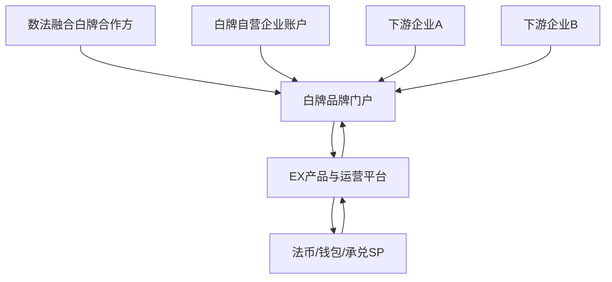
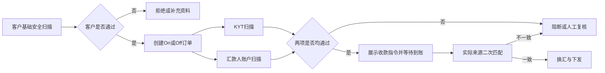
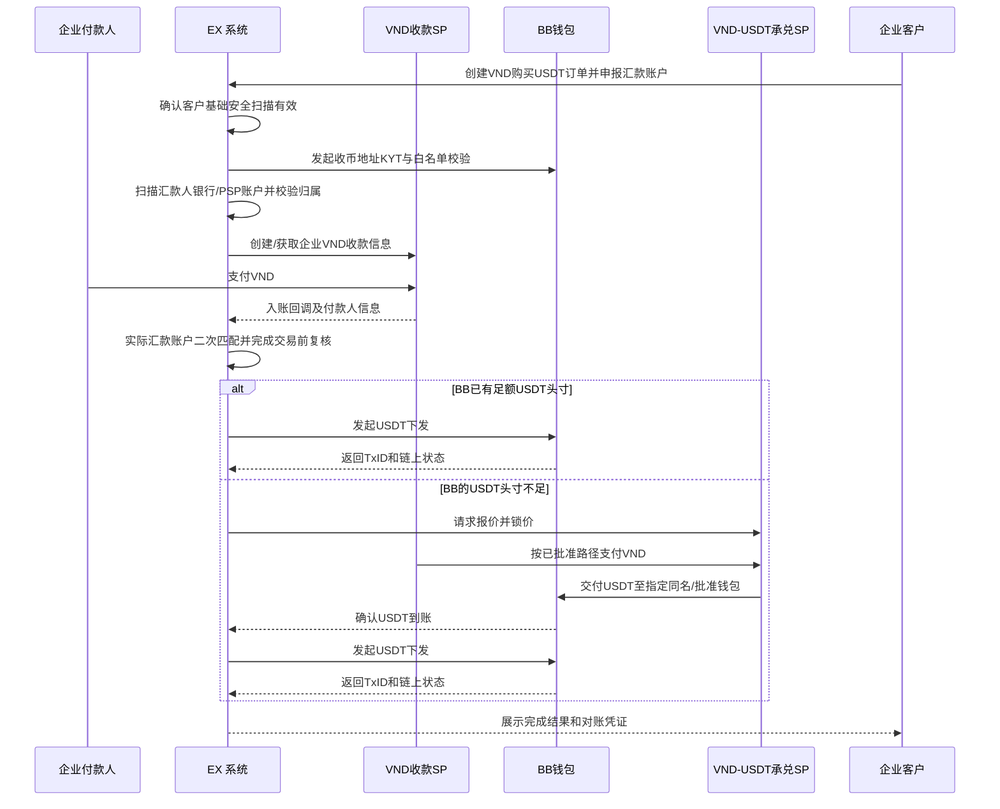
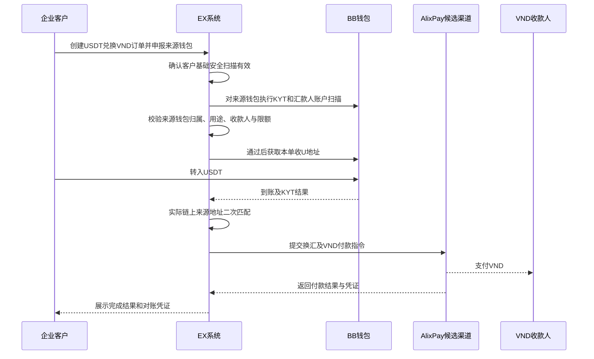
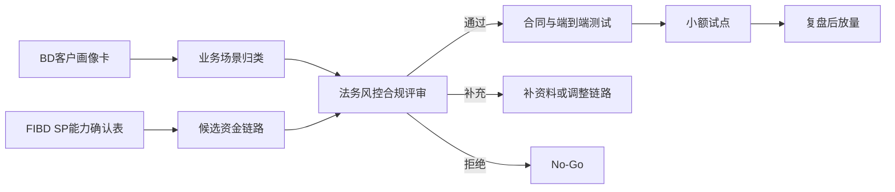

# 越南数法融合客户分层、白牌展业与 SP 渠道方案

> 文档状态：待业务、FIBD、风控与合规联合评审  
> 需求主体：EX 越南业务团队  
> 适用范围：越南相关 OTC、自营企业、客户资源型白牌合作方及其下游企业的法币与数币融合需求
> 系统边界：EX 提供客户准入、订单、账本、风控编排、渠道路由与对账；资金收付、换汇、钱包和承兑由经审核且合同明确的 SP 执行  
> 核心原则：真实业务、真实主体、真实用途、资金链路可穿透；客户须先通过基础安全扫描，所有 On/Off Ramp 交易须在执行前完成 KYT 与汇款人账户扫描；任何“行业收敛”只能基于客户实际经营活动，不得以虚假行业、材料或交易背景规避 SP 审核  
> 版本：v1.2
> 日期：2026-07-17

---

## 1. 执行摘要

本方案不再把所有具有 VND/USDT 需求或客户资源的主体统称为“OTC”。EX 应先判断对方是在经营自己的资金需求、经营兑换流动性，还是经营下游客户，再匹配不同产品与责任模型。

目标不是为非合规活动提供一套绕过审核的系统，而是把目前分散在 PSP、银行账户、钱包和人工群聊中的业务，转化为：

> 可准入、可穿透、可路由、可对账、可暂停、可退出的企业跨境结算方案。

当前至少需要区分四类对象：

1. **OTC 流动性经营方**：核心资产是报价、流动性、资金网络和持续成交能力；
2. **数法融合白牌合作方**：核心资产是客户资源、品牌和销售能力，既可自营，也可让下游企业申请 VA、钱包和 On/Off Ramp；
3. **企业终端客户**：只解决自己的广告、货贸等经营收付与结算，不经营下游客户；
4. **SP/持牌机构**：向上述客户提供账户、钱包、KYT、换汇、收付款和清算能力。

首期产品重点应转为 **有客户资源的数法融合白牌**。VND→USDT、USDT→VND、人民币→VND 等能力作为白牌可组合的底层产品，而不是用单一交易方向定义客户画像。

当前可讨论的候选 SP 包括宝付、光子易、BlancBlock（下称 BB）、AlixPay、Cregis、Gate、SGB、鲲鹏等。本文提及均为候选方案，不代表其已批准相关行业、资金流或上下游模式。

基于 2026-07-17 的客户访谈，对方应重新归类为 **数法融合白牌合作方候选**，而不是用于定义 OTC 核心画像。其关注点是：能否用自己的品牌经营客户、自己也能使用产品、下游客户能否申请 VA/钱包/换汇能力，以及如何在现有客户基础上增加收入。

---

## 1.1 客户访谈重新归类

### 已验证事实

| 访谈主题 | 客户反馈 | 对方案的影响 |
| --- | --- | --- |
| 客户背景 | 自身及其客户存在广告和货贸背景，并掌握一定客户资源 | 画像更接近数法融合白牌合作方；广告/货贸是其服务的场景，不等于其自身就是 OTC |
| 自动化 | 客户对自动化不敏感；资料上传、订单关联等动作无论在哪个平台仍需人工完成 | 不以“减少所有人工操作”作为价值主张；只自动化重复校验、状态回传和对账等真正可减少操作的部分 |
| 多 PSP 操作 | 贸易型客户通常只使用一家或少数支付公司，并倾向选择价格更低的一家 | “统一管理很多 PSP”不是普遍刚需；多 SP 聚合降为可选能力 |
| 风险能力 | 现有支付公司通常已代做 KYT；客户提前报备汇款人、添加钱包地址后，支付公司直接反馈是否可做 | EX 应优先承接并标准化现有流程，不重复建设一套客户不需要的复杂 KYT 工作台 |
| 额度 | 支付公司因双边头寸和预计下发量设置额度；大体量业务的真实痛点是额度不足 | 白牌需要向下游展示可售额度，并通过新增客户和双向流量改善整体业务结构 |
| 双向能力 | 该客户目前以收 VND 的单向业务为主；若具备人民币→VND 等反向能力，可主动寻找反向客户 | 双向业务供给与客户撮合可缓解单边头寸，是比“头寸看板”更直接的价值 |

### 本次访谈不能证明的 OTC 假设

1. **“OTC 普遍同时操作很多 PSP”未被本次访谈支持。** 至少贸易型客户更可能集中使用一家或少数渠道。
2. **“自动化是首要购买理由”被明确否定。** 如果自动化只是把线下动作搬到 EX，并未减少资料和订单操作，客户不会感知价值。
3. **“客户需要自己管理复杂 KYT”未被支持。** 现有支付公司已提供汇款人预报备、地址添加和 KYT 结论。
4. **“头寸可视化能解决额度问题”不成立。** 看见余额不能增加可用额度；客户真正需要的是更多可成交额度或反向流量。

### 对该白牌合作方的价值优先级

1. 获得一套可使用自有品牌展业的法币＋数币白牌；
2. 白牌自己可以开通和使用账户、钱包、On/Off Ramp 等能力；
3. 白牌可邀请和管理下游企业，下游经审核后申请 VA、钱包和交易产品；
4. 通过费率加价、FX/承兑点差、账户服务费和增值服务增加收入；
5. 增加 VND→USDT、USDT→VND、人民币→VND 等产品，扩大可服务客户范围；
6. 复用 SP 的 KYT、汇款人/地址报备和额度体系，避免建设无差异的重型后台。

---

## 2. 术语与责任边界

| 术语/参与方 | 本文定义 | 主要责任 |
| --- | --- | --- |
| OTC 客户 | 市场称谓；实际准入时必须还原为真实企业主体和真实业务场景 | 提供真实资料、资金来源、交易背景、客户及交易对手信息 |
| OTC 的客户 | 向该企业购买服务或与其发生结算的下游企业 | 按穿透要求提供付款人、收款人及业务材料 |
| EX | 产品与渠道编排平台，不当然成为资金持有人或兑换对手方 | KYB 编排、订单、路由、账本、权限、审计和对账 |
| 收款 SP | 提供 VND 收款、VA、余额及流水能力的机构 | 审核准入、收款、资金归属、交易监控、退款/冻结处理 |
| 钱包 SP（BB） | 提供数币钱包、链上转账、KYT 或承兑能力的候选机构 | 钱包、链上执行、KYT、数币余额与流水 |
| 流动性/承兑 SP | 提供 VND 与 USDT 双向兑换的候选机构，如 AlixPay | 报价、成交、收付款、承兑及异常处理 |
| 法币结算 SP | 提供 USDT 兑换其他法币及法币下发的候选机构 | 换汇、跨境下发、法币清算和退汇 |
| FIBD | 负责 SP 发现、渠道尽调、商务和可行性验证 | 获取书面能力边界、合同结构、资金路径和技术资料 |
| BD | 负责目标客户发现与需求核验 | 获取真实客户画像、当前链路、交易量和业务材料 |

### 2.1 不可突破的边界

1. 不以“广告、物流”等名义承载与该行业无关的兑换业务。
2. 不使用个人银行账户承接企业资金；客户自行使用的个人账户不纳入 EX 系统、结算或运营支持范围。
3. 不把“同名 VA”视为天然合规；同名只解决账户名称识别，不替代资金用途、交易对手和下游客户穿透。
4. 不推定某 SP 能从收款余额直接向承兑商付款，也不推定其支持稳定币相关对手方；必须取得书面确认并完成实测。
5. EX 不为客户或渠道承诺牌照结论。是否可开展由相关 SP、法务、风控与合规共同确认。

---

## 3. 客户画像重新定义

客户画像必须以“客户经营什么”定义，而不是以“客户用到 USDT”定义。使用数币只是产品需求，不能自动把企业或渠道方归为 OTC。

### 3.1 画像 A：OTC 流动性经营方

#### 定义

以持续买卖法币与数币、管理报价和流动性、赚取兑换点差为主要业务的经营方。其核心资产是可用资金、流动性网络、成交效率和风险控制，而不是单纯的客户资源。

#### 典型特征

- 需要持续维护双边报价和可成交额度；
- 同时管理法币与数币资金，关注补头寸、价格波动和成交敞口；
- 有稳定上游/下游流动性对手方；
- 能说明其开展兑换、承兑或相关服务的许可基础；
- 盈利主要来自点差、交易费或流动性服务费。

#### 核心痛点

| 痛点 | 说明 |
| --- | --- |
| 合规经营资格 | 是否可以向第三方持续提供兑换/承兑，是该画像的首要前提 |
| 流动性与额度 | 单边订单持续消耗某一侧头寸，大额交易容易受限 |
| 报价与敞口 | 锁价后市场变化、到账延迟和成交失败可能产生损失 |
| 对手方风险 | 法币汇款人、链上地址及承兑对手方风险需要持续判断 |
| 双向流量 | 需要相反方向订单降低补头寸成本，而不只是查看余额 |
| 多腿对账 | 收法币、承兑、链上出币等多段需要逐单闭环 |

#### 产品匹配

提供流动性接入、双向撮合、报价、额度、KYT、汇款人扫描、多腿执行和对账。只有该类客户确实管理多渠道资金时，头寸管理才可能成为核心能力。

### 3.2 画像 B：数法融合白牌合作方（当前重点）

#### 定义

拥有企业客户资源、品牌或销售网络，希望以自己的品牌向下游企业提供法币账户、数币钱包、On/Off Ramp、换汇和跨境收付入口的合作方。白牌既可以作为企业客户使用产品，也可以邀请下游企业独立申请 VA、钱包和交易能力。

该画像的核心不是自己做 OTC，而是：

> 用 EX 的产品、系统和 SP 网络经营客户关系，并通过产品加价和增值服务增加收入。

#### 典型特征

- 已有广告、货贸、物流、电商等企业客户资源；
- 希望使用自己的品牌、域名或客户门户；
- 自己有实际收付需求，同时希望把能力销售给下游客户；
- 下游客户愿意独立提交 KYB，申请各自 VA、钱包或交易权限；
- 不希望自建完整支付、钱包和风控系统；
- 更关心可售产品、价格、额度、客户归属、收入和服务责任。

#### 核心痛点

| 痛点 | 说明 |
| --- | --- |
| 产品不完整 | 现有法币支付产品无法覆盖客户的数币收付和 On/Off Ramp 需求 |
| 无法变现客户资源 | 只能介绍客户给支付公司，客户关系和后续收入容易流失 |
| 品牌不可控 | 客户直接进入上游 SP，白牌无法形成自己的产品和服务体系 |
| 下游开户复杂 | 不同产品重复提交资料，白牌无法查看申请进度和缺失材料 |
| 收入单一 | 只赚一次性介绍费，无法获得持续交易收入和账户服务收入 |
| 产品扩张慢 | 自行接入 VA、钱包、KYT、承兑和本地支付成本高 |
| 额度难销售 | 不知道可以向哪个客户销售多少额度，也无法管理客户级额度 |

### 3.3 画像 C：企业终端客户

广告、货贸、物流、电商等企业仅为自身经营收付款和结算，不向下游客户提供兑换或支付服务。其主要需求是企业 VA、钱包、换汇、VND 收付和跨境结算。

企业终端客户可以由 EX 直签，也可以由白牌引入。无论入口来自哪里，都必须独立识别主体、UBO、真实业务和交易关系；不能只使用白牌的总账户承载所有下游资金。

### 3.4 画像 D：SP/持牌机构

提供 VA、钱包、KYT、换汇、承兑、本地收付款或清算能力的机构。SP 是产品供给方，不与白牌和企业终端客户使用同一套画像或准入问卷。

### 3.5 分类决策

| 判断问题 | 是 | 否 |
| --- | --- | --- |
| 是否以持续兑换、承兑、报价和流动性经营为主要业务？ | 进入 OTC 流动性经营方画像 | 继续判断 |
| 是否掌握下游客户并希望用自己品牌销售产品？ | 进入数法融合白牌合作方画像 | 继续判断 |
| 是否只解决自身企业收付和结算？ | 进入企业终端客户画像 | 继续调查 |
| 是否提供持牌账户、钱包、换汇或支付能力？ | 进入 SP 画像 | 不纳入当前方案或 No-Go |

### 3.6 BD 必须回答的分类问题

1. 对方的主要收入来自自身经营、兑换点差、客户交易分成还是介绍费？
2. 对方是自己使用资金产品，还是希望让下游客户独立开户和交易？
3. 对方是否需要自己的品牌、域名、价格和客户后台？
4. 下游客户属于哪些真实行业，数量、活跃度、月交易量和产品需求分别是什么？
5. 对方是否接触、归集或控制下游客户资金？合同关系和牌照基础是什么？
6. 下游客户是否愿意独立 KYB，并由最终 SP 完成准入或复核？
7. 对方目前能向客户销售哪些产品，现有收入结构和期望新增收入是什么？
8. 如果其自称 OTC：是否持续双向报价、管理自有头寸、承担锁价风险并拥有合法经营基础？
9. 当前使用哪些 PSP/银行/钱包，哪些能力用于自己、哪些提供给下游客户？
10. 是否愿意披露下游客户、钱包地址、业务材料并接受持续复审？

---

## 4. 核心需求与痛点

下表主要描述底层交易与渠道痛点，不再作为单一 OTC 画像。对于白牌合作方，产品、客户和收入痛点以第 3.2 节为准。

| 环节 | 当前方式 | 核心痛点 | EX/SP 目标能力 |
| --- | --- | --- | --- |
| 企业入网 | 在不同 PSP 重复提交材料，行业口径可能不一致 | 真实业务与账户用途不清，易触发关户和资金冻结 | 场景化 KYB 包、资料复用、SP 独立终审 |
| 渠道与价格 | 主要使用一家或少数支付公司，哪家价格合适用哪家 | 可选择的合规渠道少，价格和稳定性直接影响成交 | 提供经批准的主渠道、备用渠道和清晰报价 |
| 交易额度 | 在支付公司额度内接单 | 大体量 OTC 受单日/单月或可下发头寸限制，不能继续放量 | 额度预评估、分层申请、备用额度和放量机制 |
| VND 收款 | 企业 VA 收款，提前报备汇款人 | 报备未通过不能收款；额度和实际可外付能力有限 | 汇款人账户预扫描、报备结果、企业 VA、回单和退款 |
| VND→USDT | 人工找承兑商报价和付款 | 收款 SP 未必允许向承兑商付款；对手方准入不明 | 已批准资金路径、同名账户、报价锁定和成交凭证 |
| KYT 与地址 | 向支付公司添加地址，由支付公司返回是否可做 | 多渠道时规则和反馈口径可能不同，但客户不需要复杂 KYT 工具 | 复用 SP KYT，统一汇总可做/不可做/待补充结论 |
| 双向流量 | 当前以收 VND、兑出 USDT 的单向业务为主 | 单边流量占用额度和渠道头寸，限制持续成交 | 引入人民币→VND、USDT→VND 等反向需求和撮合能力 |
| USDT 下发 | 支付公司或钱包渠道下发 | 地址风险、额度不足、错链错币 | SP/BB 钱包、地址白名单、审批、链上状态和对账 |
| USDT→其他法币 | 到外部渠道再次兑换和下发 | 多次转币、费用高、链路断裂、最终用途不透明 | 引导客户直接选择目标法币；钱包/法币 SP 联动 |
| USDT→VND | 收 U 后人工找 VND 流动性 | VND 付款主体、到账时效、退款和报价波动 | BB 收 U、AlixPay 等候选渠道换 VND 并本地付款 |
| 运营操作 | 手工上传资料、关联订单、等待审核 | 换平台后仍需手工提供必要资料，自动化价值有限 | 优先复用资料和返回状态，不强迫客户重复录入 |
| 对账与追踪 | 订单量大或链路多时人工拼接流水和 TxID | 仅在多腿/多渠道或高订单量时差错定位困难 | 按需提供全局订单号、渠道单号、TxID 和凭证 |

---

## 5. 产品方案总览

### 5.1 数法融合白牌展业主张

EX 向白牌合作方交付的是一套可用其自有品牌经营企业客户的 **法币＋数币产品组合**。白牌不需要自建 VA、钱包、KYT、换汇和清结算底座，但可以拥有自己的客户入口、产品货架、定价和收入视图。

1. 白牌合作方完成机构准入，获得自有品牌门户和管理后台；
2. 白牌自己可作为企业客户申请并使用 VA、钱包、换汇和 On/Off Ramp；
3. 白牌可邀请下游企业注册，下游企业独立提交 KYB 并申请产品；
4. EX 将下游申请路由至适用 SP，由 SP 按其责任完成终审或复核；
5. 每个获批下游企业获得独立 VA、钱包、额度、账本和交易记录；
6. 白牌可以在获批价格范围内配置对客费率，并查看其收入；
7. EX 提供产品、系统、风控编排、渠道连接、分润计算和运营支持；
8. 只有当白牌确实经营多渠道或高订单量时，再增强自动路由和头寸能力。

### 5.1.1 白牌产品货架

| 产品 | 白牌自己使用 | 下游企业申请 | 底层 SP 能力 |
| --- | --- | --- | --- |
| 法币 VA | 可以 | 可以，逐户审核并独立分配 | 企业 KYB、VA、入账、余额、流水、退款 |
| 数币钱包 | 可以 | 可以，逐户审核并独立分配 | 钱包、地址、KYT、链上转账、Webhook |
| VND→USDT | 可以 | 按客户和场景开放 | VND 收款、报价、承兑、USDT 下发 |
| USDT→VND | 可以 | 按客户和场景开放 | 收 U、KYT、报价、VND 本地付款 |
| 人民币→VND | 可以 | 待 SP 和客户场景验证后开放 | 人民币收款、FX、VND 下发 |
| 其他法币收付/换汇 | 可以 | 按国家、行业和 SP 政策开放 | VA、Payout、FX、退汇和对账 |

“可以申请”不等于自动获批。白牌不能替代 SP 的准入结论，也不能承诺账户、钱包、额度或交易一定开通。

### 5.1.2 白牌业务结构

### 5.1.3 客户与资金隔离

1. 白牌合作方、白牌自营企业和每个下游企业分别建立客户主体；
2. 下游企业独立 KYB，VA、钱包、余额、流水和额度不得与白牌混用；
3. 白牌可查看的下游信息范围由合同、授权和数据规则确定；
4. 白牌不得使用一个总 VA 或总钱包承接所有下游资金，除非 SP 明确提供并批准可穿透的机构承载模式；
5. 交易必须保留白牌 ID、下游企业 ID、SP ID、账户/钱包 ID 和订单 ID；
6. 白牌退出时，下游客户归属、存量账户和数据迁移按合同预先约定。

### 5.1.4 白牌如何增加收入

| 收入来源 | 计费方式 | 适用产品 | 关键约束 |
| --- | --- | --- | --- |
| 交易手续费加价 | 在 SP/EX 基础费率上增加固定费率或百分比 | 收款、付款、On/Off Ramp | 加价范围、披露和税务处理需合同确认 |
| FX/承兑点差分成 | 基础报价与下游成交价之间的获批点差 | VND↔USDT、人民币→VND、其他 FX | 必须有价格有效期、最大加点和异常行情规则 |
| VA/钱包服务费 | 开户费、月费、账户维护费 | 法币 VA、数币钱包 | 未获批或未开通不得收费；退款规则明确 |
| 交易量阶梯返佣 | 按白牌下游整体有效交易量计算 | 各交易产品 | 排除退款、冲正、欺诈及关联刷量 |
| 增值服务费 | 加急审核、报表、API、专属客服等 | 运营服务 | 必须真实交付，避免把合规审核结果商品化 |
| 客户转介收入 | 一次性或持续转介分成 | 不适合开白牌的客户 | 客户知情、归属和后续服务责任明确 |

白牌的收入不是凭空新增。每项收入必须能拆出：上游 SP 成本、EX 平台成本、白牌加价、税费、退款/损失准备和最终毛利。

### 5.1.5 收入增长路径

1. **提高客户覆盖**：从单一 VND→USDT 扩展到 VA、钱包、USDT→VND、人民币→VND和其他法币；
2. **提高客户转化**：让已有广告、货贸等客户在白牌门户直接提交申请，白牌跟踪缺失材料和审核状态；
3. **提高单客产品数**：同一企业从单一收款扩展到 VA＋钱包＋换汇＋下发；
4. **提高有效交易量**：通过额度扩容、备用渠道和双向需求增加可成交量；
5. **形成持续收入**：从一次性介绍费转为交易费、点差、账户费和阶梯返佣；
6. **控制服务成本**：只自动化报备、状态、资料复用、计费和对账等可量化环节。

### 5.1.6 客户销售话术

不建议对客户强调“多账户统一管理、自动头寸调拨”。建议直接验证并表达：

> 你可以用自己的品牌经营一套法币＋数币产品。你自己能申请和使用 VA、钱包与换汇能力，也可以邀请下游企业独立开户。EX 负责连接 SP、系统和风控流程，你通过交易加价、点差、账户服务费和交易量返佣获得持续收入。

### 5.2 系统能力边界

| 能力域 | EX 负责 | SP 负责 | 客户负责 |
| --- | --- | --- | --- |
| 准入 | 资料采集、预审、场景分类、审核流和留痕 | 最终准入及账户审批 | 真实完整资料和更新义务 |
| 订单 | 试算、指令、路由、状态聚合、幂等 | 报价、成交和真实执行 | 发起真实交易并确认信息 |
| 风控 | 规则编排、名单/KYT 结果汇总、人工复核流 | 法定/合同责任内的监控和处置 | 补充材料、说明资金来源用途 |
| 资金 | 分主体余额视图和账本，不合并资金权属 | 收款、付款、换汇、钱包或承兑 | 按指定账户付款并维护足额资金 |
| 对账 | 统一订单、渠道流水、TxID 和差错台账 | 提供余额、流水、回调和报表 | 核对结算结果并及时申诉 |

### 5.3 On/Off Ramp 统一标准前置控制

无论交易方向是 On Ramp（法币→数币）还是 Off Ramp（数币→法币），均遵循“先准入、先扫描、后收付”的统一标准，不因客户已有其他 PSP 账户或属于熟客而跳过。

#### 第一层：客户级前置条件

客户开通交易能力前，至少完成以下基础安全扫描：

1. 企业 KYB、董事和 UBO 身份核验；
2. 制裁、PEP、负面信息及内部黑/灰名单扫描；
3. 真实行业、网站、经营地址、交易背景和预计交易模型核验；
4. 牌照或许可情况核验，以及是否实质向第三方提供兑换/汇款服务的判断；
5. 客户预留法币账户、数币钱包地址及其归属验证；
6. 初始风险评级、交易限额、允许币对、允许方向和复审日期设置。

客户级扫描未通过、资料过期或触发重新尽调时，系统不得开放或继续提供 On/Off Ramp。

#### 第二层：每笔交易前置扫描

每笔 On/Off Ramp 订单在展示最终收款指令或进入资金执行前，必须同时完成：

| 检查项 | On Ramp（法币→数币） | Off Ramp（数币→法币） | 未通过处理 |
| --- | --- | --- | --- |
| KYT | 扫描拟收币地址；如涉及中转/承兑钱包，同时扫描相关链上地址 | 扫描汇入 USDT 的来源地址；必要时扫描中转及出币地址 | 阻断、人工复核或拒绝 |
| 汇款人账户扫描 | 扫描并核验拟支付 VND 的银行/PSP 账户及账户持有人 | 将汇入 USDT 的来源钱包作为数币汇款人账户扫描；如另有法币汇款环节，同时扫描对应银行/PSP 账户 | 不下发收款指令；已来款则冻结订单并复核/退款 |
| 一致性校验 | 汇款人账户与已批准客户/交易对手、订单和业务材料一致 | 来源钱包归属与已批准客户/交易对手、订单和业务材料一致 | 第三方汇款进入人工复核，不自动执行 |

为避免“申报账户通过、实际来款账户不同”，资金到账后还须用实际银行账户信息或实际链上来源地址进行二次匹配。实际来源与预扫信息不一致时，即使金额一致，也不得自动换汇或下发。

#### 标准处理顺序

---

## 6. 场景一：VND → USDT（首期重点）

### 6.1 标准链路

### 6.2 方案 A：BB 直接使用现有 USDT 头寸

优先使用 BB 已有、可用于该客户及场景的 USDT 头寸。VND 收款由宝付、光子易或其他候选收款 SP 执行；入账确认且风控通过后，由 BB 向已审核地址下发 USDT。

**优势**：链路短、客户体验清晰、减少临时承兑依赖。  
**前提**：BB 合同范围允许服务该客户和业务场景；BB 具备足额可用头寸；VND 资金最终如何结算给 BB 必须有合法、可对账的安排。

### 6.3 方案 B：收款 SP → AlixPay 等承兑 SP → BB

BB 头寸不足时，由候选流动性 SP 承接 VND→USDT。优先评估客户或合规资金主体在承兑 SP 开立同名账户/VA 的模式。

该方案必须同时验证：

1. 收款 SP 是否允许从 VND 收款余额向承兑 SP 付款；
2. 收款 SP 背后的越南本地渠道和银行是否能够到达该承兑 SP；
3. 收款 SP 是否将该付款识别为允许的企业付款，而非禁止的虚拟资产交易；
4. 承兑 SP 是否接受该收款 SP 来源的 VND，且能识别最终资金主体与订单；
5. 同名账户是客户同名、BB 同名还是其他获批资金主体同名；
6. USDT 交付到哪个钱包、由谁做 KYT、何时视为最终成交；
7. 报价有效期、滑点、到账超时、少款、多款、退款和争议如何处理。

在上述问题获得书面结论前，该链路仅为候选，不进入生产方案。

### 6.4 方案 C：VND → USD → BB VA → USDT

若收款 SP 不允许直接支付承兑 SP，可评估由收款 SP 将 VND 换为 USD，结算至 BB 或获批主体的同名 VA，再由 BB 完成 USD→USDT。

该方案减少了对外部 VND→USDT 承兑商的依赖，但新增 VND→USD、跨境结算和 USD→USDT 三段成本。必须验证 FX 资质、VA 主体、资金用途、结算时效、费用、退款及各段交易材料。

### 6.5 USDT 换其他币种下发

对于最终需要 USD、CNH 或其他法币的客户，系统应优先引导其在创建订单时直接选择最终目标币种，避免客户先收 USDT 再到外部渠道二次换汇。

候选路径：

- BB 钱包 → Cregis/Gate/SGB 等既有下发渠道；
- BB 钱包 → EX 法币结算 SP（候选：鲲鹏）→ 目标法币收款账户。

以上名称仅代表待调研候选方。FIBD 必须分别确认其是否接受 BB 或其他钱包来源、支持哪些国家/币种、付款主体、下发用途和退款机制。

### 6.6 额度解决方案

额度问题不能靠头寸看板解决，首期按以下顺序推进：

1. **主渠道提额**：根据客户真实历史量、通过率、退汇率和预计增量，向现有 VND 收款/承兑 SP 申请分阶段提额；
2. **备用渠道额度**：为同一真实场景准备第二家获批 SP，仅在主渠道额度不足、价格异常或服务不可用时切换；
3. **预约大额**：对超出日常额度的大额订单，先向 SP 预约报价和流动性，获得确认后再向客户展示收款指令；
4. **双向流量缓解**：引入人民币→VND、USDT→VND 等真实反向需求，减少持续单边消耗；
5. **额度不可用即停单**：若所有获批渠道均无额度，不先收客户资金，不以“之后再找流动性”的方式形成敞口。

系统只需要清晰回答三件事：本单额度是否可用、由哪家 SP 承接、额度不足时下一步是什么。

---

## 7. 场景二：USDT → VND（次优先级）

### 7.1 一期链路

一期将 AlixPay 作为 BB 的候选下游渠道，由 BB 与 AlixPay 建立清晰的服务和结算关系，EX 聚合订单状态。二期再评估 Cregis 等其他钱包直接向 AlixPay 交付 USDT 的多钱包模式。

### 7.2 关键控制

- 收 U 地址必须属于已批准的钱包主体，且明确网络与币种；
- USDT 到账后先完成确认数和 KYT，未通过不得换汇或付款；
- VND 收款账户必须与获批交易对手或业务关系一致；
- 不支持向未披露个人账户批量代付；
- 报价过期、链上到账不足、KYT 待复核、VND 付款失败均进入人工异常队列；
- 二期新增钱包来源必须重新完成来源钱包、承兑商和交易对手三方验证。

---

## 8. SP 能力地图与准入清单

### 8.1 SP 角色地图

| 业务节点 | 候选 SP | 必须具备的能力 | 当前状态 |
| --- | --- | --- | --- |
| VND 企业收款 | 宝付、光子易及其他候选 PSP | 企业 KYB、VND VA/收款、付款人信息、余额、退款、允许的外付 | 待 FIBD 书面验证 |
| USDT 钱包与下发 | BB | 钱包、KYT、地址白名单、余额、转账、Webhook、TxID | 待确认场景和头寸政策 |
| VND→USDT 流动性 | AlixPay 等 | VND 收款、锁价、USDT 交付、同名账户、退款和对账 | 待验证 |
| USDT→VND 流动性 | AlixPay 等 | 收 U、KYT 责任、VND 本地付款、付款凭证和退汇 | 待验证 |
| USDT→其他法币 | Cregis、Gate、SGB、鲲鹏等 | 钱包来源接受、换汇、目标币种下发、跨境付款和退汇 | 待验证 |
| VND→USD 备选路径 | VND 收款 SP + BB VA | VND FX、USD 跨境结算、同名 VA、USD→USDT | 待验证 |
| 人民币→VND 反向流量 | 待招募人民币收款/换汇 SP + 越南 VND 下发 SP | 人民币合规收款、FX、VND 本地付款、客户及交易穿透 | 待发现并验证 |

### 8.2 每家 SP 的准入问题

FIBD 不应只询问“能不能做”，应取得可落到合同、接口和运营 SOP 的答案：

| 类别 | 必须确认的问题 |
| --- | --- |
| 机构与牌照 | 签约主体、牌照地区、允许产品、服务地区、客户类型、禁止行业 |
| 客户关系 | SP 审核谁：EX、OTC 企业还是下游客户；是否允许机构承载或必须逐户开户 |
| 业务披露 | 是否明确知悉 VND/USDT 或 USDT/VND 场景；是否允许相关资金对手方 |
| 账户结构 | VA/钱包归属、是否同名、是否支持子账户、资金权益如何区分 |
| 资金链路 | 实际开户银行/越南渠道、收款后能否外付、可付给谁、是否支持跨境和换汇 |
| 穿透数据 | 是否要求付款人、收款人、UBO、下游客户、合同、发票、物流或服务证明 |
| 风控责任 | KYB、名单筛查、KYT、交易监控、可疑交易、冻结和解冻分别由谁负责 |
| 流动性 | 支持方向、币种/链、报价方式、锁价时长、最小/最大金额、日/月限额 |
| 结算与费用 | 入账/出账时效、手续费、点差、网络费、保证金、备付金和结算周期 |
| 异常处理 | 少款、多款、错币错链、超时、拒付、退款、退汇、账户冻结和争议 SLA |
| 技术能力 | 创建账户/钱包、报价、下单、余额、流水、状态查询、Webhook、签名、幂等 |
| 对账审计 | 渠道单号、银行参考号、TxID、日终报表、余额快照和资料保留期限 |
| 合同退出 | 关户、存量订单、余额返还、数据导出、通知期和突发中止机制 |

### 8.3 SP Go/No-Go 门槛

以下任一项不满足，不得进入生产：

1. SP 不愿在合同或书面确认中披露其真实签约主体和产品范围；
2. SP 要求隐藏稳定币、下游客户或实际交易用途；
3. 收款、承兑和付款之间的资金主体无法闭环；
4. 资金依赖未纳入合同的个人账户、借名账户或第三方账户；
5. 无法提供交易级流水、状态、退款和冻结处理机制；
6. 无法完成至少一轮端到端测试及对账；
7. 风控、合规或法务未批准该客户类型与资金链路。

---

## 9. 客户准入与持续风控

### 9.1 场景化尽调包

“行业收敛”为 1—3 个成熟场景时，每个场景必须基于真实经营活动建立独立尽调包：

| 模块 | 通用材料 | 行业补充示例 |
| --- | --- | --- |
| 企业身份 | 注册证书、章程、董事、UBO、注册地址、经营地址 | 行业许可或平台资质（如适用） |
| 经营证明 | 官网、团队、客户/供应商、历史流水、财务信息 | 广告投放记录；物流运单；贸易合同和报关材料 |
| 交易关系 | 合同、发票、付款人与收款人关系 | 代理协议、服务验收、货物流或服务流证明 |
| 资金来源用途 | 来源账户、预计币种、方向、金额、频率、最终收款人 | 为什么需要 USDT/目标法币及其商业合理性 |
| 合规资质 | 现有牌照、法律意见、其他 PSP 审核情况 | 如实披露是否向第三方提供兑换或汇款服务 |
| 钱包信息 | 钱包归属、用途、网络、历史 TxID | 地址签名或小额验证、KYT 结果 |

行业尽调模板用于提高审核一致性，不用于制造“看起来像某行业”的材料。

### 9.2 交易级控制

1. 客户必须先通过基础安全扫描且扫描结果仍在有效期内；
2. 不论 On Ramp 或 Off Ramp，每笔交易均须在执行前完成 KYT 与汇款人账户扫描，两项均通过后才可继续；
3. 校验订单客户、汇款人、收款人、银行/PSP 账户、钱包地址和业务材料的一致性；
4. 根据客户等级设置单笔、日、月和方向限额；
5. 资金到账后，以实际银行账户信息或链上来源地址进行二次匹配；第三方汇款、来源不一致或无法识别时进入人工复核或退款，不得自动换汇/下发；
6. USDT 入账和出账均执行适用的 KYT、链和地址白名单控制；
7. 报价锁定后资金未在时限内到账，应重新报价，不得自动沿用旧价格；
8. 所有人工放行、改单、退款、地址变更和余额调整执行双人复核并留痕；
9. 交易模式、交易量、客户结构、账户或 UBO 发生重大变化时触发重新尽调。

### 9.3 触发暂停/退出

- 资料虚假、实际业务与申报行业不一致；
- 拒绝披露资金来源、下游客户或最终用途；
- 个人账户、第三方代收代付或多主体混用显著增加；
- 出现制裁、诈骗、混币器等高风险链上关联；
- 交易量或频率无合理解释地突增；
- SP 关停相关产品、改变政策或无法继续提供可穿透数据；
- 法务、风控、合规或监管要求暂停。

---

## 10. EX 系统最小能力

系统能力按“必要交易能力”和“触发式增强能力”分层。首期不为尚未验证的多 PSP 管理需求建设重型头寸系统。

### 10.1 必要交易能力

| 能力 | MVP 要求 |
| --- | --- |
| 白牌租户 | 品牌名称、Logo、域名、合同主体、管理员、支持信息和数据权限 |
| 产品货架 | 按白牌配置 VA、钱包、On/Off Ramp、币种、地区和可售状态 |
| 下游客户 | 白牌邀请、独立注册、独立 KYB、申请进度、补件和 SP 审核结果 |
| 客户与场景 | 企业、UBO、真实行业、牌照、预计量、准入 SP、复审日期 |
| 交易对手 | 付款人、收款人、与客户关系、账户/钱包及验证状态 |
| 汇款人/地址报备 | 将汇款人账户和钱包地址提交给 SP，接收可做/不可做/待补充结果 |
| 额度 | 客户额度、SP 可用额度、已占用额度、额度不足提示和申请记录 |
| 定价与收入 | SP 成本价、EX 价格、白牌对客价、收入规则、逐笔收入和结算状态 |
| 报价订单 | 方向、币对、金额、费率、报价来源、锁价时间、过期时间；尽量避免重复录入 |
| 多腿执行 | 每一腿的执行 SP、主体、账户、渠道单号、金额、费用和状态 |
| 风控 | 客户基础安全扫描、KYT、汇款人账户扫描、实际来源二次匹配、限额、材料校验和人工复核 |
| 审批权限 | 创建、复核、放行、退款、改单和余额调整权限分离 |
| 对账 | 订单、VND 流水、承兑成交、钱包流水、TxID、法币下发匹配 |
| 异常工单 | 未知状态、超时、少款/多款、拒付、退款、退汇、错链错币 |
| 审计 | 操作人、时间、变更前后值、审批意见、附件和外部回执不可变留痕 |

### 10.2 触发式增强能力

仅在出现对应客户证据时建设：

| 能力 | 建设触发条件 |
| --- | --- |
| 多 SP 聚合 | 同一客户稳定使用 2 家及以上 SP，且切换操作成为明确成本 |
| 自动路由 | 不同 SP 的客户/行业/额度/价格规则已结构化，且订单量足以覆盖建设成本 |
| 头寸看板 | EX 或 BB 实际承担多渠道流动性调度责任，而非仅展示客户无权调度的余额 |
| 自动调拨 | 各 SP 合同允许、账户主体一致、接口与审批责任明确 |
| 自动对账 | 日均订单量或差错率达到内部立项阈值 |
| 双向撮合 | 已获得真实人民币→VND、USDT→VND 等反向客户和可执行 SP |

### 10.3 核心状态

| 状态 | 进入条件 | 允许动作 | 退出条件 |
| --- | --- | --- | --- |
| 待准入 | 客户提交资料 | 补充、预审、拒绝 | SP 与内部审核完成 |
| 待安全扫描 | 客户可交易且创建订单 | 执行 KYT、汇款人账户扫描、补充账户信息、取消 | 两项扫描均通过或进入人工复核/拒绝 |
| 待报价 | KYT 与汇款人账户扫描均通过 | 获取报价、取消 | 报价锁定或获取失败 |
| 待入账 | 报价已确认 | 等待、取消/重新报价 | VND/USDT 到账或超时 |
| 待风控复核 | 到账但存在规则命中或信息不一致 | 补材料、放行、拒绝、退款 | 复核得出结论 |
| 待兑换/调拨 | 入账通过但目标头寸不足 | 选择获批 SP、成交、取消 | 目标资金到账 |
| 待下发 | 资金与风控均就绪 | 发起下发 | 渠道受理或失败 |
| 处理中 | SP 已受理 | 查询、等待、异常升级 | 成功、失败或未知 |
| 已完成 | 最终收款/上链确认且对账通过 | 查看、导出 | 终态 |
| 失败/退款中 | 下游拒绝或无法继续 | 重试、退款、人工处理 | 已退款或异常关闭 |
| 异常待处理 | 结果未知、对账差异或账户冻结 | 工单、查询、人工校正 | 差异解决并审计确认 |

---

## 11. BD 与 FIBD 联合作业流程

### 11.1 BD：先证明有真实客户与真实需求

BD 首轮先完成客户分类，不承诺通道和价格。对白牌候选方输出《数法融合白牌画像卡》：

- 主体、UBO、团队背景和经营地；
- 品牌、销售团队、客户来源、下游客户数量及主要行业；
- 自营需求与下游客户需求分别是什么；
- 当前使用的 PSP、开户行业、企业账户及真实资金链路；
- VND→USDT、USDT→VND 的历史量和预估量；
- 客户来源、下游行业、付款人与收款人关系；
- 牌照情况及是否向第三方提供兑换/汇款；
- 期望使用的品牌、产品、定价权、客户归属和收入模式；
- 下游客户是否接受独立 KYB、独立 VA/钱包和持续风控；
- 3 笔脱敏历史样本：合同/订单、VND 流水、TxID 或下发凭证。

### 11.2 FIBD：再证明 SP 链路可用

FIBD 针对每一条候选路径输出《SP 能力确认表》：

- 宝付/光子易等 VND 收款背后的实际越南渠道；
- 收款后是否允许企业余额直接付款及允许的收款人类型；
- 能否付至 AlixPay 等承兑商及银行侧是否拦截；
- AlixPay 的同名 VA、VND 入账、USDT 交付和 VND 付款流程；
- 已跑通的越南 PSP/银行类型、币种、限额和异常案例（可脱敏）；
- BB 的钱包、KYT、头寸、承兑和渠道管理责任；
- Cregis/Gate/SGB/鲲鹏等对钱包来源、目标币种与最终收款人的要求。

### 11.3 联合评审

---

## 12. 分期策略

### 12.1 第 0 阶段：画像与渠道事实核验

- 分别访谈 OTC 流动性经营方、白牌合作方和企业终端客户，不混合样本结论；
- 访谈 5—10 家数法融合白牌候选方，验证下游客户数、活跃度、产品需求和付费意愿；
- 收敛 1—3 个真实且材料可验证的企业场景；
- 单独验证客户对额度、价格、双向能力、KYT 报备和自动化的优先级；
- 完成候选 SP 的合同、资金、合规、技术和异常能力核验；
- 选出一条 VND→USDT 主路径和一条备选路径。

**退出条件**：至少 2 家客户能够提供真实交易样本；至少 1 条端到端链路获得各参与 SP 书面确认。

### 12.2 第 1 阶段：小额人工辅助试点

- 选择 1 家白牌合作方和少量下游企业，验证自营＋下游独立开户模式；
- 上线最小品牌门户、下游邀请、KYB 进度、产品申请、定价和收入明细；
- 优先 VND→USDT；USDT→VND 限定白名单客户；
- 所有客户先完成基础安全扫描，所有试点订单先完成 KYT 和汇款人账户扫描；
- 客户、交易对手、地址和限额全部白名单；
- 人工报价或半自动报价、双人复核、人工处理异常；
- 每日余额与逐单四方对账；
- 只接企业账户，不接个人账户。

**退出条件**：完成约定数量的成功订单，入账、承兑、下发、退款和对账均有可审计记录；无未解释资金差异。

### 12.3 第 2 阶段：系统化与多渠道

- 优先接入 KYT、汇款人/地址报备、额度、报价、流水和 Webhook；
- 建立客户额度不足预警和追加额度申请流程；
- 增加 USDT→其他法币直接下发；
- 寻找并验证人民币→VND、USDT→VND 等反向需求客户，形成双向业务；
- 在新渠道逐一通过准入后开放多 SP 路由；
- 路由只在已批准的客户、场景和额度范围内执行；
- 多 SP、头寸看板和自动调拨仅在满足第 10.2 节触发条件后立项。

---

## 13. 验收标准

1. 系统能区分 OTC 流动性经营方、数法融合白牌、企业终端客户和 SP，不再用同一“OTC”标签承载所有对象。
2. 白牌合作方可以使用自有品牌邀请下游企业；白牌自身与每个下游企业均为独立客户主体。
3. 下游企业可以独立提交 KYB 并申请 VA、钱包或交易产品，申请结果由相应 SP 和内部审核决定。
4. 白牌、白牌自营账户和下游企业的 VA、钱包、余额、额度、流水和账本相互隔离。
5. 每笔收入能够拆分 SP 成本、EX 收入、白牌收入、税费/调整项和结算状态。
6. 白牌只能在已批准产品、客户、地区、价格和额度范围内展业。
7. 任一客户均能追溯到真实企业、UBO、获批行业场景、基础安全扫描结果、审核结论和复审日期。
8. 客户基础安全扫描未通过或已过期时，系统不得开放或继续提供 On/Off Ramp。
9. 每笔 On/Off Ramp 订单均须记录 KYT 与汇款人账户扫描结果；任一项未通过时，不得进入收款、换汇或下发。
10. 实际汇款银行账户或链上来源地址与预扫信息不一致时，订单必须阻断自动执行并进入人工复核。
11. 系统不能用一个未获批准的行业标签绕过 SP 准入规则。
12. 任一订单均能展示付款人、收款人、资金用途、各资金腿主体、SP 单号和最终 TxID/银行参考号。
13. 收款 SP 未书面确认可向承兑 SP 付款时，路由不可启用。
14. BB 头寸不足时，系统只能选择已批准的调拨/承兑路径；无可用路径则暂停订单。
15. KYT 未完成、命中高风险或收款人与获批信息不一致时，不得自动下发。
16. 重复请求不得造成重复承兑、重复打币或重复 VND 付款。
17. 下游超时或结果未知时，系统不得直接标记失败并自动重试；须先查询或人工确认。
18. 余额和账本按资金主体、SP 和币种隔离，不将不同主体资金合并为无边界余额。
19. 退款、退汇、冻结、人工放行和余额调整均可追溯到操作人、审批人、原因和凭证。
20. 每日可完成订单、VND 流水、承兑成交、钱包流水和法币下发的逐笔对账。
21. 白牌、客户或 SP 退出时，可停止新交易、处理在途订单、返还余额，并按合同处理客户归属和数据导出。

---

## 14. 待确认事项

| 编号 | 待确认事项 | 负责人 | 影响 |
| --- | --- | --- | --- |
| O-01 | 首期真实行业场景最终收敛为哪 1—3 类，各自的标准尽调包是什么 | BD/风控/合规 | 决定客户范围和进件材料 |
| O-02 | 受访客户目前在宝付、光子易等以何主体、何真实行业、何产品入网 | BD | 验证客户画像，不得直接复用其口径 |
| O-03 | 宝付等 VND 收款 SP 背后的越南渠道及收款余额外付政策 | FIBD | 决定能否直付承兑商 |
| O-04 | 收款 SP 是否明确允许付款至 AlixPay 等稳定币流动性对手方 | FIBD/合规 | 决定方案 B 是否成立 |
| O-05 | AlixPay 的签约主体、牌照、同名 VA 结构、VND 来源要求和已跑通渠道 | FIBD | 决定双向承兑可行性 |
| O-06 | BB 的 USDT 头寸归属、最低储备、补充机制、KYT 和最终拒绝责任 | FIBD/BB | 决定首期履约能力 |
| O-07 | VND→USD→BB VA→USDT 的 FX、跨境结算、VA 和成本结构 | FIBD/财务 | 决定备选路径经济性 |
| O-08 | Cregis/Gate/SGB/鲲鹏分别支持哪些币种、地区、钱包来源和下发主体 | FIBD | 决定其他币种下发范围 |
| O-09 | 非持牌企业自身结算与向第三方提供兑换服务的法律边界 | 法务/合规 | 决定 B 类客户可做范围 |
| O-10 | 首期单笔/日/月限额、报价有效期、保证金和头寸阈值 | 业务/财务/风控 | 决定试点参数 |
| O-11 | EX、BB、收款 SP、承兑 SP 的合同链和客户披露文案 | 法务/FIBD | 决定责任及投诉处理 |
| O-12 | 试点成功订单数、观察周期和放量门槛 | 业务/风控 | 决定阶段退出标准 |
| O-13 | 当前客户额度上限、实际峰值需求、额度不足频率及期望新增额度 | BD/FIBD | 判断额度是否为可规模化卖点 |
| O-14 | 支付公司现有汇款人报备、地址添加和 KYT 结果接口能否直接复用 | FIBD/产品 | 决定是否需要自建扫描流程 |
| O-15 | 是否存在可验证的人民币→VND 或 USDT→VND 反向客户，规模和频率如何 | BD | 判断双向撮合是否成立 |
| O-16 | 客户在什么订单量、渠道数量或差错率下才愿意使用自动化 | BD/产品 | 决定系统建设触发点 |
| O-17 | 白牌合作方现有下游企业数量、月活、行业和可迁移交易量 | BD | 判断白牌商业价值 |
| O-18 | 白牌是否需要独立品牌、域名、App/API，以及愿意承担的实施成本 | BD/产品 | 决定白牌交付范围 |
| O-19 | SP 是否允许白牌展业、下游逐户开户及白牌查看审核/交易数据 | FIBD/法务 | 决定白牌责任模型 |
| O-20 | 白牌可配置哪些费率和点差，EX/SP 最低价、最大加价和客户披露规则 | 财务/法务/产品 | 决定收入模型 |
| O-21 | 白牌、EX、SP 和下游企业的合同链、客户归属及退出迁移规则 | 法务/BD | 决定可持续合作关系 |
| O-22 | 白牌是否需要自己作为企业客户使用产品，是否与其白牌运营主体相同 | BD/合规 | 决定主体和账户隔离设计 |

---

## 15. 建议立即执行的两周行动清单

### BD

- 先将线索分类为 OTC 流动性经营方、白牌合作方、企业终端客户或 SP；
- 选择 5—10 家白牌候选方，按《数法融合白牌画像卡》访谈；
- 每家获取近 3—6 个月方向性交易数据和 3 笔脱敏样本；
- 明确其真实行业、当前 PSP、开户主体、下游客户和牌照情况；
- 获取下游客户数量、活跃客户数、行业分布、现有产品、收入结构和期望新增收入；
- 验证下游企业是否愿意独立 KYB、申请 VA/钱包并迁移到白牌门户；
- 记录现有 SP 数量、选择渠道的首要因素、当前额度和额度不足频率；
- 收集其可拓展的人民币→VND、USDT→VND 等反向客户线索；
- 不再笼统询问“是否需要自动化”，改为逐项询问哪些动作重复、耗时及愿意付费解决；
- 输出行业聚类，但不提出虚假包装口径。

### FIBD

- 向宝付、光子易确认 VND 本地合作方、企业 VA 和余额外付政策；
- 获取各 SP 的客户额度、通道总额度、追加额度条件、价格阶梯和放量周期；
- 确认能否通过接口完成汇款人预报备、地址添加和 KYT 结果回传；
- 向 AlixPay 获取完整双向承兑 SOP、同名账户定义、上下游接受清单和异常机制；
- 与 BB 确认钱包、KYT、头寸、补充流动性和渠道责任；
- 对 Cregis/Gate/SGB/鲲鹏逐家完成 SP 能力确认表。

### 产品、风控与合规

- 设计白牌、自营企业和下游企业三层主体及数据隔离；
- 定义白牌产品货架、下游开户、定价、分润和退出的最小闭环；
- 基于真实样本选择首期 1—3 个业务场景；
- 为每个场景建立资料清单、交易规则、风险触发器和退出规则；
- 画出一条主链路、一条备选链路，逐腿标注主体、账户、SP 和凭证；
- 只有书面确认和评审通过后，才进入接口设计与小额测试。

---

## 16. 关联资料

- [越南 OTC 资金运营与风控解决方案](./vietnam-otc-solution.md)
- [越南 OTC 运营后台 PRD（v1.0 MVP）](./vietnam-otc-system-prd-v1.md)
- [越南多 SP 架构与客户方案](./vietnam-multi-sp-architecture.md)
- [EurewaX 越南 SP 招募方案](./ex-vietnam-sp-recruitment.md)
