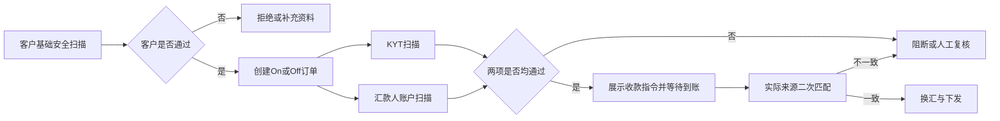
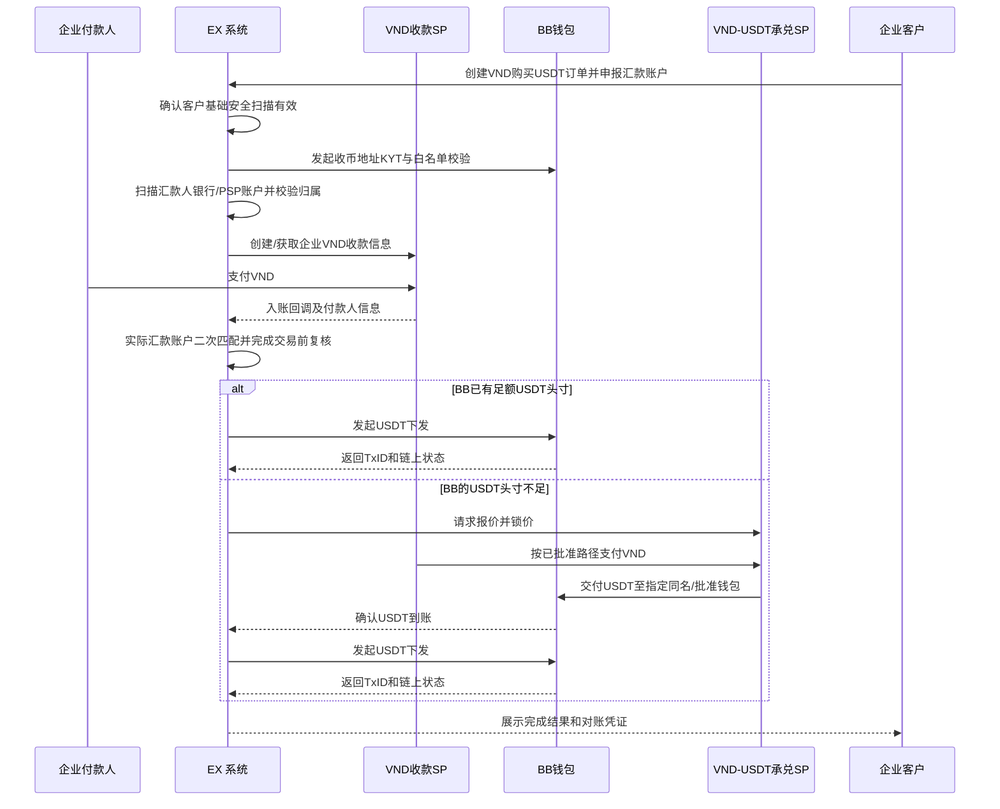
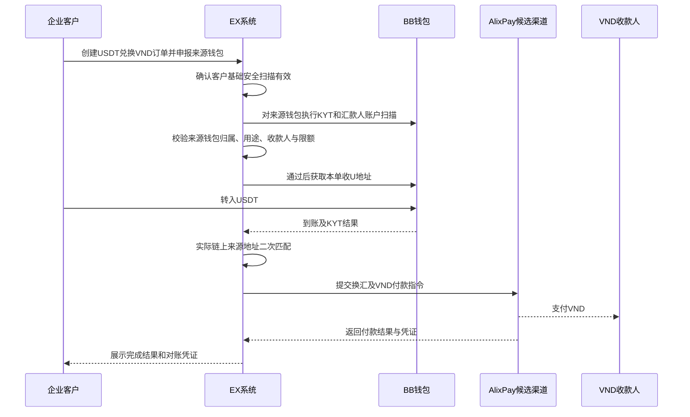
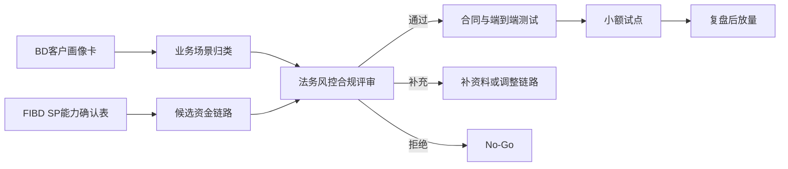

# 越南 OTC 展业与 SP 渠道方案

> 文档状态：待业务、FIBD、风控与合规联合评审  
> 需求主体：EX 越南业务团队  
> 适用范围：越南相关企业客户的 VND 与 USDT/其他法币之间的跨境结算需求  
> 系统边界：EX 提供客户准入、订单、账本、风控编排、渠道路由与对账；资金收付、换汇、钱包和承兑由经审核且合同明确的 SP 执行  
> 核心原则：真实业务、真实主体、真实用途、资金链路可穿透；客户须先通过基础安全扫描，所有 On/Off Ramp 交易须在执行前完成 KYT 与汇款人账户扫描；任何“行业收敛”只能基于客户实际经营活动，不得以虚假行业、材料或交易背景规避 SP 审核  
> 版本：v1.0  
> 日期：2026-07-17

---

## 1. 执行摘要

本方案面向市场中通常被称为“OTC”的企业客群，但 EX 不以“OTC 包装入网”为产品逻辑。EX 应先识别客户真实经营活动、资金来源、交易对手和实际结算需求，再将符合准入条件的客户归入少量、真实且可验证的企业场景，例如广告服务、物流服务或贸易服务，并为对应场景配置完整尽调、交易材料和持续监控。

目标不是为非合规活动提供一套绕过审核的系统，而是把目前分散在 PSP、银行账户、钱包和人工群聊中的业务，转化为：

> 可准入、可穿透、可路由、可对账、可暂停、可退出的企业跨境结算方案。

首期重点验证 **VND → USDT**，因为当前访谈显示该方向需求更集中；**USDT → VND** 作为次优先级场景验证，不因样本较少而预设市场结论。

当前可讨论的候选 SP 包括宝付、光子易、BlancBlock（下称 BB）、AlixPay、Cregis、Gate、SGB、鲲鹏等。本文提及均为候选方案，不代表其已批准相关行业、资金流或上下游模式。

---

## 2. 术语与责任边界

| 术语/参与方 | 本文定义 | 主要责任 |
| --- | --- | --- |
| OTC 客户 | 市场称谓；实际准入时必须还原为真实企业主体和真实业务场景 | 提供真实资料、资金来源、交易背景、客户及交易对手信息 |
| OTC 的客户 | 向该企业购买服务或与其发生结算的下游企业 | 按穿透要求提供付款人、收款人及业务材料 |
| EX | 产品与渠道编排平台，不当然成为资金持有人或兑换对手方 | KYB 编排、订单、路由、账本、权限、审计和对账 |
| 收款 SP | 提供 VND 收款、VA、余额及流水能力的机构 | 审核准入、收款、资金归属、交易监控、退款/冻结处理 |
| 钱包 SP（BB） | 提供数币钱包、链上转账、KYT 或承兑能力的候选机构 | 钱包、链上执行、KYT、数币余额与流水 |
| 流动性/承兑 SP | 提供 VND 与 USDT 双向兑换的候选机构，如 AlixPay | 报价、成交、收付款、承兑及异常处理 |
| 法币结算 SP | 提供 USDT 兑换其他法币及法币下发的候选机构 | 换汇、跨境下发、法币清算和退汇 |
| FIBD | 负责 SP 发现、渠道尽调、商务和可行性验证 | 获取书面能力边界、合同结构、资金路径和技术资料 |
| BD | 负责目标客户发现与需求核验 | 获取真实客户画像、当前链路、交易量和业务材料 |

### 2.1 不可突破的边界

1. 不以“广告、物流”等名义承载与该行业无关的兑换业务。
2. 不使用个人银行账户承接企业资金；客户自行使用的个人账户不纳入 EX 系统、结算或运营支持范围。
3. 不把“同名 VA”视为天然合规；同名只解决账户名称识别，不替代资金用途、交易对手和下游客户穿透。
4. 不推定某 SP 能从收款余额直接向承兑商付款，也不推定其支持稳定币相关对手方；必须取得书面确认并完成实测。
5. EX 不为客户或渠道承诺牌照结论。是否可开展由相关 SP、法务、风控与合规共同确认。

---

## 3. 目标客户画像

### 3.1 首期目标画像

| 画像维度 | 优先条件 | 风险信号/暂不准入 |
| --- | --- | --- |
| 企业主体 | 可核验注册主体、UBO 和管理团队；经营状态正常 | 空壳、多层代持、UBO 不透明或频繁更换主体 |
| 团队背景 | 可说明实际控制人、运营地及越南业务来源 | 仅通过匿名聊天工具联系，拒绝面对面或视频核验 |
| 真实行业 | 广告、物流、贸易等实际经营场景，合同和流水可相互印证 | 为通过 PSP 审核临时选择行业，材料与交易不匹配 |
| 当前账户 | 已在 PSP 以企业身份开户并能提供账户用途与历史流水 | 主要依赖越南个人账户收企业款，或账户主体与业务主体无关 |
| 客户来源 | 熟客、长期企业客户、可解释的获客渠道 | 不识别下游客户、公开吸收不特定公众资金 |
| 交易需求 | VND→USDT、USDT→VND 或 USDT→其他法币，有明确商业用途 | 无法说明资金来源、用途或最终收款人 |
| 合规基础 | 有 MSB/VASP/支付等相关牌照，或业务本身不构成受监管服务且经法律确认 | 实质向第三方提供兑换/汇款服务但无相应许可或豁免依据 |
| 运营能力 | 愿意接受 KYB、KYT、交易材料、限额和持续复审 | 要求隐藏稳定币、下游客户或真实交易用途 |

### 3.2 客户分层

| 层级 | 条件 | 可提供方案 | 决策 |
| --- | --- | --- | --- |
| A：持牌/可验证机构 | 牌照、许可范围和业务模式可验证，具备持续合规能力 | 可评估机构级钱包、承兑、API 和更高限额 | 单独机构方案 |
| B：真实企业场景 | 非金融企业，有真实广告/物流/贸易等业务，结算是自身业务附随需求 | 企业收付、钱包、换汇和对账；禁止代第三方经营兑换 | 首期重点验证 |
| C：代理/资源方 | 主要掌握客户资源，自身不应接触资金 | 转介或代理，不为其开资金账户，不形成资金归集 | 轻投入合作 |
| D：非透明兑换商 | 无法证明牌照或真实场景，依赖个人账户或隐瞒交易性质 | 不提供通道及系统开通 | No-Go |

### 3.3 BD 必须回答的客户问题

1. 企业、UBO、管理团队分别在哪个国家/地区？是否以中国背景团队为主？
2. 当前在哪些 PSP/银行以什么主体、什么真实行业和什么产品开户？
3. 向 PSP 提交了哪些业务材料？材料与实际交易是否一致？
4. 当前 VND→USDT、USDT→VND 的近 3—6 个月月均量、峰值、笔数、客单价分别是多少？
5. 客户如何获客：熟客、代理、公开渠道还是平台？下游客户通常从事什么行业？
6. 资金付款人、合同客户、兑换申请人和最终收款人是否一致？若不一致，关系是什么？
7. 是否持有 MSB、VASP、支付、汇款或其他相关许可？牌照地区和业务范围是什么？
8. 当前如何报价、收款、确认到账、换 U、打币、换其他法币、下发和对账？
9. 当前链路最常见的冻结、退汇、到账慢、余额不足和对账差错是什么？
10. 是否愿意披露下游客户、钱包地址、业务材料并接受单笔或抽样复核？

---

## 4. 核心需求与痛点

| 环节 | 当前方式 | 核心痛点 | EX/SP 目标能力 |
| --- | --- | --- | --- |
| 企业入网 | 在不同 PSP 重复提交材料，行业口径可能不一致 | 真实业务与账户用途不清，易触发关户和资金冻结 | 场景化 KYB 包、资料复用、SP 独立终审 |
| VND 收款 | 企业 VA 或个人账户收款 | 付款人识别、用途证明、余额能否外付不确定 | 企业 VA、付款人信息、回单、可用余额和退款 |
| VND→USDT | 人工找承兑商报价和付款 | 收款 SP 未必允许向承兑商付款；对手方准入不明 | 已批准资金路径、同名账户、报价锁定和成交凭证 |
| USDT 下发 | 自有/三方钱包人工打币 | 地址风险、余额不足、错链错币、审批缺失 | BB 钱包、KYT、白名单、审批、链上状态和对账 |
| USDT→其他法币 | 到外部渠道再次兑换和下发 | 多次转币、费用高、链路断裂、最终用途不透明 | 引导客户直接选择目标法币；钱包/法币 SP 联动 |
| USDT→VND | 收 U 后人工找 VND 流动性 | VND 付款主体、到账时效、退款和报价波动 | BB 收 U、AlixPay 等候选渠道换 VND 并本地付款 |
| 头寸管理 | 多后台、群聊和 Excel | 不知道 BB/承兑商/法币通道可用余额 | 分主体余额视图、阈值、调拨申请和不可混同账本 |
| 对账与追踪 | 人工拼接 PSP 流水和 TxID | 一单多腿、状态不一致、异常难追责 | 全局订单号、各腿渠道单号、TxID、费率和凭证 |

---

## 5. 产品方案总览

### 5.1 展业主张

EX 对客户交付的不是单一 OTC 通道，而是按真实行业和结算需求组织的企业资金运营方案：

1. 一个经过核验的企业与业务场景；
2. 一套对应场景的 KYB、交易材料和持续复审规则；
3. 一条经各 SP 书面批准的资金链路；
4. 一个可查看订单、余额、报价、执行状态和对账的系统；
5. 一套可暂停、退款、冻结、升级人工处理和退出的风控机制。

### 5.2 系统能力边界

| 能力域 | EX 负责 | SP 负责 | 客户负责 |
| --- | --- | --- | --- |
| 准入 | 资料采集、预审、场景分类、审核流和留痕 | 最终准入及账户审批 | 真实完整资料和更新义务 |
| 订单 | 试算、指令、路由、状态聚合、幂等 | 报价、成交和真实执行 | 发起真实交易并确认信息 |
| 风控 | 规则编排、名单/KYT 结果汇总、人工复核流 | 法定/合同责任内的监控和处置 | 补充材料、说明资金来源用途 |
| 资金 | 分主体余额视图和账本，不合并资金权属 | 收款、付款、换汇、钱包或承兑 | 按指定账户付款并维护足额资金 |
| 对账 | 统一订单、渠道流水、TxID 和差错台账 | 提供余额、流水、回调和报表 | 核对结算结果并及时申诉 |

### 5.3 On/Off Ramp 统一标准前置控制

无论交易方向是 On Ramp（法币→数币）还是 Off Ramp（数币→法币），均遵循“先准入、先扫描、后收付”的统一标准，不因客户已有其他 PSP 账户或属于熟客而跳过。

#### 第一层：客户级前置条件

客户开通交易能力前，至少完成以下基础安全扫描：

1. 企业 KYB、董事和 UBO 身份核验；
2. 制裁、PEP、负面信息及内部黑/灰名单扫描；
3. 真实行业、网站、经营地址、交易背景和预计交易模型核验；
4. 牌照或许可情况核验，以及是否实质向第三方提供兑换/汇款服务的判断；
5. 客户预留法币账户、数币钱包地址及其归属验证；
6. 初始风险评级、交易限额、允许币对、允许方向和复审日期设置。

客户级扫描未通过、资料过期或触发重新尽调时，系统不得开放或继续提供 On/Off Ramp。

#### 第二层：每笔交易前置扫描

每笔 On/Off Ramp 订单在展示最终收款指令或进入资金执行前，必须同时完成：

| 检查项 | On Ramp（法币→数币） | Off Ramp（数币→法币） | 未通过处理 |
| --- | --- | --- | --- |
| KYT | 扫描拟收币地址；如涉及中转/承兑钱包，同时扫描相关链上地址 | 扫描汇入 USDT 的来源地址；必要时扫描中转及出币地址 | 阻断、人工复核或拒绝 |
| 汇款人账户扫描 | 扫描并核验拟支付 VND 的银行/PSP 账户及账户持有人 | 将汇入 USDT 的来源钱包作为数币汇款人账户扫描；如另有法币汇款环节，同时扫描对应银行/PSP 账户 | 不下发收款指令；已来款则冻结订单并复核/退款 |
| 一致性校验 | 汇款人账户与已批准客户/交易对手、订单和业务材料一致 | 来源钱包归属与已批准客户/交易对手、订单和业务材料一致 | 第三方汇款进入人工复核，不自动执行 |

为避免“申报账户通过、实际来款账户不同”，资金到账后还须用实际银行账户信息或实际链上来源地址进行二次匹配。实际来源与预扫信息不一致时，即使金额一致，也不得自动换汇或下发。

#### 标准处理顺序

---

## 6. 场景一：VND → USDT（首期重点）

### 6.1 标准链路

### 6.2 方案 A：BB 直接使用现有 USDT 头寸

优先使用 BB 已有、可用于该客户及场景的 USDT 头寸。VND 收款由宝付、光子易或其他候选收款 SP 执行；入账确认且风控通过后，由 BB 向已审核地址下发 USDT。

**优势**：链路短、客户体验清晰、减少临时承兑依赖。  
**前提**：BB 合同范围允许服务该客户和业务场景；BB 具备足额可用头寸；VND 资金最终如何结算给 BB 必须有合法、可对账的安排。

### 6.3 方案 B：收款 SP → AlixPay 等承兑 SP → BB

BB 头寸不足时，由候选流动性 SP 承接 VND→USDT。优先评估客户或合规资金主体在承兑 SP 开立同名账户/VA 的模式。

该方案必须同时验证：

1. 收款 SP 是否允许从 VND 收款余额向承兑 SP 付款；
2. 收款 SP 背后的越南本地渠道和银行是否能够到达该承兑 SP；
3. 收款 SP 是否将该付款识别为允许的企业付款，而非禁止的虚拟资产交易；
4. 承兑 SP 是否接受该收款 SP 来源的 VND，且能识别最终资金主体与订单；
5. 同名账户是客户同名、BB 同名还是其他获批资金主体同名；
6. USDT 交付到哪个钱包、由谁做 KYT、何时视为最终成交；
7. 报价有效期、滑点、到账超时、少款、多款、退款和争议如何处理。

在上述问题获得书面结论前，该链路仅为候选，不进入生产方案。

### 6.4 方案 C：VND → USD → BB VA → USDT

若收款 SP 不允许直接支付承兑 SP，可评估由收款 SP 将 VND 换为 USD，结算至 BB 或获批主体的同名 VA，再由 BB 完成 USD→USDT。

该方案减少了对外部 VND→USDT 承兑商的依赖，但新增 VND→USD、跨境结算和 USD→USDT 三段成本。必须验证 FX 资质、VA 主体、资金用途、结算时效、费用、退款及各段交易材料。

### 6.5 USDT 换其他币种下发

对于最终需要 USD、CNH 或其他法币的客户，系统应优先引导其在创建订单时直接选择最终目标币种，避免客户先收 USDT 再到外部渠道二次换汇。

候选路径：

- BB 钱包 → Cregis/Gate/SGB 等既有下发渠道；
- BB 钱包 → EX 法币结算 SP（候选：鲲鹏）→ 目标法币收款账户。

以上名称仅代表待调研候选方。FIBD 必须分别确认其是否接受 BB 或其他钱包来源、支持哪些国家/币种、付款主体、下发用途和退款机制。

---

## 7. 场景二：USDT → VND（次优先级）

### 7.1 一期链路

一期将 AlixPay 作为 BB 的候选下游渠道，由 BB 与 AlixPay 建立清晰的服务和结算关系，EX 聚合订单状态。二期再评估 Cregis 等其他钱包直接向 AlixPay 交付 USDT 的多钱包模式。

### 7.2 关键控制

- 收 U 地址必须属于已批准的钱包主体，且明确网络与币种；
- USDT 到账后先完成确认数和 KYT，未通过不得换汇或付款；
- VND 收款账户必须与获批交易对手或业务关系一致；
- 不支持向未披露个人账户批量代付；
- 报价过期、链上到账不足、KYT 待复核、VND 付款失败均进入人工异常队列；
- 二期新增钱包来源必须重新完成来源钱包、承兑商和交易对手三方验证。

---

## 8. SP 能力地图与准入清单

### 8.1 SP 角色地图

| 业务节点 | 候选 SP | 必须具备的能力 | 当前状态 |
| --- | --- | --- | --- |
| VND 企业收款 | 宝付、光子易及其他候选 PSP | 企业 KYB、VND VA/收款、付款人信息、余额、退款、允许的外付 | 待 FIBD 书面验证 |
| USDT 钱包与下发 | BB | 钱包、KYT、地址白名单、余额、转账、Webhook、TxID | 待确认场景和头寸政策 |
| VND→USDT 流动性 | AlixPay 等 | VND 收款、锁价、USDT 交付、同名账户、退款和对账 | 待验证 |
| USDT→VND 流动性 | AlixPay 等 | 收 U、KYT 责任、VND 本地付款、付款凭证和退汇 | 待验证 |
| USDT→其他法币 | Cregis、Gate、SGB、鲲鹏等 | 钱包来源接受、换汇、目标币种下发、跨境付款和退汇 | 待验证 |
| VND→USD 备选路径 | VND 收款 SP + BB VA | VND FX、USD 跨境结算、同名 VA、USD→USDT | 待验证 |

### 8.2 每家 SP 的准入问题

FIBD 不应只询问“能不能做”，应取得可落到合同、接口和运营 SOP 的答案：

| 类别 | 必须确认的问题 |
| --- | --- |
| 机构与牌照 | 签约主体、牌照地区、允许产品、服务地区、客户类型、禁止行业 |
| 客户关系 | SP 审核谁：EX、OTC 企业还是下游客户；是否允许机构承载或必须逐户开户 |
| 业务披露 | 是否明确知悉 VND/USDT 或 USDT/VND 场景；是否允许相关资金对手方 |
| 账户结构 | VA/钱包归属、是否同名、是否支持子账户、资金权益如何区分 |
| 资金链路 | 实际开户银行/越南渠道、收款后能否外付、可付给谁、是否支持跨境和换汇 |
| 穿透数据 | 是否要求付款人、收款人、UBO、下游客户、合同、发票、物流或服务证明 |
| 风控责任 | KYB、名单筛查、KYT、交易监控、可疑交易、冻结和解冻分别由谁负责 |
| 流动性 | 支持方向、币种/链、报价方式、锁价时长、最小/最大金额、日/月限额 |
| 结算与费用 | 入账/出账时效、手续费、点差、网络费、保证金、备付金和结算周期 |
| 异常处理 | 少款、多款、错币错链、超时、拒付、退款、退汇、账户冻结和争议 SLA |
| 技术能力 | 创建账户/钱包、报价、下单、余额、流水、状态查询、Webhook、签名、幂等 |
| 对账审计 | 渠道单号、银行参考号、TxID、日终报表、余额快照和资料保留期限 |
| 合同退出 | 关户、存量订单、余额返还、数据导出、通知期和突发中止机制 |

### 8.3 SP Go/No-Go 门槛

以下任一项不满足，不得进入生产：

1. SP 不愿在合同或书面确认中披露其真实签约主体和产品范围；
2. SP 要求隐藏稳定币、下游客户或实际交易用途；
3. 收款、承兑和付款之间的资金主体无法闭环；
4. 资金依赖未纳入合同的个人账户、借名账户或第三方账户；
5. 无法提供交易级流水、状态、退款和冻结处理机制；
6. 无法完成至少一轮端到端测试及对账；
7. 风控、合规或法务未批准该客户类型与资金链路。

---

## 9. 客户准入与持续风控

### 9.1 场景化尽调包

“行业收敛”为 1—3 个成熟场景时，每个场景必须基于真实经营活动建立独立尽调包：

| 模块 | 通用材料 | 行业补充示例 |
| --- | --- | --- |
| 企业身份 | 注册证书、章程、董事、UBO、注册地址、经营地址 | 行业许可或平台资质（如适用） |
| 经营证明 | 官网、团队、客户/供应商、历史流水、财务信息 | 广告投放记录；物流运单；贸易合同和报关材料 |
| 交易关系 | 合同、发票、付款人与收款人关系 | 代理协议、服务验收、货物流或服务流证明 |
| 资金来源用途 | 来源账户、预计币种、方向、金额、频率、最终收款人 | 为什么需要 USDT/目标法币及其商业合理性 |
| 合规资质 | 现有牌照、法律意见、其他 PSP 审核情况 | 如实披露是否向第三方提供兑换或汇款服务 |
| 钱包信息 | 钱包归属、用途、网络、历史 TxID | 地址签名或小额验证、KYT 结果 |

行业尽调模板用于提高审核一致性，不用于制造“看起来像某行业”的材料。

### 9.2 交易级控制

1. 客户必须先通过基础安全扫描且扫描结果仍在有效期内；
2. 不论 On Ramp 或 Off Ramp，每笔交易均须在执行前完成 KYT 与汇款人账户扫描，两项均通过后才可继续；
3. 校验订单客户、汇款人、收款人、银行/PSP 账户、钱包地址和业务材料的一致性；
4. 根据客户等级设置单笔、日、月和方向限额；
5. 资金到账后，以实际银行账户信息或链上来源地址进行二次匹配；第三方汇款、来源不一致或无法识别时进入人工复核或退款，不得自动换汇/下发；
6. USDT 入账和出账均执行适用的 KYT、链和地址白名单控制；
7. 报价锁定后资金未在时限内到账，应重新报价，不得自动沿用旧价格；
8. 所有人工放行、改单、退款、地址变更和余额调整执行双人复核并留痕；
9. 交易模式、交易量、客户结构、账户或 UBO 发生重大变化时触发重新尽调。

### 9.3 触发暂停/退出

- 资料虚假、实际业务与申报行业不一致；
- 拒绝披露资金来源、下游客户或最终用途；
- 个人账户、第三方代收代付或多主体混用显著增加；
- 出现制裁、诈骗、混币器等高风险链上关联；
- 交易量或频率无合理解释地突增；
- SP 关停相关产品、改变政策或无法继续提供可穿透数据；
- 法务、风控、合规或监管要求暂停。

---

## 10. EX 系统最小能力

| 能力 | MVP 要求 |
| --- | --- |
| 客户与场景 | 企业、UBO、真实行业、牌照、预计量、准入 SP、复审日期 |
| 交易对手 | 付款人、收款人、与客户关系、账户/钱包及验证状态 |
| 报价订单 | 方向、币对、金额、费率、报价来源、锁价时间、过期时间 |
| 多腿执行 | 每一腿的执行 SP、主体、账户、渠道单号、金额、费用和状态 |
| 余额头寸 | 按资金主体和 SP 分开展示可用、冻结、在途和待结算余额 |
| 风控 | 客户基础安全扫描、KYT、汇款人账户扫描、实际来源二次匹配、限额、材料校验和人工复核 |
| 审批权限 | 创建、复核、放行、退款、改单和余额调整权限分离 |
| 对账 | 订单、VND 流水、承兑成交、钱包流水、TxID、法币下发匹配 |
| 异常工单 | 未知状态、超时、少款/多款、拒付、退款、退汇、错链错币 |
| 审计 | 操作人、时间、变更前后值、审批意见、附件和外部回执不可变留痕 |

### 10.1 核心状态

| 状态 | 进入条件 | 允许动作 | 退出条件 |
| --- | --- | --- | --- |
| 待准入 | 客户提交资料 | 补充、预审、拒绝 | SP 与内部审核完成 |
| 待安全扫描 | 客户可交易且创建订单 | 执行 KYT、汇款人账户扫描、补充账户信息、取消 | 两项扫描均通过或进入人工复核/拒绝 |
| 待报价 | KYT 与汇款人账户扫描均通过 | 获取报价、取消 | 报价锁定或获取失败 |
| 待入账 | 报价已确认 | 等待、取消/重新报价 | VND/USDT 到账或超时 |
| 待风控复核 | 到账但存在规则命中或信息不一致 | 补材料、放行、拒绝、退款 | 复核得出结论 |
| 待兑换/调拨 | 入账通过但目标头寸不足 | 选择获批 SP、成交、取消 | 目标资金到账 |
| 待下发 | 资金与风控均就绪 | 发起下发 | 渠道受理或失败 |
| 处理中 | SP 已受理 | 查询、等待、异常升级 | 成功、失败或未知 |
| 已完成 | 最终收款/上链确认且对账通过 | 查看、导出 | 终态 |
| 失败/退款中 | 下游拒绝或无法继续 | 重试、退款、人工处理 | 已退款或异常关闭 |
| 异常待处理 | 结果未知、对账差异或账户冻结 | 工单、查询、人工校正 | 差异解决并审计确认 |

---

## 11. BD 与 FIBD 联合作业流程

### 11.1 BD：先证明有真实客户与真实需求

BD 首轮不承诺通道和价格，输出《OTC 客户画像卡》：

- 主体、UBO、团队背景和经营地；
- 当前使用的 PSP、开户行业、企业账户及真实资金链路；
- VND→USDT、USDT→VND 的历史量和预估量；
- 客户来源、下游行业、付款人与收款人关系；
- 牌照情况及是否向第三方提供兑换/汇款；
- 当前痛点、可接受的资料穿透程度和系统需求；
- 3 笔脱敏历史样本：合同/订单、VND 流水、TxID 或下发凭证。

### 11.2 FIBD：再证明 SP 链路可用

FIBD 针对每一条候选路径输出《SP 能力确认表》：

- 宝付/光子易等 VND 收款背后的实际越南渠道；
- 收款后是否允许企业余额直接付款及允许的收款人类型；
- 能否付至 AlixPay 等承兑商及银行侧是否拦截；
- AlixPay 的同名 VA、VND 入账、USDT 交付和 VND 付款流程；
- 已跑通的越南 PSP/银行类型、币种、限额和异常案例（可脱敏）；
- BB 的钱包、KYT、头寸、承兑和渠道管理责任；
- Cregis/Gate/SGB/鲲鹏等对钱包来源、目标币种与最终收款人的要求。

### 11.3 联合评审

---

## 12. 分期策略

### 12.1 第 0 阶段：画像与渠道事实核验

- 访谈 5—10 家代表性客户，不以单一客户结论代替市场结论；
- 收敛 1—3 个真实且材料可验证的企业场景；
- 完成候选 SP 的合同、资金、合规、技术和异常能力核验；
- 选出一条 VND→USDT 主路径和一条备选路径。

**退出条件**：至少 2 家客户能够提供真实交易样本；至少 1 条端到端链路获得各参与 SP 书面确认。

### 12.2 第 1 阶段：小额人工辅助试点

- 优先 VND→USDT；USDT→VND 限定白名单客户；
- 所有客户先完成基础安全扫描，所有试点订单先完成 KYT 和汇款人账户扫描；
- 客户、交易对手、地址和限额全部白名单；
- 人工报价或半自动报价、双人复核、人工处理异常；
- 每日余额与逐单四方对账；
- 只接企业账户，不接个人账户。

**退出条件**：完成约定数量的成功订单，入账、承兑、下发、退款和对账均有可审计记录；无未解释资金差异。

### 12.3 第 2 阶段：系统化与多渠道

- 接入报价、余额、流水和 Webhook；
- 引入 BB 头寸阈值和自动预警；
- 增加 USDT→其他法币直接下发；
- 在新渠道逐一通过准入后开放多 SP 路由；
- 路由只在已批准的客户、场景和额度范围内执行。

---

## 13. 验收标准

1. 任一客户均能追溯到真实企业、UBO、获批行业场景、基础安全扫描结果、审核结论和复审日期。
2. 客户基础安全扫描未通过或已过期时，系统不得开放或继续提供 On/Off Ramp。
3. 每笔 On/Off Ramp 订单均须记录 KYT 与汇款人账户扫描结果；任一项未通过时，不得进入收款、换汇或下发。
4. 实际汇款银行账户或链上来源地址与预扫信息不一致时，订单必须阻断自动执行并进入人工复核。
5. 系统不能用一个未获批准的行业标签绕过 SP 准入规则。
6. 任一订单均能展示付款人、收款人、资金用途、各资金腿主体、SP 单号和最终 TxID/银行参考号。
7. 收款 SP 未书面确认可向承兑 SP 付款时，路由不可启用。
8. BB 头寸不足时，系统只能选择已批准的调拨/承兑路径；无可用路径则暂停订单。
9. KYT 未完成、命中高风险或收款人与获批信息不一致时，不得自动下发。
10. 重复请求不得造成重复承兑、重复打币或重复 VND 付款。
11. 下游超时或结果未知时，系统不得直接标记失败并自动重试；须先查询或人工确认。
12. 余额和账本按资金主体、SP 和币种隔离，不将不同主体资金合并为无边界余额。
13. 退款、退汇、冻结、人工放行和余额调整均可追溯到操作人、审批人、原因和凭证。
14. 每日可完成订单、VND 流水、承兑成交、钱包流水和法币下发的逐笔对账。
15. 客户或 SP 退出时，可停止新交易、处理在途订单、返还余额并导出审计资料。

---

## 14. 待确认事项

| 编号 | 待确认事项 | 负责人 | 影响 |
| --- | --- | --- | --- |
| O-01 | 首期真实行业场景最终收敛为哪 1—3 类，各自的标准尽调包是什么 | BD/风控/合规 | 决定客户范围和进件材料 |
| O-02 | 受访客户目前在宝付、光子易等以何主体、何真实行业、何产品入网 | BD | 验证客户画像，不得直接复用其口径 |
| O-03 | 宝付等 VND 收款 SP 背后的越南渠道及收款余额外付政策 | FIBD | 决定能否直付承兑商 |
| O-04 | 收款 SP 是否明确允许付款至 AlixPay 等稳定币流动性对手方 | FIBD/合规 | 决定方案 B 是否成立 |
| O-05 | AlixPay 的签约主体、牌照、同名 VA 结构、VND 来源要求和已跑通渠道 | FIBD | 决定双向承兑可行性 |
| O-06 | BB 的 USDT 头寸归属、最低储备、补充机制、KYT 和最终拒绝责任 | FIBD/BB | 决定首期履约能力 |
| O-07 | VND→USD→BB VA→USDT 的 FX、跨境结算、VA 和成本结构 | FIBD/财务 | 决定备选路径经济性 |
| O-08 | Cregis/Gate/SGB/鲲鹏分别支持哪些币种、地区、钱包来源和下发主体 | FIBD | 决定其他币种下发范围 |
| O-09 | 非持牌企业自身结算与向第三方提供兑换服务的法律边界 | 法务/合规 | 决定 B 类客户可做范围 |
| O-10 | 首期单笔/日/月限额、报价有效期、保证金和头寸阈值 | 业务/财务/风控 | 决定试点参数 |
| O-11 | EX、BB、收款 SP、承兑 SP 的合同链和客户披露文案 | 法务/FIBD | 决定责任及投诉处理 |
| O-12 | 试点成功订单数、观察周期和放量门槛 | 业务/风控 | 决定阶段退出标准 |

---

## 15. 建议立即执行的两周行动清单

### BD

- 选择 5—10 家样本客户，按统一画像卡访谈；
- 每家获取近 3—6 个月方向性交易数据和 3 笔脱敏样本；
- 明确其真实行业、当前 PSP、开户主体、下游客户和牌照情况；
- 输出行业聚类，但不提出虚假包装口径。

### FIBD

- 向宝付、光子易确认 VND 本地合作方、企业 VA 和余额外付政策；
- 向 AlixPay 获取完整双向承兑 SOP、同名账户定义、上下游接受清单和异常机制；
- 与 BB 确认钱包、KYT、头寸、补充流动性和渠道责任；
- 对 Cregis/Gate/SGB/鲲鹏逐家完成 SP 能力确认表。

### 产品、风控与合规

- 基于真实样本选择首期 1—3 个业务场景；
- 为每个场景建立资料清单、交易规则、风险触发器和退出规则；
- 画出一条主链路、一条备选链路，逐腿标注主体、账户、SP 和凭证；
- 只有书面确认和评审通过后，才进入接口设计与小额测试。

---

## 16. 关联资料

- [越南 OTC 资金运营与风控解决方案](./vietnam-otc-solution.md)
- [越南 OTC 运营后台 PRD（v1.0 MVP）](./vietnam-otc-system-prd-v1.md)
- [越南多 SP 架构与客户方案](./vietnam-multi-sp-architecture.md)
- [EurewaX 越南 SP 招募方案](./ex-vietnam-sp-recruitment.md)
