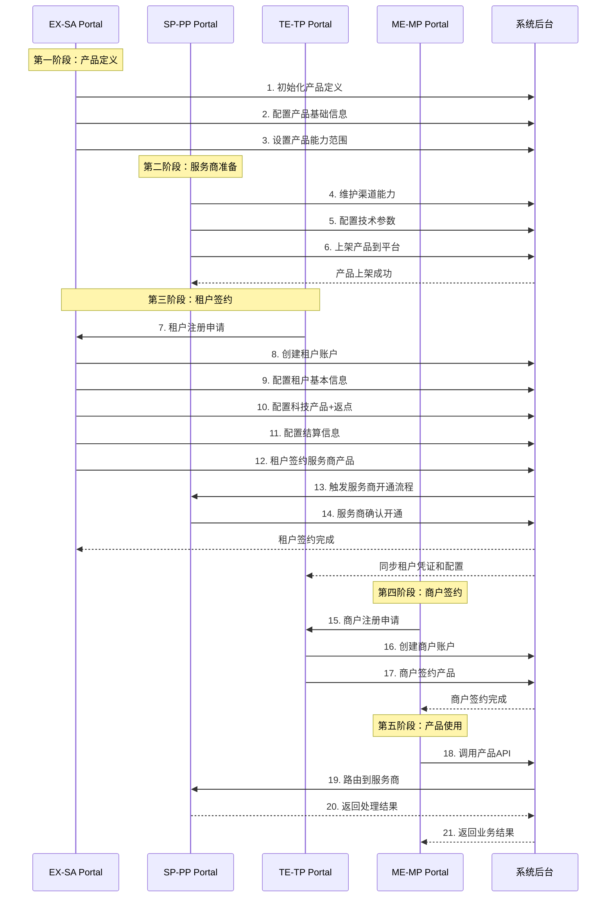
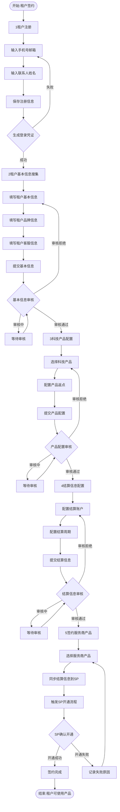
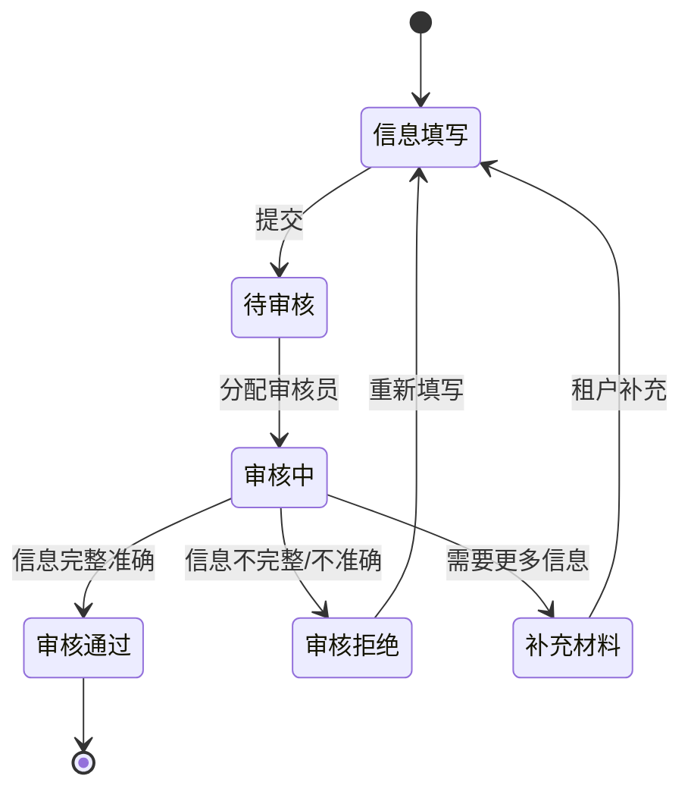
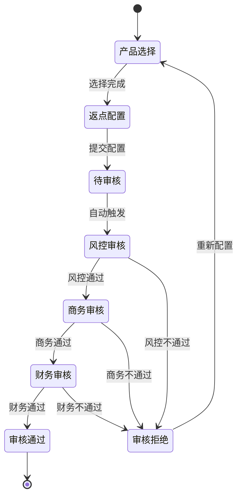
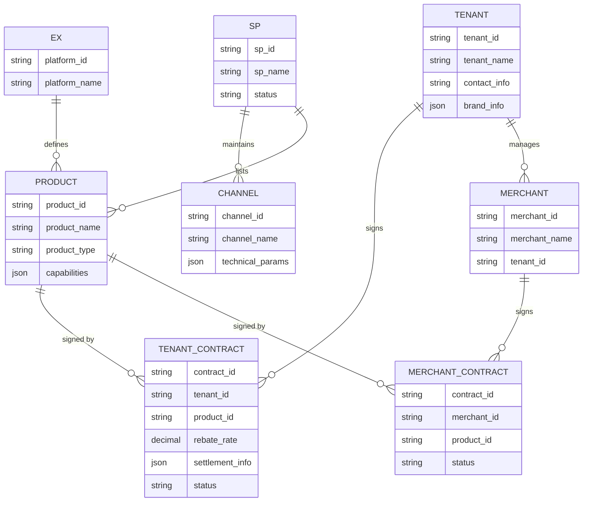
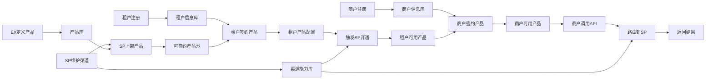

# 产品签约流程图

## 1. 整体产品流程时序图

## 2. 租户签约详细流程图

## 3. 租户基本信息审核流程

## 4. 产品配置审核流程

## 5. 系统角色与Portal对应关系

| 角色代码 | 角色名称               | Portal代码 | Portal名称          | 职责                         |
| -------- | ---------------------- | ---------- | ------------------- | ---------------------------- |
| EX       | Exchange平台           | SA         | System Admin Portal | 产品定义、租户管理、系统配置 |
| SP       | Service Provider服务商 | PP         | Provider Portal     | 渠道能力维护、产品上架       |
| TE       | Tenant租户             | TP         | Tenant Portal       | 产品签约、商户管理           |
| ME       | Merchant商户           | MP         | Merchant Portal     | 产品使用、交易管理           |

## 6. 关键业务对象关系图

## 7. 数据流转图

## 使用说明

1. **时序图**：展示EX、SP、TE、ME四个角色在整个产品生命周期中的交互顺序
2. **流程图**：详细展示租户签约的5个步骤及审核流程
3. **状态图**：展示审核流程的状态转换
4. **关系图**：展示核心业务对象之间的关系
5. **数据流转图**：展示数据在系统中的流转路径

## 在Markdown编辑器中查看

推荐使用以下工具查看Mermaid图表：

- VS Code + Mermaid插件
- Typora
- 在线Mermaid编辑器：https://mermaid.live/
