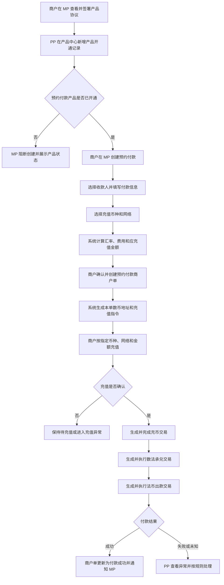
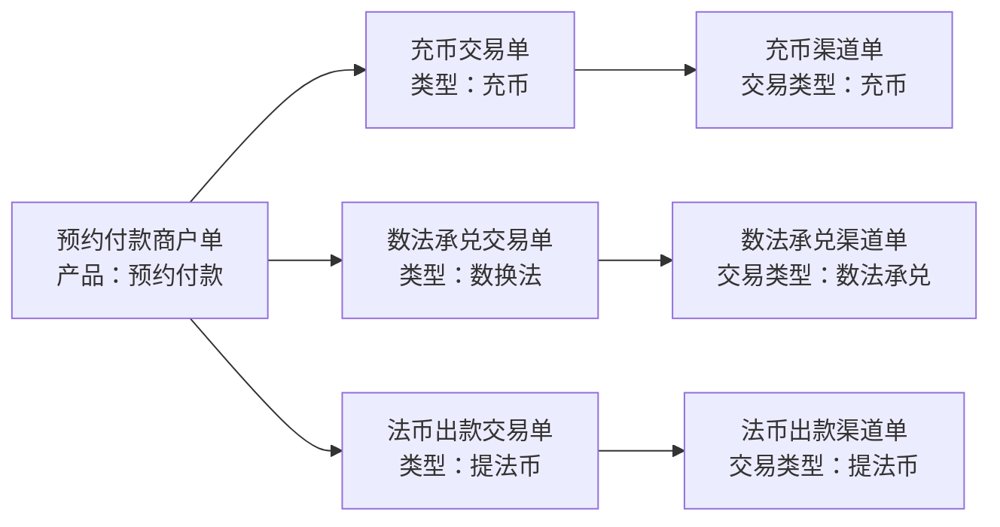
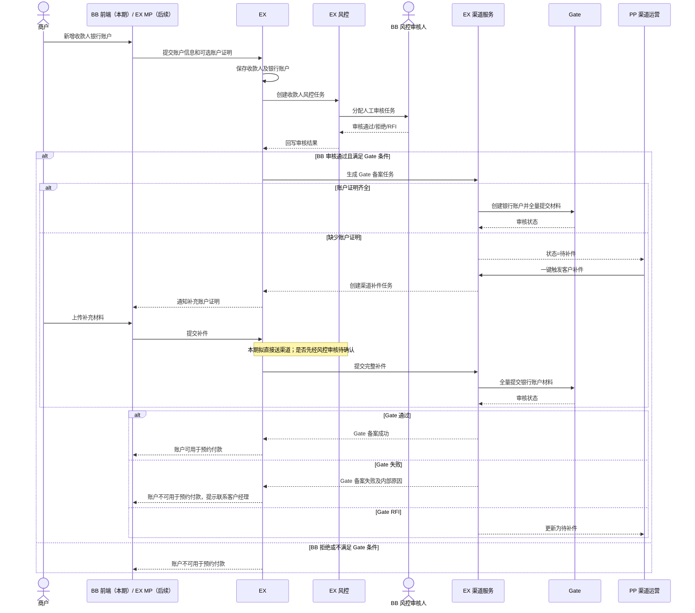
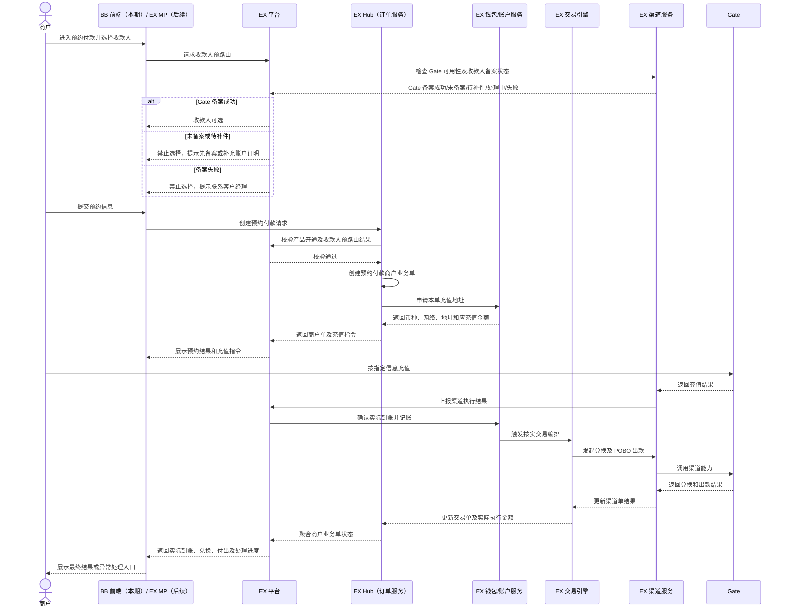
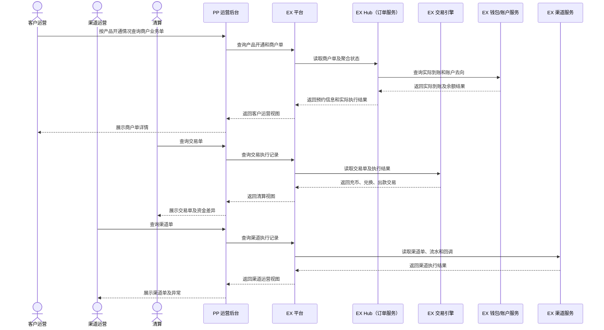

# 预约付款产品 PRD

> 文档状态：待评审
>
> 需求主体：预约付款产品
>
> 适用端：本期 BB 商户端及 PP 运营后台；后续扩展至 EX MP
>
> 适用范围：已签约并开通“预约付款”产品的企业商户
>
> 币种范围：本期预约付款的收款及法币出款币种仅支持 USD；其他法币币种在后续版本支持
>
> 系统边界：整套能力基于 EX 建设。EX Hub（订单服务）、交易引擎、钱包/账户服务和渠道服务均属于 EX；本期由 BB 前端接入 EX，后续开放 EX MP。范围包含产品签约与开通、预约付款商户单创建、数币充值、数法兑换、法币付款、三单追踪、异常处理及 PP 运营管理；不包含收款人渠道报备、渠道商户开户、渠道 VA 开户的具体渠道规则
>
> 核心原则：BB/EX MP 承载商户发起与结果查询，所有业务请求进入 EX；EX Hub 承载商户业务单及状态聚合；EX 交易引擎编排交易；EX 钱包/账户服务与 EX 渠道服务完成资金和渠道执行。PP 承载产品开通、订单查询和运营处理；商户单不展示渠道信息，交易单不展示渠道信息，渠道信息仅存在于渠道单

## 1. 术语和系统定位

| 术语 | 定义 |
| --- | --- |
| 预约付款 | 商户在资金充值前先确定收款人、付款金额和充值方式；充值到账后，系统按订单编排完成后续兑换及付款 |
| MP | Merchant Portal，商户端；用于商户签约、创建预约付款及查询业务结果 |
| PP | 运营后台；用于产品开通、商户单/交易单/渠道单查询及运营处理 |
| EX | 本产品的统一业务平台和系统边界，承载 EX Hub、交易引擎、钱包/账户服务及渠道服务 |
| EX Hub | EX 内的订单服务，负责商户业务单创建、交易编排触发和状态聚合 |
| 产品名称 | 预约付款 |
| 商户单 | 商户发起的业务意图单。预约付款商户单记录商户提交的完整业务信息 |
| 交易单 | 平台为完成商户单而拆分或编排的内部交易记录，不包含渠道字段 |
| 渠道单 | 平台向外部渠道发起执行后形成的渠道执行记录；包含渠道及渠道流水信息，不包含产品名称 |
| 收款工具 | 充值或入账所使用的数币地址、VA 或 RF Reference Account |
| 收款账户 | 提币或法币出款时使用的数币地址或银行账户 |
| 机构代理商 | 商户所属机构代理关系；列表同时展示机构代理商 ID 与机构代理商名称 |

## 2. 需求背景

企业商户在发起跨币种付款前，需要先知道收款人预计收到的法币金额、需要充值的数币金额、汇率和费用。传统“先充值、后决定用途”的路径会增加资金识别、内部调度和后续人工匹配成本。

平台现有 On Ramp / Off Ramp 面向客户提供的是市场实时汇率；本期“预约付款”产品接入 Gate，Gate 当前提供固定 1:1 汇率。因此，“预约付款”与现有 On Ramp / Off Ramp 在报价机制、客户操作路径和订单执行方式上属于两种不同的产品形态，不能直接复用实时换汇产品的报价与交互逻辑。

从综合成本考虑，本期选择由 Gate 承接从数币钱包收款、兑换到 POBO 法币付款的端到端链路。相较平台拆分使用多个服务方，该方案在当前业务条件下具有更优的整体成本，因此本期不再单独组合钱包、承兑和 POBO 渠道。

预约付款将付款意图前置：商户先创建预约付款商户单，再按订单指定的币种、网络和数币地址充值；系统识别到账后，自动关联商户单并执行数法兑换和法币付款。

本需求同时覆盖：

- MP：商户签约、创建预约付款、充值和查询进度；
- PP：产品开通、订单查询、订单关联、渠道执行查询和异常处理；
- 订单模型：商户单、交易单、渠道单三层数据边界和关联关系。

## 3. 产品价值

- 商户在充值前即可确认付款对象、金额、汇率和费用。
- 通过固定 1:1 汇率形成区别于实时汇率 On Ramp / Off Ramp 的付款产品形态。
- 由 Gate 端到端承接钱包至 POBO 付款链路，降低多渠道组合产生的综合执行成本。
- 充值资金能够直接关联业务目的，降低错配和人工认领成本。
- 平台通过三单模型分离商户意图、平台交易和渠道执行，便于追踪、对账和审计。
- MP 与 PP 使用一致的订单编号、状态及金额快照，减少运营沟通成本。

## 4. 产品目标与非目标

### 4.1 产品目标

1. 建立“签约开通—创建预约单—数币充值—兑换—付款—结果通知”的完整闭环。
2. MP 可完成预约付款创建、查看充值指令及跟踪业务结果。
3. PP 可按商户、机构代理商、订单号和状态查询全链路订单。
4. 商户单、交易单、渠道单职责清晰且可相互追溯。
5. 重复请求、重复回调和渠道结果未知不得造成重复入账、重复兑换或重复付款。

### 4.2 非目标

- 本 PRD 定义 Gate 收款人备案、账户证明补件及预约付款准入流程，但不定义 Gate 签约条款或账户证明的最终材料清单。
- 本 PRD 不定义渠道自动切换策略。
- 本 PRD 不定义实时换汇产品本身的业务规则。
- 本 PRD 不在商户单或交易单中展示渠道信息。
- 本 PRD 不实现多渠道择优或自动切换；本期预路由候选渠道固定为 Gate。

## 5. 参与方、用户与权限

| 参与方/角色 | 主要职责 | 关键权限限制 |
| --- | --- | --- |
| 商户（BB，本期） | 创建预约付款、获取充值指令、查看订单 | 仅可操作所属商户范围内的数据 |
| 商户（其他租户，后续） | 在 EX MP 创建预约付款并查询结果 | 后续阶段开放；按机构代理商及商户范围隔离 |
| PP 客户运营 | 参考产品开通情况查询商户业务单；新增、配置、启停产品开通记录 | 不查询渠道单；产品操作必须留痕，不得覆盖历史开通记录 |
| PP 渠道运营 | 查询渠道单及收款人渠道备案，跟进渠道请求、回调、补件和渠道异常 | 可一键触发客户补件，但不得代替客户提交材料或绕过待确认的风控规则 |
| PP 清算 | 查询交易单及资金执行结果，处理清算差异 | 不修改商户原始提交快照，不配置渠道 |
| BB 风控审核人 | 在 EX 风控系统中审核新增收款人及相关材料 | 审核人归属 BB；风控任务、状态和审计记录均保存在 EX |
| EX Hub（订单服务） | 创建商户单、触发交易编排并聚合状态 | EX 内部服务；保证幂等和状态一致性 |
| EX 钱包/账户服务 | 分配数币地址、识别充值到账、维护数币及法币账户 | EX 内部服务；地址、币种和网络必须一致 |
| EX 交易引擎 | 执行充币、数法兑换、法币出款等交易 | EX 内部服务；同一业务步骤不可重复执行 |
| EX 渠道服务 | 创建渠道单、调用 Gate、处理回调 | EX 内部服务；渠道结果与渠道流水号必须可审计 |

## 6. 整体业务流程

### 6.1 业务总览

### 6.2 三单生成与关联

三层订单展示规则：

| 订单层级 | 展示产品名称 | 展示交易类型 | 展示渠道 | 主要用途 |
| --- | --- | --- | --- | --- |
| 商户单 | 是 | 是 | 否 | 记录商户业务意图 |
| 交易单 | 否 | 是 | 否 | 记录平台内部交易编排 |
| 渠道单 | 否 | 是 | 是 | 记录外部渠道执行 |

## 7. Case 1：MP 商户端

### 7.1 Case 目标

商户在 MP 完成产品签约后，创建预约付款商户单，获取数币充值指令，并查看从充值到付款完成的全链路进度。

### 7.2 前置条件

- 商户已完成平台入网且状态可用。
- 商户与机构代理商关系有效。
- “预约付款”产品已在 PP 开通且处于可用状态。
- 商户拥有可用的法币收款人银行账户。
- 商户操作人拥有预约付款创建权限。

### 7.3 Case 1A：MP 添加收款人银行账户

#### 7.3.1 Case 目标

新增收款人必须经过风控审核。风控能力和审核任务均在 EX，人工审核人归属 BB。Gate 要求每个新增银行账户提交账户补充信息，账户证明属于 Gate 备案所需材料；但当前 MP 添加收款人时“账户证明”仍为非必填附件。因此，基础账户可以先保存并进入 EX 风控审核，但未通过 BB 审核人的审核、或未补齐 Gate 所需账户证明时，不能完成 Gate 备案，也不能用于本期预约付款。

#### 7.3.2 正向流程

1. 客户在 MP 新增企业收款人银行账户，填写基础账户信息。
2. MP 提供“账户证明（非必填）”上传入口，支持 Welcome Letter、账户流水、月结单等材料。
3. EX 保存收款人银行账户并创建 EX 风控任务。
4. BB 风控审核人在 EX 中完成审核；审核通过后，EX 判断该账户是否满足 Gate 备案条件。
5. 满足 Gate 条件的账户全部生成 Gate 收款人渠道备案任务。
6. 材料齐全时提交 Gate；材料缺失时进入“待补件”，不得向 Gate 提交空材料。
7. 客户完成补件后，本期按“直接送 Gate”设计；是否必须先经过风控审核，仍待风控确认。
8. Gate 审核通过后，账户标记为“Gate 备案成功”，可用于预约付款。

#### 7.3.3 MP 添加收款人时序图

#### 7.3.4 状态与客户操作

| Gate 备案状态 | MP 展示 | 是否可用于预约付款 | 客户操作 |
| --- | --- | --- | --- |
| 未备案 | 尚未完成渠道备案 | 否 | 前往备案；缺账户证明时先补充证明 |
| 待补件 | 需要补充账户证明 | 否 | 上传账户证明 |
| 备案处理中 | 渠道审核中 | 否 | 等待审核 |
| 备案成功 | 已验证 | 是 | 可在预约付款中选择 |
| 备案失败 | 暂不可用 | 否 | 联系客户经理 |

新增收款人的 EX 风控状态与 Gate 备案状态分别保存：只有 EX 风控审核通过后才允许进入 Gate 备案；Gate 的待补件、处理中或失败不得覆盖已经形成的 EX 风控审核结论。

### 7.4 Case 1B：MP 创建预约付款

1. 商户进入“付款”。
2. 系统校验“预约付款”产品是否已开通。
3. 商户选择收款人银行账户；本期只允许选择 Gate 备案成功的账户。
4. 商户填写付款金额、币种、付款用途及附言。
5. 商户选择充值币种和网络。
6. 系统展示汇率、费用明细、应充值金额及收款人预计到账金额。
7. 商户确认订单。
8. MP 将预约付款请求提交至 EX Hub；EX Hub 幂等创建预约付款商户单，并生成本单数币地址。
9. MP 展示数币地址、网络、币种、应充值金额及有效期。
10. 商户完成充值。
11. 系统识别到账并依次执行充币、数法兑换和法币付款。
12. MP 展示处理进度和最终结果。

#### 7.4.1 Case 1B 时序图

### 7.5 MP 页面及功能要求

#### 7.5.1 产品签约与状态

- 未签约或未开通时，预约付款页面仅展示产品说明、协议和当前状态。
- 商户签署协议后形成签约记录，至少保存协议版本、签署人、签署时间、商户 MID 和机构代理商 ID。
- PP 完成产品开通后，MP 才允许创建预约付款。
- 产品已停用、已关闭或失效时，MP 禁止创建新单，但允许查询历史订单。

#### 7.5.2 创建预约付款

- 选择收款人后必须执行预路由。本期候选渠道只有 Gate，预路由必须同时校验商户 Gate 能力和收款人银行账户 Gate 备案状态。
- 本期下拉列表只允许选择 Gate 备案成功的收款人银行账户；其他账户可展示但必须禁用，并展示不可选原因。
- 未备案：提示“该收款账户尚未完成备案，请先完成备案后再使用。”；缺少账户证明时提供“去补充账户证明”入口。
- 待补件或备案处理中：提示当前状态并禁止继续创建预约单。
- 备案失败：提示“该收款账户暂无法用于预约付款，请联系客户经理协助处理。”
- 预路由没有可用渠道时：提示“当前收款账户暂不可用于预约付款，请更换已验证的收款账户或联系客户经理。”，不得生成预约单或充值地址。
- 本期付款币种固定为 USD，页面不提供其他法币选项；服务端收到非 USD 请求必须拒绝。
- 充值币种和网络使用本期可用配置。
- 汇率字段只展示“汇率”，不使用“1:1 汇率”作为字段名称。
- 确认页必须展示：
  - 商户单类型：预约付款；
  - 产品名称：预约付款；
  - 收款人及掩码银行账号；
  - 付款金额及币种；
  - 充值币种、网络；
  - 汇率；
  - 分项费用；
  - 应充值金额；
  - 收款人预计到账金额；
  - 充值有效期。

#### 7.5.3 充值指令

- 每张预约付款商户单生成与该单关联的数币地址或明确的收款工具。
- 数币地址展示“地址名称”和“网络—掩码地址”。
- MP 必须提示商户严格按指定币种和网络充值。
- 地址、网络、币种、有效期和应充值金额在创建后形成不可变快照。

#### 7.5.4 订单列表与详情

- 列表主标识为“商户单号”，不使用“交易 ID”替代。
- 列表至少展示商户单号、产品名称、收款人、付款金额、充值金额、汇率、费用、状态、创建/更新时间。
- 详情不能只展示预约时的商户提交内容，还必须展示实际执行结果和处理进度。
- 实际执行结果至少包含：应充值金额、实际到账金额、充值差额、实际卖出数币金额、实际兑换所得法币金额、实际付出金额、资金去向、失败原因和后续处理。
- MP 不展示内部交易单、渠道单、渠道名称、渠道流水号及渠道错误原文。

### 7.6 MP 异常分支

| 场景 | MP 处理 |
| --- | --- |
| 产品未开通或已停用 | 阻断创建，展示产品状态及联系入口 |
| 收款人不可用 | 阻断提交，提示更换或维护收款人 |
| 收款人未完成 Gate 备案 | 禁止选择；引导备案，缺账户证明时引导补件 |
| 收款人 Gate 备案失败 | 禁止选择；提示联系客户经理 |
| 预路由无可用渠道 | 不创建预约单或充值地址；提示更换已验证账户或联系客户经理 |
| 币种与网络不匹配 | 不生成订单，提示重新选择 |
| 重复点击提交 | 返回同一幂等结果，不生成重复商户单 |
| 未充值且订单到期 | 商户单更新为已失效 |
| 少充或超额 | 按实际到账金额完成兑换，但不执行原预约付款；展示“出款失败”，兑换所得留在商户法币账户，可继续出款 |
| 错币、错链或迟到到账 | 不自动兑换或付款，展示“充值异常处理中” |
| 兑换失败 | 展示“处理失败/处理中”，不得虚假展示付款成功 |
| 付款结果未知 | 展示“结果确认中”，由系统查询及 PP 跟进 |
| 付款退票 | 展示退票结果和后续处理状态，不暴露渠道敏感信息 |

## 8. Case 2：PP 运营后台

### 8.1 Case 目标

运营通过 PP 完成产品开通，统一查询预约付款相关商户单、交易单和渠道单，并处理充值、兑换、付款及渠道异常。

### 8.1.1 Case 2 时序图

### 8.2 PP 信息架构

PP 顶层一级菜单：

1. 承兑业务
2. 渠道商户管理
3. 产品中心

菜单层级：

| 一级菜单 | 二级菜单 | 三级菜单 |
| --- | --- | --- |
| 承兑业务 | 商户收款工具 | 商户数币地址、商户 VA 账户 |
| 承兑业务 | 商户业务单 | 充值订单、提现订单、数法兑换、实时换汇、付款订单、预约付款订单 |
| 承兑业务 | 交易单 | 充币交易单、法币入账交易单、提币交易单、法币出款交易单、数法承兑交易单、实时换汇交易单 |
| 承兑业务 | 渠道单 | 充币渠道单、法币入账渠道单、提币渠道单、法币出款渠道单、数法承兑渠道单、实时换汇渠道单 |
| 渠道商户管理 | 渠道商户报备 | — |
| 渠道商户管理 | 渠道 VA 开户 | — |
| 渠道商户管理 | 收款人渠道报备 | — |
| 产品中心 | 产品开通 | — |

### 8.2.1 PP 收款人渠道备案与补件

- “渠道商户管理—收款人渠道报备”列表增加账户证明状态、报备状态和渠道状态。
- Gate 报备状态至少包括：未备案、待运营发起、待补件、备案处理中、成功、失败。
- 状态为“待补件”时，渠道运营可点击“一键触发客户补件”；系统向对应 MP 客户发送补件任务和通知，操作必须记录操作人、时间、材料要求和关联报备 ID。
- 一键触发只创建客户补件任务，不得伪造材料或直接将状态改为审核通过。
- 客户提交材料后，本期交互按“直接送渠道”展示；是否在送 Gate 前增加风控审核节点，列为待风控确认项。若最终要求风控审核，则状态需增加“补件待风控审核”，审核通过后才可全量提交 Gate。
- Gate 备案失败的记录保留 Gate 状态和内部失败信息；MP 仅展示“请联系客户经理”，不得直接暴露渠道敏感原文。

### 8.3 产品开通

- “预约付款开通”合并至“产品中心—产品开通”。
- 产品开通页面提供“新增开通”操作。
- 每次开通、关闭、重新开通或重新提交均生成一条独立记录，不覆盖历史。
- 同一商户可对同一产品存在多次开通记录，但同一时点只能有一个有效版本。
- 列表字段：

| 字段 | 展示规则 |
| --- | --- |
| 商户 MID | 商户唯一标识 |
| 商户名称 | 与 MID 同时展示 |
| 机构代理商 ID | 展示开通时快照 |
| 机构代理商名称 | 与机构代理商 ID 同列展示 |
| 开通产品 | 本 case 为“预约付款” |
| 开通时间 | 展示该次记录生效或提交时间 |
| 状态 | 待处理、配置中、已开通、已关闭、失败 |
| 操作 | 产品配置、操作日志；按状态提供审核或启停动作 |

### 8.4 预约付款商户单

- 商户单只展示商户业务信息，不展示任何渠道字段。
- 产品名称为“预约付款”。
- 商户信息合并为一列：商户名称 + 商户 MID。
- 机构代理商信息合并为一列：机构代理商名称 + 机构代理商 ID。
- 创建时间和更新时间合并为一列。
- 列表建议顺序：

| 顺序 | 字段 |
| --- | --- |
| 1 | 商户单号 |
| 2 | 商户 |
| 3 | 机构代理商 |
| 4 | 产品名称 |
| 5 | 收款人 |
| 6 | 付款金额 |
| 7 | 充值币种 / 网络 / 应充值金额 |
| 8 | 汇率 |
| 9 | 手续费 |
| 10 | 状态 |
| 11 | 创建 / 更新时间 |
| 12 | 操作 |

### 8.5 交易单

- 交易单不关心产品，不展示或保存产品名称；以交易类型作为核心业务识别字段。
- 交易单必须关联商户单号。
- 交易单保留商户名称和商户 MID 用于归属识别，但列表及详情优先突出交易类型。
- 商户、机构代理商、创建/更新时间采用与商户单一致的合并样式。
- 预约付款可能关联的交易单：

| 交易单菜单 | 交易类型 | 关键业务字段 |
| --- | --- | --- |
| 充币交易单 | 充币 | 数币地址名称、网络—掩码地址、金额 |
| 数法承兑交易单 | 数换法 | 货币对、卖出金额、买入金额、汇率、费用 |
| 法币出款交易单 | 提法币 | 收款账户名称、掩码账号、收款人类型、账户国家、金额 |

交易单列表通用顺序：

1. 交易单号；
2. 交易类型；
3. 商户单号；
4. 商户名称 + 商户 MID；
5. 机构代理商；
6. 业务特有字段；
7. 交易金额；
8. 状态；
9. 创建/更新时间；
10. 操作。

### 8.6 渠道单

- 渠道单没有产品名称，只有交易类型。
- 渠道单必须关联交易单号和商户单号。
- 渠道信息只在渠道单展示。
- 充币渠道单可展示数币地址名称及“网络—掩码地址”。
- 法币入账渠道单可展示收款工具：
  - VA：使用蓝色 `VA` 小标签，展示 VA 名称和完整 VA 号码；
  - RF：使用紫色 `RF` 小标签，展示大账户名称和完整 RF Reference Account 号码。
- 提币渠道单展示地址昵称及“网络—掩码地址”，不展示账户国家。
- 法币出款渠道单展示收款账户名称、掩码账号、收款人类型及账户所在国家。

渠道单列表通用顺序：

1. 渠道单号；
2. 交易单号；
3. 商户单号；
4. 商户；
5. 机构代理商；
6. 交易类型；
7. 业务特有字段；
8. 渠道及渠道流水号；
9. 请求金额及渠道费用；
10. 状态；
11. 创建/更新时间；
12. 操作。

### 8.7 PP 查询与操作

- 所有订单列表支持按订单号、商户 MID、商户名称、机构代理商 ID、机构代理商名称、状态及时间筛选。
- PP 可从商户单进入关联交易单，从交易单进入关联渠道单。
- PP 可查看完整状态时间线、请求/响应摘要、失败原因和人工操作日志。
- 敏感地址、银行账号默认掩码；完整值仅对授权角色按需展示并记录审计日志。
- 导出遵循当前筛选条件、数据权限和脱敏规则。

## 9. 核心字段及校验规则

| 字段 | 必填 | 来源/类型 | 校验规则 | 可见范围 | 备注 |
| --- | --- | --- | --- | --- | --- |
| merchant_order_id | 是 | EX Hub | 商户与租户范围内唯一 | MP/PP | 商户单号 |
| merchant_id | 是 | 商户系统 | 必须有效并与当前租户匹配 | MP/PP/内部 | 商户 MID |
| merchant_name_snapshot | 是 | 商户系统 | 创建时固化 | PP/内部 | 不被后续改名覆盖 |
| institution_agent_id | 是 | 机构代理系统 | 全链路透传 | PP/内部 | 机构代理商 ID |
| institution_agent_name_snapshot | 是 | 机构代理系统 | 创建时固化 | PP/内部 | 与 ID 同列展示 |
| product_name | 是 | 产品中心 | 预约付款商户单为“付款” | MP/PP/内部 | 渠道单不保存展示字段 |
| merchant_order_type | 是 | EX Hub | 预约付款 | MP/PP/内部 | 区分普通付款 |
| beneficiary_account_id | 是 | 收款人服务 | 必须属于当前商户且状态可用 | MP/PP/内部 | 下单时保存快照 |
| beneficiary_snapshot | 是 | 收款人服务 | 名称、账号、银行、国家不可缺失 | MP/PP/内部 | 历史不可覆盖 |
| payment_currency | 是 | 系统固定 | 本期必须为 `USD`；非 USD 请求服务端拒绝 | MP/PP/内部 | 其他法币后续支持 |
| payment_amount | 是 | 商户输入 | 大于零并符合限额配置 | MP/PP/内部 | 目标付款金额 |
| deposit_asset | 是 | 商户选择 | 必须在产品支持范围内 | MP/PP/内部 | 数币 |
| deposit_network | 是 | 商户选择 | 必须与 deposit_asset 匹配 | MP/PP/内部 | 网络 |
| deposit_address_snapshot | 创建后必填 | EX 钱包/账户服务 | 地址、网络、资产一致 | MP/PP/内部 | PP 默认掩码 |
| exchange_rate | 是 | 报价/规则服务 | 创建时固化精度和方向 | MP/PP/内部 | 表头名称为“汇率” |
| currency_pair | 是 | 报价/规则服务 | 明确卖出币种和买入币种 | MP/PP/内部 | 如卖出 USDT、买入 USD |
| fee_items | 是 | 费用服务 | 分项保存币种、金额、承担方 | MP/PP/财务 | 不只保存总额 |
| required_deposit_amount | 是 | EX Hub | 与付款金额、汇率和费用一致 | MP/PP/内部 | 应充值金额 |
| transaction_order_id | 条件必填 | EX 交易引擎 | 平台范围内唯一 | PP/内部 | 关联商户单 |
| transaction_type | 条件必填 | EX 交易引擎 | 使用标准交易类型枚举 | PP/内部 | 交易单、渠道单均展示 |
| channel_order_id | 条件必填 | EX 渠道服务 | 渠道请求范围内唯一 | PP/内部 | 关联交易单 |
| channel_code | 条件必填 | EX 渠道路由/渠道服务 | 渠道单创建后不可为空 | PP/内部 | 不进入商户单/交易单展示 |
| channel_reference | 条件必填 | 渠道返回 | 同渠道内可追溯 | PP/内部 | 渠道流水号 |
| idempotency_key | 是 | MP/服务端 | 商户、接口、业务场景维度唯一 | 内部 | 防止重复创建和执行 |

## 10. 状态及状态流转

### 10.1 产品开通状态

| 状态 | 进入条件 | 允许操作 | 退出条件 |
| --- | --- | --- | --- |
| 待处理 | 新增开通记录 | 查看、处理、关闭 | 开始配置或关闭 |
| 配置中 | 运营开始产品配置 | 保存配置、完成、失败 | 开通成功或失败 |
| 已开通 | 配置完成并生效 | 查看、调整、关闭 | 产品关闭 |
| 已关闭 | 人工关闭或产品失效 | 查看、重新新增开通记录 | 新记录生效 |
| 失败 | 开通过程失败 | 查看原因、重新新增记录 | 新记录生效 |

### 10.2 预约付款商户单状态

| 状态 | 进入条件 | 允许操作 | 退出条件 | MP 文案 |
| --- | --- | --- | --- | --- |
| 待充值 | 商户单和充值指令创建成功 | 查看、充值 | 检测到充值或到期 | 等待充值 |
| 充值确认中 | 检测到对应充值 | 查看 | 确认成功或异常 | 充值确认中 |
| 兑换处理中 | 充值确认并发起数法兑换 | 查看 | 兑换成功、失败或未知 | 处理中 |
| 付款处理中 | 兑换成功并发起付款 | 查看 | 付款成功、失败或未知 | 付款处理中 |
| 付款成功 | 获得明确付款成功结果 | 查看、导出 | 终态 | 付款成功 |
| 充值异常 | 少充、超额、错币、错链或迟到到账 | 查看、等待处理 | 恢复执行、退款或关闭 | 充值异常处理中 |
| 出款失败 | 实际到账金额与预约单应充值金额不匹配，按实兑换后停止原出款 | 查看实际执行结果、继续出款 | 新出款单成功或人工关闭 | 出款失败 |
| 失败 | 业务明确失败 | 查看结果 | 终态或按规则重建 | 处理失败 |
| 结果确认中 | 下游超时或结果未知 | 查看 | 成功或失败 | 结果确认中 |
| 已失效 | 有效期内未完成充值 | 查看 | 终态 | 已失效 |
| 已退票 | 付款成功后发生退票 | 查看处理进度 | 退款、重付或关闭 | 付款已退回 |

### 10.3 状态聚合原则

- 商户单状态由关联交易单结果聚合，不直接复制某一渠道单状态。
- 交易单状态由自身业务结果决定，不因渠道切换或重试覆盖历史渠道单。
- 渠道单每次请求独立留存；重试生成新的渠道单或新尝试记录。
- 未得到明确终态前不得将商户单展示为成功或失败。

## 11. 风控与合规要求

- 产品开通校验与交易级风控相互独立；产品已开通不代表每笔预约付款自动放行。
- 下单时校验商户状态、产品状态、操作权限、收款人状态、金额限额和币种网络配置。
- 执行兑换和付款前重新校验必要的交易条件，避免长时间等待充值后配置已失效。
- 收款人、付款用途、国家地区、制裁名单、金额频率和拆单风险沿用平台现有规则。
- 高风险或敏感原因仅向授权 PP 角色展示；MP 使用可行动的通用提示。
- 完整数币地址、银行账号及渠道原始报文属于敏感数据，按角色脱敏并记录查看日志。

## 12. 接口和数据对象

| 接口/对象 | 方向 | 所有者 | 关键要求 |
| --- | --- | --- | --- |
| 查询产品权限 | MP → 产品中心 | 产品中心 | 返回有效开通记录及版本 |
| 创建预约付款 | BB/EX MP → EX → EX Hub | EX Hub | 幂等；服务端重验产品、商户、收款人和金额 |
| 获取充值指令 | EX Hub → EX 钱包/账户服务 | EX 钱包/账户服务 | 返回资产、网络、数币地址、有效期 |
| 充值到账通知 | EX 渠道服务 → EX 钱包/账户服务 → EX 交易引擎 | EX 钱包/账户服务 | 验签、去重、确认数、错链识别 |
| 创建交易单 | EX Hub → EX 交易引擎 | EX 交易引擎 | 关联商户单；步骤幂等 |
| 创建渠道单 | EX 交易引擎 → EX 渠道服务 | EX 渠道服务 | 关联交易单；保存请求快照 |
| 渠道回调 | Gate → EX 渠道服务 | EX 渠道服务 | 验签、幂等、乱序兼容、原文留档 |
| 状态聚合 | EX 交易引擎/渠道服务 → EX Hub | EX Hub | 只接受合法状态迁移 |
| MP 状态查询 | BB/EX MP → EX → EX Hub | EX Hub | 不返回渠道敏感信息 |
| PP 查询与导出 | PP → 查询/报表服务 | 数据平台 | 租户隔离、权限校验、脱敏、审计 |

## 13. 异常场景

| 场景 | 系统处理要求 |
| --- | --- |
| 产品状态在确认前变化 | 服务端拒绝创建，不生成商户单和充值指令 |
| 重复创建请求 | 返回原幂等结果，不生成重复订单 |
| 数币地址生成失败 | 商户单不得进入可充值状态，可安全重试 |
| 重复到账通知 | 只认领一次，不重复入账或执行 |
| 少充/超额 | 暂停自动执行，记录实收金额并进入异常队列 |
| 错币/错链 | 不自动执行预约付款，进入人工核查 |
| 迟到到账 | 不复用失效订单自动付款，进入异常处理 |
| 兑换失败 | 不发起付款；保留资金及失败快照 |
| 付款失败 | 不重复付款；按明确规则重试、退款或重建 |
| 渠道超时/结果未知 | 主动查询，明确终态前禁止重复发起 |
| 回调乱序 | 按状态版本或事件时间处理，不允许终态回退 |
| 付款退票 | 关联原商户单、交易单和渠道单，生成退票处理记录 |
| PP 人工操作失败 | 返回明确错误且写入操作日志，不产生半完成状态 |

## 14. 通知、审计与非功能要求

### 14.1 通知

- 产品开通、关闭或失败时通知商户管理员。
- 商户单创建、充值确认、付款成功、失败、失效、充值异常和退票时通知商户。
- PP 异常队列对充值异常、兑换失败、结果未知及退票生成待处理提醒。

### 14.2 审计

- 保存协议版本、产品开通、订单创建、报价、费用、充值指令、交易执行、渠道请求/回调和人工操作日志。
- 历史记录使用不可变快照，不因商户、机构代理商、收款人或配置变化而覆盖。
- 所有跨单关联均保存商户单号、交易单号、渠道单号及链路追踪 ID。

### 14.3 非功能要求

- 所有写接口支持幂等。
- 查询与导出按商户、租户、机构代理商及角色隔离。
- 状态更新具备可重放、可对账和可追踪能力。
- 页面或接口超时不得触发重复充值认领、兑换或付款。
- 金额、汇率和费用使用明确精度及舍入规则，不使用浮点数直接计算。

## 15. 页面交互

MP 商户端页面交互见：[fiat-crypto-platform-interactive.html](./fiat-crypto-platform-interactive.html)

PP 运营后台页面交互见：[预约付款-运营后台交互文档.html](./预约付款-运营后台交互文档.html)

## 16. 验收标准

### 16.1 整体流程

1. 只有存在有效“预约付款”产品开通记录的商户能够创建预约付款。
2. 一次预约付款只生成一张商户单，并可关联多张交易单和渠道单。
3. 充值确认后，系统可按顺序执行充币、数法兑换和法币出款。
4. 任一步骤失败或结果未知时，不得重复兑换或重复付款。
5. 商户单、交易单和渠道单之间可通过订单号双向追溯。
6. 本期预约付款只接受 USD 作为收款及法币出款币种，客户端无其他法币选项，服务端拒绝非 USD 请求。

### 16.2 MP Case

7. MP 确认页完整展示收款人、付款金额、充值资产与网络、汇率、费用、应充值金额及预计到账金额。
8. 创建成功后展示与订单绑定的数币地址、网络、币种、金额和有效期。
9. 产品未开通、收款人不可用或币种网络不匹配时，客户端和服务端均阻断创建。
10. 重复提交返回相同商户单，不生成重复订单。
11. MP 详情不展示交易单、渠道单、渠道名称和渠道错误原文。
12. 少充、超额、错币、错链及迟到到账均不会自动继续付款。

### 16.3 PP Case

13. 产品中心支持新增产品开通，同一商户同一产品的多次记录可完整保留。
14. 预约付款商户单展示产品名称“预约付款”，不展示渠道。
15. 交易单不展示产品名称，优先展示交易类型，同时保留商户名称和商户 MID。
16. 渠道单展示交易类型和渠道信息，不展示产品名称。
17. 商户和机构代理商均以“名称 + ID”合并展示，创建/更新时间合并展示。
18. PP 可从商户单查询关联交易单，并从交易单查询关联渠道单。
19. 数币地址默认掩码；VA 和 RF 分别使用蓝色、紫色小标签并按权限展示账户号码。
20. 未授权角色不能查看完整敏感信息、执行产品配置或导出超出权限的数据。
21. 所有产品操作、订单操作、敏感信息查看和导出均有审计记录。
22. MP 新增收款人时账户证明保持非必填，但缺少 Gate 所需证明的账户不能用于预约付款。
23. 满足 Gate 条件的收款人银行账户均生成 Gate 备案任务，只有 Gate 备案成功的账户可在预约付款中选中。
24. 选择收款人后必须执行预路由；未备案、待补件、处理中、失败或 Gate 不可用时，服务端不得创建预约单或充值地址。
25. 未备案或待补件账户提供备案及补充账户证明入口；备案失败账户统一提示联系客户经理。
26. PP 收款人渠道报备列表展示账户证明、报备及渠道状态，待补件记录支持一键触发客户补件并完整留痕。
27. 每个新增收款人均在 EX 创建风控任务，由 BB 风控审核人完成审核；审核通过前不得进入 Gate 备案或用于预约付款。

## 17. 分期方案

### 17.1 本期

- 产品首先在 BB 上线，由 BB 商户完成产品签约、预约付款创建、充值指令和订单查询。
- PP 按角色提供查询入口：客户运营查询商户业务单并参考产品开通情况；渠道运营查询渠道单；清算查询交易单。
- 数币充值、数法兑换、法币付款的基础编排。
- 三单关联、状态聚合、幂等和基础异常队列。

### 17.2 后续

- 将“预约付款”产品开放至 EX MP，并按机构代理商与商户维度复用产品开通、订单查询和权限隔离能力。
- 多渠道路由、自动切换及渠道成本优化。
- 更丰富的充值资产、网络和付款币种。
- 增加 EUR、GBP、HKD 等其他法币的预约付款能力，具体币种按后续版本评审结果开放。
- 少充、超额、迟到到账和退款的自动化处理。
- 自动对账、差错处理和运营 SLA 看板。

## 18. 待确认事项

| 编号 | 待确认事项 | 决策方 |
| --- | --- | --- |
| Q1 | 产品签约与 PP 产品开通的准确状态、审批角色及生效规则 | 产品/运营/合规 |
| Q2 | 预约付款后续支持的其他法币、数币和网络清单 | 产品/资金/钱包 |
| Q3 | 汇率来源、报价有效期、精度和舍入规则 | 产品/资金/财务 |
| Q4 | 手续费项目、计费币种、承担方及退款规则 | 产品/财务 |
| Q5 | 订单有效期及未充值自动失效时间 | 产品/运营 |
| Q6 | 少充、超额、错币、错链和迟到到账的处理阈值与费用 | 产品/运营/资金 |
| Q7 | 兑换或付款失败后的重试、退款币种和损失承担方 | 产品/资金/财务/法务 |
| Q8 | 收款人可用状态及交易级风控的具体准入条件 | 风控/合规/产品 |
| Q9 | 渠道路由是否人工选择、系统选择或按产品配置固定 | 产品/运营/技术 |
| Q10 | MP 与 PP 的通知渠道、模板和 SLA | 产品/运营 |
| Q11 | 客户完成 Gate 渠道补件后，本期是否允许直接送 Gate，还是必须先经过风控审核 | 风控/合规/产品 |

## 19. 参考资料

- [Offramp产品PRD.md](./Offramp产品PRD.md)
- [Gate渠道对接方案与改造点.md](../prd/Gate渠道对接方案与改造点.md)
- [商户单-交易单-渠道单模型与交易引擎设计.md](../prd/商户单-交易单-渠道单模型与交易引擎设计.md)
- [预约付款-运营后台交互文档.html](./预约付款-运营后台交互文档.html)
- [fiat-crypto-platform-interactive.html](./fiat-crypto-platform-interactive.html)
